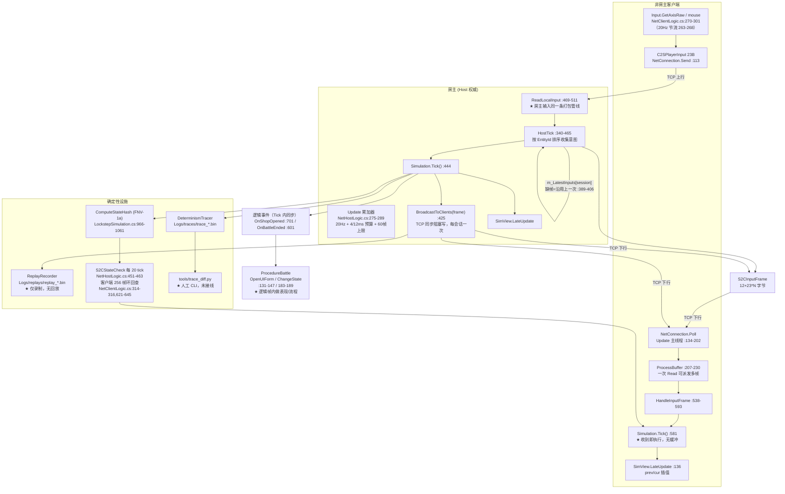

# 联机架构审查报告

- 审查对象：`D:\EmojiWarStudio\EmojiWar2`（Unity 项目，GameMain 程序集）
- 审查依据：`doc/帧同步联机架构自查清单.md`
- 审查性质：**只读审查**，未修改任何代码/资源/配置；本文件是唯一新建文件。
- 说明：所有"已验证"结论都给出 `文件:行号`；无法从代码判断的写"无法判断"，推测一律标注"**推断**"。
  引用的路径均相对于 `EmojiWar2/`，例如 `Assets/GameMain/Scripts/Simulation/LockstepSimulation.cs`。

> **先说结论（TL;DR）**：这是一个**方向正确、骨架认真、但只做到"能跑通回环"的帧同步原型**。
> 骨架（20Hz 固定 tick、输入只传意图、逻辑与表现分离成 SimView、双端状态哈希对账、确定性打点 + trace diff 工具）都已经存在，
> 但有三处会导致"真联机一定出问题"：
> **(1) 客户端收到帧立刻执行，没有抖动缓冲、没有消费节拍、没有追帧预算**（E 组 4 项全不符合）；
> **(2) 结算/开箱级的状态（每个玩家的施法程序 CastProgram）由各端从自己本机的背包各自编译**，没有 `S2CLoadoutSync`（`SimConfigFactory.cs:51-60` 自己写了 TODO）；
> **(3) 全逻辑层是浮点 + `Mathf`，没有定点数**，且 `Vector2/Mathf.Cos/Sin` 直接进入被哈希、被网络复现的敌人生成与弹道计算。
> 另外：**这不是 Steam P2P 架构**，是自研 TCP + 局域网 UDP 广播发现，与清单给的项目背景（Steam P2P/中继）不一致。

---

## 1. 架构调用链图（第一阶段）

### 1.1 环节定位表

| 环节 | 实现位置（文件:行号 / 类.方法） |
|---|---|
| 输入采集（本地） | `NetHostLogic.ReadLocalInput` `NetHostLogic.cs:469-511`（房主）；`NetClientLogic.Update` `NetClientLogic.cs:263-302`（客户端）。均为 **未量化 float**：`GetAxisRaw` 直接进 `MoveX/MoveY`，鼠标用 `Camera.main.ScreenToWorldPoint(Input.mousePosition)` 得世界坐标进 `AimX/AimY` |
| 输入发送（非房主） | `NetClientLogic.cs:263-268` 20Hz 节流（`m_InputSendTimer = LockstepSim.TickInterval`）→ `:302 m_Service.Send(m_InputMsg)` → `NetConnection.Send` `NetConnection.cs:113-129`。走 **TCP**（可靠有序），消息 `C2SPlayerInput`（23 字节） |
| 帧打包（房主） | `NetHostLogic.HostTick` `NetHostLogic.cs:340-465`，由 `Update` 里的累加器以 20Hz 驱动 `NetHostLogic.cs:275-289`；缺少某人输入时用 `m_LatestInputs`（上一次收到的值）`NetHostLogic.cs:389-406` |
| 帧广播 | `S2CInputFrame`（`NetMessages.cs:69-126`）→ `m_Service.BroadcastToClients(frame)` `NetHostLogic.cs:425` → `NetServer.Broadcast` `NetServer.cs:325-343` → 每会话 `NetServerSession.Send` `NetServer.cs:46-62`。**无 ACK、无重发、无序号冗余**（靠 TCP 保序） |
| 帧接收与排队 | `NetServerSession.Poll`/`NetConnection.Poll` `NetServer.cs:64-132` / `NetConnection.cs:134-202` → `ProcessBuffer` `NetConnection.cs:207-230` → `OnMessage` → `NetClientLogic.HandleInputFrame` `NetClientLogic.cs:538-593`。**没有队列/缓冲**，收到即 `Simulation.Tick()` |
| 逻辑 Tick | 固定 **20Hz**：`LockstepSimulation.TickInterval = 0.05f` `LockstepSimulation.cs:123`。房主用 `Time.deltaTime` 累加器 `NetHostLogic.cs:275-289`；客户端由**收包**驱动 `NetClientLogic.cs:581`。**都不在 `FixedUpdate`** |
| 逻辑层入口 | `LockstepSimulation` `LockstepSimulation.cs:120`（房主 `NetHostLogic.Simulation` `NetHostLogic.cs:42`；客户端 `NetClientLogic.Simulation` `NetClientLogic.cs:24`）。实体= `SimPlayer/SimEnemy/SimBullet`（`LockstepSimulation.cs:55/89/101`）；施法解释器 `CastResolver.Tick` `CastResolver.cs:442` |
| 表现层 | `SimView.LateUpdate` `SimView.cs:136-160` → `SyncPlayers/SyncEnemies/SyncBullets` `:164/270/307`；用 `PrevPosition`+`Position` 插值 `:28-37,143-155,187,299,336`。另有逻辑事件回调：`OnShopOpened/OnBattleEnded/OnPlayerHpChanged/OnEnemyKilled` `LockstepSimulation.cs:253-261`，在 Tick 内**同步**触发并在订阅方开 UI/切流程（`ProcedureBattle.cs:131-147,183-189`） |
| 网络层 | **自研**：`System.Net.Sockets.TcpListener`/`TcpClient`（`NetServer.cs:192/231`、`NetConnection.cs:66-69`）+ 自研二进制协议（`NetCodec.cs`，`[MsgId:ushort][len:ushort][payload]`，`NetProtocol.cs:3-4`）+ 局域网 UDP 广播发现（`RoomDiscovery.cs:44-49`）。**没有 Steamworks / Facepunch / UnityTransport**（`Packages/manifest.json` 无相关依赖，全仓库无 steam 资源） |
| 碰撞/判定 | 纯距离平方比较，**不用物理引擎**：子弹×敌人 `LockstepSimulation.cs:530`；敌人接触玩家 `LockstepSimulation.cs:569`。子弹半径来自弹道剖面/配置兜底 `:637-642`。无宽相位 |
| 寻路 | **不存在**。敌人朝最近玩家直线 seek `LockstepSimulation.cs:560-567`；无 NavMesh/A*/流场（全项目 grep `NavMeshAgent|SetDestination|AStar|Pathfind` 无代码命中） |

### 1.2 调用链图



### 1.3 一句话架构判断

设计**符合**目标架构的核心原则："房主只是打包帧的人" —— `NetHostLogic.cs:385-388` 房主自己的 session0 输入走 `ReadLocalInput` 并被填进同一个 `S2CInputFrame` 广播帧，随后房主自己也用同一份 `m_InputsCache` 推进模拟（`NetHostLogic.cs:409-425,444`）。
**但**"帧队列/抖动缓冲"这一层（目标架构图里帧广播之后、确定性逻辑层之前那一段）**在客户端完全不存在**。

---

## 2. 总览

| 分类 | 符合 | 部分符合 | 不符合 | 无法判断 | 小计 |
|---|---|---|---|---|---|
| A 逻辑层隔离与确定性 | 0 | 5 | 5 | 0 | 10 |
| B 不同步检测与可复现 | 0 | 3 | 2 | 0 | 5 |
| C 帧同步管线 | 1 | 3 | 3 | 0 | 7 |
| D 本地操作手感 | 0 | 1 | 2 | 1 | 4 |
| E 帧消费与抖动缓冲 | 0 | 0 | 4 | 0 | 4 |
| F 逻辑与表现分离 | 0 | 4 | 1 | 0 | 5 |
| G 物理、判定与寻路 | 3 | 1 | 1 | 0 | 5 |
| H 性能 | 0 | 2 | 3 | 0 | 5 |
| I 断线/中途加入/房主迁移 | 0 | 0 | 4 | 0 | 4 |
| J 调试与验证工具 | 1 | 0 | 3 | 0 | 4 |
| **合计** | **5** | **19** | **28** | **1** | **53** |

参考指标达标情况（清单 §4）：

| 指标 | 建议目标 | 实际 | 判定 |
|---|---|---|---|
| 逻辑帧率 | 20–30Hz | 20Hz（`LockstepSimulation.cs:123`） | ✅ 达标 |
| 本地操作到画面反馈 | ≤1 渲染帧（表现）/ ≤100ms（逻辑确认） | 表现层零预测（D3 不符合）→ 只到"插值后的权威位置" | ❌ |
| 房主与非房主延迟差 | 尽量为 0 | 推断 ≈ `RTT + 50ms`（房主零延迟，无统一输入延迟，D2） | ❌ |
| 抖动缓冲深度 | 1–3 帧且可动态调整 | **0**（无缓冲，E2） | ❌ |
| 单逻辑帧耗时（200 实体） | < 帧间隔 20% | **无任何 Profiler 标记，无法测量**（H1） | ⚪ 无法判断 |
| 逻辑 Tick 的 GC 分配 | 0 B/帧 | 有多处无条件分配（H2） | ❌ |
| 不同步 | 同录像多次无头回放哈希一致 | 无回放实现，无自动化哈希比对（B4） | ❌ |

---

## 3. 流畅度问题的根因排序

> 排序依据：对"手感与流畅度"的直接影响 × 发生频率。每一条都附证据链。

### 根因 1（最大）：客户端"收到帧就执行"，没有抖动缓冲与消费节拍 —— 逻辑推进节奏 = 网络到达节奏

**证据链**

1. 帧一到达就在消息回调里推进逻辑：
   `NetClientLogic.HandleInputFrame` `NetClientLogic.cs:538-593`，其中 `NetClientLogic.cs:581 Simulation.Tick(m_InputsCache);` —— 没有任何队列/等待。
2. TCP 一次 `Read` 最多 4096 字节（`NetConnection.cs:163`），而一帧广播只有 104 字节（4 人，见 C6 计算），`ProcessBuffer` 的 `while` 循环会把**同一批到达的多帧全部派发**：
   `NetConnection.cs:207-230`；服务端侧同样 `NetServer.cs:134-162`。
   → 一个渲染帧内可能连续跑 **2~30+ 个逻辑帧**，画面表现为"卡一下 → 猛冲一段"。
3. 反向情况同样存在：客户端 60fps 而逻辑 20Hz 时，约 2/3 的渲染帧一个帧都收不到，第 3 帧收到 1 个 → 逻辑推进呈 0/0/1 脉冲。
4. 客户端**没有任何追帧上限**（无帧数上限、无时间预算、无"追帧中"状态）。
   对照：房主有 `framesThisFrame < 60` + 4ms/12ms 时间预算 `NetHostLogic.cs:275-289`；客户端一条都没有。
5. 全项目不存在队列/抖动缓冲：grep `Queue<|jitter|Jitter|bufferDepth|CatchUp|追帧` 在 `Scripts/` 下只命中一条注释（`NetHostLogic.cs:273`）。

**影响**：这是"流畅度不足"的第一来源。它同时造成抖动（节奏不均）、瞬移（批量推进）、以及输入延迟不确定（延迟随 TCP 到达分布浮动）。
**注意**：这不是"带宽不够"问题（带宽只有 2 KB/s，见 C6），所以调带宽没用。

### 根因 2：输入不是"按帧编号的输入"，而是"最近一次到达的输入"

**证据链**

1. 房主用覆盖式字典保存最近输入：`NetHostLogic.cs:36 m_LatestInputs`，写入点 `NetHostLogic.cs:523-529`（每次收到 `PlayerInput` 直接覆盖），读取点 `NetHostLogic.cs:389-406`。
   → 房主的每个 tick 取到的是"截至目前最后到达的那个输入"，与帧号无绑定关系。
2. 客户端 20Hz 节流采样：`NetClientLogic.cs:263-268`（`m_InputSendTimer -= Time.deltaTime`，到点才采样并发送），且 `:270-301` 的采样只发生在发送帧上。
   → **边沿触发型输入会被丢**：`NetClientLogic.cs:301 Input.GetKeyDown(KeyCode.R)` 只在发送帧读取，按键落在非发送帧即永久丢失（当前 `Reload` 被模拟忽略，所以还没爆，但这是个系统性采样缺陷）。
3. 采样/发送与房主 tick 彼此独立，相位随机 → 同一次输入在不同 tick 上的生效时刻抖动 ±1 帧（50ms）。
4. 输入缺失既不等也不填空，而是**无限沿用上一次输入**：`NetHostLogic.cs:402-406` 的注释写"掉线托管：空输入"，但前置条件 `m_LatestInputs.TryGetValue` 失败才会走空输入；玩家一旦断线但 TCP 尚未报错，其角色会带着最后一帧的输入继续移动/开火。

**影响**：本地操作延迟不可预测（是"卡顿感"而非"稳定延迟感"的来源），且断线玩家行为异常（角色自己跑）。

### 根因 3：本地零预测、零即时反馈 —— 按键到画面只有"权威帧回包"一条路

**证据链**

1. 表现层只读模拟状态，不读本地输入：`SimView.cs:169-199,274-300,311-337` 全部是 `m_Sim.Players/Enemies/Bullets` → `transform.position`。
2. 输入只在 `Simulation.Tick` 内生效：`LockstepSimulation.cs:450-504`。客户端本地玩家按键后必须先上行到房主、房主打包、再下行回来才动。
3. 连**音效/起手动画**这类零成本反馈都没有：`SfxManager.PlayShoot/PlayHit` 的调用点只有离线路径 —— `Entity/EntityBase.cs:178`、`Weapon/RangedWeapon.cs:89`（网络模式下 `ProcedureBattle.cs:276-296` 明确不实例化 `BattleManager`，因此这些 MonoBehaviour 不存在）；`ShopForm.cs:217` 只在购买时响。
4. 网络模式的表现层没有动画：`SimView` 用裸 `SpriteRenderer`，全项目代码零 `Animator` 引用（grep `Animator|applyRootMotion` 只命中一句注释 `Entity/EntityBase.cs:4`）；`Art/Animations/playerAnimator.controller` 等资产只服务离线的 Player/Enemy 预制体。
5. 插值又额外引入显示滞后（见 F2）：`SimView.cs:143-155` 的 `InterpolationFactor` 在 tick 到达的那一刻被重置为 ~0，随后 50ms 内插到当前值 → 显示位置平均落后权威位置约半帧、最多一帧。

**影响**：非房主玩家的"按键 → 画面变化"要等完整一个 RTT + 一个 tick，而且期间没有任何"我按到了"的确认。这是手感差的第二来源。

### 根因 4：确定性有硬缺口，真联机一旦分叉，表现就是"输入没反应/位置漂移"，会被当成卡顿

**证据链**

1. **每个玩家的施法程序由各端从本机背包各自编译**（最严重）：
   `Simulation/SimConfigFactory.cs:53-60` 用 `ItemSystem.HandLeftId/HandRightId` + 本机 `ItemSystem.Service.Table` 编译 `PrimaryProgram/SecondaryProgram`；而 `NetHostLogic.BuildPlayerConfig` `NetHostLogic.cs:698-701` 是**为所有玩家**调用这个工厂的。
   → 房主眼里每个玩家用的都是**房主自己的法杖/法术序列**；客户端 A 眼里每个玩家用的都是 **A 自己的**。代码自己写了 TODO：`SimConfigFactory.cs:51-52`（"P5 收尾时改为 Host 权威编译 + S2CLoadoutSync 下发，消除两端各自编译的分叉风险"），而 `NetMessages.cs` 里**没有** `S2CLoadoutSync`（grep 全仓库只命中注释）。
   → 只要任何一个玩家在背包里动过法术/换过杖（这正是本作核心玩法），两端 `CastProgram` 立刻不同，而 mana/delay/弹道全部由它派生，且**全部进状态哈希**（`LockstepSimulation.cs:987-1032`）→ 立即不同步。
2. 全逻辑层浮点、无定点：见 A2/A3 的逐行证据（`LockstepSimulation.cs:60-114` 位置/伤害/速度全是 `float`/`Vector2`；`SimRandom.cs:59-61` 用 `Mathf.Sqrt/Cos/Sin` 生成**会被哈希**的敌人生成位置 `LockstepSimulation.cs:803-820`）。
3. 配置版本校验未接线：`Data/ConfigService.cs:26/33/54` 计算并暴露 `VersionHash`，注释声称"供联机握手校验（Host/Client 配置不一致时阻止开局）"（`ConfigService.cs:8`），但全仓库**零消费者**（grep `VersionHash` 只有定义与日志）。
4. RNG 状态不入哈希：`m_Rng`（`LockstepSimulation.cs:191`）从未进入 `ComputeStateHash`（`:966-1061`）；`DeterminismTracer.Check.RandomCall`（`DeterminismTracer.cs:29`）定义了却从未写入。

**影响**：分叉一旦发生，`NetClientLogic.cs:630-634` 只写一行 `LogError` + 探针文件，发布版玩家看不到；画面表现是远端单位位置漂移/技能不生效，玩家会理解为"卡"。**这一条不修，前面三条优化的收益随时会被分叉吃掉。**

### 根因 5：逻辑帧内同步做重活（开 UI、切流程、资源加载、GC 回收），而房主卡顿会传导给所有人

**证据链**

1. 商店开放事件在 `Tick` 内部同步触发：`LockstepSimulation.cs:696-702`（`ShopOpen = true; GenerateShopItems(); OnShopOpened?.Invoke(...)`）→ 订阅者 `ProcedureBattle.cs:165` → `OnShopPhase` `ProcedureBattle.cs:131-147` → `GameEntry.UI.OpenUIForm(...)`（异步资源加载 + 实例化）**在逻辑 tick 调用栈里**。
2. 战斗结束同样：`LockstepSimulation.cs:598-602 OnBattleEnded?.Invoke()` → `ProcedureBattle.cs:183-189 ChangeState<ProcedureGameOver>`（流程/场景级别副作用在 tick 内）。
3. 界面内还有一次主动 `GC.Collect()`：`ProcedureBattle.cs:290-293`（注释自述"实测 274ms 暂停 = 明显卡顿"）——虽然放在过渡期，但它恰恰证明了本项目对 GC 停帧的敏感度。
4. 房主单线程承担渲染 + 逻辑 + 打包 + 同步网络写：`NetHostLogic.Update` `:252-326` → `HostTick` `:340-465` → `NetServer.Broadcast` `NetServer.cs:339-342`（每会话一次**同步阻塞** `NetworkStream.Write` `NetServer.cs:56`）。房主这一帧卡住 → 该 tick 的输入帧没广播出去 → 所有客户端这一帧收不到东西，下一帧收到积压的多帧 → 触发根因 1 的批量推进。
5. 每逻辑帧的确定性打点写文件：`LockstepSimulation.cs:431` 每 tick 一次 `DeterminismTracer.RecordInt`（`DeterminismTracer.cs:85-99`，`BinaryWriter` 直写 FileStream，无 `#if`，发布版也在跑）；录像开启时还有 `NetHostLogic.cs:431-432` 每 tick 两个 `new List<>`。

**影响**：周期性卡顿（开商店那帧必然长帧），以及"房主卡 → 全员卡"的传导链，且这条链的终点正是根因 1 的批量推进。

---

## 4. 逐项结果

### A. 逻辑层隔离与确定性

#### A1 程序集隔离 —— 不符合
- 证据：全项目仅两个 asmdef —— `Assets/GameMain/EmojiWar.GameMain.asmdef`（`"references": ["UnityGameFramework.Runtime","DOTween.Runtime"]`、`"noEngineReferences": false`）与 `Assets/GameMain/Editor/EmojiWar.GameMain.Editor.asmdef`。逻辑层文件与 UI/网络/表现层**同处一个程序集**，因此必然引用 UnityEngine：
  - `Simulation/LockstepSimulation.cs:12 using UnityEngine;`
  - `Simulation/SimRandom.cs:7 using UnityEngine;`（`Mathf.PI/Sqrt/Cos/Sin` 见 `:59-61,67-68`）
  - `Simulation/SimConfigFactory.cs:8 using UnityEngine;`
  - `Simulation/SimView.cs:12`（表现层，也在 `Simulation/` 目录下，无隔离）
  - `Simulation/CastResolver.cs:193 MaxNestingOf(SpellSystemConfigSO config)` 直接吃 `UnityEngine.ScriptableObject`；`LockstepSimulation.cs:148 public Data.SpellSystemConfigSO SpellConfig;`
  - `LockstepSimulation.cs:637-642` 在 Tick 内读 `SpellConfig.DefaultBulletLifetime/DefaultBulletRadius`
  - `ReplayRecorder.cs:149 new UnityEngine.Vector2(...)`（在 `Simulation/` 命名空间下）
- 影响：无法用"编译不过"来机械保证逻辑层不碰引擎；也无法把逻辑层单独抽出来做无头回放/服务端复用（这正是 B4 做不到的结构性原因）。
- 建议：新建 `EmojiWar.Sim.asmdef`，`overrideReferences`/`noEngineReferences: true`，只容纳 `Simulation/` 中的逻辑文件 + `Items/` 中纯逻辑部分（`CastProgram/BuffInstance/BuffRuntime/LoadoutCompiler`）；把 `SimView.cs`、`SimConfigFactory`（数据表读取）移到表现/装配层，用显式配置结构体（纯值类型）向逻辑层注入参数。这一步会强制暴露 A2/A3/A7 的所有问题。
- 类型：已验证

#### A2 禁用浮点 —— 不符合
- 证据（逻辑层浮点密度，均为 `grep -c` 实测）：

  | 文件 | `float` | `Vector2` | `Mathf.` |
  |---|---|---|---|
  | `LockstepSimulation.cs` | 54 | 24 | 6 |
  | `CastResolver.cs` | 24 | 0 | 0 |
  | `SimRandom.cs` | 7 | 4 | 7 |
  | `Items/CastProgram.cs` | 45 | 0 | 0 |
  | `Items/BuffRuntime.cs` | 4 | 0 | 0 |
  | `Items/BuffInstance.cs` | 4 | 0 | 0 |

- 关键点（会进入网络复现与状态哈希的浮点）：
  - `LockstepSimulation.cs:60-63 SimPlayer.Position/PrevPosition`（`Vector2`）、`:62 Hp`、`:73 MoveSpeed`
  - `LockstepSimulation.cs:469 player.Position += moveDir * player.MoveSpeed * TickInterval;`
  - `LockstepSimulation.cs:476-482` 瞄准方向归一化（`Vector2.normalized` → `Mathf.Sqrt` 派生）
  - `LockstepSimulation.cs:514 bullet.Position += bullet.Direction * bullet.Speed * TickInterval;`
  - `LockstepSimulation.cs:566 enemy.Position += toTarget.normalized * enemy.Speed * TickInterval;`
  - `LockstepSimulation.cs:624-627` 扇形散射用 `Mathf.Lerp/Deg2Rad/Cos/Sin`
  - `LockstepSimulation.cs:571 Mathf.Max(0f, target.Hp - EnemyContactDamage)`
  - `SimRandom.cs:59-61,67-68`（`Mathf.PI/Sqrt/Cos/Sin`）→ 结果经 `LockstepSimulation.cs:803-813` 成为敌人出生位置，并在 `:816-820` 以位模式写入确定性 trace、在 `:1047-1048` 以位模式进入状态哈希
  - `CastResolver.cs` 的 `float dt`（`:442`）、`state.Mana += program.ManaRegen * dt`（`:454`）、`FinalDelay`（`:890`）、`FramesOf`（`:873`）
- 定点↔浮点转换方向：**不存在**——项目里没有任何定点类型，所以谈不上"只允许表现层单向转换"。
- 影响：跨运行时/跨平台的位一致无法保证（尤其 `Mathf.Cos/Sin/Sqrt` 在 Mono 与 IL2CPP 下不保证逐位相同），而这几个函数**直接决定了敌人出生点和弹道**；一旦分叉，`ComputeStateHash` 会在敌人位置字段上报不同步。
- 建议：引入自研 `FP`（Q32.32 或 Q16.16）定点类型 + `FPMath`（`Sqrt` 用整数牛顿迭代，`Sin/Cos` 用查表 + 线性插值）；先把"参与哈希且在 Tick 内被计算"的量（位置、速度、HP、坐标、弹道方向、曼纳/延迟）改为定点；角度类量改为整数度或定点弧度。不要一次全改，按 `ComputeStateHash` 的字段表逐个迁移，每迁一个跑一次 B4（需要先建 B4）。
- 类型：已验证

#### A3 定点数学库 —— 不符合
- 证据：全项目无任何定点类型（grep `FixedPoint|FP64|Fix64|Deterministic` 在 `Scripts/` 下只命中注释与 `DeterminismTracer` 类名）。所有"数学库"调用都是浮点：
  - 归一化：`LockstepSimulation.cs:467 moveDir = moveDir.normalized;`、`:482 aim.Normalize();`、`:566 toTarget.normalized`
  - 距离：`LockstepSimulation.cs:530 (enemy.Position - bullet.Position).sqrMagnitude`
  - 三角函数：`SimRandom.cs:59,61,67,68`、`LockstepSimulation.cs:624-627`
  - `CastResolver.cs` 内部**很干净**（无 `Mathf.`、无 `Random`、无 `Dictionary/HashSet`、无 `.Sort(`、无 `GetHashCode`），但仍是 `float` 运算（`:442,454,873,890`）
- 证据（补充：三处"浮点脆弱点"的具体形态，比"用了 float"更值得注意）：
  1. **浮点累加 + epsilon 比较，且该累加量居然不在状态哈希里**：`CastResolver.cs:761-766`
     ```csharp
     state.DelayCarry += delay - frames * TickSeconds;
     ...
     if (state.DelayCarry >= TickSeconds - 1e-5f) { carryFrames = 1; state.DelayCarry -= TickSeconds; }
     ```
     含义：跨帧累加的 float 残差 + 硬编码 `1e-5f` 容差，是典型的"位级差异放大器" —— 一次末位差异可能让某帧的 `carryFrames` 从 0 变 1，进而改变整条法术序列的时序。
     > **更正说明**：本报告初版写的是"`DelayCarry` 在 `LockstepSimulation.cs:996/1018` 进哈希"。核对后是错的：`996/1018` 混合的是 `PendingRechargeSeconds`（另一个字段）。**`DelayCarry` 在 `LockstepSimulation.cs` 里零出现**（grep 确认，只出现在 `Items/CastProgram.cs:350` 的声明/初始化与 `CastResolver.cs` 的使用点）→ **它根本没进 `ComputeStateHash`**。这让上面这个脆弱点更严重：`DelayCarry` 分叉时**不会被对账发现**，只会在某次进位被"点燃"后才以法术时序错乱的形式暴露。已作为 B1 的缺口单列（见 B1 第 6 条）。
  2. **float→int 截断**：`CastResolver.cs:873-876 FramesOf` → `return (int)(seconds / TickSeconds + 0.5f);`；`:884-887 FinalCost` → `(int)(v + 0.5f)`。`.5` 边界上的 float 表示误差会直接改变"帧数"这个整数，而帧数决定时序，属于"小误差、大后果"。
  3. **对比（这一点项目做对了，值得保留）**：`Items/BuffInstance.cs:116` 的注释明确要求"乘法型 = 每层数值连乘 Stacks 次（**迭代相乘**，不用 `Math.Pow`，避免跨平台浮点差异）"，代码 `:128-131` 确实是 `for (int i = 0; i < n; i++) { v *= ValuePerStack; }`。说明团队已经知道"避免 libm"这条原则，只是在 `Mathf.Cos/Sin` 上没有贯彻。
- 影响：溢出/舍入规则不存在统一约定（因为根本没有定点），`Sqrt/Cos/Sin` 全部落到 `Mathf → System.Math` 的双精度实现上，是清单 A3 明确点名的反模式（"先转 float 算再转回来"）；上面三处则说明**即使不跨平台，浮点累加本身就在制造脆弱点**。
- 建议：见 A2；额外要求把 `SimRandom.InsideUnitCircle` 改成"整数角度查表 + 定点半径"，并在 trace 里补 `RandomCall` 检查点（现在定义了却没人写，`DeterminismTracer.cs:29`）。
- 类型：已验证

#### A4 随机数 —— 部分符合
- 证据（符合的部分）：
  - 逻辑层唯一随机源是 xorshift32 实例：`Simulation/SimRandom.cs:14-71`；每个模拟一份实例：`LockstepSimulation.cs:191 private SimRandom m_Rng;`、`:306 m_Rng = new SimRandom((uint)seed);`
  - 逻辑层**没有** `UnityEngine.Random`/`System.Random`/`Guid.NewGuid`（逐文件验证）：`LockstepSimulation.cs`、`CastResolver.cs`、`SimRandom.cs`、`Items/` 全部零命中。
  - 唯一的 `UnityEngine.Random` 落在种子生成处 `NetHostLogic.cs:637 int seed = UnityEngine.Random.Range(0, 100000);` —— 该种子随即被广播（`:638`），所以不构成确定性漏洞。
- 证据（不足的部分）：
  1. **RNG 状态不进状态哈希**：`ComputeStateHash` `LockstepSimulation.cs:966-1061` 混合了 FrameIndex/Wave/玩家/敌人/子弹，唯独没有 `m_Rng` 的内部 state（`SimRandom.m_State` `SimRandom.cs:16`）。→ RNG 分叉只能在"下一次消费它并产生位置差异"时才被发现（延迟检测）。
  2. `DeterminismTracer.Check.RandomCall = 5`（`DeterminismTracer.cs:29`）声明了"随机数调用（数据：prng 状态 hash）"，但**从未被写入**（7 个 `DeterminismTracer.Check.*` 调用点里没有它，见 B2）。
  3. 遗留随机仍在同程序集：`Battle/BattleManager.cs:11 using Random = UnityEngine.Random;` `:259`；`Shop/ShopManager.cs:65,176`；`UI/LobbyForm.cs:55`、`UI/MultiplayerForm.cs:56`。其中 `ShopManager.GenerateOfferings` 被表现层兜底调用 `UI/ShopForm.cs:55`（当 `sim.ShopItems` 为空时），而 `Simulation/SimRandom` 只服务模拟 —— 目前 `ShopForm` 只展示、买什么由索引回传房主解析（`NetHostLogic.cs:791-808`），所以不构成分叉，但这是一条"表现层用了非确定性随机"的地雷。
- 影响：确定性问题的**检出延迟**；以及同程序集内随机源混用难以靠审查守住。
- 建议：`ComputeStateHash` 加入 `m_Rng` 的 state（并同步改 `trace_diff` 无影响，因为哈希是对账通道）；在 `SimRandom.NextUInt` 内加 `DeterminismTracer.RecordInt(Check.RandomCall, (int)m_State, frameIndex)`（需要把 frameIndex 传下去或在模拟里集中打点）；把 `ShopManager.GenerateOfferings` 标记为"仅离线"，或在 `ShopForm` 里改成明确报错而不是静默随机。
- 类型：已验证

#### A5 遍历顺序 —— 部分符合
- 证据（符合的部分）：
  - `Tick` 内的所有遍历都是具体 `List<T>`（`LockstepSimulation.cs:450,507,524,551,720,828,846,858,871,884`），无 `Dictionary`/`HashSet`/接口类型 `foreach`。
  - 玩家容器显式按 EntityId 排序：`Initialize` 里 `LockstepSimulation.cs:351 m_Players.Sort((a, b) => a.EntityId.CompareTo(b.EntityId));`；增量加入也按序插入 `:394-400`。
  - 房主侧打包输入帧前也对玩家排序：`NetHostLogic.cs:373-377 m_SortedPlayers.Sort((a, b) => a.EntityId.CompareTo(b.EntityId));`。
  - 模拟层刻意避开了 `RemoveAll(lambda)`：`LockstepSimulation.cs:581-595` 反向遍历手删。
- 证据（不足的部分）：
  - 输入查找用的是 `Dictionary<int, PlayerIntent>`：`LockstepSimulation.cs:421 public void Tick(Dictionary<int, PlayerIntent> inputs)` + `:458 inputs.TryGetValue(...)` —— 这是按 key 查、不是遍历，**顺序安全**，但类型上把 `Dictionary` 带进了逻辑层签名，容易被后续误用成遍历。
  - `ComputeStateHash` 的正确性依赖"容器插入顺序跨端一致"这个**隐式**约定，代码注释自己也承认：`LockstepSimulation.cs:962-963`（"遍历顺序依赖既有有序容器……容器顺序本身由确定性模拟保证跨端一致"）。敌人/子弹列表是"按生成顺序 append"，只要两端 Tick 结果相同就一致 —— 是循环论证，一旦分叉则哈希差异位置会被放大，反而**不利于定位**。
  - 客户端名册 `m_Roster` 是 `Dictionary`，在 `NetClientLogic.cs:702 foreach (var kv in m_Roster)` 里被遍历来构建 configs —— 侥幸安全，因为 `Simulation.Initialize` 之后会排序（`LockstepSimulation.cs:351`）。属"靠下游兜住的隐患"。
- 影响：当前不会直接导致分叉，但"有序容器"是**未被强制**的不变量，缺少断言/测试守门。
- 建议：把 `Tick` 的输入参数换成有序结构（`PlayerIntent[]` + entityId 数组，即协议帧结构本身）或 `List<KeyValuePair>`；在 `Initialize`/`AddPlayer` 末尾加 `Debug.Assert` 校验单调性；把"敌人/子弹按 EntityId 单调递增"也断言上（当前是 append 顺序而非 ID 顺序，重排后哈希会变）。
- 类型：已验证（结论）/ 推断（隐患的触发场景）

#### A6 ID 分配 —— 部分符合
- 证据（符合的部分）：
  - 逻辑层实体 ID 由模拟内单调递增分配：`LockstepSimulation.cs:215 private int m_NextEntityId = 1000;`，子弹 `:646 EntityId = m_NextEntityId++`，敌人 `:805-808`。
  - 不依赖 `GetInstanceID`、对象池取出顺序或时间戳（全项目逻辑层无 `GetInstanceID`）。
  - 玩家 ID 由房主统一分配并下发：`NetHostLogic.cs:39 private int m_NextEntityId = 1000;` → `:137 / :875 EntityId = m_NextEntityId++` → 广播 `S2CMyEntity`（`:886`）。
- 证据（不足的部分）：
  - **两套 ID 分配器起始值相同（都是 1000）**：`NetHostLogic.cs:39` 与 `LockstepSimulation.cs:215`。玩家拿到 1000/1001/…，而模拟生成的第一个敌人/子弹也从 1000 开始（`:646`、`:805-808`）→ **玩家实体 ID 与敌人/子弹实体 ID 重叠**。
    当前没炸是因为表现层用三张独立字典（`SimView.cs:40-42 m_PlayerViews/m_EnemyViews/m_BulletViews`），哈希也是分节混合（`LockstepSimulation.cs:976-1058`）。但 `LockstepSimulation.cs:535` 的命中事件把 `enemy.EntityId` 当作 `TargetEntityId` 发进 `CastEventBus`（`CastEventBus.cs:50`），`:543` 又把玩家实体 ID 当 `KillerEntityId` —— 一旦被动系统按 ID 反查目标，就会命中错误实体。
  - 客户端**不做**任何 ID 合法性校验：`NetClientLogic.HandleSpawn` `:667-683` 直接信任 `spawn.EntityId` 并 `AddPlayer`。
- 影响：当前不影响确定性，但埋了一颗"ID 空间冲突"的雷；一旦被动/反查逻辑用上 ID，会表现为"技能打到奇怪的东西"，且极难排查。
- 建议：ID 空间分区（玩家 1000–1999、敌人 2000–2999、子弹 3000+，或统一由一个 `EntityIdAllocator` 分配）；在 `SimBullet/SimEnemy` 生成处加断言"ID 未与现存玩家冲突"。
- 类型：已验证

#### A7 外部依赖 —— 部分符合
- 证据（符合的部分）：
  - 逻辑层不读 `Time.deltaTime`/`Time.time`/`Time.fixedDeltaTime`：`Simulation/` 与 `Items/` 下零命中（唯一 `Time.` 出现在 `SimView`，属表现层）。
  - 固定步长以常量注入：`LockstepSimulation.cs:123 TickInterval = 0.05f`，`CastResolver.cs:119 TickSeconds = 0.05f`。
  - 逻辑层无 `Task`/`async`/`Thread`/`Parallel`/`StartCoroutine`（37 处 `StartCoroutine`/`IEnumerator` 全部落在音频/离线战斗/UI/重连/自动化，无一处触碰 `LockstepSimulation`）。
  - 逻辑 Tick 只在主线程调用：`NetHostLogic.cs:444`、`NetClientLogic.cs:581`。
- 证据（不足的部分）：
  1. `LockstepSimulation.cs:148 public Data.SpellSystemConfigSO SpellConfig;` 在 Tick 内被读取（`:488,494` 传给 `CastResolver.Tick`，`:639,642` 读 `DefaultBulletLifetime/DefaultBulletRadius`）。可确定的是：`ApplySpellConfig`（`:151-154`）**全项目零调用者** → 两端 `SpellConfig` 恒为 `null`，全部走结构兜底（`CastResolver.cs:448-449` 的 64/8，`:195` 的 3，`LockstepSimulation.cs:639/642` 的 3f/0.2f）。所以现在是"对称地忽略配置"，不是分叉；但只要有人给单端补上 `ApplySpellConfig`，就会立刻分叉。
  2. 文件 IO 出现在逻辑相邻路径但不在 `Tick` 内：`DeterminismTracer.cs:54 DateTime.Now`（仅文件名）、`ReplayRecorder.cs:36 DateTime.Now`（仅文件名）；`ReplayRecorder.RecordFrame` 由 `NetHostLogic.cs:438` 在 tick 循环里调用（写 `BinaryWriter`）。文件名用 `DateTime` 不影响确定性，但**录像/打点写盘在 tick 循环内**，是可观测的 I/O 停顿来源。
  3. 有一处**未同步的跨线程访问**：`NetConnection.cs:69 m_Client.BeginConnect(host, port, OnConnectCallback, null);`，回调 `:77-93` 在 .NET 线程池线程上执行，写入 `m_Client`/`m_Stream`（`:82`）并可能触发 `:91 OnDisconnected?.Invoke()` → `NetworkService.cs:165-170` 在非主线程修改 `m_Mode` 并抛 `OnModeChanged`。它不触碰 `LockstepSimulation`，所以确定性完好，但是"逻辑/游戏状态在非主线程被改"的实例。
- 影响：确定性的外部输入面没有从类型上封死（SO 引用、I/O、网络回调都能伸进来）。
- 建议：把 `SpellConfig`/`BattleConfig` 换成纯值结构体 `SimTuning`（在 `Initialize` 时深拷贝进来，之后逻辑层只读值）；把打点/录像的写盘挪到 tick 之外的批量 flush；`BeginConnect` 回调改为只置标志位，由主线程在 `Poll` 中消费。
- 类型：已验证

#### A8 静态可变状态 —— 不符合
- 证据：
  1. **`CastResolver.cs:428-429`**（逻辑层静态可变，且在 Tick 路径上被写）：
     ```csharp
     private static int[] s_PerItem = new int[MaxPendingSlots];   // 单物品触发计数
     private static int s_PerItemSlots;
     ```
     写入点 `CastResolver.cs:1180-1193 IncrementPerItem`（`s_PerItem[slotIndex]++`），清空点 `:1195-1199 ClearPerItem`，唯一调用者 `:584`（`BeginCast` 内）。
     → 跨局不清零（没有任何 `Reset` 入口）；更严重的是**跨玩家/跨模拟共享**：玩家 B 的 `BeginCast` 会 `ClearPerItem()` 清掉玩家 A 正在进行的发射的计数（`:496 BeginCast` 属于各自的手，但 `s_PerItem` 是全局单例）→ 确定性上两端同步执行所以不炸，但 Q7"单物品触发上限"的语义被破坏。
  2. **`LockstepSimulation.cs:610-611`**：`private static readonly CastPlan s_CastPlanPrimary = new CastPlan();` / `s_CastPlanSecondary` —— `readonly` 的是引用，对象本身可变且跨模拟共享。同文件 `:196-201` 的注释明确把"共享静态"列为非确定性来源："**必须是实例字段**（不能做成静态）：回环/联机对拍会在同一进程里跑两个模拟，静态队列会让两个模拟互相偷事件 → 非确定性"（`CastEventBus.cs:22` 同）。
     → `CastPlan` 犯了同一类错误（当前靠"Tick 与 SpawnCastPlan 紧邻执行"侥幸成立，`LockstepSimulation.cs:487-495`）。
  3. 其他跨局/跨实例 static：`DeterminismTracer.cs:37-39`（`s_Writer/s_Path/s_Enabled`）、`ReplayRecorder.cs:22-24`、`CastResolver.cs:1284-1288 CastProbe.Enabled/Sink`、`ProcedureBattle.cs:28 SelectedCharacterId`（`static` 且被 `NetClientLogic.cs:330/506` 读写）、`ProcedureBattle.cs:44 s_BattleSession`、`ItemSystem.cs:28 s_Service`、`GameEntry` 各 static 引用。
  4. **重开一局不重置背包**：`ItemSystem.Reset()`（`ItemSystem.cs:55-58`）**全项目零调用者**（grep 确认）→ 上一局的背包/手部法杖跨局保留；结合 A10 的"本机编译 loadout"，这会直接让第二局的初始 `CastProgram` 与对手不同。
  5. 自检残留：`Items/CastSelfTest.cs:66 private static int s_SpellIndex;`（测试用）。
- 影响：跨局状态污染（清单 A8 的核心问题）+ 静态共享是"同进程双模拟"场景（编辑器回环诊断 `Editor/NetBattleSimDiagnostics.cs`、`Editor/NetworkSyncDiagnostics.cs` 正是同进程跑两个模拟）的隐患。
- 建议：`s_PerItem` 移入 `CastRuntimeState`（每个手一份，随状态走，天然进哈希与快照）；`s_CastPlanPrimary/Secondary` 改为 `LockstepSimulation` 的实例字段（`CastPlan` 已经是复用缓冲，改成实例不增加分配）；写一个 `ResetAllStatics()` 在开局调用，并在 `ProcedureGameOver`/`ResetRoom` 里调 `ItemSystem.Reset()`。加一条 Editor 自检：同一进程内跑两个模拟各 600 帧，逐帧比对 `ComputeStateHash`（就是 B4 的雏形）。
- 类型：已验证（第 1、2、4 点）；推断（第 5 点的实际影响程度）

#### A9 表现层反向写入 —— 部分符合
- 证据（符合的部分）：`SimView` 是纯只读消费者 —— `SimView.cs:169-199,274-300,311-337` 只写 `transform.position`/`sprite`/`SetActive`，不改 `LockstepSimulation` 的任何字段；无 `OnTriggerEnter`/`OnCollisionEnter`/Animator 事件回写（网络模式下这些 MonoBehaviour 根本不存在，`ProcedureBattle.cs:276-296`）。
- 证据（违规/风险的部分）：
  1. **UI/流程在逻辑帧中途被执行**（逻辑层反向调用表现层，等价于"表现层在逻辑帧执行到一半时被唤醒"）：
     - `LockstepSimulation.cs:696-702`（`OnShopOpened?.Invoke`）→ `ProcedureBattle.cs:165/176` 订阅 → `ProcedureBattle.cs:131-147 GameEntry.UI.OpenUIForm(...)`
     - `LockstepSimulation.cs:598-602`（`OnBattleEnded?.Invoke`）→ `ProcedureBattle.cs:183-189 ChangeState<ProcedureGameOver>`
     - `LockstepSimulation.cs:540/572`（`OnEnemyKilled`/`OnPlayerHpChanged`）也在 tick 中途同步回调
  2. **UI/流程直接改逻辑状态，绕过帧管线**：`ProcedureRoom.cs:89 hostLogic.SetLocalCharacter(characterId);` → `NetHostLogic.SetLocalCharacter` `:208-214` → `HandleChangeCharacter` `:569-604` → `Simulation.ApplyCharacter(state.EntityId, ...)` `:590`（立即执行，不在任何 tick 边界内）。同类还有 `ProcedureRoom.cs:191 SetLocalReady`、`AutoPlay.cs:845`。
     - 目前不炸的原因：`HandleChangeCharacter` 有战斗阶段守卫（`NetHostLogic.cs:575-579 if (m_BattleStartBroadcasted) return;`），且房间期模拟（seed=0）不参与哈希（`NetClientLogic.cs:602-606`）。
     - 但它证明了"存在绕过帧管线的状态变更入口"，一旦有人在战斗期加上别的 UI 直改（例如买技能、换杖预览），就会立即分叉。
  3. 诊断/自动化入口也直改逻辑：`LockstepSimulation.cs:731-738 DebugKillAllEnemies`（由 `AutoPlay.cs:259/263` 与 `Editor/RuntimeDiagnostics.cs:18` 调用）、`LockstepSimulation.cs:745 RequestNextWave`（`NetHostLogic.cs:560`/`NetClientLogic.cs:489`/`AutoPlay.cs:279`）。
- 影响：逻辑帧时长不可控（A9 的实质后果落在 H1/H3）；帧边界被外部状态变更刺穿，确定性依赖"恰好没人这么做"。
- 建议：把 `OnShopOpened/OnBattleEnded/OnEnemyKilled/OnPlayerHpChanged` 改成"每个逻辑帧结束后把事件 append 进 `FrameEventQueue`，由表现层在 `Update` 里取出处理"（清单 F1 方案一）；所有 UI 触发的逻辑变更（换角色、买装备、继续下一波）统一改成"生成 `PlayerCommand` → 进帧管线 → 在下一个 tick 的固定位置应用"，而不是直接调 `Simulation.ApplyXxx`。诊断入口用 `#if UNITY_EDITOR || DEVELOPMENT_BUILD` 包起来。
- 类型：已验证（现象）；推断（"未来会分叉"的路径）

#### A10 配置数据 —— 不符合
- 证据：
  1. **SO 里有 float，且不转定点**：`Data/SO/*.cs` 中 `BattleConfigSO`（`EnemiesPerWaveBase/SpawnRadius/EnemySpawnInterval/EnemyBaseHp/EnemyBaseSpeed/... `）、`WeaponSO`（`Damage/FireRate/BulletSpeed`）、`SpellSO`、`SpellSystemConfigSO`、`ProjectileProfileSO`、`CharacterSO`（`MoveSpeed`）均为 `float` 字段；`ApplyBattleConfig` `LockstepSimulation.cs:157-175` 是**直接赋值** float → float 字段（`:163-174`），没有任何定点转换。
  2. **配置版本一致性完全没有校验**（清单明确要求"开局时有没有校验配置哈希"）：
     - `Data/ConfigService.cs:26/33 private static ulong s_VersionHash`（暴露为 `VersionHash`）、`:54 s_VersionHash = ComputeHash(data);`、`:602 private static ulong ComputeHash(DataComponent data)`
     - `ConfigService.cs:8` 的注释写着它的用途："供联机握手校验（Host/Client 配置不一致时阻止开局）与日志追溯"
     - 但 grep `VersionHash|ComputeHash` 全仓库只有上述定义与 `:58-59` 的日志 → **零消费者**，没有任何网络消息携带它，`S2CBattleStart`（`NetMessages.cs:430-445`）只有 `Seed` 一个字段。
  3. **本机 loadout 各自编译**（A10 最严重的一条 = 根因 4 的第 1 点）：`Simulation/SimConfigFactory.cs:53-60` 读本机 `ItemSystem.Service` + `ItemSystem.HandLeftId/HandRightId` 编译 `PrimaryProgram/SecondaryProgram`；`NetHostLogic.cs:698-701` 为**所有玩家**调用它；`NetClientLogic.cs:686-689` 同理（`Simulation/SimConfigFactory.cs:49-52` 自述 TODO）。
     补充证据（**此处修正过一版结论，见下**）：`Items/LoadoutCompiler.cs:305 public static ulong Hash(CastProgram primary, CastProgram secondary)` **已经实现且已经被调用** —— `LoadoutCompiler.cs:117 return new LoadoutSnapshot(p, s, Hash(p, s));`，结果存进 `CastProgram.cs:488-494 public readonly struct LoadoutSnapshot { public readonly ulong Hash; }`。但**唯一消费者是自检断言** `Items/ItemSelfTest.cs:242-243`（`snapA.Hash == snapB.Hash && snapA.Hash != snapC.Hash`），**没有任何握手/对局流程使用它**。
     > 更正说明：本报告初版写的是"`LoadoutCompiler.Hash` 零调用者"，那是我当时的 grep 模式 `\.Hash\(` 漏掉了不带点号的内部调用 `Hash(p, s)`。事实是"已实现、已计算、存进快照，但只有自检用"——**现成的校验手段确实没接到联机上**，结论方向不变，事实描述已修正。
  4. `ReplayRecorder.cs:40-54` 的录像头只写 `SessionId/EntityId/CharacterId/StartPosition`，**不写 `CastProgram`/装备** → 录像无法复现一局（见 B3）。
  5. **`ComputeHash` 自身的浮点序列化口径不一致，导致"配置哈希"即使接上也不可靠**：显式字段全部用 `ToString("R")`（往返格式，`ConfigService.cs:613,624,625,645-649,661-664,670-672,683,707,708`），但两个**用反射遍历**的 SO 用的是默认 `ToString()`：
     - `ConfigService.cs:750` → `sb.Append("B|").Append(f.Name).Append('|').Append(v != null ? v.ToString() : "null")`（`BattleConfigSO`，`:746 foreach (var f in typeof(BattleConfigSO).GetFields())`）
     - `ConfigService.cs:762` → 同款（`SpellSystemConfigSO`，`:758`）
     而这两个 SO 恰好就是**数值真正进入模拟的那两个**（`SpawnRadius/EnemyBaseHp/EnemyBaseSpeed/EnemyHpPerWave/...`、`DefaultBulletLifetime/DefaultBulletRadius/...`）。
     默认 `float.ToString()` 只保证到 G7 有效位左右、**不是**往返格式 → 两个位模式不同但十进制短表示相同的值会产生**相同的哈希** ⇒ 误判为"配置一致"。也就是说：这个哈希的两个最关键字段组，恰好是唯一不可靠的部分。
- 影响：两端配置/装备不一致时不会拦、不会报，只会表现成对局内不同步；且"数据驱动"的边界（哪些数据是模拟输入）没有被定义。
- 建议：
  1. 把 `ConfigService.VersionHash` 加进握手：`C2SJoinRoom`（`NetMessages.cs:168` 附近）带版本哈希，房主比对，不一致直接拒绝并给玩家可见提示；
  2. 把 `LoadoutCompiler.Hash`（`Items/LoadoutCompiler.cs:305`，已实现、结果已在 `LoadoutSnapshot.Hash`）接进 `S2CBattleStart`，或者更彻底：**由房主编译所有人的 `CastProgram` 并随 `S2CBattleStart` 下发**（就是代码 TODO 里的 `S2CLoadoutSync`）；
  3. 更稳的做法：不要序列化成字符串再哈希，**直接对字段的位模式做 FNV-1a**（`BitConverter.SingleToInt64Bits`/`DoubleToInt64Bits`，与 `ComputeStateHash` 现有风格一致）；至少在修好之前，把 `:750/:762` 的 `v.ToString()` 改成 `Convert.ToString(v, CultureInfo.InvariantCulture)` + 对 `float` 显式走 `"R"`（或直接位模式）；
  4. `SystematicSimConfig`：所有进入模拟的数值统一在一个"可哈希的纯值结构"里定义，`ConfigService.ComputeHash` 覆盖它，逻辑层只吃这个结构；
  5. 录像头写入完整 `SimPlayerConfig`（含 program）。
- 类型：已验证

### B. 不同步检测与可复现

#### B1 状态哈希 —— 部分符合
- 证据（符合的部分）：
  - 房主每 20 tick（1 秒）广播：`NetHostLogic.cs:451-463`（`m_StateCheckCounter >= 20 && m_BattleStartBroadcasted` → `S2CStateCheck{FrameIndex, StateHash}`）。
  - 客户端 256 帧哈希环 + 按帧号精确回查：`NetClientLogic.cs:314-316`（`HashRingSize = 256`）、`:648-653 RecordFrameHash`（每收到一帧就 `ComputeStateHash()`）、`:596-618 HandleStateCheck`、`:621-645 TryVerifyFrame`（不等则 `m_DesyncCount++` + `WriteProbe` + `Debug.LogError`）。
  - 哈希实现：`LockstepSimulation.cs:966-1061`（FNV-1a，float 用位模式 `BitConverter.DoubleToInt64Bits` 参与，避免"数值相等位不同"漏检 —— `:963-964` 有注释说明）。
  - 故意排除的字段有理由：`SessionId/OwnerSession` 是元数据（`:960-961`）。
- 证据（不足的部分）—— 参与哈希的量**漏得比较多**：
  - 玩家侧（`LockstepSimulation.cs:977-1040`）有 `EntityId/CharacterId/Alive/Position/Hp/WandId/Cast 状态`，**没有** `MoveSpeed`、`WeaponId`、`WeaponDamage`、`FireRate`、`BulletSpeed`、`FireCooldown`、`Ammo`（`:1039` 注释说弹药取消所以不入哈希，合理）。
  - 敌人侧（`:1042-1050`）只有 `EntityId/Alive/Position/Hp`，**没有** `Speed`、`ContactCooldown`。
  - 子弹侧（`:1052-1058`）只有 `EntityId/Position`，**没有** `Direction/Speed/Damage/Lifetime/Radius/Tags/OwnerSession`。
  - 波次/商店计时器全缺：**没有** `m_EnemiesToSpawn`、`m_SpawnTimer`、`m_ShopTimer`、`m_ShopOfferReady`（`:218-221`），也没 `m_NextEntityId`。
  - **RNG 状态缺失**（见 A4）。
  - **`DelayCarry` 缺失**（本轮新增，见 A3 补充第 1 条）：`Items/CastProgram.cs:350 public float DelayCarry;` 是**跨帧累加的延迟余量**，`CastResolver.cs:761-765` 用它决定 `carryFrames`（即"这一帧要不要多进一位"），直接影响法术序列的时序；而它在 `LockstepSimulation.cs` 里**零出现** —— `ComputeStateHash` 混合的是 `PendingRechargeSeconds`（`:996/1018`），**不是** `DelayCarry`。
    这与它旁边那些"已入哈希的兄弟字段"（`Mana/Cursor/RechargeRemainingFrames/DelayRemainingFrames/PendingRechargeSeconds`）形成鲜明对比：同一个结构体里，唯独这个浮点累加残差没被对账覆盖。**它是最"沉默"的一类分叉** —— 分叉本身不会被发现，只会在某次进位翻转后才以"法术时序莫名其妙不一样"的形式炸出来。
  - 覆盖频率差距：房主每 20 tick 算一次，客户端**每 tick** 算一次（`:585` → `ComputeStateHash`），是一次全量遍历（玩家含 `PendingCount`/`SlotBuffs`/`PassiveUsed` 三组内层循环）。功能上无害，但客户端 CPU 账不对。
- 影响：分叉的**检出延迟**可能很长。典型例子：某个玩家的 `WeaponDamage`/`FireRate` 不同（A10 那条路径）→ 直到敌人 HP 出现差异才被哈希发现；`BulletSpeed` 不同 → 直到子弹位置差异才暴露；RNG 状态不同 → 直到下一次敌人生成位置不同才暴露；`DelayCarry` 不同 → 直到某次进位翻转才暴露（甚至可能整局都不触发）。清单 B1 明确要求"位置、血量、随机数状态、实体数量"都要覆盖，现在随机数状态缺、`DelayCarry` 缺、数量类/计时器类缺。
- 建议：把 `ComputeStateHash` 的字段清单**按"影响后续推进的全部可变状态"重新枚举**（清单 B1 的口径），至少补上：`m_Rng` state、`m_NextEntityId`、`m_EnemiesToSpawn/m_SpawnTimer/m_ShopTimer`、敌人 `Speed/ContactCooldown`、子弹 `Direction/Speed/Damage/Lifetime/Radius/Tags`、玩家 `WeaponId/WeaponDamage/FireRate/BulletSpeed/FireCooldown`，以及**两手 Cast 状态的 `DelayCarry`**。最稳的落地方式是**取消手工列字段**：给 `CastRuntimeState` / `SimPlayer` / `SimEnemy` / `SimBullet` 各写一个 `AppendToHash(ref long h)`，由结构体自己负责"哪些字段算状态"（这样新增字段时不会漏），`ComputeStateHash` 只做遍历；再用一条 EditMode 用例守门——"给任一字段赋一个不同的值，哈希必须变化"（可用反射遍历字段自动生成该用例，这样以后加字段忘了入哈希会直接测试失败）。
  客户端改为每 N tick 算一次（或只在收到 StateCheck 前算需要的帧，用增量哈希）。
  **注意**：`WeaponName`（`LockstepSimulation.cs:68 string`）不要入哈希（字符串大小写/编码风险），现在的做法（不入）是对的。
- 类型：已验证

#### B2 分叉定位 —— 部分符合
- 证据（符合的部分）：
  - 双端各写一份二进制 trace：房主 `NetHostLogic.cs:659-662 DeterminismTracer.Begin(...Logs/traces)`、客户端 `NetClientLogic.cs:718-720`（注释即"双端各写一份 trace，diff 定位分歧"）。
  - 有真实的消费工具：`tools/trace_diff.py`（读 `[CheckID:int][len:short][data][frame:int]`，按记录序号对齐，打印**第一个有效分歧**，`trace_diff.py:65-89`）。
  - 格式与打点器一致：`DeterminismTracer.cs:1-9` 的格式注释 + `:85-139` 的写原语。
- 证据（不足的部分）：
  1. **10 个 CheckID 只用了 6 个**（逐点验证）：
     | CheckID | 定义 | 是否被写入 |
     |---|---|---|
     | FrameStart=1 | `DeterminismTracer.cs:25` | ✅ `LockstepSimulation.cs:431` |
     | PlayerSpawn=2 | `:26` | ❌ **从未写入** |
     | EnemySpawn=3 | `:27` | ✅ `:816-820` |
     | BulletSpawn=4 | `:28` | ✅ `:659-661` |
     | RandomCall=5 | `:29` | ❌ **从未写入** |
     | PlayerHp=6 | `:30` | ❌ **从未写入** |
     | EnemyDeath=7 | `:31` | ✅ `:541` |
     | WaveChange=8 | `:32` | ✅ `:780,795` |
     | ShopOffer=9 | `:33` | ✅ `:724` |
     | BattleEnd=10 | `:34` | ❌ **从未写入** |
     → **玩家 HP 变化没有打点**：最常见的分叉（伤害/命中判定不一致）恰好没有可 diff 的检查点，只能等敌人死亡或帧末哈希。
     → 更进一步：**唯一被写入的 `ShopOffer` 检查点（`:724`）本身不可靠**（见第 6 条）——也就是说 6 个在用的检查点里，有 1 个可能恒误报。
  2. 工具**没有接线**：grep `traces|DeterminismTracer` 全仓库，没有任何编辑器菜单、脚本或 CI 调用 `trace_diff.py`；`MIGRATION_PLAN.md:412/449` 显示是**人工 CLI 跑过**（"双端 trace 各 1168 检查点完全一致 ✅"）。
  3. `DeterminismTracer.End()` 只在 `NetHostLogic.cs:708 ResetRoom` 与 `NetClientLogic.cs:771` 被调；**退出战斗/关进程时没有 flush**（无 `OnApplicationQuit`/`OnDestroy`）→ 中途退出会丢掉尾部检查点。
  4. `RecordFloats`（`:122-139`）声明长度 `data.Length * 4` 却写 `DoubleToInt64Bits`（8 字节/元素），而 `trace_diff.py` 只按 4 字节整型解析（`trace_diff.py:51-56`）→ 格式不自洽（当前 `RecordFloats` 零调用者，属潜伏 bug）。
  5. `trace_diff.py` 按**记录序号**对齐而非按 (CheckID, frame)，一条记录缺失会导致后续全部错位；数量不等只在循环结束后才报告（`trace_diff.py:82-86`）。
  6. **`ShopOffer` 检查点的数据源是 `string.GetHashCode()`，跨进程不保证一致 → `trace_diff` 可能报出假分歧**：
     `LockstepSimulation.cs:719-724 GenerateShopItems` 里 `hash = hash * 31 + item.GetHashCode();`（`:722`），随后 `DeterminismTracer.RecordInt(DeterminismTracer.Check.ShopOffer, hash, FrameIndex)`（`:724`）。
     两点评判：
     - **不影响确定性**：该 `hash` 既不入 `ComputeStateHash`（`:966-1061`），也不回写任何模拟状态，只写进 trace；所以它**不会**造成分叉。
     - **但会污染排查**：`string.GetHashCode()` 在不同运行时/进程下不保证稳定（.NET Core 起字符串哈希按进程随机化；Unity 的 Mono/IL2CPP 通常未随机化，所以**本项目当前大概率不会不一致** —— 标为**推断**），一旦不一致，`trace_diff.py` 会在开局第一个商店打点上报"第一个有效分歧"，把人引向完全错误的方向。
     - **它违反了项目自己写下的规则**：`Items/CastProgram.cs:88` 明确写着"FNV-1a 32bit：稳定且跨端一致（string.GetHashCode 不保证跨运行时一致，**禁止用**）"。同一份代码里既有这条禁令，又在 `LockstepSimulation.cs:722` 违反它。
- 影响：能发现"不同步"，但**定位能力受限于检查点密度**（尤其缺 PlayerHp），且需要人工介入；此外现有 6 个检查点里 `ShopOffer` 可能恒误报，实际可用的只剩 5 个。
- 建议：补齐 `PlayerSpawn`（玩家加入/战斗重建）与 `PlayerHp`（HP 变化时打点，`LockstepSimulation.cs:571`）与 `BattleEnd`（`:600`）；`RandomCall` 随 A4 一起补；**`LockstepSimulation.cs:722` 的 `item.GetHashCode()` 换成 `CastProgram.HashKey`（`Items/CastProgram.cs:89` 的 FNV-1a）或直接对字符串字节做 FNV-1a**；`End()` 挂到 `OnApplicationQuit`/`ResetRoom`/`HandleRunRestart`；`trace_diff.py` 改成按 `(CheckID, frameIndex)` 匹配并输出"首个缺失/首个不一致"；把 trace diff 做成一个编辑器菜单 + 一个 `.ps1` 步骤，纳入固定验证流程。
- 类型：已验证

#### B3 输入录制 —— 部分符合
- 证据（符合的部分）：
  - 记录种子：`ReplayRecorder.cs:42 s_Writer.Write(seed);`
  - 记录初始玩家数据（部分）：`:43-53`（`SessionId/EntityId/CharacterId/StartPosition`）
  - 记录每帧全部输入：`:66-95 RecordFrame`（frameIndex + 每实体 7 个 intent 字段）
  - 调用链：房主开战时 `NetHostLogic.cs:648-657 ReplayRecorder.Begin(seed, "0.3.0-20260827", configs, ".../Logs/replays")`；每 tick `NetHostLogic.cs:429-439`（`IsRecording` 守卫 + 组 entityList/intentList + `RecordFrame`）；回房间 `:707 ReplayRecorder.End()`
  - 磁盘上确有产物（`EmojiWar2/Logs/replays/replay_*.bin` 37 个、`Builds/**/Logs/replays/` 20 个）。
- 证据（不足的部分）：
  1. **没有记录 `CastProgram`/装备**：`ReplayRecorder.cs:48-52` 只写 4 个字段，而 `SimPlayerConfig.PrimaryProgram/SecondaryProgram`（`LockstepSimulation.cs:50-51`）恰恰是**本机编译**的、决定弹道与 mana 的部分（A10）。→ 用这份录像重放，无法复现原局。
  2. **只房主在录**：`NetClientLogic` 里没有任何 `ReplayRecorder` 调用（grep 确认）→ 无法用"两端录像对拍"来定位分叉。
  3. 版本指纹是**硬编码字符串**：`NetHostLogic.cs:655 "0.3.0-20260827"`，不是从代码/配置算出来的；`ReplayRecorder.FormatVersion = 1` 也是手工维护（`:20`）。
  4. 录像开始时机在 `HandleReadyChange` 内（`:648`），而 `InitializeSimulation` 在 `:644`、`PrepareFirstWave` 在 `:645` —— 顺序是先重置模拟再开录像 + 打点，所以 `PrepareFirstWave` 里产生的 `WaveChange/ShopOffer` 检查点（`LockstepSimulation.cs:780,724`）会**落在 `Begin` 之前**，丢失开局检查点。
  5. 每 tick 组 `entityList/intentList` 两个 `List`：`NetHostLogic.cs:431-432`（`ReplayRecorder.IsRecording` 为真时每 tick 分配，可视为 tick 内 GC 来源之一）。
  6. `RecordFrame` 内部有一处**未校验的长度错配**：`ReplayRecorder.cs:76-80` 的 `count` 取自 `entityIds.Count`，却用同一个 `count` 去索引 `inputs[i]`（`:81 var inp = inputs[i];`），没有 `inputs.Count` 检查；而整个记录块包在 `:91-94 catch (Exception e) { LogWarning("[Replay] 记录帧失败: " + e.Message); }` 里 → 一旦 `inputs` 短于 `entityIds`，会在 `frameIndex`/`count` **已经写入**之后被静默吞掉，产出一个**结构损坏但无任何报错**的录像文件（后续 `ReadFrame` 会从这里开始读到错位数据）。当前调用点 `NetHostLogic.cs:431-437` 两列表同源等长，所以是**潜伏**问题，不是当前损坏。
- 影响：清单 B3 的意图（"记录每一局的种子、初始数据和全部输入帧"）在**输入**维度做到了，在**初始数据**维度不完整，导致录像不可复现 —— 这直接卡住 B4。
- 建议：`ReplayRecorder.Begin` 的 `players` 参数改成完整序列化 `SimPlayerConfig`（含 `PrimaryProgram`/`SecondaryProgram` 的 SlotCount/WandId/各项参数/子弹参数）；`Begin` 提到 `InitializeSimulation` **之前**（或先 `Begin` 再 `Initialize`+`PrepareFirstWave`）；版本指纹改成 `ConfigService.VersionHash` + 程序集版本；客户端也录（或至少在客户端录一份 trace 之外的状态摘要）。
- 类型：已验证

#### B4 无头回放 —— 不符合
- 证据：
  - `ReplayRecorder.ReadHeader`（`:130-154`）与 `ReadFrame`（`:157-191`）**零调用者**（grep `ReadHeader|ReadFrame` 全仓库只命中这两处声明）。
  - 全项目**没有任何回放实现**：grep `Replay|Playback|Rewind|LoadReplay` 在 `Assets/` 下 12 处命中全在 `ReplayRecorder.cs` 内部定义/日志 与 `NetHostLogic.cs` 的录制调用；`Assets/GameMain/Editor/` 零命中。
  - `MIGRATION_PLAN.md:433` 自述："录像回放路径未接入（仅录制）；快照/观战/专用服为文档 §10 减配项之外的后续方向"；`:402` 表格"录像性能基线 ❌ 待办（回放路径未接入）"。
  - **没有任何测试**能承担这件事：全项目 `[Test]`/`[UnityTest]`/`NUnit`/`UnityEngine.TestTools` **零命中**；两个 asmdef（`EmojiWar.GameMain.asmdef`、`Editor/EmojiWar.GameMain.Editor.asmdef`）都不引用测试程序集 → Unity Test Runner **发现不到任何测试**。
  - 已有的"回环诊断"不验证哈希：
    - `Editor/NetworkSyncDiagnostics.cs:111-123` 的通过条件是 `s_Joined && s_InputFrame && framesAdvancing`（帧号在增长），`s_InputFrame` 只是"收到过一帧"（`:65-68`），**完全不看 `ComputeStateHash`**。
    - `Editor/NetBattleSimDiagnostics.cs:112-121` 同理（`joined && inputFrameSeen`）。
    - 编辑器里共有一整排 `EmojiWar/Diagnostics/Net*` 菜单（`Editor/NetCoopDiagnostics.cs:36`、`Editor/NetBattleSimDiagnostics.cs:32`、`Editor/NetShopDiagnostics.cs:31`、`Editor/NetReconnectDiagnostics.cs:34`、`Editor/NetRestartDiagnostics.cs:40`、`Editor/NetworkSyncDiagnostics.cs:29`、`Editor/NetworkDiagnostics.cs:26`），**全部是 Play 模式手动点、只打日志、没有一个对着参考哈希做断言**（`Editor/NetworkDiagnostics.cs:26 RunLoopbackTest` 更是纯传输层 JoinRoom→RoomState）。
  - `AutoPlay` 的"多局回归"（`AutoPlay.cs:1415-1431`）只打印 `frame/wave/players/enemies`，无哈希、无断言；双实例对比只打印 `P<sid>:(x,y)` 两位小数（`:1385-1389`）→ 0.01 以下的漂移不可见，敌人/子弹连位置都不打印（`:1383-1384`）。
- 影响：**这是清单里"验证确定性最有效的自动化手段"，当前完全缺失**。所有确定性结论（包括本报告的 A 组）都只能靠代码审查，任何后续优化都无法用回归证明。
- 建议（优先级最高的基础设施）：
  1. 把 `Simulation/` + `Items/`（纯逻辑部分）移进一个不引用 UnityEngine 的 asmdef（A1），使其可在 EditMode 测试/命令行里跑；
  2. 加 `Simulation/ReplayPlayer.cs`：`ReadHeader` + 循环 `ReadFrame` → `Tick`，跑完后输出 `ComputeStateHash()` 与逐帧哈希序列；
  3. 加 `Assets/GameMain/Tests/EditMode/DeterminismTests.asmdef`（引用 TestAssemblies）+ 三个用例：
     (a) **同一录像连跑两次 → 最终哈希与逐帧哈希序列完全相同**；
     (b) 录像哈希序列 == 录制时记录的哈希序列（把录制时的逐帧哈希也写进录像文件）；
     (c) `D:\EmojiWarStudio\Logs\replays\*.bin` 里挑一局真实对局，用某个已知正确答案的哈希回归。
  4. 命令行入口（`-replay <path>`）供 `Builds/**` 验证流水线使用（当前 `AutoPlay.cs:57` 是唯一的命令行解析点，可扩展）。
- 类型：已验证

#### B5 跨平台/跨构建 —— 不符合（未验证，且存在已知风险）
- 证据：
  - **没有任何 Mono/IL2CPP、Debug/Release、跨 CPU 的对比验证**：全项目无测试、无 CI（grep 未发现任何构建/比对脚本调用 trace 工具；`_tmp/verify_*.ps1` 全是单实例 UI 探针 grep）。
  - 结构上存在跨运行时风险：逻辑层全浮点（A2 表格），且 `Mathf.Sqrt/Cos/Sin`（`SimRandom.cs:59-61,67-68`、`LockstepSimulation.cs:624-627`）的结果会进入**被哈希的敌人生成位置**（`LockstepSimulation.cs:816-820`、`:1047-1048`）。
  - 参考：`doc/确定性帧同步可借鉴实践.md` 是项目内的参考文档，但代码里没有落实"跨运行时验证"这一条。
- 影响：一旦切换 IL2CPP 发布（Steam 发布通常需要），可能出现"编辑器/Mono 一致、出包 IL2CPP 不一致"的最难排查形态。
- 建议：在 B4 建好后，加一条固定验证：同一录像在 (a) 编辑器 Mono、(b) Windows IL2CPP Development、(c) Windows IL2CPP Release 三种构建下各跑一次，比对逐帧哈希序列完全一致；不一致就先按 A2/A3 迁定点。此项建议在 A2 定点化之后成为**发布门禁**。
- 类型：已验证（"未验证"这一事实）/ 推断（IL2CPP 下是否会真的分叉）

### C. 帧同步管线

#### C1 房主输入公平性 —— 符合
- 证据：房主本地输入走**同一条**采集→打包→执行的管线：
  - 采集：`NetHostLogic.cs:385-388`（`sessionId == 0` → `intent = ReadLocalInput()`，`ReadLocalInput` 定义在 `:469-511`）
  - 打包：`NetHostLogic.cs:409-417`（与远端输入一样填进同一个 `S2CInputFrame` 的同一组数组）
  - 广播：`NetHostLogic.cs:423-426 m_Service.BroadcastToClients(frame);`
  - 执行：`NetHostLogic.cs:442-444 Simulation.Tick(m_InputsCache);`（用的是刚填进帧的同一份 `m_InputsCache`）
  - 即房主**没有**"本地直接生效"的旁路。
- 影响：这一点是对的，也是后续做"统一输入延迟"（D2）的基础。
- 建议：保持；仅需在 D2 里把"房主也要等 N 帧才生效"补上以消除延迟差。
- 类型：已验证

#### C2 打包频率 —— 部分符合
- 证据（符合的部分）：
  - 用独立累加器按固定间隔打包，与渲染帧率无关：`NetHostLogic.cs:275 m_TickAccumulator += Time.deltaTime;`、`:279-289 while (m_TickAccumulator >= LockstepSimulation.TickInterval && framesThisFrame < 60)`，`TickInterval = 0.05f`（`LockstepSimulation.cs:123`）→ 20Hz。
  - 有追帧上限与时间预算（清单点名的"独立计时累加器"要求基本满足）：`:276 budgetMs = (m_TickAccumulator >= TickInterval*8f) ? 12f : 4f;`、`:285-288` 在完整逻辑帧边界检查预算（注释 `:284` 说明"中途截断 = 破坏确定性"，处理正确）。
  - 累加器不重置，落后量会保留到下一帧继续追（`m_TickAccumulator -= TickInterval` 只在消费时减），没有丢帧。
- 证据（不足的部分）：
  1. **时钟源是 `Time.deltaTime`**，它会受 `Time.timeScale` 与 `Time.maximumDeltaTime`（默认 0.333s）影响。若房主卡顿超过 maximumDeltaTime，`deltaTime` 被钳制 → 累加器少加时间 → 逻辑时钟**永久落后于真实时间**（漂移），且这个漂移在不同机器上不同（不同的卡顿模式）。
     当前没人在改 `timeScale`（grep 确认全项目只有 `UiDragManager.cs:9,327` 的注释提到 timeScale=0，无赋值），所以今天不会暂停逻辑；但依赖"没人动画暂停"不是架构保证。
  2. 预算与帧数上限让房主在极端情况会"少推进几个 tick 但继续广播" —— 因为累加器保留，最终会追上；只是这期间**已经广播出去的帧号与本地 tick 一一对应**，所以客户端不会错位（好）。这一点处理是对的。
  3. 房主的打包频率即渲染帧的整数倍：60fps 下 50ms 间隔无法整除（3 帧 = 50ms 恰好整除，实际可以），30fps 下 2 帧；但若渲染帧长抖动，tick 时刻也在抖动（±1 渲染帧 ≈ ±16.7ms），而客户端消费依赖到达时刻 → 相位抖动传递给客户端。
- 影响：房主自身逻辑时钟对"长卡顿"不够鲁棒（漂移）；tick 相位抖动会传导给客户端（叠加根因 1）。
- 建议：改用不依赖 Unity 的可累加时钟（例如 `Stopwatch` 只用于**计时**，不参与逻辑计算；或用 `Time.unscaledDeltaTime` + 显式处理 `maximumDeltaTime` 钳制：钳制发生时按"真实经过时间"补足累加器）；把 tick 相位显式量化（例如在每次 tick 后按剩余时间决定下一帧的 tick 数），使相位稳定。
- 类型：已验证

#### C3 输入缺失 —— 不符合
- 证据：
  - 房主保存的是"每个会话最近一次输入"，不是"每帧输入"：`NetHostLogic.cs:36 private readonly Dictionary<int, C2SPlayerInput> m_LatestInputs`；写入 `:523-529`（收到即覆盖，无帧号关联）；读取 `:389-406`。
  - 缺失路径：`:402-406`
    ```csharp
    else
    {
        // 掉线托管：空输入（与客户端缺失输入时的规则一致）
        intent = SimIntent.Empty;
    }
    ```
    但 `m_LatestInputs.TryGetValue` 只在**从未收到过**该会话输入时失败。一名玩家在发送过输入后网络抖动/卡住 → `TryGetValue` 成功 → **沿用上一次输入继续推进**（不清零、不等待）。
  - 因此三个选项都不成立：既不"等待"（不阻塞），也不"填空输入"，也不是"用上一帧输入 + 明确策略"——而是**无期限地重复最后一个输入**。
  - 客户端侧不存在这个问题（客户端只消费房主帧），但客户端在还没建立模拟时会直接丢帧：`NetClientLogic.cs:540-543 if (frame == null || Simulation == null) return;`。
- 影响：房主卡顿期间/某客户端上行抖动时，该角色的行为会"粘住"最后一帧输入（例如一直往右走、一直开火）；断线未超时期间角色会自己行动。这是可观测的玩法错误，也会让"某玩家操作不动"被误判为网络卡。
- 建议：给 `C2SPlayerInput` 加 `FrameIndex`（客户端上报其采样时的本地帧号），房主按帧号对齐而不是"取最新"；确实缺失时按显式策略（沿用上一帧但**限时**，超时后填空输入并标记为托管），并把"托管中"作为状态参与哈希与 UI 提示（清单 J4 要显示输入延迟帧数）。
- 类型：已验证

#### C4 传输可靠性 —— 不符合
- 证据：
  - 全部走 **TCP 可靠有序**：服务端 `NetServer.cs:231 m_Listener = new TcpListener(IPAddress.Any, port);`，客户端 `NetConnection.cs:66-69 m_Client = new TcpClient(); ... BeginConnect(...)`；消息收发 `NetServer.cs:56 m_Stream.Write(...)` / `NetConnection.cs:123 m_Stream.Write(...)`。
  - **没有不可靠通道**：`Packages/manifest.json` 无 `com.unity.transport`/Steamworks/Facepunch；全项目只有 `System.Net.Sockets`（`NetServer.cs:10`、`NetConnection.cs:9`、`RoomDiscovery.cs:16`）。
  - **没有冗余发送**：`S2CInputFrame`（`NetMessages.cs:69-126`）只携带**当前一帧**，没有"最近 N 帧输入"的冗余字段；`C2SPlayerInput`（`:34-67`）同理。
  - **没有 ACK/重发协议**：协议只有 `[MsgId][len][payload]`（`NetCodec.cs:19,93-98`），`NetProtocol.cs:52-53` 只有 `Heartbeat = 9001`（且 `NetHeartbeat` 从不发送，见 J4），没有任何 ACK 消息类型。
  - 队头阻塞的具体后果在代码里可见：客户端一次 `Read` 拿到多帧就全部执行（根因 1）；并且 TCP 的"可靠有序"意味着**丢一个包等于所有后续帧延后** —— 由于逻辑帧号与到达顺序绑定（`NetClientLogic.cs:550-560`），表现为周期性卡顿后突发推进。
- 影响：清单 C4 点名的"周期性卡顿"在架构上必然出现，且当前没有任何缓解手段（无冗余帧、无不可靠帧通道）。
- 建议（二选一，推荐前者）：
  1. **保留可靠通道传事件类消息（加入/准备/购买/换角色/开始），把输入帧与帧广播迁到不可靠通道**，并在每个包里冗余携带"最近 N 帧（建议 3–5 帧）输入 + 帧号"，接收端按帧号去重/补齐；配合 NACK 只在缺口持续时请求补发。
  2. 若短期只能走 TCP，则**必须**在客户端加抖动缓冲 + 按本地时间轴均匀消费（E1/E2），把 TCP 的到达突发吸收掉，并在服务端把"输入帧"与"其他消息"分流（避免大消息（如 `S2CPlayerList` 字符串）阻塞输入帧）。
- 类型：已验证

#### C5 Steam 发送参数 —— 不符合（架构层面偏离；TCP 参数已到位）
- 证据：
  - **没有 Steamworks**：`Packages/manifest.json` 的 40 项依赖里无 `com.rlabrecque.steamworks.net` / `Facepunch.Steamworks` / `Steamworks.NET`；`Assets/` 下 `steam` 命名文件 0 个；全项目 grep `Steamworks|SteamNetworking|SendP2PPacket|SteamNetworkingSockets|SteamNetworkingMessages` **零命中**。
    → 与清单给的项目背景（"Steam P2P / Steam 中继，没有专用服务器"）**不一致**。当前是"局域网 TCP 直连 + UDP 广播发现"（`RoomDiscovery.cs:44-49,107-108,185-197`），意味着**跨公网需要端口映射/公网 IP**，没有中继。
  - TCP 参数部分做对了：`NetServer.cs:276 client.NoDelay = true;`、`NetConnection.cs:68 m_Client.NoDelay = true;`（对应 NoNagle/NoDelay 的要求）。
  - 收发时机：接收在主线程每帧轮询 `NetworkService.cs:50-62`（`m_Server.Poll()` / `m_Connection.Poll()`）；发送是**同步阻塞** `NetworkStream.Write`（`NetServer.cs:56`、`NetConnection.cs:123`），无显式 flush（`NetworkStream` 无缓冲，写即发）。
  - 每帧只 `Read` 一次（`NetServer.cs:93`、`NetConnection.cs:163`，各 4096 字节缓冲），必要时才循环拆帧（服务端 `Poll` 每帧每会话一次）。
- 影响：跨公网可玩性/可发行性是硬约束（Steam 上无法用局域网广播发现房间，也没有 NAT 穿透/中继）；同时同步阻塞写把"网络延迟"直接变成"主线程卡顿"（H3）。
- 建议：确定传输方案。若目标仍是 Steam：用 `SteamNetworkingSockets`（或 `SteamNetworkingMessages`）替换 `NetServer/NetConnection`，`SendFlags` 用 `UnreliableNoDelay` 传输入帧、`Reliable` 传事件；房间发现换成 Steam Lobby（`SteamMatchmaking`）。若要保留自研传输，至少把发送改成非阻塞（发送队列 + 后台线程 flush），并保留局域网发现作为开发期通道。
- 类型：已验证

#### C6 包体大小 —— 部分符合
- 证据（按编码代码逐字段核算）：
  - 帧头 4 字节：`NetCodec.cs:19 HeaderLength = 4`，写头 `:93-98`（`[MsgId:ushort LE][payloadLen:ushort LE]`）。
  - `C2SPlayerInput`（`NetMessages.cs:46-55`）：4×float(16) + 3×bool(3) = payload 19 → **23 字节**；20Hz 上行 ≈ **460 B/s/客户端**。
  - `S2CInputFrame`（`NetMessages.cs:85-100`）：payload = `8 + 23·Count`（`FrameIndex:4 + Count:4`，每玩家 `EntityId:4 + 4×float:16 + 3×bool:3 = 23`）→ 总长 **`12 + 23·Count` 字节**：

    | 玩家数 | 帧字节 | @20Hz 每客户端 |
    |---|---|---|
    | 1 | 35 | 700 B/s |
    | 2 | 58 | 1.16 KB/s |
    | 3 | 81 | 1.62 KB/s |
    | 4（`LockstepSimulation.cs:125 MaxPlayers = 4`） | **104** | **2.08 KB/s** |

  - 无空帧合并、无压缩：`NetHostLogic.HostTick` 每 tick **无条件广播**一次（`:423-426`），即使所有输入都没变。
  - 无输入量化：`MoveX/MoveY/AimX/AimY` 是 4 个原始 float（`:410-413`），其中 `AimX/AimY` 是**鼠标世界坐标绝对值**（`ReadLocalInput` `:493-499` / `NetClientLogic.cs:283-288` 由 `Camera.main.ScreenToWorldPoint` 得到）。
  - 浪费点：每 tick 每会话**重复序列化同一份 payload**（一次 `Broadcast` 内 `NetServer.cs:339-342` 循环调用 `session.Send` → `NetCodec.Encode`），且每次 `Encode` 都 `new BinaryWriter`（`NetCodec.cs:78`）。
- 影响：**带宽不是瓶颈**（4 人 2 KB/s），所以"卡顿"绝不是带宽问题 —— 这一点很重要，避免优化错方向。但设计上仍未量化/未压缩，若实体数量与玩法变复杂（例如要同步更多状态）会很快变成问题。
- 建议：把 `MoveX/MoveY` 量化为 `sbyte×2`（-127..127），`Aim` 改为"相对玩家的量化角度"（1 byte 或 2 byte `ushort` 角度）→ 每玩家从 23 字节降到 ~7 字节；`FirePrimary/FireSecondary/Reload` 打包进一个 bit field（1 byte）；对"输入与上一帧完全相同"的玩家发一个"unchanged"位。`Broadcast` 改为"序列化一次、多次发送"（缓存 `byte[] + length`）。
- 类型：已验证

#### C7 帧序号 —— 部分符合
- 证据（符合的部分）：
  - 房主帧号单调递增且与本地模拟帧严格对齐：`NetHostLogic.cs:362 frame.FrameIndex = Simulation.FrameIndex + 1;`，随后 `:444 Simulation.Tick(...)` 使 `m_Sim.FrameIndex` 变成同一值（`LockstepSimulation.cs:428 FrameIndex++`）。
  - 客户端有重复/过期帧处理：`NetClientLogic.cs:552-556`（`frame.FrameIndex <= localFrame` → 丢弃 + 探针）。
  - 跳号处理：`NetClientLogic.cs:557-560`（`frame.FrameIndex > localFrame + 1` → 记录"缺口，确定性可能已破坏"告警，但**仍按收到的帧推进一步**）。
  - 乱序/重复在网络层不可能（TCP 保序，`NetConnection.cs:207-230` 的 `ProcessBuffer` 顺序派发）。
- 证据（不足的部分）：
  1. 跳号时**不补帧、不阻塞、不请求重发**，只推进一步 —— 意味着缺口一旦发生，客户端与房主的帧号就**永久错位**（帧号是哈希的一部分，`LockstepSimulation.cs:971`），之后所有对账都会失败，只能靠 `S2CStateCheck` 发现"不同步"而无法恢复。
  2. `Simulation.FrameIndex` 被当作了"帧序号"（进哈希），而它同时是"本地已执行的 tick 数"。在房间阶段（seed=0）客户端加入晚于房主，本地帧号与房主帧号相差整个入房时长（客户端第一条收到的帧号 ≈ 房主的入房时刻帧号，`NetClientLogic.cs:557-560` 会打一次跳号告警但只推进 1 步）→ 房间阶段两端帧号不同构。今天靠"房间阶段不参与哈希"（`:602-606`）绕过；但这也说明**帧号不是一个跨端可比的量**，却被写进了哈希。
  3. 没有任何"帧号合法性"校验（例如与上次相差过大时直接拒绝）。
- 影响：一旦出现缺口就是不可恢复的错位（"输入没反应"的典型原因之一）；帧号语义混用（本地 tick 计数 vs 协议帧序号）是潜在的分叉源。
- 建议：把 `S2CInputFrame.FrameIndex` 变成**权威的协议帧序号**，客户端本地"已执行 tick 数"另用一个字段（`ExecutedTicks`），`ComputeStateHash` 用协议帧序号而不是本地 tick 数；跳号时按"补空输入帧"推进到目标帧号（缺口帧用"沿用上一帧输入/空输入"补齐，两端同规则），并记录缺口统计供 J4 展示。
- 类型：已验证

### D. 本地操作手感

#### D1 实测延迟 —— 无法判断（未实测；下面给出代码推算，标注为推断）
- 证据（无法判断的原因）：
  - 没有任何延迟/RTT 测量代码：`NetHeartbeat`（`NetMessages.cs:579-595`）与 `MsgId.Heartbeat = 9001`（`NetProtocol.cs:53`）定义了但**从不发送**（grep `new NetHeartbeat` 零命中）；HUD 不显示任何网络指标（见 J4）。
  - 没有任何延迟/抖动/丢包注入（见 J1），历史验证都是本机回环。
- **推断**（延迟构成，逐段对应代码）：

  | 段 | 房主 | 非房主 |
  |---|---|---|
  | 采样等待 | 0（tick 时刻直接 `Input.GetAxisRaw`，`NetHostLogic.cs:471-472`） | 0–50ms（20Hz 节流采样，`NetClientLogic.cs:263-268`），均 25ms |
  | 上行 | — | RTT/2 |
  | 房主打包等待 | — | 0–50ms（下一个 `HostTick`），均 25ms |
  | 下行 | — | RTT/2 |
  | 逻辑生效 | 同 tick 生效（`NetHostLogic.cs:444`） | 客户端收到即生效（`NetClientLogic.cs:581`） |
  | 渲染插值滞后 | 0–50ms（`SimView.cs:143-155` 的 t 从 0 涨到 1），均 25ms | 同 |
  | **合计** | **≈ 25ms**（仅插值滞后） | **≈ 75ms + RTT** |

  RTT = 60ms 时：非房主 ≈ **135ms**，房主 ≈ **25ms**，**差值 ≈ RTT + 50ms ≈ 110ms**。
  对照清单 §4 的目标："本地操作到画面反馈 ≤1 渲染帧（表现层）；逻辑确认 ≤100ms（RTT 60ms 时）" —— 非房主的逻辑确认 ≈135ms，**未达标**；差值 110ms **远未达标**（目标"尽量为 0"）。
- 影响：非房主手感明显差于房主，且差值随 RTT 线性恶化；这是"两人同机测好像还行、跨网就崩"的直接原因。
- 建议：先建测量（J4：`NetHeartbeat` 往返测 RTT，HUD 显示"输入延迟帧数/预计总延迟"），再按 D2/D3 优化；优化目标是把非房主的总延迟压到 `<= 1 tick + RTT`（靠 D3 的表现层预测达成"感知延迟 ≈ 0"）。
- 类型：无法判断（未实测）/ **推断**（数值）

#### D2 输入延迟策略 —— 不符合
- 证据：
  - 无统一输入延迟：房主输入在打包的**同一个 tick 内**就生效（`NetHostLogic.cs:387 intent = ReadLocalInput();` → `:444 Simulation.Tick(m_InputsCache);`，同一 `HostTick` 调用栈）；远端输入则在到达后的下一个 tick 生效。
  - 全项目没有"延迟帧数"这个概念：grep `inputDelay|InputDelay|delayFrames|统一延迟|输入延迟` 在 `Scripts/` 下零命中（`CastResolver` 里的 "delay" 是法术延迟，无关）。
  - 房主与非房主的延迟差 = 上行 + 打包等待 + 下行（见 D1 表），**由架构决定且无法配置**。
- 影响：房主永远比其他人快一个 RTT；合作 PvE 里表现为"房主总先出手/先躲开"，且不同客户的体验不一致（谁的 RTT 低谁占优）。
- 建议：引入统一输入延迟 `D` 帧（所有人包括房主都把输入延后 `D` 个逻辑帧才应用），`D` 按当前最大 RTT 动态调整（例如 `D = ceil(maxRTT / tickInterval / 2) + 1`，下限 2、上限 6），并在 HUD 显示当前 `D`。实现方式：房主打包帧时不立即用该帧输入，而是用 `D` 帧前的输入（缓冲 `D+1` 帧输入）。这样房主与客户端的"按键到逻辑生效"完全一致。
- 类型：已验证

#### D3 表现层预测 —— 不符合
- 证据：
  - 无任何预测：表现层只消费模拟状态 —— `SimView.cs:169-199`（玩家）、`:274-300`（敌人）、`:311-337`（子弹），全部读 `m_Sim.*`，不读本地输入。
  - 无本地即时反馈：
    - 音效：`Audio/SfxManager.cs:38-49` 定义了 `PlayShoot/PlayHit`，调用点只有离线路径 `Entity/EntityBase.cs:178`、`Weapon/RangedWeapon.cs:89`；网络模式不实例化 `BattleManager`（`ProcedureBattle.cs:276-296`），因此这些调用点不存在 → **网络模式下开火/命中没有任何声音**。
    - 动画：`SimView` 用裸 `SpriteRenderer`（`SimView.cs:249,286,323`），全项目代码零 `Animator` 引用（唯一命中是注释 `Entity/EntityBase.cs:4`）→ **没有起手动画、没有转向表现、没有后坐力**。
    - 特效/飘字：网络模式的表现只有"精灵位置变化"（`SimView.cs:187,299,336`）。
  - 权威帧到达后的纠正：不存在"纠正"逻辑，因为从来没有预测过位置 —— 表现位置**就是**（插值后的）权威位置，所以也不需要误差修正，但代价就是延迟（D1）。
- 影响：清单 D3 要求"按键后表现层立刻给出反馈"，当前是 0 反馈。这是"手感发虚"的核心：玩家按下开火后，屏幕、声音、任何 channel 都没有反应，直到一个 RTT + 50ms 后子弹出现。
- 建议（成本从低到高）：
  1. **立即做（半天量级，收益最大）**：本地玩家的输入按下立刻播开火音效 + 一个极短的表现（枪口闪光/角色放大一点/朝向即时转向）。这完全不涉及逻辑，不破坏确定性。
  2. 本地玩家的**朝向**用本地鼠标即时更新（表现层预测瞄准方向），逻辑仍用权威 `AimX/AimY`。
  3. 本地玩家的**位移**做轻量预测：用本地输入 + 上一个权威位置外推，收到权威帧后用 `Mathf.MoveTowards`/指数平滑在 1–2 帧内收敛（注意不要做"瞬移"式硬纠正）。这一步要等 E1/E2 的抖动缓冲先建好，否则纠正频率会很高，观感更差。
- 类型：已验证

#### D4 回滚可行性评估 —— 部分符合（已评估，未实现）
- 证据与评估：
  1. **状态能否完整拷贝/序列化？** 结构上可以，但没有现成入口：
     - 模拟状态 = `List<SimPlayer>`（`LockstepSimulation.cs:192`，`SimPlayer` 是 `sealed class` `:55`）、`List<SimEnemy>`（`:193`）、`List<SimBullet>`（`:194`），加标量 `FrameIndex/Seed/WaveIndex/ShopOpen/BattleOver/WaveStarted/m_EnemiesToSpawn/m_SpawnTimer/m_ShopTimer/m_ShopOfferReady/m_NextEntityId`（`:177-221`）、`m_Rng`（`:191`）、`m_CastEvents`（`:201`）。
     - `CastRuntimeState` 内含数组（`SlotBuffs`/`Pending`/`PassiveUsed`/`PassiveCooldown`，见 `LockstepSimulation.cs:1005-1032`、`:1079-1114` 的遍历），需要深拷贝；`Items/BuffInstance.cs:242-302 BuffSet` 用的就是 `Items.CloneItems()`（`:256`）这种"拷贝-修改"风格，可以借用，但当前**没有 `Snapshot()`/`Restore()` API**。
     - **快照耗时/内存：无法给出** —— 项目零 Profiler 标记（H1），无测量数据。
     - 隐藏坑：`CastResolver.s_PerItem` 是**静态**的（`CastResolver.cs:428`），回滚/快照时必须一起处理（见 A8）。
  2. **单帧耗时 × 重算帧数是否在预算内？** 无数据。可用的间接信息：`NetHostLogic.cs:276` 的预算常量（正常 4ms、追帧 12ms）说明作者预期的单帧成本**显著低于 4ms**；200 实体时主要成本是 O(子弹×敌人) 与 O(敌人×玩家)（H4），无宽相位。
     一次回滚要重算的帧数：RTT 150ms / 50ms = 3 帧（20Hz 下比清单举的 30Hz/5 帧更少）——**在 20Hz 下回滚的帧数代价比 30Hz 小**。
     但仍需先做 H1 的测量才能判断"3 帧 × 单帧耗时 < 16.7ms(60fps)" 是否成立。
  3. **表现事件能否在回滚时撤销/去重？** 当前**没有事件**可撤销：逻辑不产"表现事件流"，而是由 `SimView` 每帧从状态直接推导表现（`SimView.cs:169-337`）。这在回滚下反而是**好事**（位置/存在性自动收敛），但代价是：
     - 回滚会造成实体位置的**跳变**（没有平滑），以及 `SimView.cs:210-218` 的"实体消失即 `Destroy`"（回滚后重新出现需要重建）；
     - 音效/特效（D3 建议新增的）**必须**配套去重（按 `(frameIndex, eventId)` 记录已播放集合）。
  4. **结论/推荐**：**推荐"输入延迟（D2）+ 表现层预测（D3）+ 插值（F2）+ 抖动缓冲（E1/E2）"的组合，暂不做完整回滚。** 理由：
     - 20Hz 逻辑帧下，输入延迟 2–3 帧（100–150ms）+ 表现层预测，已经能把"感知延迟"压到接近 1 帧；回滚换来的额外手感收益相对有限；
     - 完整回滚的前置条件当前**全部不满足**：无定点数（A2/A3）、无状态快照 API、无 Profiler 数据（H1）、无表现事件去重机制、且客户端连抖动缓冲都没有（E 组）；在这些之上直接做回滚，失败模式会非常难排查；
     - 回滚真正的不可替代价值在"本地玩家零延迟"这一项上，而这恰恰可以用预测 + 平滑近似替代（合作 PvE 对"精确公平"的敏感度低于 PvP）。
     若后续确实要做回滚，建议路径：先把 E 组 + D2 + D3 做完 → 再做 A2/A3 定点化 → 再补快照 API 与 H1 测量 → 最后上"预测 + 回滚重算 + 表现去重"。
- 类型：已验证（结构与缺失项）/ 推断（推荐结论）

### E. 帧消费与抖动缓冲

#### E1 消费时机 —— 不符合
- 证据：
  - 收到帧**立刻执行**：`NetClientLogic.cs:538-593`，其中 `:581 Simulation.Tick(m_InputsCache);` 就在消息回调链里（`NetworkService.Update` → `Poll` → `OnMessage` → `OnServerMessage` → `HandleInputFrame`）。
  - 消息派发是"一次 Read 内的循环"：`NetConnection.cs:207-230`
    ```csharp
    while (count - m_Consumed >= NetCodec.HeaderLength) { ... var message = NetCodec.DecodeFromList(...); m_Consumed += total; if (message != null) { OnMessage?.Invoke(message); } }
    ```
    → 同一批到达的 N 帧会在**同一个渲染帧**内连续调用 N 次 `Tick`。
  - 客户端**没有**任何按本地时间轴均匀执行的结构（无累加器、无队列、无节拍器）：`NetClientLogic.Update` `:194-303` 里只有重连、加入握手、探针、输入上行，**没有任何 tick 调度**。
  - `m_LastFrameTime`（`:308`）被赋值（`:562`）但从未被用于消费调度（仅作为历史残留；插值已改为 `SimView` 自算，见 `:206-207` 注释）。
- 影响：清单 E1 描述的现象在本项目**必然发生**：帧的到达间隔不均匀（TCP 合帧、Steam 中继若接入会更明显），逻辑推进就忽快忽慢，画面随之抖动/瞬移。这是根因 1。
- 建议：客户端引入"帧队列 + 本地时间轴消费"：收到帧 push 进 `Queue<S2CInputFrame>`（去重、按帧号排序）；`Update` 里用累加器以 `TickInterval` 为间隔从队列取帧执行；队列空时暂停推进（并计入"饥饿"统计），队列过长时按 E2 加速。
- 类型：已验证

#### E2 缓冲深度 —— 不符合
- 证据：全项目**没有任何缓冲深度概念**：
  - grep `Queue<|jitter|Jitter|bufferDepth|CatchUp|追帧|抖动缓冲` 在 `Scripts/` 下唯一命中是 `NetHostLogic.cs:273` 的一句注释（讲房主的批量推进预算）。
  - `NetClientLogic` 里与"帧"相关的容器只有哈希环（`m_HashRingFrame/m_HashRingValue` `:315-316`，用于对账，非消费缓冲）。
  - 没有"缓冲过多加速、过少减速"的任何逻辑，因此也不存在突然跳帧 vs 平滑调速的选择问题。
- 影响：没有缓冲 → 网络抖动 100% 传导到画面（清单 E2 的"目标缓冲深度 1–3 帧"目标为 0）。
- 建议：实现目标缓冲深度 `T`（初始 2 帧，按 RTT 与抖动估计动态调整 1–3）：队列长度 > T+1 时按 `TickInterval * 0.9` 加速消费（轻微），< T 时按 `1.1` 减速（轻微），并限幅（清单明确要求"轻微加速/减速，而不是突然跳帧"）。把当前深度暴露到 HUD（J4）。
- 类型：已验证

#### E3 追帧预算 —— 不符合
- 证据：
  - 客户端没有任何帧数与时间预算：`HandleInputFrame`（`NetClientLogic.cs:538-593`）对每个收到的帧无条件执行一次 `Tick`，`ProcessBuffer` 的 `while`（`NetConnection.cs:210-229`）没有任何上限。
  - 对照房主是有的：`NetHostLogic.cs:276`（4ms/12ms 预算）与 `:279`（`framesThisFrame < 60`）—— 也就是说作者已经知道"批量推进要有预算"这件事，只是没有应用到客户端（客户端的批量来源恰好更严重：TCP 合帧 + 切后台恢复）。
  - 后台恢复路径也无限流：`NetworkService.Update` `:50-62` 每帧只 `Read` 一次 4096 字节，但切后台几分钟后 TCP 接收缓冲+内核缓冲里可能积压大量帧，回到前台后每帧 4096 字节地读，每帧都可能推进十几个 tick，直到追平 —— 期间没有任何"追帧中"状态（E4 也无从谈起）。
- 影响：切后台/长卡顿返回时会长时间"快进"（画面瞬移、音效/特效爆发），而不是限速追平。
- 建议：客户端加"每帧最多执行 K 帧（建议 2–3）+ 最多 M 毫秒（建议 4ms）"的预算（与房主同款，`NetHostLogic.cs:276-289` 可直接复用），并在追帧期间进入 `CatchingUp` 状态（见 E4）；缺口过大（超过 1 秒的逻辑时间）时考虑直接向房主请求一张状态快照重新对齐（需要 I4 的快照能力）。
- 类型：已验证

#### E4 追帧期间的表现 —— 不符合
- 证据：
  - 没有追帧概念（E3），因此也没有"追帧期间屏蔽/合并表现事件"的机制。
  - 表现层是"状态推导"而非"事件消费"：`SimView.LateUpdate` 每渲染帧只按**当前**模拟状态摆放位置（`SimView.cs:187,299,336`），并销毁不在模拟里的实体（`:210-218`、`:359-368` 回收）→ 追帧时表现会**直接跳到最终位置**（无中间帧、无插值，因为 `PrevPosition` 在两帧之间已被覆盖多次，见 `LockstepSimulation.cs:434-445`）。
  - 无"事件去重/合并"基础设施：`LockstepSimulation` 的事件（`OnEnemyKilled` 等）在 tick 内同步触发且**无批次号/事件 ID**，一旦追帧时批量 tick，会批量触发（例如连续 N 次 `OnEnemyKilled`），任何新加的"命中特效/音效"都会重复播放。
  - 对账探针在追帧期间照常输出：`NetClientLogic.cs:229-258`（每 2 秒一次状态/帧号/实体数/fps 写盘），追帧时会看到帧号跳变但无法区分"追帧"与"分叉"。
- 影响：追帧期间观感最差（瞬移 + 未来的特效爆炸），而且当前无法判定"帧号跳变"是追帧还是分叉。
- 建议：在 E3 的 `CatchingUp` 状态下：(a) `SimView` 关闭插值、只写最终位置（现在实际上就是这样，但要**显式标记**并可选地在追帧超过阈值时隐藏远端单位或做一次淡入）；(b) 把逻辑产出的事件先入 `FrameEventQueue` 并打上 `frameIndex`，表现层在追帧期间**丢弃/合并**特效类事件、保留状态类变化（清单 E4 的原话）；(c) 追帧结束后按最终状态统一刷新一次（`SimView` 天然满足，但音效/飘字需显式"只播最后一次"）。
- 类型：已验证

### F. 逻辑与表现分离

#### F1 数据通道 —— 部分符合
- 证据（符合的部分）：存在"表现层读取逻辑层发布的只读状态"这条通道，且是本项目的主通道：
  - `LockstepSimulation.cs:263,297,298 public IReadOnlyList<SimPlayer/SimEnemy/SimBullet> Players/Enemies/Bullets`
  - `SimView.LateUpdate` 每帧读取（`SimView.cs:136-160` → `:169/274/311`）
  - `BattleHudForm` 也走只读读取：`UI/BattleHudForm.cs:232,427,469-497`（`GameEntry.SimView.GetLocalPlayer()` / `.Simulation`）
  - `ShopForm` 读 `sim.ShopItems` / `sim.WaveIndex`：`UI/ShopForm.cs:48-63`
- 证据（不足/违规的部分）：
  1. **不存在"每逻辑帧结束后把表现事件作为一批放进队列"的通道**，取而代之的是"在 Tick 中途同步触发 C# 事件"：`LockstepSimulation.cs:253-261` 定义 5 个 `event`，触发点全在 `Tick`（或 Tick 调用的方法）内部：`:540 OnEnemyKilled`、`:572 OnPlayerHpChanged`、`:601 OnBattleEnded`、`:701 OnShopOpened`、`:778-779/792 OnWaveChanged/OnShopOpened`。
  2. 订阅方在逻辑帧中途执行**重操作**：`ProcedureBattle.cs:163-167`（订阅）→ `:131-147 OnShopPhase` → `GameEntry.UI.OpenUIForm(...)`；`:183-189 OnSimulationBattleEnded` → `ChangeState<ProcedureGameOver>`。这正是清单 F1 明确禁止的"表现层在逻辑帧执行到一半时读取/处理逻辑状态"。
  3. 表现层还被用作**输入通道以外的决策来源**：`ShopForm.cs:49-56` 在 `sim.ShopItems` 为空时用 `ShopManager.GenerateOfferings(3)`（`UnityEngine.Random`）本地造商品列表；用户点击的索引回传房主后由房主**按自己的 `sim.ShopItems`** 解析（`NetHostLogic.cs:784-808`）→ 两端列表不同源时买到的不是看到的（当前网络模式下 `ShopItems` 通常非空所以不触发，但这是"表现层自造逻辑数据"的结构性问题）。
- 影响：逻辑帧时长被表现/流程副作用污染（H1/H3）；事件没有帧号/批次，未来做回滚或追帧去重时无基础。
- 建议：引入 `FrameEventQueue`（逻辑层持有，每个 tick 末尾 append 带 `frameIndex` 的事件），`SimView`/HUD/`ProcedureBattle` 在 `Update` 里 poll；把 `OnShopOpened → OpenUIForm` 改成"标记待开商店，表现层下一帧开"；`ShopForm` 的兜底路径改为"若 `ShopItems` 为空则显示错误/禁用购买"，不再本地随机。
- 类型：已验证

#### F2 位置平滑 —— 部分符合
- 证据（符合的部分）：插值已实现且思路正确：
  - 逻辑层保存 `PrevPosition`（每 tick 开头统一回写）：`LockstepSimulation.cs:434-445`（玩家/敌人/子弹三类）
  - 表现层在 `PrevPosition`→`Position` 之间插值：`SimView.cs:31-37 Interpolate(prev, cur, t)`
  - 插值系数自算、不依赖网络层执行顺序：`SimView.cs:143-155`（检测 `FrameIndex` 变化 → 记 `m_LastTickRealtime` → `t = (now - lastTick)/TickInterval` 并 `Clamp01`）
  - 新实体不插值（避免从原点拖出重影）：`LockstepSimulation.cs:807-810`（敌人）与子弹 `:646-648`、注释 `:607-608`
- 证据（不足的部分）：
  1. **无外推**（清单 F2 的两方案只实现了"插值"），且插值基准是"tick 到达的墙钟时刻"（`Time.realtimeSinceStartup`）。在 E1 的批量推进场景下，一个渲染帧内 `FrameIndex` 可能连跳多次，`t` 被反复重置到 ~0，导致**插值时间轴抖动**（观感是"位置回退/顿一下"）；代码注释里其实记录了这类历史问题（`NetHostLogic.cs:291-292`、`NetClientLogic.cs:206-207`、`SimView.cs:132-135` 都在解释"避免位置回退抖动"）。
  2. 无"平滑误差修正"：因为不做预测，就没有需要修正的误差；但也因此没有"位置突变时的柔和处理"（追帧/回滚时位置会硬跳）。
  3. 插值引入恒定约 1 个逻辑帧（50ms）的显示延迟（均 25ms、最大 50ms）—— 这是清单 F2 描述的插值代价，当前被无意识地全额计入。
- 影响：插值本身是对的且必要（20Hz 逻辑 + 60fps 渲染必须插值），但在"逻辑推进节奏不均"（E1）时它的效果大打折扣。
- 建议：先修 E1（均匀消费）—— 均匀消费之后插值才真正平稳；然后把插值基准从"到达时刻"改成"消费时刻"（由 E1 的调度器提供，`t` 由调度器累加器算出而非 `realtimeSinceStartup`）；远端单位可继续用插值，本地玩家在 D3 的预测里用外推 + 平滑收敛。
- 类型：已验证

#### F3 渲染与逻辑解耦 —— 部分符合
- 证据（符合的部分）：
  - 逻辑**不在** `FixedUpdate` 中（避免了清单点名的 `Time.fixedDeltaTime` + `Maximum Allowed Timestep` 死亡螺旋/时间漂移问题）：房主在 `Update` 里用累加器（`NetHostLogic.cs:252,275-289`），客户端在网络消息回调里（`NetClientLogic.cs:194` + `OnServerMessage`）。
  - 渲染与逻辑用不同回调分离：表现层在 `LateUpdate`（`SimView.cs:136`，注释 `:132-135` 说明"确保在所有 Update 之后"），逻辑在 `Update`/消息回调。
  - 逻辑帧率（20Hz，`LockstepSimulation.cs:123`）与目标渲染帧率（60fps，`GameEntry.cs:78 Application.targetFrameRate = 60;`）显式不同，且渲染帧率可自由变化。
- 证据（不足的部分）：
  1. **客户端的逻辑推进节奏 = 收包节奏**，而收包发生在 `NetworkService.Update`（`NetworkService.cs:50-62`）—— 也就是渲染帧里。所以客户端的"逻辑时钟"实际上是渲染帧率 + TCP 到达分布的函数，**没有与渲染帧率解耦**。这与清单 F3 的要求（"渲染帧率与逻辑帧率无关"）在客户端方向上不成立。（房主方向因为累加器是成立的。）
  2. 房主的累加器源是 `Time.deltaTime`（`NetHostLogic.cs:275`），受 `Time.timeScale` 影响。当前无人修改 `timeScale`（grep 确认无赋值），但这是一个"暂停菜单/过场一旦加 timeScale 就会静默破坏帧同步"的耦合点（清单 F3 提到的另一类风险）。
  3. 逻辑 Tick 与网络轮询的相对顺序未显式固定：`NetworkService.Update`（`NetworkService.cs:50`）与 `NetHostLogic.Update`（`NetHostLogic.cs:252`）都在 `Update` 阶段，执行顺序由 Unity 的组件顺序（未设 `DefaultExecutionOrder`）决定 —— 代码里多处注释在解释这种顺序敏感（如 `SimView.cs:132-135`、`NetClientLogic.cs:206-207`）。目前靠"插值由 SimView 自算"绕过了，但顺序敏感本身没有消除。
- 影响：客户端逻辑推进忽快忽慢（同 E1），且帧同步正确性依赖"没人改 timeScale / 没人在网络回调顺序上动手"。
- 建议：客户端引入 E1 的本地时间轴消费器（把"逻辑推进"从"收包"里拆出来）；给 `NetworkService`、`NetHostLogic` 显式设置 `[DefaultExecutionOrder]`；把逻辑时钟改用 `Time.unscaledDeltaTime` 或独立计时源，并在代码里断言 `Time.timeScale == 1`。
- 类型：已验证

#### F4 动画驱动 —— 不符合
- 证据：
  - 网络模式下表现层**没有动画系统**：`SimView` 只创建/摆放 `SpriteRenderer`（`SimView.cs:126-129,247-265,285-296,322-333`），全项目代码零 `Animator` 引用（grep `Animator|applyRootMotion|rootMotion` 只命中注释 `Entity/EntityBase.cs:4`）。
  - 项目里存在动画资产（`Assets/GameMain/Art/Animations/playerAnimator.controller`、`enemyAnimator.controller`、`PlayerAnimation.anim`、`playerIdle.anim`、`EvilA.anim`）但只被离线预制体使用 —— 网络模式下 `ProcedureBattle.cs:276-296` 不实例化 `BattleManager`（`Battle/BattleManager.cs:105-148` 才 `Instantiate(Player.prefab)`），所以这些 Animator 在对局里根本不出现。
  - 因此"技能 ID + 已进行帧数 → 动画播放时间点"的映射不存在；`CastPlan.Events`（`CastResolver.cs:79-80`，含 `CastStart`/`Truncated` 等）**没有被任何表现层消费**（grep `plan.Events` / `CastEventKind` 在 `Simulation/` 之外的引用，只有 `CastSelfTest`/`Probe`）。
  - RootMotion 不适用（无 Animator），因此"位移由逻辑层决定而非动画决定"这点是满足的（位移完全来自 `LockstepSimulation.cs:469,514,566`）。
- 影响：表现层完全没有"动作"这一层信息量，玩家无法从视觉判断"我在施法/被击/命中"。这与 D3（零反馈）叠加，是"手感发虚"的共同成因。清单 F4 的意图（动画由逻辑状态驱动、位移不由动画决定）在"无动画"的情况下形式上满足后半句、实质上前半句完全缺失。
- 建议：在 `SimView` 上补一层**由逻辑状态驱动的表现状态机**（不需要 Animator，用 sprite 序列/缩放/旋转即可）：输入 = `(CastActive, CastPlan.Trace 的 slot 序列, mana, 是否在充能, HP)`，输出 = 精灵帧/颜色/缩放；若将来引入 Animator，播放时间点必须由 `frameIndex` 推导（`animTime = (simFrame - castStartFrame) * TickInterval`），且禁止 RootMotion。
- 类型：已验证

#### F5 表现层的量 —— 部分符合
- 证据（符合的部分）：
  - 特效/飘字不存在（所以谈不上回写逻辑）；表现层只写自身 Transform/Sprite：`SimView.cs:187,299,336`、`:210-218`（Entity 销毁）、`:359-368`（回收进池）。
  - 有对象池，避免频繁 Instantiate/Destroy：`SimView.cs:48-49 m_EnemyPool/m_BulletPool`、`:102-130 ReturnToPool/GetFromPool`。
  - 有集合快照式增删对比（O(n)，避免 O(n·m)）：`SimView.cs:342-369 RemoveMissingViews` + `:202-218`。
- 证据（不足的部分）：
  1. **没有屏外裁剪**：`SimView.cs` 全文无 `Camera`/`isVisible`/距离判断（仅 3 处 `sprite.bounds.size.x` 用于缩放，`:236,290,327`）→ 200 个实体时，无论是否在视野内，都创建 GameObject、每帧写 `transform.position`、参与全容器扫描。
  2. 每帧两轮全容器扫描 ×3 类（6 次）：`SyncPlayers` 先遍历模拟玩家（`:169-199`）再全量扫描 `m_PlayerViews`（`:202-209`）+ 移除（`:210-218`）；`RemoveMissingViews` 对敌人/子弹各做一次（`:350-357` + `:359-368`）。没有 dirty flag / 版本号机制（对比：逻辑层有 `FrameIndex` 可直接当版本号）。
  3. 每帧 3 次接口类型枚举器装箱：`SimView.cs:169/274/311` 遍历的是 `IReadOnlyList<T>`（`LockstepSimulation.cs:263/297/298`）→ `foreach` 走 `IEnumerator<T>`，`List<T>.Enumerator` 被装箱（H2）。
  4. `m_ToRemove` 复用（`:55`）这点是对的，但玩家移除时反而**不走池**（`:210-218` 直接 `Destroy`），注释 `:201` 说明理由是"玩家数量少"——可接受。
- 影响：实体数上到 200 时，表现层每帧固定成本（6 次全扫 + 3 次装箱 + 每个实体一次 Transform 写）会成为可观开销；且"远端单位在屏幕外也全量更新"违反清单 F5 的裁剪建议。
- 建议：加"分帧/裁剪"：(a) 用摄像机包围盒（带 margin）做可见性判断，屏幕外实体跳过 `transform.position` 写入（但**不要**销毁，保持池内对象与模拟同步，避免回来时重建）；(b) 把三处 `foreach (var x in m_Sim.Xxx)` 改成 `for (int i=0;i<list.Count;i++)`（`IReadOnlyList<T>` 的索引访问不装箱），或让逻辑层暴露 `List<T>` 的 `Count`+索引器；(c) 用 `FrameIndex` 做 dirty 检查，只有逻辑推进过才做增删对比。
- 类型：已验证

### G. 物理、判定与寻路

#### G1 Unity 物理（战斗判定是否依赖 Physics） —— 符合（锁步路径）
- 证据：
  - 战斗判定**完全不用物理引擎**，是纯距离平方比较：
    - 子弹命中敌人：`LockstepSimulation.cs:507-548`，核心 `:530 if ((enemy.Position - bullet.Position).sqrMagnitude <= hitRadius * hitRadius)`
    - 敌人接触玩家：`LockstepSimulation.cs:569-574`（`toTarget.magnitude <= EnemyContactRadius`）
    - 逻辑层无 `Physics`/`Physics2D`/`Rigidbody`/`Collider`/`OnTrigger`（grep 结果中这些命中全部落在离线与 UI 代码里）
  - 使用物理的地方都**只在离线单机路径**：
    - `Entity/EntityBase.cs:15 [RequireComponent(typeof(Rigidbody2D))]`、`:21 m_Rigidbody`、`:80,91-98`（配置 `Rigidbody2D`）、`:124-130`（`m_Rigidbody.velocity = ...`）
    - `Weapon/Projectile.cs:13 [RequireComponent(typeof(Rigidbody2D))]`、`:36,55-57,95-101`、`:109 private void OnTriggerEnter2D(Collider2D other)`
    - 这些 MonoBehaviour 在离线路径才被实例化：`Battle/BattleManager.cs:105-148 SpawnPlayer`（`Instantiate(Player.prefab)`）、`:248-271 SpawnEnemy`；而网络模式明确跳过它（`ProcedureBattle.cs:276-296`）。
  - 因此清单 G1 判定为**符合**（锁步路径无 PhysX/Box2D 依赖），但需要一个防回归约束，见下。
- 影响：确定性上没有"物理引擎浮点不一致"的风险，这是本项目做得好的一点。
- 建议：把离线遗留的 `Entity/`、`Battle/BattleManager`、`Weapon/Projectile`、`Weapon/RangedWeapon`、`Shop/ShopManager` 与逻辑层**物理隔离**（移进 `EmojiWar.Offline` 程序集，或用 `#if` 明确排除），并在 A1 的 asmdef 落地后加一条编译期约束：`EmojiWar.Sim` 不允许引用 `UnityEngine.Physics2DModule`。
- 类型：已验证

#### G2 维度判断 —— 符合
- 证据：
  - 逻辑位置全是 2D：`LockstepSimulation.cs:60 SimPlayer.Position (Vector2)`、`:92 SimEnemy.Position`、`:104 SimBullet.Position/Direction`；配置 `:36 StartPosition` 也是 `Vector2`。
  - 高度完全留给表现层：`SimView.cs:31-37 Interpolate()` 返回 `new Vector3(x, y, 0f)`，z 恒为 0；无 z 参与逻辑。
  - 判定也是 2D：`LockstepSimulation.cs:530,569` 全部是 `Vector2` 距离。
- 影响：符合清单 G2 推荐的"俯视平面 2D 逻辑"，是引入定点 2D 碰撞（圆/胶囊/凸多边形/扇形 + 网格）的良好基础。
- 建议：保持 2D；在定点化（A2/A3）之后按清单 G2 实现定点 2D 形状与网格宽相位。**注意**：当前半径判定用的是圆（`hitRadius`/`EnemyContactRadius`，`:126-127`），散射用扇形（`SpawnCastPlan` `:621-628`，但是按发射瞬间算方向而非持续扇形判定）——扇形/胶囊类"范围筛选"目前不存在，若玩法需要（例如锥形 AOE）要新增定点实现。
- 类型：已验证

#### G3 宽相位 —— 不符合
- 证据：
  - **无任何空间划分**：grep `Grid|QuadTree|Quadtree|Broadphase|SpatialHash|SpatialGrid|cell` 在 `Scripts/` 下的 24 处命中**全部是 UI**（`BackpackForm`/`BattleHudForm`/`RoomForm`/`ItemDetailPanel`/`UiListCell` 的 GridLayout/Cell 之类），模拟层零命中。
  - O(n·m) 全量两两检测：
    - 子弹 × 敌人：`LockstepSimulation.cs:507 foreach (var bullet in m_Bullets)` 内嵌 `:524 foreach (var enemy in m_Enemies)`，`:530` 距离判定，命中即 `break`（`:545`）。子弹不清空则不 break，所以最坏是 `bullets × enemies`。
    - 敌人 × 玩家：`LockstepSimulation.cs:551 foreach (var enemy in m_Enemies)` → `:560 GetNearestPlayer(enemy.Position)` → `:824-842` 全量遍历 `m_Players`（每敌人每 tick 一次）。
  - `CastResolver` 不对实体做范围查询（`TargetScope` 是"法杖槽位内的顺序范围"，`:329-389 ExecuteTargets`、`:1003-1021 ApplyBuffEffect` 都是遍历程序槽位），所以 AOE 目标筛选目前不接入实体集合 —— 一旦接入就会再来一个 O(n·m)。
  - 规模估算（来自配置）：每波敌人 `3 + 2*(wave-1)`（`LockstepSimulation.cs:788`）→ 第 10 波 21 个、第 20 波 41 个；项目自称规模 30–200 实体（清单背景表）。
- 影响：30–200 实体 + 高频弹幕时，单 tick 的检测次数可达数万次（200 子弹 × 200 敌人 = 40,000 次距离判定/帧 × 20 帧/s = 80 万次/s）。这在 20Hz 下**可能仍然可接受**（简单平方运算），但它是 H4 里的首要热点，且会随"弹幕型法术编程玩法"（本作核心）线性放大。无实测数据（H1）无法定性。
- 建议：加均匀网格宽相位（cell 大小取最大命中半径的 2 倍，例如 1.0–2.0 单位）：子弹/敌人各自入格，子弹只需查自身格 + 邻近格；敌人找最近玩家可用"玩家数量少（≤4）"直接线性（现状 OK，但要加注释明确这是有意的，避免误改）。**必须用定点实现**并保证遍历顺序确定（按 cell 索引 + 实体内 ID 排序）。
- 类型：已验证

#### G4 寻路 —— 符合（因为不存在寻路），但缺避障
- 证据：
  - **无寻路系统**：全项目 grep `NavMesh|Pathfind|PathFind|AStar|A*|SetDestination` 在 `Scripts/` 下零命中；`Assets` 下仅命中 Unity 场景 YAML 的 `NavMeshSettings:` / `m_NavMeshData: {fileID: 0}`（默认空值）。
  - AI 是直线 seek：`LockstepSimulation.cs:560-567`
    ```csharp
    SimPlayer target = GetNearestPlayer(enemy.Position);
    Vector2 toTarget = target.Position - enemy.Position;
    if (toTarget.sqrMagnitude > 0.01f) { enemy.Position += toTarget.normalized * enemy.Speed * TickInterval; }
    ```
  - 因此"寻路是否放在逻辑层并用定点数"这个问题的前半段（不在逻辑层）不成立 —— 它压根没有寻路，也就不存在"用了 Unity NavMesh（浮点）"的确定性风险（清单 G4 要避免的正是这个）。
  - "AI 寻路限频"同样不适用（每 tick 只做一次 O(players) 的最近玩家查询）。
- 影响：确定性上是安全的（这也是清单 G4 最担心的点），但**玩法上缺避障与分离**：多个敌人会沿同一条直线叠在一起（`LockstepSimulation.cs:566` 无 separation），有障碍物时会被挡住原地抖动（`toTarget.sqrMagnitude > 0.01f` 只处理了"到达"情形，没有绕行）。清单要求"重点给出建议"，因此这条要按"将来要加，但必须按确定性规则加"来对待。
- 建议：若需要绕障，用**逻辑层定点流场（flow field）**：在网格上按确定顺序做 BFS/Dijkstra 得到方向场，所有敌人查表转向（天然确定性、天然限频）；加"分离"用定点整数版的邻域斥力（每 N tick 更新一次，N=4~5，即限频）。不要用 `NavMeshAgent`（浮点、不可快照）。
- 类型：已验证

#### G5 Unity Collider 的用途 —— 部分符合
- 证据（符合的部分）：锁步路径上**没有任何 Collider/Rigidbody**；逻辑判定是纯数学（G1 证据）。表现层也没有用 Collider 做什么（`SimView` 只创建 `SpriteRenderer`，`SimView.cs:128,249,259,286,323`）。
- 证据（不足的部分）：Collider/Rigidbody2D 确实存在，但用途是**离线单机玩法**（移动与命中），而不是清单允许的那几种"纯表现层用途"（镜头遮挡/脚底贴地/点击拾取）：
  - `Entity/EntityBase.cs:15,21,80,91-98,124-130`（用 `Rigidbody2D.velocity` 驱动移动 → **这是用物理引擎驱动玩法位移**，恰好是清单 G5 想避免的用法，只不过它只在离线模式生效）
  - `Weapon/Projectile.cs:13,36,95-109`（用 `Rigidbody2D.velocity` + `OnTriggerEnter2D` 做命中）
  - 另有 UI 层的 `RaycastResult`/`blocksRaycasts`（`UI/Drag/UiDragManager.cs:198-199`、`UI/Framework/SlideMotion.cs:236-240`、`UI/Items/ItemDetailPanel.cs:144`）—— 这些是 UI 射线，与战斗无关，合规。
- 影响：当前不影响网络对局的确定性，但"同一程序集里同时存在物理驱动玩法与确定性数学玩法"是长期风险（新人可能照抄 `EntityBase` 的写法进联机路径），且离线模式的胜负判定与联机不一致（同一个游戏两套战斗逻辑）。
- 建议：把离线物理玩法与联机逻辑玩法明确分层（A1/G1 的程序集建议已覆盖）；如果离线模式要长期保留，考虑把离线也迁到 `LockstepSimulation`（单机即"房间只有自己"），这样只需维护一套战斗逻辑 —— 从代码看这条路成本不高（`NetHostLogic` 已经会用 `seed=0` 的房间模拟，`NetHostLogic.cs:164-175`）。
- 类型：已验证

### H. 性能

#### H1 逻辑帧耗时 —— 不符合
- 证据：
  - **全项目零性能计数**：grep `ProfilerMarker|Profiler.BeginSample|Profiler.Begin|Profiler` 在整个 `Assets/GameMain/Scripts` 下**零命中**。三条热路径（房主 `HostTick`、客户端 `HandleInputFrame`、`SimView.LateUpdate`）全部未插桩。
  - 现有的 `[fps]` 不是帧耗时：`AutoPlay.cs:695-717 FrameTimeMonitor()` 用 `Time.unscaledDeltaTime` 统计**渲染帧** avg/max，不是逻辑 tick 耗时。
  - 200 实体压力场景的耗时平均值/P99：**无任何数据**（也不存在压力测试场景；`AutoPlay` 是流程驱动，不是压力驱动）。
  - 唯一的间接预算证据是作者写的常量：`NetHostLogic.cs:276`（正常 4ms、追帧 12ms）——说明设计预期单帧 < 4ms，但这不是测量。
- 影响：清单 H1 的目标（"逻辑帧耗时远小于逻辑帧间隔 20%（即 20Hz 下 < 10ms）；若要回滚则需更低"）**无法验证**；D4 的回滚可行性评估、G3 的宽相位必要性、H4 的热点排序都因此只能停留在推断。这也解释了项目历史里"卡顿"问题为什么反复出现又反复被猜（代码注释里多处是"某处是掉帧主因"的断言，如 `NetClientLogic.cs:261-262`、`NetServer.cs:154`，但都无测量支撑）。
- 建议：
  1. 用 `ProfilerMarker` 包住三个 tick 入口（`LockstepSimulation.Tick`、`CastResolver.Tick`、`SimView.LateUpdate`）与五个子段（玩家/子弹/敌人 AI/波次/清理）；
  2. 加一个"逻辑帧耗时"环形统计（avg/p99/max，最近 300 帧），写进运行时探针（与 `runtime_probe_<pid>.txt` 同通道，便于构建版 exe 验证）；
  3. 加压力场景：`-autostress <enemies> <bullets> <players>` 命令行参数，直接在模拟里灌实体，跑 60 秒输出 P50/P99；
  4. 有了数据再决定 G3 宽相位的优先级与 D4 的回滚可行性。
- 类型：已验证

#### H2 GC 分配 —— 不符合
- 证据（逻辑 Tick 内的分配；清单目标是 0 B/帧）：
  1. **`BuffRuntime.TickFrames` → `BuffSet.WithAt` → `CloneItems`**：`CastResolver.cs:466 TickBuffs(ref state)` → `:162 state.SlotBuffs[i] = BuffRuntime.TickFrames(...)` → `BuffRuntime.cs:145-147` → `BuffInstance.cs:275 s.Items = CloneItems();` / `:256 return (BuffInstance[])Items.Clone();`
     → 每个"有非空 buff 的槽位 × 有 buff 的手 × 逻辑 tick"一次 `BuffInstance[]` 分配（`CastResolver.Tick` 每玩家每 tick 跑 2 次，见 `LockstepSimulation.cs:487,493`）。**这是 Tick 内唯一的无条件（条件性）每帧分配**，且 `Compact` 里的 `RemoveAt` 会再 clone 一次（`BuffRuntime.cs:197`）。
  2. **`DeterminismTracer.RecordInts(..., new[]{...}, ...)` 无条件分配数组**：
     `LockstepSimulation.cs:659-661`（每次生成子弹一个 `int[3]`）与 `:816-819`（每次生成敌人一个 `int[3]`）。
     注意 `DeterminismTracer.RecordInts` 自己会 `if (!s_Enabled || s_Writer == null) return;`（`DeterminismTracer.cs:104-107`）**但实参数组在调用前就已分配**（C# 语义），所以即使打点关闭也在分配。
  3. **未加开关守卫的 `string.Format`（5 处）**：`CastResolver.cs:273,288,303,913,1036`。`CastProbe.Write` 只检查 `Sink != null`（`:1290-1294`），而 `string.Format` 的实参先求值。其中 `:303`（每次被动触发）、`:1036`（每次 buff 施加）是**正常玩法路径**，会持续产生字符串垃圾。
     对照：`EmitShotProbe` 有正确的守卫 `CastResolver.cs:530 if (!CastProbe.Enabled) { return; }`。
  4. **`SimView` 每帧 3 次接口枚举器装箱**：`SimView.cs:169,274,311` 遍历 `IReadOnlyList<T>`（`LockstepSimulation.cs:263,297,298` 的返回类型）→ `List<T>.Enumerator` 装箱。
  5. 网络侧每帧分配（不在 Tick 内但在热路径）：`NetCodec.cs:78` 每次 `Encode` `new BinaryWriter`（服务端每 tick × 每会话一次，`NetServer.cs:339-342`）；`NetMessages.cs:106-113` 每个收到的 `S2CInputFrame` 分配 **8 个数组 + 1 个对象**（20Hz）。
  6. 房主 tick 循环内：`NetHostLogic.cs:431-432`（录像开启时每 tick 两个 `List`）。
  7. **每 tick 一次 `Sort(Comparison<T>)`，在 Unity 的 Mono BCL 下很可能每 tick 分配一个比较器包装对象**：`NetHostLogic.cs:377 m_SortedPlayers.Sort((a, b) => a.EntityId.CompareTo(b.EntityId));`（lambda 无捕获，委托本身被缓存；但 Mono 的 `List<T>.Sort(Comparison<T>)` 传统实现会 `new FunctorComparer<T>(...)`）。
     **推断**（未实测）：该实现细节取决于运行时，需要 Profiler 确认；若成立则是 20 次/秒的稳定分配。可以零成本规避（改用 `m_SortedPlayers.Sort(s_EntityIdComparer)`，把 `IComparer<PlayerState>` 做成静态单例；或玩家数 ≤4 时直接手写 4 元素插入排序）。
  8. **`WriteProbe` 每次调用都在主线程做同步文件 IO**：`SimView.cs:382-393`（以及 `NetHostLogic.cs:967-980`、`NetClientLogic.cs:787-800`、`AutoPlay.cs:1437-1448` 同一份实现）里是 `Path.Combine` + `Directory.CreateDirectory` + **`System.IO.File.AppendAllText`** —— 每次打开/追加/关闭一个文件。
     触发点里最值得注意的一个是 `SimView.cs:196`（玩家换角色时刷精灵），还有 `NetHostLogic.cs:294-317` 与 `NetClientLogic.cs:228-252` 的每 2 秒状态探针。单次开销不大，但它是"主线程上可阻塞的系统调用"，在磁盘瞬断/杀软扫描时会变成不可预期的长帧，而且**发布版也在跑**（无 `#if`/开关）。
  9. 另有一处刻意的大 GC：`ProcedureBattle.cs:290-293 System.GC.Collect()`（过渡期主动回收，注释说明"实测 274ms 暂停"）。
  - **对比（非问题项，说明这些地方项目做对了）**：`CastPlan` 缓冲复用（`LockstepSimulation.cs:610-611` + `CastResolver.cs:445 plan.Clear()`）、无 LINQ（全项目零 `using System.Linq`）、手动反向遍历替代 `RemoveAll(lambda)`（`LockstepSimulation.cs:581-595`）、`NetCodec` 复用流/缓冲、`SimView` 对象池、`m_InputFrame` 与输入字典复用（`NetHostLogic.cs:333-335,343-356`）、`m_SortedPlayers` 复用（`:368-372`）、`CastEventBus.TryDequeueForSession` 的 O(n) 扫描+搬移**不分配**（`CastEventBus.cs:118-132`）、`NetServer` 的 `AddRange(m_Sessions.Values)` 走 `Dictionary.ValueCollection` 的 `CopyTo` 不装箱（`NetServer.cs:297-301,329-333`）、`CastResolver` 内 `CastEvent/CastShot/PendingTrigger` 全是 struct（`CastResolver.cs:38,69,324`）不产生堆分配。**问题不在"不知道怎么做"，而在上面这几处遗漏。**
    另外有一批**死代码**（不影响性能，但说明重构未收尾）：`NetCodec.cs:105 Encode(NetMessage)` 会整份拷贝一次（零调用者）、`NetCodec.cs:120 Decode(byte[],int,int)` 零调用者（实际只走 `DecodeFromList`）、`NetCodec.cs:87-90` 的扩容分支需要 `12+23·Count > 512`（即 ≥22 名玩家，而 `MaxPlayers = 4`）→ 永不触发。
- 影响：20Hz 下每秒 20 次 tick，上述每 tick 分配会稳定产生垃圾 → 周期性 GC → 长帧 → 触发根因 1 的批量推进 → 形成"卡顿 → 追帧 → 更卡"的正反馈。
- 建议：按收益排序修：(a) `CastResolver` 的 **5 处** `string.Format`（`:273,288,303,913,1036`）加 `if (!CastProbe.Enabled) return;` 前置守卫（1 行/处，立即见效；其中 `:303` 每次被动触发、`:1036` 每次 buff 施加是高频路径，优先）；(b) `RecordInts` 改成传三个 int 参数的重载，去掉数组字面量；(c) `BuffSet` 从"拷贝-修改"改成"就地修改 + 版本号"或在 `CastRuntimeState` 里持有可复用缓冲（`BuffSet` 已经是结构体，改成 `Slice`/`Span` 风格或对象池化数组）；(d) `SimView` 三处 `foreach` 改索引 for；(e) `NetCodec.Encode` 的 `BinaryWriter` 改为静态复用实例（需要处理 `leaveOpen`）；(f) `S2CInputFrame.Deserialize` 的 8 个数组改为复用池或直接解码进 `m_InputsCache`（跳过中间数组）；(g) `NetHostLogic.cs:377` 的 `Sort(Comparison<T>)` 换成静态 `IComparer<PlayerState>` 单例；(h) `WriteProbe` 改成写入内存环形缓冲、由非热路径统一 flush（顺带解决 I/O 阻塞）。每步都用 H1 的耗时/分配统计验证。
- 类型：已验证

#### H3 房主负载 —— 不符合
- 证据：
  - 房主单线程串行承担四件事，且在同一个 `Update` 里：渲染（Unity 主循环）+ 逻辑（`NetHostLogic.cs:252-289` → `HostTick` `:340-465`）+ 打包（同处）+ 网络（`NetworkService.cs:50-62 Poll`、`NetServer.cs:339-342 Broadcast` → 同步阻塞 `Write` `:56`）。
  - 逻辑 tick 内还有表现/流程副作用：`LockstepSimulation.cs:701 → ProcedureBattle.cs:131-147 OpenUIForm`（H4/根因 5 的证据）；开商店那一帧必然是长帧。
  - 房主卡顿的传导链明确：房主某帧卡住 → 该帧的 `BroadcastToClients` 未发生（或延后）→ 所有客户端该帧饥饿、下一帧收到积压 → 触发 E1 的批量推进。
  - **没有考虑过把逻辑放到独立线程**：全项目零 `Task`/`async`/`Thread`（37 处 `IEnumerator` 全是协程，无一处触碰 `LockstepSimulation`）；唯一的异线程是 `NetConnection.cs:69/77-92` 的 APM 连接回调（不算负载分担）。
  - `SimView` 也在房主上跑（`NetHostLogic.cs:178-185 BindSimView`），200 实体时房主的渲染成本与人一样。
- 影响：房主是全局瓶颈；且"房主卡 → 全员卡"是设计上的必然（C3 的输入沿用策略还保证它不会自动降级）。
- 建议：
  1. 短期（不改架构）：把房主 tick 内的一切非确定性副作用挪出 tick（A9/F1 的 `FrameEventQueue`）；把网络发送改成"入队 + 非阻塞 flush"；给 tick 加 H1 的耗时预算并在超出时记录（现在只有"预算"这个字面但无测量）。
  2. 中期：把逻辑 tick 放到独立线程（`LockstepSimulation` 已经是单线程无锁可迁移，`Tick` 只在 `NetHostLogic.cs:444`/`NetClientLogic.cs:581` 被调），主线程只读"已发布的快照"（需要 I4 的快照能力 + 双缓冲）。注意这与"表现层只读逻辑状态"的约束一致（清单 H3 也这么建议）。
  3. 长期：若目标是 Steam 发行，考虑"房主只打包、不做渲染帧同步驱动"或干脆做轻量专用服务器（虽然清单背景说"没有专用服务器"，但架构上已经具备条件：`LockstepSimulation` 是纯逻辑、可无头跑 —— 前提是 A1 的 asmdef 隔离与 B4 的无头回放先落地）。
- 类型：已验证

#### H4 热点（逻辑帧中耗时最高的 5 个系统） —— 部分符合（可结构性推断，无实测）
- 证据（按代码结构与复杂度排序，均无实测数据）：
  1. **子弹 × 敌人 O(n·m) 命中检测**：`LockstepSimulation.cs:507-548`（内层 `:524` 遍历全部敌人，`:530` 距离判定）。随弹幕型法术（本作核心玩法）放大最快。
  2. **敌人 × 玩家最近目标查询**：`LockstepSimulation.cs:551-576` → `:824-842 GetNearestPlayer`（每敌人每 tick 全量扫玩家，且每 tick 重复计算 —— 玩家位置在同一 tick 内不变，可缓存）。
  3. **客户端每 tick 全量 `ComputeStateHash`**：`NetClientLogic.cs:585` → `:648-653 RecordFrameHash` → `LockstepSimulation.cs:966-1061`（含每玩家 `PendingCount` 内层循环 `:1005-1010,1027-1032`、`MixBuffs` `:1079-1097`、`MixPassives` `:1103-1114`）。房主只每 20 tick 算一次（`NetHostLogic.cs:452-461`），客户端**每 tick** 都算 → 明显的 CPU 不对称。
  4. **每 tick 广播的序列化与同步写**：`NetHostLogic.cs:425` → `NetServer.cs:339-342`（每会话一次 `Send`）→ `NetCodec.cs:74-102`（每次 `new BinaryWriter` + `MemoryStream` 写入 + `BlockCopy`）→ `NetServer.cs:56 m_Stream.Write(...)`（**主线程阻塞**）。同样的 104 字节被重复序列化 N 次。
  5. **SimView 每帧 6 次全容器扫描**：`SimView.cs:202-218`（玩家）+ `:302/339 RemoveMissingViews`（`SomeClass` 内 `:350-368`，对敌人与子弹各一次）× 2 轮。
  6. 附带：`CastResolver.Tick` 内部的 `BuffRuntime` 拷贝式推进（H2 第 1 条）在 buff 密集时也会成为热点。
- 影响：无实测无法给出真实占比；但从算法复杂度看，1、2 随实体数平方增长，3 是客户端每 tick 固定大常数，4 是每 tick 的分配 + 系统调用。
- 建议（对应优化方向）：
  - 1 → 均匀网格宽相位（G3），并让"一帧内命中即 break"的语义保持确定（按 ID 排序后取第一个）；
  - 2 → 每 tick 只算一次"玩家位置快照"并缓存；敌人目标每 N tick（N=3~5）重算 + 目标变化阈值判断（清单 G4 的限频思路）；
  - 3 → 客户端改为每 20 tick 算一次（与房主对齐），或只在收到 `StateCheck` 前补算所需帧（用增量哈希）；
  - 4 → "序列化一次、多次发送" + 非阻塞发送队列（H2 (e)）；
  - 5 → 索引 for + 可见性裁剪 + `FrameIndex` dirty 检查（F5）。
- 类型：已验证（结构）/ 推断（热点排序，因无实测）

#### H5 网络线程 —— 部分符合
- 证据：
  - 不存在 Steam 回调（无 Steamworks，C5）；所有网络处理都在**主线程**：`NetworkService.cs:50-62 Update()` 里 `m_Server.Poll()` / `m_Connection.Poll()`，注释 `:52-53` 明说"TCP 需要及时读取，保持在主线程轮询"。
  - 收包每帧每会话只 `Read` 一次（`NetServer.cs:93`、`NetConnection.cs:163`，各 4096 字节），因此**主线程卡顿会直接导致收包延迟**；延迟的后果是数据积在 TCP 缓冲里，下一帧一次性涌出 → 触发 E1 的批量推进（"卡一下然后猛冲"）。
  - 发送是同步阻塞：`NetServer.cs:56`、`NetConnection.cs:123 m_Stream.Write(frame, 0, length);`（`NetworkStream` 无写缓冲，缓冲区满时**阻塞主线程**）。`NetServer.cs:58-61`/`NetConnection.cs:125-128` 只捕获异常、不处理超时。
  - 有一处跨线程：`NetConnection.cs:69 BeginConnect(..., OnConnectCallback, null)`，回调 `:77-92` 在线程池线程上写 `m_Client`/`m_Stream`（`:82`）并可能 `:91 OnDisconnected?.Invoke()` → `NetworkService.cs:165-170` 修改 `m_Mode` + 触发 `OnModeChanged`（进而 `NetClientLogic.cs:110-123` 修改 `m_Joined/m_Reconnecting` 并调用 `ClearSimulation()` → `SimView.ClearAllViews()` 销毁 GameObject）。**这是从非主线程操作 Unity 对象**（`ClearAllViews` → `Destroy`），属于真实的隐患（可能抛 `UnityException: ... can only be called from the main thread` 或静默未定义行为）。
- 影响：主线程卡顿 → 收包延迟 → 批量推进（根因 1 的放大器）；同步阻塞写是"房主卡 → 所有人卡"的直接机制；APM 回调是潜在的随机崩溃来源。
- 建议：(a) 发送改非阻塞（`Socket.BeginSend`/`SendAsync` 或专用发送线程 + 队列），至少加写超时；(b) 收包改为"每帧循环读到空为止"（当前每帧只读一次 4096 字节，高负载时会积压）；(c) `OnConnectCallback` 只置一个 `volatile` 标志，实际的 `m_Stream` 赋值与事件派发放到主线程 `Poll` 里；(d) 若引入 Steam，注意 `SteamAPI.RunCallbacks` 必须在主线程调用（这是常规但容易忘的约束）。
- 类型：已验证

### I. 断线、中途加入与房主迁移

#### I1 断线重连 —— 不符合
- 证据：
  - 重连代码**存在但是死代码**：`NetClientLogic.cs:346-357 StartReconnect()` 与 `:381-399 RejoinAfterConnect()`（协程，等 1.5s 后重发 `C2SJoinRoom`），以及 `:359-379 UpdateReconnect()`；`m_Reconnecting` 状态与 `OnReconnectStateChanged` 事件（`:59`）。
    grep `StartReconnect` 全仓库只命中定义处（`:346`）→ **零调用者**（`UpdateReconnect` 只在 `:196-199` 被 `if (m_Reconnecting)` 守卫调用，而 `m_Reconnecting` 只会被 `StartReconnect` 置 true）。
  - 实际断线路径是"回大厅"：`NetClientLogic.cs:110-123`
    ```csharp
    if (mode == NetMode.Offline && m_Joined && !m_IntentionalLeave) { ... ClearSimulation(); UI.RoomEvents.RoomClosed(); }
    ```
    → `ProcedureRoom.cs:278-281 OnRoomClosed` → 返回多人游戏页。
  - 没有"由房主保存全部输入帧从头追帧"的机制：房主不保存历史输入帧（只有 `m_LatestInputs` 一帧，`NetHostLogic.cs:36`）；也没有状态快照（I4）。
- 影响：任何一次网络抖动导致的 TCP 断开都会踢回大厅，整局（可能已经打了 20 波）作废。这是清单 I1 的典型未实现状态。
- 建议：二选一（推荐后者）：
  1. 短断线（<3s）：客户端**保留** `Simulation`，暂停推进，重连后向房主请求"从当前帧号开始的帧序列"并追帧（房主需要为最近 K 秒缓存已广播的输入帧 —— 而这个缓存恰好也是 C4 冗余发送所需要的，可以复用）。
  2. 长断线/重进：房主下发一张状态快照（需要 I4），客户端从快照 + 之后的输入帧继续。
  另外把 `m_Reconnecting` 的 UI 状态接上（`OnReconnectStateChanged` 已有，但目前无订阅者验证 —— 见 J4）。
- 类型：已验证

#### I2 中途加入 —— 不符合
- 证据：
  - 房主开战后停止房间发现应答（避免被发现）：`NetHostLogic.cs:257-266`
    ```csharp
    bool inRoomPhase = ... && BattleRunning && !m_BattleStartBroadcasted;
    if (inRoomPhase) { RoomDiscovery.TickAdvertiser(true, ...); } else { RoomDiscovery.TickAdvertiser(false, null, 0, ...); }
    ```
    注释 `:255-256` 写明设计意图："开战（BattleStart 后）不再应答——战斗中不可再加入新玩家。"
  - 但 TCP 监听仍在，`HandleJoin`（`:851-928`）**没有战斗阶段守卫**（唯一限制是 `:858 if (m_Players.Count >= 4)`）。所以：
    - 新客户端可以正常 TCP 连接并发送 `C2SJoinRoom`；
    - 房主会给它分配实体、发 `S2CMyEntity`（`:886`）、广播 `S2CSpawnEntity`（`:891-900`）、并把已有玩家 spawn 发给它（`:902-919`）、`S2CPlayerList`（`:924`）；
    - **但不会再发 `S2CBattleStart`**（`m_BattleStartBroadcasted` 已是 true，`:624-628` 的 `HandleReadyChange` 会直接 return；战斗开始广播只在 `:634-638` 一次性发出）；
    - → 新客户端停在房间阶段模拟（seed=0，只加了自己，`NetClientLogic.cs:521-533` → `EnsureRoomSimulation` `:729-748`），之后收到房主的 `S2CInputFrame` 时 `Simulation.Seed == 0`，`HandleInputFrame` 会因为 `frame.FrameIndex > localFrame + 1` 打跳号告警（`:557-560`）并每次只推进 1 帧 —— 它的模拟里**没有其他玩家、没有敌人**，且帧号与房主永久错位。
  - 无状态快照可供中途加入（I4）。
- 影响：中途加入现在是"半可用但必然错乱"的状态 —— 比直接拒绝更糟（玩家会进入一个看起来在战斗但完全空白的场景）。清单 I2 明确要求"完整的状态快照 + 快照之后的输入帧"。
- 建议：**短期先做成显式拒绝**（`HandleJoin` 里加战斗阶段守卫：若 `m_BattleStartBroadcasted` 则回一条"对局已开始，无法加入"的消息 + UI 提示），把当前静默错乱的行为消灭；中期实现快照（I4）后再开放中途加入（"观战 + 下一波加入"是合作 PvE 更合理的产品形态）。
- 类型：已验证

#### I3 房主迁移 —— 不符合
- 证据：
  - 房主退出即解散：`NetworkService.cs:175-192 Shutdown()` → `NetServer.Stop()`（`NetServer.cs:361-391`：先 `session.Disconnect()`（`:373`）再 `m_Listener.Stop()`）；客户端侧检测到 FIN（`NetConnection.cs:141-148`）→ `HandleDisconnect`（`:232-254`）→ `OnDisconnected` → `NetworkService.cs:165-170` `m_Mode = Offline` + `OnModeChanged` → `NetClientLogic.cs:113-122` 返回大厅。
  - 没有任何迁移逻辑：grep `migrat|Migrate|host migration|HostMigration|接手|迁移` 在 `Scripts/` 下只命中 `ProcedureBattle.cs:113-129 MigrateNetworkEntitiesToBattleScene`（**同名但无关**，且方法体是空的、注释 `:126-128` 说明"确定性帧同步下表现由 SimView 常驻渲染，无需移动实体"）。
  - 帧序号对齐/未确认输入处理：不存在（也没有 ACK 概念，C4）。
  - 房主也不广播 `S2CRoomClosed`：`S2CRoomClosed`（`NetMessages.cs:469-480`）在 `NetClientLogic.cs:512-519` 有处理分支，但房主侧**从不发送**它（grep `new S2CRoomClosed` 零命中）→ 客户端实际是靠 TCP 断开被动感知（这也解释了 `NetClientLogic.cs:512-519` 为什么是"防御性"分支）。
- 影响：房主掉线 = 整局结束。清单 I3 指出"由于每个客户端都持有完整逻辑状态，理论上任何客户端都可以接任打包帧"——这个前提在本项目是**成立的**（每个客户端确实跑着同一份 `LockstepSimulation`），但缺少三件事：迁移协议、帧号对齐、未确认输入处理。
- 建议（在 I4 之后）：房主迁移最小可行方案 = "客户端互相知道彼此"（当前客户端只知道 `sessionId` 的玩家列表，`S2CPlayerList` 只传名字/准备/角色，`NetMessages.cs:448-466`，**不带 IP** → 客户端之间无法互相连接）→ 所以第一步是让房主在 `S2CPlayerList` 里带上各玩家的 P2P 地址（Steam 下是 `SteamID`），这是所有后续（迁移、P2P 广播）的前置条件。
- 类型：已验证

#### I4 快照完整性 —— 不符合
- 证据：
  - **不存在快照机制**：全项目 grep `Snapshot|snapshot|Serialize` 在 `Simulation/` 下只命中 `ReplayRecorder`/`DeterminismTracer` 的写盘代码（与模拟状态无关）。
  - 若要做快照，从代码看需要覆盖的量（按 `ComputeStateHash` 的字段表 + 遗漏项）：
    - `LockstepSimulation.cs:177-181` 标量（`FrameIndex/Seed/WaveIndex/ShopOpen/BattleOver/WaveStarted`）
    - `:215 m_NextEntityId`（ID 分配器）—— **注意**：还有 `NetHostLogic.cs:39` 的第二套分配器（A6）
    - `:217-221 m_EnemiesToSpawn/m_SpawnTimer/m_ShopTimer/m_ShopOfferReady`
    - `:191 m_Rng`（`SimRandom.m_State` `SimRandom.cs:16`）—— 当前**不入哈希**（A4）
    - `:192-194` 三个实体列表（含 `PrevPosition`、`ContactCooldown`、子弹 `Direction/Speed/Damage/Lifetime/Radius/Tags`）
    - 每个玩家的 `CastRuntimeState`（含 `SlotBuffs`/`Pending`/`PassiveUsed`/`PassiveCooldown` 数组、`ActiveMod`、游标等，见 `LockstepSimulation.cs:986-1038` 的字段表）
    - `:201 m_CastEvents`（外部事件队列）—— 有 `Clear()`（`CastEventBus.cs:149`）但无序列化
    - **`CastResolver.s_PerItem` 是静态的**（`CastResolver.cs:428`）→ 快照不会覆盖它，回滚/迁移后会带上脏数据（A8）
    - 碰撞/寻路的缓存：**不存在**（无宽相位、无寻路 → 这一项自然满足，清单 I4 里唯一已经满足的子项）
  - "随机数状态、ID 分配器、计时器队列"这三项清单点名的内容，代码里**都有对应的字段**，但没有序列化入口 —— 也就是说写快照是可行的，只是没写。
- 影响：I1（重连）、I2（中途加入）、I3（房主迁移）、D4（回滚）**全部依赖这一项**，而 `LockstepSimulation.ComputeStateHash`（`:966-1061`）实际上已经是一份"必须进快照的字段清单"的雏形（但缺 A4/B1 里点出的那些字段）。
- 建议：把 `ComputeStateHash` 的字段表升级为**唯一的"模拟状态定义"**，由它生成两份代码：(a) 哈希（现有）、(b) `Snapshot()`/`Restore()`（新增，直接写 `BinaryWriter`/从 `BinaryReader` 读）。先把 `s_PerItem` 移入 `CastRuntimeState`（A8），才能保证快照完整。验收方式：`Snapshot` → 继续跑 500 帧 → `Restore` → 重跑同样输入 → 哈希序列一致（这是 B4 的一个变体，同样需要先建 B4）。
- 类型：已验证

### J. 调试与验证工具

#### J1 网络模拟（延迟/抖动/丢包） —— 不符合
- 证据：
  - **完全没有网络损伤注入**：grep `latency|Latency|jitter|Jitter|packet drop|PacketDrop|simulated|SimulatedLatency` 在 `Assets/**/*.cs` 下**零命中**。
  - 没有自定义 Transport 包装层（传输直接就是 `TcpClient`/`TcpListener`，`NetServer.cs:192`、`NetConnection.cs:19`，中间没有可插入损伤的抽象层）。
  - 也没有 Steam 的调试模拟参数（无 Steamworks，C5）。
  - 历史上所有验证都是本机回环：`Editor/NetworkSyncDiagnostics.cs:47,70`（同进程 Host 7790 + Client 127.0.0.1）、`Editor/NetBattleSimDiagnostics.cs:50,74`（7791）、`_tmp/verify_*.ps1` 全是单实例探针 grep。→ **从未在 150ms RTT / 30ms 抖动 / 5% 丢包下测试过**（清单 J1 点名的条件）。
  - 间接证据：`NetClientLogic.cs:314` 的注释"环容量（256 帧 ≈ 12.8 秒回溯窗口，覆盖 TCP 合帧/缓冲延迟）"——说明作者预期会有缓冲延迟，但从没实测过。
- 影响：**这是清单里"最便宜的验证手段"而当前完全缺失**。本项目所有"流畅度"结论（包括本报告根因 1 的严重程度评估）都没有网络条件下的数据支撑；而 E1/E2/E3 的缺失恰恰只在有延迟/抖动时才暴露。
- 建议（很便宜，收益很高）：
  1. 在 `NetConnection`/`NetServerSession` 前加一层 `ITransport`，实现一个 `SimulatedTransport`（延迟队列 + 按概率丢弃/重排）；或最小改动：在 `Poll()` 读出消息后按配置延迟投递（一个 `PriorityQueue<(dueTime, message)>`）。命令行开关 `-netdelay <ms> -netjitter <ms> -netloss <pct>`（扩展 `AutoPlay.cs:57` 的解析点）。
  2. 与 J4 的 HUD 配合，做一张"延迟 × 抖动 × 丢包"矩阵测试表，作为流畅度优化的验收基准（先测出基线，再优化，再复测）。
  3. 若迁到 Steam，用 `SteamNetworkingUtils` 的假延迟/假丢包参数，效果等价且零代码。
- 类型：已验证

#### J2 单机多开 —— 符合
- 证据：
  - 端口分配允许"一 Host + 一 Client 同机"：Host 绑 TCP 7777（`NetworkService.cs:27 DefaultPort = 7777`）与 UDP 47779（`RoomDiscovery.cs:47 DiscoverPort = 47779`，`:107-108` 绑定监听）；Client 侧不绑这两个端口 —— `TcpClient` 用随机本地端口（`NetConnection.cs:66`），扫描器 `UdpClient` 也用随机端口（`RoomDiscovery.cs:185`）。→ 一个 Host + N 个 Client 同机可跑（Client 之间不需要端口）。
  - 局域网发现支持本机：扫描同时发广播与本机回环（`RoomDiscovery.cs:185-197`，注释 `:189` 提到"允许向广播地址发送（255.255.255.255）"），因此同机的 Client 能被同机的 Host 发现。
  - 探针按 PID 分文件，多实例互不覆盖：`NetHostLogic.cs:967-980 WriteProbe` 用 `runtime_probe_<pid>.txt`（`NetClientLogic.cs:787-800`、`SimView.cs:381-393`、`AutoPlay.cs:1437-1448` 同）。
  - 流程上可用命令行参数驱动两个进程：`-autocreate`（Host，`AutoPlay.cs:142-151`）与 `-autojoin`（Client，`:145 s_IsJoiner`）；`-automenujoin`（`:127`）自动走"加入游戏 → 列表 → 点第一个房间"（`AutoPlay.cs:1067-1089` 调 `RoomDiscovery.RoomCount` + `JoinListEvents.RequestJoin`）。
  - AGENTS.md 也确认了这条验证路径："验证以构建版 exe + AutoPlay 参数 + 运行探针（`Builds/**/Logs/runtime_probe_<pid>.txt`）为准"。
- 影响：单机多开这条基础设施**是有的**，这是本项目能持续迭代联机功能的支撑（也是为什么很多问题能"跑通"却没被发现 —— 本机 RTT ≈ 0，恰好绕过了 E1/E2/E3 的全部问题）。
- 建议：保留并把它升级为**双实例哈希对拍**的载体：两个实例（Host/Client）各自把逐帧 `ComputeStateHash` 写进探针文件（或专门的 `hash_<pid>.txt`），加一个 `_tmp/verify_determinism.ps1` 比对两份文件的每一行；配合 J1 的损伤注入，构成回归门禁。限制记录：同机不能跑两个 Host（TCP 7777 / UDP 47779 端口冲突）；若要 3 人以上同机测试，需要把端口做成命令行可配（当前 `NetworkService.DefaultPort` 是 `const`，`:27`，不可配）。
- 类型：已验证

#### J3 调试可视化 —— 不符合
- 证据：
  - **零可视化调试手段**：grep `OnDrawGizmos|Gizmos\.|Debug.DrawLine|Debug.DrawRay` 在 `Assets/GameMain/Scripts/` 下**零命中**。
  - 因此无法把逻辑层的判定范围与表现层对照：`BulletHitRadius = 0.5f`（`LockstepSimulation.cs:126`）、`EnemyContactRadius = 0.6f`（`:127`）、子弹 `Radius`（`:111,637-642`）、敌人生成半径 `SpawnRadius`（`:135`）这些量在画面上**看不到**；也无从验证"打中了但我以为没打中"这类问题。
  - 编辑器诊断菜单（`Editor/RuntimeDiagnostics.cs`）全是动作型（Kill All Enemies / Simulate Fire / Kill Player / Log Runtime State…），无绘制。
- 影响：命中判定调参/排查只能靠数值与探针文本，效率低；而"命中判定方案未定"（清单背景表）恰恰最需要这层可视化。
- 建议（很便宜）：给 `SimView` 或一个专门的 `SimDebugDraw` 加 Editor-only 开关（`-debugdraw` 或 Inspector 开关）：用 `Debug.DrawLine/DrawRay` + Gizmos 画子弹圆（半径 `bullet.Radius`）、敌人接触半径、玩家位置、`SpawnRadius` 圆、以及（可选）宽相位的网格单元。注意：**只读模拟状态、绝不写模拟状态**（避免 A9）。
- 类型：已验证

#### J4 网络统计 HUD —— 不符合
- 证据：
  - HUD 显示的内容**全是玩法数值**，没有任何网络指标：`UI/BattleHudForm.cs` 的字段 `:21-72`，刷新 `:120-126`（0.1s 定时）与 `:398/431/450/277/282/288/295`（金币 / 波次 / HP / 武器名 / "弹药 ∞" / 法术行 / Mod 槽）；三条平滑条 `m_HpFill/m_EnergyFill/m_FireProgressFill`（`:47-50`、`:487-497`，其中 `m_EnergyFill` 是明确的占位 `:494-495`）。
  - **RTT 无法显示**：`NetHeartbeat`（`NetMessages.cs:579-595`）与 `MsgId.Heartbeat = 9001`（`NetProtocol.cs:53`）定义了，但**从不发送**（grep `new NetHeartbeat` 零命中）—— 连测量基础都没有。
  - **缓冲深度不存在**（E2）→ 无从显示。
  - **输入延迟帧数不存在**（D2）→ 无从显示。
  - **追帧状态不存在**（E3/E4）→ 无从显示。
  - **逻辑帧耗时无测量**（H1）→ 无从显示。
  - **不同步告警不进 UI**：`NetClientLogic.cs:630-634` 只 `m_DesyncCount++` + `WriteProbe(...)` + `Debug.LogError(...)`，`m_DesyncCount` 无任何读取方（grep 确认只有自增）→ 发布版玩家与 HUD 都不知道已经不同步了。
  - UI 目录下与"网络"相关的命中全是注释或法术延迟文案（`BackpackForm.cs:107`、`ItemDetailPanel.cs:225/230/239/240/286`、`SpellPreviewPanel.cs:5/8/164`），无一处是网络统计。
- 影响：清单 J4 想解决的"出问题时看不到发生了什么"在本项目完全成立：卡了不知道为什么卡、不同步了不知道什么时候开始不同步。这也直接让 H1/J1 的优化无法闭环（没有基线、没有回归指标）。
- 建议（按投入排序，都很便宜）：
  1. 让 `NetHeartbeat` 真的发（房主每 1s 广播，客户端回，或客户端每 1s 发、房主回）→ HUD 显示 RTT；
  2. HUD 加一行调试文本（`-netstats` 开关控制）：`RTT / 缓冲深度 / 输入延迟帧数 / 是否追帧 / 上一 tick 耗时 / desync 累计次数`；
  3. 把 `m_DesyncCount` 接到 HUD（红字告警）+ 首次不同步时暂停/提示（开发期）；
  4. 逻辑帧耗时来自 H1 的环形统计。
- 类型：已验证

---

## 5. 改进路线图

> 每项都写了**改动范围**与**验证方法**。核心原则：**先建可测量/可回归的基础（P0 的 0-1 与 P1 的 E/D 组），再谈优化** —— 因为当前项目连"改好了没有"都无法证明（H1/J1/J4/B4 全缺）。

### P0（先修，影响正确性；不做则后面所有优化都可能被分叉吃掉）

**P0-1 建"无头回放 + 哈希回归"基础设施（一切验证的前提）**
- 范围：新建 `EmojiWar.Sim.asmdef`（`noEngineReferences: true`，装 `Simulation/` 与 `Items/` 的纯逻辑文件）；从 `SimView.cs`/`SimConfigFactory.cs` 里把渲染与数据表读取剥出去；新增 `Simulation/ReplayPlayer.cs`；新增 `Assets/GameMain/Tests/EditMode/*.asmdef` + 用例。
- 验证：`run_tests`（EditMode）能发现并跑通 3 个用例：(a) 同录像两次跑哈希序列完全相同；(b) 录像哈希序列 == 录制时写入的哈希序列；(c) 现存 `Logs/replays/*.bin` 里的真实对局复现。**这一步同时会暴露 A1/A2/A7 的全部隐藏依赖（编译不过就是证据）。**

**P0-2 把"每个玩家的施法程序"从各端本机编译改成权威下发**
- 范围：`Simulation/SimConfigFactory.cs:49-60`（去掉本机 `ItemSystem` 依赖）、`NetMessages.cs`（新增 `S2CLoadoutSync` 或在 `S2CBattleStart` 里携带全部玩家的 `SimPlayerConfig`）、`NetHostLogic.cs:634-645`（房主编译所有人的 loadout 后广播）、`NetClientLogic.cs:694-726`（改为消费下发值）、`ReplayRecorder.cs:40-54`（录像头写入完整 program）。
- 验证：B1 的 StateCheck 在两人各自改过背包（换杖/调序列）后仍然连续一致；再加一条 EditMode 用例："两端用不同的本机 loadout，但同一份下发 loadout → 哈希一致"。

**P0-3 接通配置/版本握手**
- 范围：`Data/ConfigService.cs:33`（`VersionHash` 暴露已有）、`NetMessages.cs`（`C2SJoinRoom` 加 `ConfigHash`）、`NetHostLogic.HandleJoin` `:851-928`（比对，不一致则拒绝并提示）、`NetClientLogic.cs:210-218`（携带）、UI 提示（`RoomForm`/`JoinListForm` 一句错误文案）。
- 验证：把一端的数据资产改一个数值 → 加入房间时被明确拒绝（而不是进对局后不同步）。

**P0-4 把 `ComputeStateHash` 补成"完整的模拟状态定义"，并把 RNG/ID/计时器纳入**
- 范围：`LockstepSimulation.cs:966-1061`（补 `m_Rng` state、`m_NextEntityId`、`m_EnemiesToSpawn/m_SpawnTimer/m_ShopTimer`、敌人 `Speed/ContactCooldown`、子弹 `Direction/Speed/Damage/Lifetime/Radius/Tags`、玩家 `WeaponId/WeaponDamage/FireRate/BulletSpeed/FireCooldown`）；客户端从"每 tick 算"改为"每 20 tick 算"（`NetClientLogic.cs:585`）。
- 验证：P0-1 的哈希回归仍全绿；人为制造一处差异（例如只改一端的 `BulletSpeed`）→ 哈希在**同一帧**就报不同步（而不是等到位置漂移）。

**P0-5 消除逻辑层静态可变状态与"绕过帧管线"的状态变更入口**
- 范围：`CastResolver.cs:428-429`（`s_PerItem` 移入 `CastRuntimeState`）、`LockstepSimulation.cs:610-611`（`s_CastPlan*` 改实例字段）、`ProcedureRoom.cs:89`（换角色改为生成命令进帧管线）、`ItemSystem.cs:55-58 Reset()` 接到 `ProcedureGameOver`/`NetHostLogic.ResetRoom`。
- 验证：P0-1 加一条"同进程两个模拟各跑 600 帧、逐帧哈希一致"的用例（现在 `s_PerItem`/`s_CastPlan` 就是这条用例的敌人）；第二局（`AutoPlay.cs:1415-1431` 的路径）的初始 `CastProgram` 与第一局解耦。

### P1（对手感提升最大；建议紧接着做）

**P1-1 客户端抖动缓冲 + 本地时间轴消费（E1/E2/E3/E4）**
- 范围：`NetClientLogic.cs:538-593`（`HandleInputFrame` 改为入队）、新增 `FrameQueue` + 消费调度器（在 `NetClientLogic.Update` 里按 `TickInterval` 取帧执行，目标深度 2 帧、1–3 动态）、追帧预算（复用 `NetHostLogic.cs:276-289` 的 4ms/12ms + 帧数上限）、`CatchingUp` 状态、`SimView.cs` 追帧期间关插值 + 后续 `FrameEventQueue` 的事件去重。
- 验证：J1 的损伤注入（150ms RTT / 30ms 抖动 / 5% 丢包）下，`[fps]` 的 max 帧时间与"每帧执行 tick 数"的分布收敛（加个探针统计每渲染帧执行的 tick 数，要求 ≤3 且方差显著下降）；人测：画面不再出现"卡一下猛冲"。

**P1-2 表现层即时反馈（D3）**
- 范围：`SimView.cs`（本地玩家：输入按下立刻播开火音效/朝向即时转向/短促缩放表现）+ `Audio/SfxManager.cs`（把调用点从离线层搬到表现层，注意只在网络模式的表现层调用，不改逻辑）+ HUD（技能冷却条已有 `m_FireProgressFill`，`:253`）。
- 验证：非房主"按下左键到看到/听到反馈"的主观延迟降到 1 渲染帧；用录屏逐帧核对（这是唯一能"测"表现延迟的方式，因为逻辑确认延迟测不了感知）。

**P1-3 统一输入延迟（D2）**
- 范围：`NetHostLogic.HostTick` `:340-465`（改为消费 `D` 帧前的输入，缓冲 `D+1` 帧）、`NetClientLogic`（同样延后 `D` 帧应用，或在房主侧统一延后即可 —— 因为所有端跑同一份输入帧）、HUD 显示当前 `D`。
- 验证：房主与非房主的"按键→逻辑生效"帧数一致（加一个探针：本地按键时记录 `FrameIndex`，逻辑生效时再记录一次，两端差值应相等）。

**P1-4 输入按帧编号（C3）**
- 范围：`NetMessages.cs:34-67`（`C2SPlayerInput` 加 `FrameIndex`）、`NetHostLogic.cs:389-406`（按帧号对齐，缺失时显式策略 + 超时托管）、`NetClientLogic.cs:263-302`（采样移出 20Hz 节流：每帧采样、每 20Hz 发送最新样本，并维护"按下/松开"边沿位）。
- 验证：在 5% 丢包 + 30ms 抖动下，边沿输入不丢（用一个自动化用例连点 100 次，逻辑收到的按下次数 == 100）；断线玩家在超时后进入"托管"且行为可预测。

**P1-5 逻辑帧事件批（F1/A9）**
- 范围：`LockstepSimulation.cs:253-261`（事件改为 append 进带 `frameIndex` 的队列）、`ProcedureBattle.cs:131-147/183-189`（改为在下一帧 Update 处理）、`SimView.cs`/`BattleHudForm` 改为 poll。
- 验证：开商店那一帧的逻辑 tick 耗时不再尖峰（H1 统计的 P99 下降）；HUD/商店打开时机延后 1 帧但玩家无感。

### P2（性能；P0/P1 之后再动，且必须先用 H1 测出基线）

**P2-1 逻辑帧耗时测量（H1）+ 压力场景**
- 范围：`ProfilerMarker` 包三个入口 + 五个子段；`NetHostLogic`/`NetClientLogic` 加环形统计与探针输出；`AutoPlay.cs:57` 加 `-autostress`。
- 验证：200 实体场景下输出 avg/p99/max；这两组数字成为 P2 其余项的验收依据。

**P2-2 GC 归零（H2）**
- 范围：`CastResolver.cs:273/288/303/913/1036`（加 `Enabled` 守卫）、`LockstepSimulation.cs:659-661/816-819`（`RecordInts` 改三参重载）、`BuffRuntime.cs:145-147` + `BuffInstance.cs:256/275`（去掉拷贝式推进）、`SimView.cs:169/274/311`（索引 for）、`NetCodec.cs:78`（复用 `BinaryWriter`）、`NetMessages.cs:106-113`（`S2CInputFrame` 数组复用/直解）。
- 验证：Unity Profiler 的 GC Alloc 在逻辑 Tick 上为 **0 B/帧**（清单目标）；连续对局 10 分钟无 GC 尖峰。

**P2-3 宽相位与 AI 热点（G3/H4）**
- 范围：`LockstepSimulation.cs:507-548`（子弹×敌人）与 `:551-576`+`:824-842`（敌人×玩家）改为均匀网格 + 玩家位置缓存 + 目标重算限频（每 3–5 tick）。
- 验证：P2-1 的压力场景下 P99 逻辑帧耗时下降 ≥50%，且哈希回归全绿（宽相位必须保持"命中判定结果与顺序"不变 —— 这是最容易引入分叉的改动，务必用 P0-1 的用例守）。

**P2-4 定点化（A2/A3）** —— 排在这里不是因为不重要，而是因为它风险高、改动面广，**必须先有 P0-1 的回归能力**
- 范围：新增 `Simulation/FP.cs` + `FPMath.cs`；按 `ComputeStateHash` 的字段表逐字段迁移（位置/速度/HP/弹道方向/mana/延迟/半径/计时器）；`SimRandom.cs:59-68`（查表三角函数 + 定点开方）；`SimView.cs`（定点→float 只在表现层转换）。
- 验证：B5 的跨构建验证（编辑器 Mono / IL2CPP Dev / IL2CPP Release 三种构建跑同一录像，逐帧哈希完全一致）；哈希回归全绿。

**P2-5 网络开销（C6/H2/H5）**
- 范围：输入量化（`sbyte×2` 方向 + 量化角度 aim + bit field 布尔 → 23 B→7 B）；`NetServer.Broadcast` 改为"序列化一次多次发送"；发送改非阻塞队列；收包改为循环读空；`OnConnectCallback` 只置标志。
- 验证：抓包确认单帧字节数与"每会话序列化次数 = 1"；主线程最长阻塞时间下降（Profiler）。

### P3（功能）

**P3-1 明确拒绝中途加入（I2 止血）**
- 范围：`NetHostLogic.HandleJoin` `:851-928` 加战斗阶段守卫 + 一条新消息 + UI 提示。
- 验证：对局中第二实例点"加入" → 明确提示"对局已开始，无法加入"，而不是进入空白战场。

**P3-2 状态快照（I4）**
- 范围：以 `ComputeStateHash` 的字段表为准，新增 `LockstepSimulation.Snapshot()/Restore()`；`s_PerItem` 必须先移入状态（P0-5）。
- 验证：`Snapshot → 跑 500 帧 → Restore → 重跑同样输入 → 哈希序列一致`（EditMode 用例）。

**P3-3 断线重连 + 房主迁移（I1/I3）**
- 范围：`NetClientLogic.cs:346-399`（激活现有死代码并接上帧追齐）、房主缓存最近 K 秒输入帧（与 C4 的冗余发送共用）、`S2CPlayerList` 携带玩家地址/SteamID（迁移的前置条件）、房主迁移协议（帧号对齐 + 未确认输入）。
- 验证：拔网线 3 秒内恢复 → 自动追帧回对局且哈希一致；房主强杀 → 剩余客户端在 N 秒内选出新房主并继续（哈希一致）。

**P3-4 网络统计 HUD（J4）+ 网络损伤注入（J1）+ 逻辑可视化（J3）**
- 范围：`NetHeartbeat` 真的发；`BattleHudForm.cs:21-72` 加一行调试文本；`NetConnection`/`NetServerSession` 前加 `ITransport` + `SimulatedTransport`；`SimView` 加 Editor-only `Debug.DrawLine` 绘制判定半径。
- 验证：HUD 能实时显示 RTT/缓冲深度/输入延迟帧数/追帧状态/tick 耗时/desync 次数；在 150ms RTT + 30ms 抖动 + 5% 丢包下完成一轮完整对局并记录基线指标。

---

## 6. 待确认问题（需要开发者回答，Agent 无法从代码判断）

1. **目标平台与发行渠道是否仍是 Steam？** 现在的传输是"局域网 TCP 直连 + UDP 广播发现"，没有任何 NAT 穿透/中继（C5）。若是 Steam，`NetServer/NetConnection/RoomDiscovery` 三处都要替换，工作量不小；如果只是朋友间局域网/内网联机，则 C5 的判定应降级为"设计选择"而非缺陷。
2. **"确定性"是硬需求还是软需求？** 如果接受"房主权威 + 状态同步（不做帧同步）"，那么 A2/A3（浮点/定点）与 B4/B5（回放/跨平台）可以完全不做，E 组（抖动缓冲）反而变成唯一要务，成本大幅下降。反之若坚持帧同步 + 回滚，A2/A3 是必须的。这个决策决定了 P0 与 P2 的一半工作量。
3. **200 实体的目标是否真实？** 当前每波敌人是 `3 + 2*(wave-1)`（`LockstepSimulation.cs:788`），第 20 波 41 个；弹幕由法术序列产生（未测）。若实际同屏 30–60 个，G3 宽相位的优先级可以降到 P3。
4. **`SpellSystemConfigSO` 为什么没有被注入？** `ApplySpellConfig`（`LockstepSimulation.cs:151-154`）零调用者 → 所有法术上限（`MaxTotalTriggers=64`、`MaxTriggersPerItem=8`、`MaxPassiveNesting=3`）与弹道兜底（3f/0.2f）都在用硬编码兜底值，配置资产形同虚设。是有意为之（担心两端配置不一致），还是漏接线？（这条同时是 A7/A10 的关键背景。）
5. **`s_PerItem`（`CastResolver.cs:428`）的"单物品触发上限"是否真的是全局语义？** 当前它跨手、跨玩家、跨局共享，只在 `BeginCast` 清空。如果设计意图是"每次发射、每只手独立"，那它必须移进 `CastRuntimeState`（本报告 P0-5 已按此假设给建议）。
6. **离线模式（`BattleManager` + `Entity/` + `Weapon/Projectile`）是否要长期保留？** 它与联机模式是两套完全不同的战斗实现（物理驱动 vs 确定性数学），会导致同一个游戏两种手感、以及"联机没做的功能在离线做了"的双维护成本。是否考虑把离线也统一到 `LockstepSimulation`（单机 = 房间里只有自己）？
7. **`Logs/replays/*.bin`（37 个）与 `Logs/traces/*.bin`（36 个）里是否有已知正确的基线？** 如果有（例如 `MIGRATION_PLAN.md:449` 提到的"双端 Trace 完全一致（1461 检查点）"那一局），可以直接作为 P0-1 的回归基准，省去重新造数据。
8. **ID 空间冲突（A6）是否已经踩过？** 玩家实体 ID 与敌人/子弹 ID 都从 1000 开始。如果被动系统（S4）确实会把 `CastEventBus` 的 `TargetEntityId/KillerEntityId` 拿去反查实体，那这是一个已在线上（或测试中出现过）的 bug；如果没有反查逻辑，则只是一个隐患。
9. **`m_DesyncCount` 在真实联机（非本机回环）中是否曾经增长过？** 如果增长过，P0-2（loadout 各自编译）几乎可以确定是元凶；如果从未增长过，说明当前的对局条件（本机/同机、两人、未动背包）恰好绕过了它。这个答案会影响 P0 的排序。
10. **是否接受"房主也延后 D 帧"带来的房主自身手感变差？** D2 的统一输入延迟会牺牲房主的"零延迟优势"来换取公平与一致性。合作 PvE 里这可能不被接受（房主是出资方/主持者），需要产品决策 —— 替代方案是"房主不延后，接受 RTT 差值"（即维持现状 D2 的不符合，但把它记录为**已知取舍**）。

---

## 附：本次审查的方法与边界

- 工具与手段：只读静态审查（`read`/`grep`/`glob` 逐文件核对）+ 三路并行子审查（确定性专项、性能专项、可复现/工具链专项），所有结论都回到 `文件:行号`。
- 未做的事：没有编译、没有运行、没有跑 Unity/MCP、没有读美术资源内容；没有修改任何文件（本报告除外）。
- **搜索保真度注意（对复现本次审查很重要）**：仓库 `.gitignore` 含 `_tmp/` 与 `*.log`，因此**在仓库根目录直接跑 ripgrep 会静默跳过 `_tmp/`** —— 而 `_tmp/` 恰好放着 `verify_*.ps1` 这批实际被使用的验证脚本（`_tmp\verify_battle.ps1`、`verify_shop.ps1`、`verify_spell.ps1` 等 12 个）。本次审查对 `_tmp/` 采用了显式路径单独搜索，"没有任何自动化验证消费 trace/replay"这一结论已把 `_tmp/` 计入（`_tmp/verify_*.ps1` 全部是按前缀+子串 grep 最新的 `runtime_probe_*.txt`，不消费 trace/replay、不比对哈希）。
- 产出的旁证数据（说明录制/打点在跑、但无证据表明被 diff 过）：`EmojiWar2/Logs/replays/` 37 个 `replay_*.bin`（134 B–24,692 B）、`Logs/traces/` 36 个 `trace_*.bin`（626 B–12,346 B），另有 `Builds/StandaloneWindows64/Logs/` 下 20 + 24 个；`MIGRATION_PLAN.md:412/424/449` 记录的"双端 trace 检查点完全一致"是**人工 CLI 调用**结果，不是自动化回归。
- 已验证 vs 推断的边界：
  - **已验证**：代码里能直接读到的事实（含"某函数零调用者"这类 grep 可证的事实）。
  - **推断**：性能占比排序（H4）、延迟数值（D1）、IL2CPP 是否真的会分叉（B5）、某些隐患的触发场景（A5/A8 部分）。这些标注为"推断"的地方，都需要先补 H1（测量）与 B4（回放）才能从推断升级为事实。
- **明确未解决（UNKNOWN）**：
  1. `List<T>.Sort(Comparison<T>)`（`NetHostLogic.cs:377`，每 tick）在当前 Unity 运行时（Mono/IL2CPP）是否分配内部比较器包装 —— BCL 实现相关，需 Profiler 确认（见 H2 第 7 条）。
  2. `Art.ArtManager.GetEnemySprite()/GetBulletSprite()`（`SimView.cs:260/287/323`）内部是否有缓存/分配 —— 只在实体表现创建时调用，未展开审查。
  3. 真实的分配速率与帧时间归因 —— 因为 H1（零 Profiler 标记）今天**无法测量**。
- 已知遗漏：`Assets/GameFramework/` 下只有 `Configs/`（无 `.cs`），UnityGameFramework 实际在 `Packages/com.jiangyin.gameframework/`，其内部实现未审（不在本项目业务范围内）；`Art/ArtManager`、UI 列表/Cell 规范、法术内容配置的数值平衡均不在本次审查范围（后者属玩法而非联机架构）。
