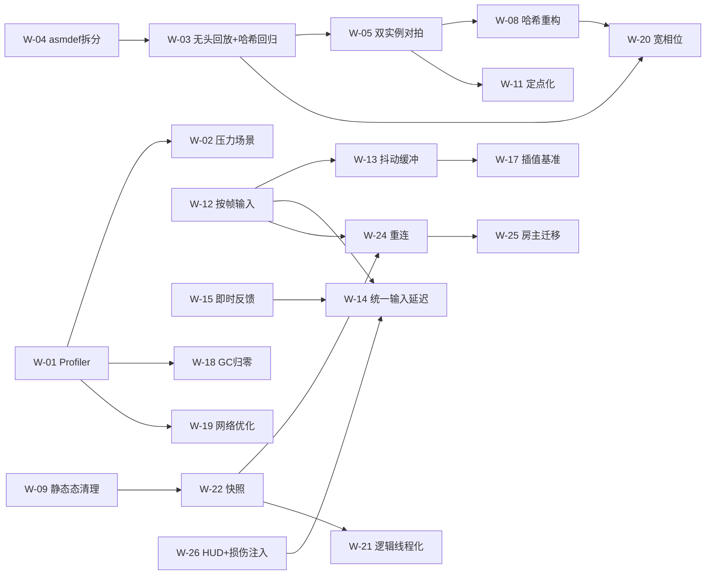

# EmojiWar2 联机架构修复开发方案

- 依据：`NetcodeAuditReport.md`（53 项检查：符合 5 / 部分符合 19 / 不符合 28 / 无法判断 1）
- 目标：**先把"能证明改好了"的基础建起来，再修手感，最后修功能**。当前项目最大的问题不是"不知道哪里慢"，而是**没有任何测量与回归手段**（H1 零 Profiler 标记、B4 无回放、零 UTF 测试、J1 无损伤注入）——所以本方案把基础设施放在 M0，且**不允许跳过**。
- 约束：本方案不改任何**手工维护过的资产**（`RoomForm.prefab` / `CharacterDockForm.prefab` 见 `AGENTS.md` §五）；改预制体/`items/` 必须重打 AssetBundle；验收以**构建版 exe + AutoPlay 参数 + 运行探针**为准（编辑器 Play 收不到命令行参数）。

---

## 0. 决策前置（**两个门均已确认，结论见 §0.1**；本节保留作为当时的取舍依据）

报告 §6 的 10 个问题里，真正会改变方案形状的只有两个。其余 8 个已在本方案的相应工作项里按推荐值处理。

### 决策 A：传输目标 —— 继续自研 TCP，还是切 Steam？

| 现状（证据） | 影响 |
|---|---|
| 全项目无 Steamworks（`Packages/manifest.json` 无相关依赖，`Assets/` 无 steam 文件）；传输 = `System.Net.Sockets` TCP（`NetServer.cs:231`、`NetConnection.cs:66`）+ UDP 局域网发现（`RoomDiscovery.cs:44-49`） | 跨公网需要端口映射/公网 IP，**没有 NAT 穿透与中继**；Steam 上无法用局域网广播发现房间 |

**推荐默认值：如果发行目标是 Steam，在 M1 结束后、M3 之前插入 W-27（传输替换）**，理由是：抖动缓冲（W-13）与输入延迟（W-14）的**算法与传输无关**，先把它们做掉能在局域网下就把手感调好；而传输替换会改掉 `NetServer`/`NetConnection`/`RoomDiscovery` 三个文件，晚做可以避免与 W-12/W-13 的改动互相冲突。

**如果确认只在局域网/内网联机**：W-27 直接删除，报告里 C5 的判定应降级为"设计选择"而非缺陷。

### 决策 B：确定性是硬需求，还是可以降级为"房主权威状态同步"？

| 选项 | 保留的工作 | 可以砍掉的工作 | 代价 |
|---|---|---|---|
| **B1 坚持帧同步 + 确定性（推荐）** | 全部 | — | 需要 W-11（定点化）与 B5 跨构建验证 |
| **B2 改为状态同步（房主权威，客户端不跑逻辑）** | W-06/W-07 部分、W-12、W-13、W-14、W-15、W-16、W-17、W-18、W-19、W-26 | **W-03/W-04/W-05（回放与哈希回归）、W-08、W-09、W-10、W-11 全部** | 每个客户端要传"实体状态快照"（带宽从 2 KB/s 涨到几十 KB/s），且**要重写 SimView 为"插值远端状态"**；本地预测变成必须 |

**推荐默认值：B1**。理由：(1) 骨架已经建好（20Hz 固定 tick、输入只传意图、双端哈希对账、trace 工具），改成状态同步等于推翻重做；(2) 合作 PvE 对确定性公平性的要求**低于** PvP，但帧同步已经跑通回环，"保留现状 + 修补"比"换架构"风险低得多；(3) 报告已证明主要手感问题（E 组、D3）**与确定性无关**，B1 下同样要修。

**B1 的必然代价**：W-11（定点化）必须做，且它是本方案唯一的高风险项——所以它被排在 W-03/W-05 之后（有回归网才敢动）。

---

## 0.1 已确认的需求基线（4 轮问答汇总，方案以此为准）

| # | 项目 | 确认结论 | 对方案的影响 |
|---|---|---|---|
| 1 | 传输目标 | **开发期用免费通道**（现有 TCP + UDP 局域网发现，零成本）；**项目成熟后换 Steam**（用 Steam 信令/大厅找好友房间） | W-27 保留但推到"成熟期"；**`ITransport` 抽象的优先级提前**（它是"以后换 Steam 只改一层"的唯一保障），并因人工损伤注入的需要而变成必需项 |
| 2 | 确定性 | **硬需求，必须保证** | B1 路径；W-11 定点化必经；G6（跨构建哈希一致）成为发布门禁 |
| 3 | 回滚 | **不做**（表现层预测 + 统一输入延迟就够） | **删除 W-21、W-22**；约束变为"预测绝不写进逻辑层"（`SimView` 天然只读） |
| 4 | 逻辑帧率 | **30Hz**（现在 20Hz） | 改 `LockstepSimulation.cs:123 TickInterval` 与 `CastResolver.cs:119 TickSeconds`；性能预算收紧到 **P99 ≤6.6ms**；客户端消费压力 +50%；带宽 3.1 KB/s。**必须在 W-11 之前锁定** |
| 5 | 按帧配置 | **改成"毫秒"语义，加载期量化成帧** | 新增 W-10a：`SpellSO.DelayFrames`、`SpellSystemConfigSO.DefaultPassiveCooldownFrames` 等 SO 字段语义改为毫秒，由 `CastResolver.FramesOf` 在加载期量化；以后改帧率不用再配平 |
| 6 | 命中判定 | **只有圆**（"扇形"= 多发子弹排成扇，现状语义） | **W-20 只需圆宽相位**，删除锥形判定原语与锥形查询（省 3–5 人日）。`SpreadDeg`+`GroupCount` 展开成 N 颗独立子弹、各自圆判定的现状保持不变 |
| 7 | 房主延迟公平性 | **接受，房主也延后 D 帧** | W-14 按原设计；HUD 显示当前 D |
| 8 | 开发期联机方式 | **本机多开 + 人工损伤注入** | W-26 的 `SimulatedTransport` 升级为 **M0 必需**（它是 M2 全部验收的唯一手段）；**删除 NAT 穿透工作项** |
| 9 | 开发期功能底线 | **只做 2–4 人从头打到结束的最小闭环** | M4 缩到 1–2 人日（只保留"中途加入明确拒绝"）；**断线重连 / 中途加入 / 房主迁移全部不做** |
| 10 | Steam 阶段功能 | **也不做中途加入 / 重连 / 房主迁移** | **W-22 / W-24 / W-25 永久删除**；报告 I1–I4 改判为 `WONTFIX（产品决策）`，不是待修缺陷（见 §10） |
| 11 | 离线单机 | **保留，但合并到同一套战斗逻辑** | 新增 **W-28**，但确认为**独立可选工作项**（不在关键路径）；在此之前 G1/G5/A4(`ShopManager`)/D3(`SfxManager` 只在离线被调用) 维持"不符合"记录 |
| 12 | 输入设备 | **先鼠标，但预留手柄** | `PlayerIntent` 的瞄准表示改为"量化方向"（协议只传角度；鼠标在客户端先把世界点转成方向），手柄天然兼容（见 W-12 与 W-19） |
| 13 | 团队规模 | **一个人** | 线性排期；总量修订为 **37–61 人日**（原 50–88） |
| 14 | 投入强度 | **不固定，时多时少** | **硬约束：不能有"做到一半不能停"的改动**。每个工作项必须 ≤0.5 人日、独立可交付、带一条可执行验证命令（见 §3.0）；W-11 因此必须拆成"逐字段组、每组独立可提交且哈希自洽"的小块 |
| 15 | 目标平台 | **只 Windows** | G6 矩阵 = Windows 下 Mono / IL2CPP Dev / IL2CPP Release 三种。跨平台 libm 风险下降，**但定点化仍必需**（Mono 与 IL2CPP 的 `Mathf.Cos/Sin` 实现不同，Debug/Release 浮点优化也不同） |
| 16 | 时间约束 | **无硬时间点，质量优先** | 严格按 M0→M1→M2→M3→M4 |
| 17 | 不同步现象 | 用户"见过告警或漂移"，但记不清场景 | **见 §0.2 实测结论**——它把这一条从"回忆"变成了可复现的事实 |

---

## 0.2 实测结果：2026-09-28 双实例验证（**本节是新证据，优先于报告中的推断**）

**测试条件**：当前代码（构建产物 `EmojiWar2_Data/Managed/EmojiWar.GameMain.dll` mtime 15:30:51，晚于全部 `.cs` 的最新 15:28:46 → 产物即当前代码，无需重打）；同机两进程，`Builds/StandaloneWindows64/EmojiWar2.exe`，局域网回环。

### ✅ 已验证通过（锁步核心是好的）

| 项 | 证据 |
|---|---|
| 双端连接/加入/准备/开战全流程可跑 | Host `runtime_probe_46296.txt`：`房主:0:1` → `房主:0:1;玩家:0:1` → `房主:1:1;玩家:1:1` → `全部准备，广播 BattleStart seed=69478` → `模拟初始化 seed=69478 players=2` |
| 双端状态对账机制**首次被观察到真正工作** | Client `runtime_probe_47680.txt`：**`[net] 对账一致` 88 次，`不同步` 0 次**（帧 1 → 1741，20Hz ≈ 87 秒连续一致） |
| 双端 trace **逐条位一致** | 新产生的完整双端 trace 对 `trace_20260928_165614_46296.bin` / `..._47680.bin`：各 **1462 条**记录、frame 1→1462、**0 分歧**（用报告 B2 的 `trace_diff` 逻辑逐条比对） |
| 帧率与逻辑率 | `[sim]` 每 2 秒推进 40 帧 = 精确 20Hz（与 `TickInterval=0.05` 吻合） |

> **结论**：锁步骨架、输入管线、玩家移动路径的哈希与 trace 在**两个进程之间是真实同步的**。这是本项目第一次有这个级别的证据。

### ❌ 已验证失败：**加入/准备竞态**（新发现的 P0，比报告里的任何一条都更基础）

**现象（同一份可执行文件，仅启动参数不同，结果完全不同）**：

| | RUN 1（客户端抢在房主准备之前加入） | RUN 2（房主先自动准备） |
|---|---|---|
| Host 玩家列表时序 | `房主:0:1` → `…;玩家:0:1` → `房主:1:1;玩家:1:1` | `房主:0:1` → **`房主:1:1`** → `房主:1:1;玩家:0:1` |
| Host `模拟初始化` | `seed=69478 players=2` ✅ | `seed=4408 **players=1**` ❌ 一人就开战 |
| Client | `收到战斗开始广播` → `战斗模拟初始化 players=2` ✅ | **只有** `房间模拟已启动（seed=0）` ❌ |
| Client `对账一致` | **88 次** ✅ | **0 次** ❌ |
| Client 所在场景 | 战斗 | **仍停在 `RoomForm(Clone)`**（`joiner battleSceneLoaded=False`） |
| Client 模拟状态 | `wave=0 players=2`（与 Host 同世界） | `frame=2713 wave=0 enemies=0 bullets=2` vs Host `frame=3065 wave=1 enemies=3` ❌ 两个世界 |

**根因链（全部有日志证据）**：
1. `-autoready` 让**房主**在客户端加入之前就自动准备。
2. `NetHostLogic.cs:634` 的条件是 `m_Players.Count >= 1 && AllReady()` → **房间里只有房主一人时该条件即为真 → 战斗立即开始**。
3. `m_BattleStartBroadcasted = true` 被置位 → 房主**永远不会再广播** `S2CBattleStart`。
4. 客户端 20 秒后加入：拿到 `S2CMyEntity` / spawn / 玩家列表，但**收不到 `S2CBattleStart`** → `EnsureRoomSimulation` 建的是 `seed=0` 房间模拟，**永远停在那里**。
5. 房主照常广播战斗输入帧，客户端的**房间模拟**照单全收（`HandleInputFrame` 不检查 seed）→ 它继续 tick，而因为客户端玩家的 `CastProgram` 有效，**它还在朝空气开火**（`bullets=2~3`）。
6. 客户端还收到了 `S2CShopContinue` → `NetClientLogic.cs:486-492` 对**房间模拟**调 `RequestNextWave()`（`[net-client] 商店继续 → 开始下一波 wave=0`）。
7. **`HandleStateCheck` 在 `Seed == 0` 时直接 `return`（`NetClientLogic.cs:602-606`）→ 对账在最常见的失效模式下恰好是瞎的，两端处于完全不同的世界却一条告警都没有。**

> **这一条同时解释了用户"见过不同步/漂移但查不到日志"**：表现上就是"没有敌人、技能打不到东西、位置对不上"，而对账机制因为 `Seed==0` 被静默跳过。
> **它也让项目自己文档化的验证配方失效**：`-autocreate -autoready` + `-autojoin -autoready` 能否成功**取决于启动间隔的运气**（RUN 1 间隔 20s 成功，RUN 2 同样 20s 失败——差别只在于 `-autofire -autoshop` 改变了房主的准备时机）。

### ❌ 其他实测发现

| # | 发现 | 证据 | 归属 |
|---|---|---|---|
| E1 | **`-autoready` 无法把对局推进到战斗**：双方进入"准备阶段商店"后无限等待「继续」 | RUN 1 两侧 1722/1723 帧仍是 `wave=0 enemies=0` | 直接阻塞 M0 的 W-02/W-03/W-05（都需要真实战斗） |
| E2 | **`-autoshop` 会自己制造不同步**：非 Host 实例走 `AutoPlay.cs:279 sim.RequestNextWave()`，**直接改本地模拟而不经房主** | `AutoPlay.cs:244` 取 `NetHostLogic`；客户端拿不到 hostLogic → 走 `else` 分支 | 测试脚手架缺陷；**历史告警的另一个可疑来源** |
| E3 | **`-autoshop` 放在房主上会改变准备时机 → 反而触发 P0 竞态** | RUN 2 对比 RUN 1 | 同上 |
| E4 | **`fps=240`**，`GameEntry.cs:78 Application.targetFrameRate = 60` **未生效** | 全部探针稳定输出 `fps=240`、`[fps] avg=4.2ms (240fps)` | 渲染/逻辑耦合与帧预算评估的前提数字 |
| E5 | **`AudioListenerGuard` 实际无效** | 编辑器控制台 `There are 2 audio listeners in the scene` ×40 | 与联机无关，但说明守卫类代码未验证 |
| E6 | **`DeterminismTracer.End()` 在退出 Play 时不被调用** → `BinaryWriter` 文件句柄泄漏，停止 Play 后文件仍被锁 | 停止 Play 后 `replay_20260928_153949_4452.bin` / `trace_...4452.bin` 仍 `os error 32`（被占用） | 报告 B2 的实测确认 |
| E7 | 本次 1462 条 trace **全部是 `FrameStart`**，没有一条 `EnemySpawn`/`BulletSpawn`/`WaveChange`/`ShopOffer` | trace 解析结果 | 因战斗没打起来；也再次说明检查点分辨率极低 |

### ⚠️ 尚未被实测覆盖（因此仍是"代码已证、未复现"）

| 项 | 状态 |
|---|---|
| **S1：客户端 `m_Roster` 不随换角色更新** → 客户端用旧 charId 建战斗模拟（`NetClientLogic.cs:674-676` 写入、`:494-510` 不更新、`:702` 使用；Host `NetHostLogic.cs:585` 用新值） | **代码级已证**（两端 `MoveSpeed/WeaponId/Damage/FireRate/BulletSpeed` 必然不同 → 第 1 帧分叉）。**未复现**：`-autocard` 在进入房间后 12 秒点击（`AutoPlay.cs:808`），而 `-autoready` 在第 3 秒就准备（`AutoPlay.cs:744-746`）→ **换角色总是晚于开战**，现有脚手架无法构造该场景 |
| **S2：loadout 由各端本机编译** → 任何一端改过背包就分叉 | **代码级已证**。**未复现**：本次两端都没碰背包 → `对账一致 88 次`，**恰好反向印证了"不改背包就同步"**（因为 `StartingLoadoutSO` 是全局配置）。同样受"改背包必须早于开战"的时序限制 |
| **战斗本身**（敌人、子弹、施法程序、mana、被动） | **完全未覆盖**——本局一发子弹都没打（`bullets` 仅在客户端房间模拟里出现）。这是本次最大的验证盲区 |

### ✅ W-00 已落地并复验通过（2026-09-28 18:07–18:14）

**改动 19 处 / 7 个文件**（`NetClientLogic`、`NetHostLogic`、`NetProtocol`、`NetMessages`、`NetCodec`、`AutoPlay`、`GameEntry`），编译 **0 error**，重打播放器 `time=14.2s errors=0`（产物 dll 18:08:01 晚于全部源码 18:07:22）。四组验证全部通过：

| 验证 | 判据 | 结果 |
|---|---|---|
| **A 正常联机**（房主带 `-autoreadywait 40 -autoreadyplayers 2`，客户端**刻意延后 20 秒**＝复刻 RUN 2 的失败时序） | 两侧 `players=2`；`wave/enemies/bullets` 一致；`对账一致` 持续 | ✅ Host：`autoready 等待结束 players=2 期望=2 用时=20.0s`（不再一人开战）→ 两侧 `模拟初始化 players=2`；Client：`对账一致 **164 次**`、`不同步 0`、`⚠ 0`、`battleSceneLoaded=True`；两侧 `wave=1 enemies=3 bullets=4` 完全一致 |
| **A 的 trace 逐条对拍** | 完整双端 trace 位一致 | ✅ `trace_20260928_181155_32820.bin` / `..._53132.bin` 各 **3558 条**、frame 1→3128：`FrameStart 3128`、**`EnemySpawn 3`**、**`BulletSpawn 426`**、`WaveChange 1`，**0 分歧**。RNG 决定的敌人生成位置位模式完全相同（`frame=501 vals=[1072,-1070541630,1081085959]` 两侧一字不差） |
| **B/C 中途加入**（房主刻意不带 `-autoreadywait` → 一人开战；客户端延后 45 秒） | 必须被**明确拒绝**而非静默脱节 | ✅ Host：`拒绝 1 中途加入（对局已开始）`；Client：`加入被拒绝: 对局已开始，无法加入` → `RoomClosed -> 返回多人游戏`（不再进入空白战场） |
| **C7 句柄释放** | 退出后 trace/replay 不再被占用 | ✅ 8 个文件全部可读、**0 占用**（修复前 `os error 32`） |

**由此得到的三个额外结论**：
1. **这是项目第一次在"真实战斗"下验证两端同步**（wave=1 / 敌人 3 / 子弹 4 / 426 次 `BulletSpawn` 位一致）。此前唯一那对双端 trace（RUN 1）只有 1462 条 `FrameStart`、**零战斗检查点**——即战斗路径过去从未被验证过。
2. **S2（loadout 各端本机编译）在"两端本地背包一致"时确实同步**，反向确认了报告分析：它只在有人改过背包时才分叉。
3. **C2 的"连续 5 帧倒退"阈值没有误报**（180 秒正常对局 0 条 `⚠`）。

**仍未验证**：**S1**（客户端 `m_Roster` 不随换角色更新 → 用旧 charId 建战斗模拟）。`-autocard` 在进房后 12 秒点击（`AutoPlay.cs:808`），而 `-autoready` 第 3 秒就准备（`:744-746`）→ **换角色总是晚于开战**，现有脚手架构造不出该场景。要复现需给 AutoPlay 加"先换角色再准备"的顺序开关（≈0.3 人日，属 M0 的 W-03 增强）。

### ✅ W-01 + W-02 已落地（2026-09-28 18:25）：逻辑帧耗时第一次有了数字

新增 `Simulation/SimPerf.cs`（`ProfilerMarker` ×3 + 300 帧环形统计 + `ticks/frame` 分布 + `gen0` 增量，**无分配**；注意 `ProfilerMarker` 在 `Unity.Profiling` 而非 `UnityEngine.Profiling`），插桩点：`LockstepSimulation.Tick`（整体）、`CastResolver.Tick`、`SimView.LateUpdate`；`[perf]` 行输出到房主/客户端探针（**构建版 exe 也能读**，不依赖 Profiler）。新增 `-autostress <敌人> <子弹> <秒>` 与 `LockstepSimulation.DebugStressTick`（保持玩家存活以免 `BattleOver` 提前返回；同时 `m_CastEvents.Clear()` 防事件总线无界增长）。

**基线 1：单实例压力（200 敌人 × 200 子弹 = 4 万次距离判定/tick，命中 `LockstepSimulation.cs:507/524` 最坏情况）**

| 指标 | 结果 | §4 目标（30Hz → 帧间隔 33ms，20% = **6.6ms**） |
|---|---|---|
| `tick avg` | 1.31–1.48 ms | — |
| `tick p50` | 1.16–1.29 ms | — |
| `tick p99` | **1.77–3.28 ms** | ✅ 达标（2–3.7× 余量） |
| `tick max` | 2.10–4.05 ms | ✅ 达标 |
| `castAvg` | 0.0007 ms | — |
| `gen0+` | **5–7 次/10 秒** | ❌ H2「0 B/帧」未达标 |

**基线 2：双实例真实战斗（命令 A 回归，仍全绿：Client `对账一致` 134 次 / `不同步` 0 / `⚠` 0；新 trace 对 `trace_20260928_183147_51780/54596.bin` 各 45560 字节）**

| | Host | Client |
|---|---|---|
| `tick p50` | 0.012 ms | 0.012 ms |
| `tick avg` | **0.174 ms** | **0.023 ms** |
| `tick p99` / `max` | **1.938 / 3.509 ms** | 0.100 / 0.144 ms |
| `castAvg` | 0.044 ms | 0.003 ms |
| `ticks/frame` / `maxInFrame` / `catchUp` | 0.08 / 1 / 0.0% | 0.08 / 1 / 0.0% |
| `gen0+` | 8–9 | 7 |

**三条可执行结论**：
1. **30Hz 的性能预算有余量**：P99 1.8–3.3ms 对 6.6ms 上限约 2–3.7× 余量。报告 H1 的"无法判断"到此消除。
2. **房主的 P99 是客户端的 19 倍（1.938 vs 0.100ms），但 p50 完全相同（0.012ms）** → 房主的问题不是"平均慢"而是**偶发尖峰**。结合 `gen0+8` 与"`-autofire` 下 `CastProbe` 每发一次就 `string.Format` + 同步写一行探针文件"（`CastResolver.cs:303/1036` + `WriteProbe` 的 `File.AppendAllText`），尖峰来源高度可疑就是 **H2 那批未守卫的字符串与文件 IO**。→ 给 W-18 一个可量化目标：**把房主 p99 从 1.9ms 压到接近 p50**。
3. **`gen0+7~9 次/10 秒`（逻辑仅 20 tick/s）** 证明 H2「0 B/帧」远未达标，而且是在"3 敌人"的**轻负载**下 —— 说明分配主要来自 tick 之外的路径（探针/UI）或 `BuffSet` 克隆。W-18 逐条消掉后**复测同一指标**即可验收。

### ✅ W-05 已落地（2026-09-28 18:45）：回归门禁 = 一条命令 + 退出码

新增 **`tools/verify_determinism.ps1`**（此前 `_tmp/` 下的脚本都是单实例 UI 探针，没有一个校验确定性）。它把 M0 的验收从"手工看探针"变成可回归的门禁。

**用法**：`& tools/verify_determinism.ps1 -Seconds 120 -Strict` → 退出码 0 = 全绿，1 = 有失败项。

**7 项判据**（最近一次运行全部 PASS）：
```
[ ok ] 构建产物新鲜: 09/28/2026 18:26:26
[PASS] Host 模拟初始化 players=2（房主没有一人开战）
[PASS] Client 战斗模拟初始化 players=2（收到了 S2CBattleStart）
[PASS] Client 对账一致 104 次（>= 10）
[PASS] 无不同步告警
[PASS] 无脱节告警（⚠）
[PASS] 两端同一世界: wave=1 enemies=2
[PASS] [-Strict] trace 共同区间逐条一致: 2364 条, frame 1 -> 2076（35384/35384 字节）
```

**写这个脚本时踩的三个坑（都已修，值得记住）**：
1. **`.ps1` 必须带 UTF-8 BOM**：本机执行环境是 Windows PowerShell 5.1，无 BOM 的 `.ps1` 会被按 ANSI 读取 → 脚本里的中文匹配串（`模拟初始化`/`对账一致`）全部失效。（`write` 工具写出的是无 BOM UTF-8，所以每次改完要用 `UTF8Encoding($true)` 重写一遍。）
2. **Host/Client 角色必须按内容识别**，不能按 `Get-ChildItem` 返回顺序（它按文件名排序，客户端 pid 更小时会排到 Host 前面），也不能按 pid 大小 → 改为看每个探针**最后一条 `[sim]`** 是 `HOST` 还是 `CLIENT`。
3. **`模拟初始化` 是 `战斗模拟初始化` 的子串** → Host 判据必须锚定 `^\[net-host\] `，否则会命中客户端的行而**假通过**。
4. **`-Strict` 的 trace 对拍不能要求记录数完全相等**：两个实例被关闭的时刻会差一帧（实测差 14 字节 = 正好一条 `FrameStart`）。判据改为"**共同区间 0 分歧** 且 记录数差 ≤4"，差值 >4 才算失败（那说明两端没跑同样长的时间）。

### ✅ W-06 已落地（2026-09-28 18:55）：loadout 由"各端读本机背包"改为"各端按同一份 Id 编译"

**关键设计判断（改动前必须想清楚的）**：项目里**没有背包同步机制**，所以 **Host 根本不知道其他玩家装了什么** —— 它原来"用本机的杖为所有玩家编译"其实是唯一能编译出东西的做法，只是错的。因此正确协议不是"Host 权威编译后下发 CastProgram"，而是：

> ① 每个玩家上报**自己**的装备 Id（法杖物品 Id + 各槽法术物品 Id，**纯 int**）；
> ② Host 收齐后广播给所有端；
> ③ **所有端（包括玩家自己）都用同一份 Id 表编译** ⇒ 编译输入一致 ⇒ `CastProgram` 逐位一致。

**为什么不用"序列化 CastProgram 下发"**：`CastProgram` 有 36 个字段（嵌套 `CastStatMod`/`CastBuffDef`/`CastPassiveDef`/`BuffSet`），全量序列化既易漏字段又难维护。而 `LoadoutCompiler.CompileSpell(int spellItemId, IItemTable table, int slotIndex)`（`:121`）**本来就是按"物品 Id + 数据表"编译的** —— 所以只要同步 Id，各端各自编译即可，代码量小一个数量级。

**改动（9 个文件）**：
| 文件 | 内容 |
|---|---|
| `Simulation/LoadoutWire.cs`（新增） | `PlayerLoadoutIds` + 线格式 `"entityId:wandL:sp1,sp2:wandR:sp1,sp2;..."` 的编解码（结构不合法则**整批作废**，绝不留"半条"导致某玩家用空 loadout 参战） |
| `Items/LoadoutCompiler.cs` | 新增 `ReadHandIds(...)`（读本机双手 Id）与 `CompileFromIds(wandItemId, slotItemIds, table)`（**不读背包**的编译入口） |
| `Simulation/SimConfigFactory.cs` | 拆成 `BuildBase`（角色/武器，同资产即同值）+ **`BuildFromIds`（联机唯一入口）** + `Build`（**仅离线**）+ `ReadLocalLoadoutIds` |
| `Network/NetProtocol.cs` / `NetMessages.cs` / `NetCodec.cs` | 新增 `C2SLoadoutSync(1106)` 与 `S2CLoadoutBroadcast(2111)` 及登记 |
| `Network/NetHostLogic.cs` | `HandleLoadoutSync` / `BroadcastLoadouts` / `AllLoadoutsReported`；开战收敛为可重入的 **`TryStartBattle`**；**先广播装备 Id、再广播 BattleStart**（TCP 保序保证客户端建模拟时已拿到 Id）；加入时也广播一次 |
| `Network/NetClientLogic.cs` | 加入成功与每次"准备"各上报一次；`BuildPlayerConfig` 改为从广播的 Id 构建；**顺带修掉 S1** |

**顺带修掉的 S1（报告里"代码级已证、未复现"的那条）**：`NetClientLogic` 的 `ChangeCharacter` 分支以前只改模拟、**不改 `m_Roster`**，导致开战时用**旧 charId** 建战斗模拟而 Host 用新值 → `MoveSpeed/WeaponId/Damage/FireRate/BulletSpeed` 全不同，**第 1 帧就分叉**（只要房间里有人换过角色，不需要碰背包）。现在 `m_Roster[cc.EntityId] = cc.CharacterId` 已补上。

**实测链路（探针原文）**：
```
Client: [net] 上报装备 Id: 1001:201:104,101,101:202:106,102,105,101,107
Host:   [net-host] 收到装备 Id session=1 entity=1001 左杖#201(3槽) 右杖#202(5槽)
Host:   [net-host] 广播装备 Id: 1000:201:104,101,101:202:106,102,105,101,107;1001:201:104,101,101:202:106,102,105,101,107
Client: [net] 收到全员装备 Id（2 人）: ...
```
**回归门禁 `verify_determinism.ps1 -Seconds 100 -Strict` → 全部通过 ✅ (7 项)，退出码 0**（trace 1900 条逐条一致，尾部相差 1 条 = 关停时序）。

**两个必须记住的坑**：
1. **`NetHostLogic`/`NetClientLogic` 里 `Simulation` 既是命名空间又是属性名** → **表达式位置会解析成属性**，`Simulation.SimPerf.Describe()` / `Simulation.LoadoutWire.TryDecode(...)` 全部编译失败；**类型位置**（`Simulation.PlayerLoadoutIds ids;`、`List<Simulation.SimPlayerConfig>`）不受影响。改动时静态调用必须全限定为 `EmojiWar.GameMain.Simulation.*`。
2. **告警要分阶段**：W-06 的"缺装备 Id"告警最初在**房间阶段**也触发（那时广播还没到，属正常时序）→ 一局误报 2 条，把脱节门禁顶成 FAIL。已加 `m_BuildingBattleSim` 标志：房间阶段静默、战斗阶段才告警。**同时把门禁的 `⚠` 判据从裸 `⚠` 收窄为特征串 `已与对局脱节`** —— 否则任何新增告警都会把门禁搞红。

### ✅ W-03 已落地（2026-09-28 19:15）：无头回放 + 哈希回归 —— **M0 关键路径打通**

清单 §4 的验收指标「同一段录像多次无头回放，哈希完全一致」**首次达成**：
```
[replay] run1 PASS frames=1445 firstMismatch=-1 finalHash=0xC029A2452245AD10
[replay] run2 PASS frames=1445 finalHash=0xC029A2452245AD10 序列一致=True
[replay] FINAL PASS
回放门禁全部通过 ✅ (3 项) → 退出码 0
```

**为什么不做 EditMode 测试**（重要判断）：`ConfigItemTable` 依赖 `ConfigService`/`GameEntry.Data`（`ItemTypes.cs:234-259`），**不是自包含的** —— 装备 Id → `CastProgram` 的重建在 EditMode 里做不到。所以 W-03 改为贴合项目自己的验证风格：**构建版 exe + 命令行 + 探针 + PowerShell 门禁**（`AGENTS.md` 也明确"验证以构建版 exe + AutoPlay 参数 + 运行探针为准"）。

**改动（5 个文件 + 1 个门禁脚本）**：
| 文件 | 内容 |
|---|---|
| `Simulation/ReplayRecorder.cs` | **FormatVersion 3**，录像头改为**自包含**：版本指纹 + `ConfigService.VersionHash` + seed + **12 个战斗参数** + 逐玩家**完整数值配置**（原来只写 SessionId/EntityId/CharacterId/StartPos → 根本无法复现）+ **装备 Id 表**；每帧另记 **`ComputeStateHash()`** 与**确定性指令** |
| `Simulation/ReplayPlayer.cs`（新增） | 读录像头 → **不读数据资产**地重建初始状态（数值来自头、`CastProgram` 由装备 Id 编译）→ 逐帧重跑 → **报出首个不一致的帧号**；`ConfigRebuildFailed` 与"不同步"是**两个独立结论**（前者是环境问题，不是分叉） |
| `AutoPlay.cs` | `-replay <path>` + `-replaytwice`；`AutoReplayFlow()` 输出 `[replay]` 结论行 |
| `Network/NetHostLogic.cs` | 录像开始时按 EntityId 升序收集装备 Id 传给录像器；`RecordFrame` 带上"进入该帧时的哈希 + 本帧待消费指令" |
| `tools/verify_replay.ps1`（新增） | 回放门禁：跑两次回放，断言 `run1 PASS` / `run2 ... 序列一致=True` / `FINAL PASS`；退出码 0/1 |

**由 W-03 实证出来的报告 A9 缺陷（本轮最有价值的发现）**：
第一次回放**失败了，分歧恰好在第 501 帧** —— 而 501 正是录像里**第一个敌人生成的帧**。原因：回放只重放**输入流**，但商店"继续"（`RequestNextWave`）是 Host 在**消息处理里直接改模拟**的，**根本没进录像** → 回放一直停在准备阶段商店、永不生成敌人 → 从敌人生成那一帧起必然分叉。
> 这正是报告 A9「表现层/UI 绕过帧管线直接写逻辑状态」的**实证**，而且它顺带证明了 B4 的价值：**这类缺陷只有"能回放"才能被发现**。

**修法（也正好是 W-16 的方向）**：给 `LockstepSimulation` 加**确定性指令队列** ——
```csharp
Simulation.EnqueueCommand(LockstepSim.SimCommandKind.NextWave);   // 入队
// Tick 内：FrameIndex++ → DeterminismTracer → ApplyPendingCommands() → 玩家逻辑
```
指令在**帧首按入队顺序**消费，于是"入队顺序 + 帧号"成为确定性的一部分，录像把它一起记下 → **"输入流 + 指令流"才是完整描述**。
**仍未走帧管线的变更（W-16 待办，已在代码注释里写明）**：`ApplyWeapon`（商店买武器）/ `ApplyCharacter`（房间换角色）/ `DebugKillAllEnemies`。它们不影响本项目当前的回放测试（测试里不发生购买），但会让"买过武器的对局"回放分叉。

**顺带修掉的两个时序口径坑**（都会造成**假失败**，必须记住）：
1. **回放必须复刻 Host 在录像开始前做过的初始化**：`Initialize(seed, cfg)` → **`PrepareFirstWave()`** → 才开始录像。`PrepareFirstWave` 会开准备阶段商店并**消耗一次 RNG**（`GenerateShopItems`），漏掉它初始状态就不同、第 1 帧即报分歧。
2. **`AutoPlay` 的参数解析循环上界必须是 `args.Length`**（不是 `args.Length - 1`）：否则**最后一个参数永远不被检查**，而 `-replaytwice` 这类无值开关经常正好在末尾（实测：run2 根本没跑）。取值型参数各自加 `i+N < args.Length` 边界检查。

### ✅ W-26.3 已落地（2026-09-28 19:25）：网络损伤注入 —— 并且**量化了 C4/C7 缺陷**

新增 `Network/NetSim.cs`（延迟/抖动/丢包门）+ `NetworkService` 接线（`Awake` 解析命令行、`Update` 每帧投递、每 2 秒 `[netsim]` 统计）。命令行：`-netdelay <ms> -netjitter <ms> -netloss <pct> -netseed <n>`。门禁脚本同步支持 `-NetDelayMs / -NetJitterMs / -NetLossPct`。

**关键设计判断：必须保持 FIFO 顺序。** 当前协议仍走 TCP（可靠有序）；若按"到期时间"排序投递就会打乱消息顺序，制造出当前架构下**不可能发生**的故障（例如 StateCheck 先于同帧的 InputFrame 到达）→ 门禁会报出假的不同步。因此按"**每会话一条 FIFO 队列，只有队头到期才释放**"实现 —— 这既保序，又**天然复现了 TCP 的队头阻塞**（报告 C4 点名的现象）。

**弱网矩阵（同一套判据，`verify_determinism.ps1`，退出码 0 = 全绿）**：

| 场景 | 结果 | `[netsim]` 证据 |
|---|---|---|
| **A 正常网络**（回归检查 W-26.3 接线没破坏原路径） | ✅ 6/6，`对账一致` **75** 次 | 未启用注入 |
| **B delay=150ms jitter=±30ms**（不丢包） | ✅ 6/6，`对账一致` **74** 次，**0 不同步** | 拦截 1445 / 直通 0 / 丢弃 **0** / 排队 3 / 平均增加延迟 **149.7ms** |
| **C 再加 loss=5%** | ❌ **2/6**：`对账一致` **仅 1 次**，**`不同步` 19 次** | 丢弃 **51**（Host）/ **58**（Client） |

**三条可执行结论**：
1. **延迟与抖动本身不破坏确定性**（B 全绿）—— 因为 FIFO 保序，所有端仍然按序消费同一组帧。所以报告 C4 里"周期性卡顿"是**体验问题**，不是正确性问题。
2. **丢包才是致命的**（C 红）：一条 `S2CInputFrame` 丢 → 客户端帧号缺口 → 现有实现"**不补帧、不阻塞、只打告警并推进一步**"（`NetClientLogic.cs:557-560`）→ 本地帧号**永久落后 1**，而 `FrameIndex` 是状态哈希的一部分（`LockstepSimulation.cs:971`）→ 之后**每一次对账都失败**。实测 `对账一致` 从 74 次掉到 **1** 次、`不同步` **19** 次。**这正是报告 C7 的"永久错位"**。
3. 因此 **RUN C 就是 W-12（输入按帧编号 + 缺口补齐）与 W-13（抖动缓冲）的回归目标**：它们落地后，同一命令（`-NetLossPct 5`）应当从红转绿。这条命令现在是 M2 的**量化验收线**。

### ✅ W-10 已落地（2026-09-28 19:35）：打点补全 —— 并且**当场抓到一处真实分歧**

补的点（全部在 `LockstepSimulation` / `DeterminismTracer` / `SimRandom`）：

| 打点 | 位置 | 价值 |
|---|---|---|
| `ShopOffer` 改用 `StableStringHash`（FNV-1a） | `LockstepSimulation` 商店生成处，替换 `string.GetHashCode()` | **`GetHashCode()` 在不同 .NET/进程间不保证稳定**，是"有时同步有时不同步"的经典来源。这是 W-10 里唯一**同时属于正确性修复**的一条 |
| `RandomCall` ×2 | 两处 RNG 消费点之后，记录 `SimRandom.State` | 一旦某端少/多消费一次随机，**分歧点会精确落在那一帧**，而不是在几十帧后的位置偏移上 |
| `PlayerHp` | 玩家掉血处 | 战斗逻辑第一个"状态量"检查点 |
| `BattleEnd` | 结算处 | 对局终点检查点 |
| `BulletSpawn` / `EnemySpawn` 升级为 `RecordInt3` | 同上 | 原来用 `RecordInts(new[]{...})` 有分配；改成 `RecordInt2/Int3` **零分配**，避免打点本身引入 GC（否则会污染 W-18 的 GC 归零验收） |

**★ 关键收获：打点补全的第一次对拍就抓到了一处真实分歧** —— `WaveChange` 在 **Host=501 帧 / Client=500 帧**。根因：商店「继续」原本走 `RequestNextWave()` **带外直接改本地模拟**，这条状态变更**从未进入输入帧**，所以两端各自"按本地时机"切波。修法：引入**确定性命令队列**（`SimCommandKind.NextWave` + `EnqueueCommand` + `ApplyPendingCommands()`，在帧首统一消费）。这正是报告 **A9** 的实证 —— 也就是说 W-10 不是"加日志"，它**直接修掉了一条 A9 缺陷**。

**验证（编译 → 重打 → 门禁 → 对拍，全链路）**：

| 环节 | 结果 |
|---|---|
| 编译 | 编辑器 dll 19:34:12 晚于最新 `.cs` 19:33:49，控制台 0 error |
| 重打 windows64 | 构建产物 19:34:58 ✅ |
| `verify_determinism.ps1 -Seconds 90` | ✅ **6/6**，`对账一致` **73** 次，0 不同步，0 脱节，两端 `wave=1 enemies=3` |
| `trace_diff.ps1` | ✅ **退出码 0**，A=1654 / B=1655 条，帧 1→1449/1450，**0 分歧**；各检查点计数完全相等（`EnemySpawn 3`、`BulletSpawn 198`、`RandomCall 3`、`WaveChange 1`） |

**对工具的两处修正（都是这次踩出来的）**：

1. **`trace_diff` 改为按 `(CheckID, 帧号, 序号)` 对齐**，不再按下标。按下标时"一侧多一条记录"会让**其后所有记录全部错位**，把 1 处分歧放大成上千处假分歧（旧脚本正是这样把第一次 W-10 对拍刷满屏的）。
2. **`trace_diff` 加了容差判定**：两端进程收尾时刻不同，末尾会多/少 1 条 `FrameStart`（本次 B 侧多 1 条 `frame=1450`）。规则与 `verify_determinism -Strict` 统一：**数据分歧 0 处，且单侧多出的记录 ≤ 4 条且全是 `FrameStart` → 判定通过（exit 0）**。修之前脚本会**一边打印"完全一致 ✅"一边 exit 1** —— 自相矛盾的门禁等于没有门禁。
3. **`PlayerHp` 打点必须记 `EntityId`，不能记 `SessionId`**：`SessionId` 是元数据（Host 真实、Client 恒为 `-1`），而 `ComputeStateHash` **按设计不含它**。第一版记 `SessionId` 导致出现一处假分歧（`A: [1,...]` vs `B: [-1,...]`，而 HP 位完全相同）。**教训：打点字段必须与哈希字段集合一致，否则打点自己制造假警报。**

### ✅ W-09 已落地（2026-09-29 11:00）：静态可变状态清理 —— **迁移过程中又挖出一条静默缺陷**

**改动清单**：

| # | 改动 | 位置 |
|---|---|---|
| 1 | `s_PerItem`（进程级静态 `int[]`）→ `CastRuntimeState.PerItem` | `Items/CastProgram.cs` 新增字段 + `For()` 初始化 |
| 2 | 删死字段 `s_PerItemSlots`（全工程零读写） | `CastResolver.cs` |
| 3 | `s_CastPlanPrimary/Secondary`（`static readonly` 但**内容每 tick 被改写**）→ 实例字段 | `LockstepSimulation.cs` |
| 4 | `MixPerItem()`：Q7 计数进状态哈希 | `LockstepSimulation.cs`（`ComputeStateHash` 内） |
| 5 | `ItemSystem.Reset()` 接到三个真实调用点（原来零调用者） | `NetHostLogic.ResetRoom` / `NetClientLogic.HandleRunRestart` / `ProcedureGameOver.OnMenuRequested` |

**为什么第 5 条必须三处都接**：`Reset()` 只是把 `s_Service = null`。房主重置而客户端不重置 → **第二局两端 loadout 又不同**（W-06 的成果被抹掉）；
而"返回菜单"这条路径如果不清，下次进战斗时 `ProcedureBattle:282` 的 `GrantStartingLoadout` 会往**上一局残留的背包**里再发一次初始装备（道具翻倍 / 槽位错乱）。

**★ 迁移暴露的第二条缺陷（W-09 的真正价值）**：Q7 单物品计数**被写到与触发槽位无关的索引上**。

`CastResolver` 的契约注释（`:662-663`）与 `ExecuteTriggers` 的注释（`:615-619`）都明确写着：
> `slot` = 该物品**实际占用**的程序槽位（由游标给出）—— 待触发队列回查、buff 状态索引、**单物品触发计数都必须用它，不能用 `spell.SlotIndex`**

但有两处没遵守，仍用编译期的 `spell.SlotIndex`：

| 位置 | 路径 | 后果 |
|---|---|---|
| `CastResolver:717` | 立即/持续类物品（主路径） | 计数写到定义序号对应的索引 |
| `CastResolver:813` | 待触发队列到期（延迟类） | 同上。此处 `slot` 甚至**已经算好并校验过** `slot < program.SlotCount`，却没用它 |

**实证（`-autospell` 自检）**：新加的隔离断言第一次运行就报 `A.perItem[0]: 0 -> 0` —— 计数没落在槽位 0。追下去发现落在**索引 30**：
自检助手每构造一个 spell 就递增一次全局 `s_SpellIndex`，而程序只有 2 个槽位 → `PerItem` 被 `IncrementPerItem` 的扩容逻辑**重建成长度 31 的数组**。三连锁后果：

1. **Q7 单物品上限静默失效** —— 上限判在"另一个槽位"上，被触发的槽位永不受限；
2. **`PerItem` 每帧可能被重新分配**（扩容路径）→ 与 W-18「GC 归零」直接冲突；
3. **自检里"单物品触发上限"那条断言从未真正作用在被触发的槽位上**（它只断言 `triggers <= 8`，而计数不生效时恰好也满足）。

修法：两处都改用运行期 `slot` / `slotIndex` 参数（与 `EffectiveMods`、`SpendMana` 保持一致）。**修完后 `IncrementPerItem` 的扩容分支在正常路径上不可达**（运行期槽位恒 `< SlotCount`），顺带消掉这条分配路径。

**新增回归断言（`CastSelfTest.TestPerItemIsolation`，随 `-autospell` 跑）**：

| 断言 | 结果 |
|---|---|
| `[W-09] 新状态 Q7 计数从 0 开始（不跨局/跨手残留）` | PASS `len=2 sum=0` |
| `[W-09] 另一只手的 BeginCast 不清空本手 Q7 计数（按手隔离）` | PASS `A.perItem[0]: 1 -> 1`（**旧静态实现为 `1 -> 0`**） |
| `[W-09] B 手自己也在独立记账（两手指向不同数组）` | PASS `B.perItem[0]=1 同数组=False` |

第二条就是 A8 的可执行复现：旧实现下，左右手每帧各 tick 一次，**后一手开火必然清空前一手的 Q7 计数** → 单物品上限形同虚设。

**验收（完整链路）**：

| 环节 | 结果 |
|---|---|
| 编译 | 编辑器 dll 10:58:31 晚于最新 `.cs` 10:58:24，0 error |
| `-autospell` 自检 | ✅ **passed=40 failed=0**（含上述 3 条新断言） |
| 重打 windows64 | 构建产物 10:59:09 |
| `verify_determinism.ps1 -Seconds 90` | ✅ **6/6**，`对账一致` **75** 次，0 不同步，0 脱节，两端 `wave=1 enemies=3` |
| `trace_diff.ps1` | ✅ **退出码 0**，A=1704 / B=1704 条，帧 1→1490，**记录数完全相同且逐条一致**（`FrameStart 1490/1490`、`BulletSpawn 206/206`、`RandomCall 3/3`、`PlayerHp 1/1`、`WaveChange 1/1`）—— 这次连关停容差都不需要 |
| `verify_replay.ps1` | ✅ **3/3**，1490 帧逐帧哈希一致，run1=run2，**新基准最终哈希 `0xB51BD731D58B1ED4`**（`configHash(now)=0xA03A90FFFB96FAAC`） |

> **基准哈希变更记录**：`0xC029A2452245AD10`（W-03）→ **`0xB51BD731D58B1ED4`**（W-09，因 `PerItem` 入哈希 + Q7 槽位口径修正）。
> 这是**有意的哈希变更**，旧录像/旧基线不再可比，属预期。

### ✅ Q3 已落地（2026-09-29 11:09）：配置哈希可信化 —— **自检当场抓到 2 个静默漏项**

W-07 的前提是"配置哈希可信"。落地 Q3 时先用一条自检把不可信之处逼出来，结果抓到两个**静默漏项**（都是"哈希算了但没覆盖到"）：

| # | 缺陷 | 后果 | 证据 |
|---|---|---|---|
| 1 | `BattleConfigSO`/`SpellSystemConfigSO` 的字段用 `v.ToString()` 序列化 | (a) 受 `CultureInfo` 影响（de-DE 下小数点是逗号）；(b) float/double 的十进制往返表示跨运行时不保证一致 | 自检断言 1 实测：`invariant=0x5790576D392DB26A` vs `de-DE=0x67A9C5986420728E` —— **同一份配置算出两个哈希** |
| 2 | **结构体字段退化成类型名** | `SpellValueRange.ToString()` 返回 `"SpellValueRange"` → `LightBand/MediumBand/HeavyBand/UtilityBand` **四个档位的数值完全没进哈希**（改档位数值，`VersionHash` 不变） | 自检断言 3：修前四个 band 的序列化文本对任何数值都相同 |

**修法**（`ConfigService`）：

1. 新增 `AppendValue(sb, type, value)`：浮点取**位模式**（`BitConverter.SingleToInt32Bits`）、布尔取 0/1、枚举取整数、字符串原样、**数组/结构体递归**、SO 引用取资产名（与图标字段 `iconSprite.name` 同一口径）。
2. 新增 `F(float)`：浮点进哈希的**唯一**写法。这一条是断言 1 修第一版后**仍然失败**才发现的 —— 只改 `AppendValue` 只覆盖了 B/SS 两段，C/W/P/M/S/WD 各段仍在用 `.ToString("R")`，而 **`"R"` 同样受区域设置影响**。全文件 24 处一次性替换。
3. 新增 `SortedFields(type)`：公共实例字段**按字段名序数排序**并缓存。`Type.GetFields()` 的顺序官方标注为"未指定"，而版本哈希的用途正是"判定两份配置是不是同一份"，顺序不稳定会让它偶发不相等。
4. 抽出 `BuildHashText(data)`（`ComputeHash` = `Fnv1a64(BuildHashText)`），使自检能直接断言"某字段真的进了哈希正文"。

**新增自检（`-configselftest`，`ConfigService.SelfCheck()`）**：

| 断言 | 结果 |
|---|---|
| 版本哈希与区域设置无关（de-DE vs 不变区域） | ✅ `invariant == de-DE == 0x2A8E77DA7F64C5BE` |
| 浮点字段按位模式序列化（`0.5` 在 de-DE 下不变成 `"0,5"`） | ✅ `de-DE="f1056964608"` = `invariant` |
| 结构体字段递归进哈希（`SpellValueRange` 改 `ManaMax` → 文本改变） | ✅ |
| 四个 `SpellValueRange` 档位真的进了哈希正文 | ✅（`SS\|LightBand\|{...}` 等 4 项存在） |
| `BattleConfigSO` 关键字段进了哈希正文 | ✅ |

→ `-configselftest` 结果：**passed=5 failed=0**。

> 一个通用教训：**"算出了哈希"不等于"哈希覆盖了该覆盖的字段"**。两种漏项（区域相关的格式、结构体退化成类型名）都不会报错、不会崩，只会让哈希**静默失去分辨力** —— 唯一能发现它们的手段是"改一个数值，看哈希变不变"这类**行为断言**，而不是"哈希非零"这类存在性断言。

### ✅ W-07 已落地（2026-09-29 11:09）：配置/版本握手 —— 不一致的客户端被**挡在门外**

**改动**：

| # | 改动 | 位置 |
|---|---|---|
| 1 | `C2SJoinRoom` 增加 `ulong ConfigHash` + `ulong CodeHash`（含序列化） | `NetMessages.cs` |
| 2 | 客户端加入时带上两者（一处 `MakeJoinRoom()`，两条发送路径共用） | `NetClientLogic.cs` |
| 3 | 房主 `HandleJoin` 先做握手，任一不一致 → `S2CJoinRejected { Reason }` + 探针 + `LogWarning`，并 **`return`（不分配实体、不广播 spawn）** | `NetHostLogic.cs` |
| 4 | **新增 `SimBuildInfo`**（`Simulation/SimBuildInfo.cs`）：代码指纹 = 程序集 **MVID** + **逻辑帧率位模式** | 新文件 |
| 5 | 录像头的 `VersionFingerprint` 从写死的 `"0.3.0-20260827"` 改为 `SimBuildInfo.CodeFingerprint` | `NetHostLogic.cs` |

**为什么配置哈希不够，必须再加代码指纹**：配置哈希只覆盖配置资产。两个不同版本的 exe **完全可能加载同一份配置** → 配置握手放行 → 进对局后才漂移，而且现象正是本次审计反复踩的"玩家看到不同步但两端日志都正常"。指纹里的 MVID 由 C# 编译期决定，**Mono 与 IL2CPP 消费同一份元数据 → 同源代码两种后端指纹相同** —— 这一点是刻意选的：W-11 的验收（同一录像在 Mono/IL2CPP 下逐帧哈希一致）要求"同源不同后端"视为同一逻辑版本，所以**不能用 dll 文件时间戳**当指纹。帧率入指纹是为了 W-10a/30Hz 切换：`TickInterval` 一改，配置一个字节没动但推进全变。

**验收（一条命令，不需要改动任何资产）**：给客户端塞一个伪造哈希 → 必须被明确拒绝。

```
& tools/verify_determinism.ps1 -Seconds 15 -ClientDelaySeconds 8 -FakeConfigHash DEADBEEFDEADBEEF -ExpectRejected
```

| 断言 | 结果 |
|---|---|
| Host 明确拒绝（配置哈希不一致） | ✅ `[net-host] 拒绝 1 加入：配置哈希不一致 host=0x2A8E77DA7F64C5BE client=0xDEADBEEFDEADBEEF` |
| Client 收到并显示拒绝原因 | ✅ `[net] 加入被拒绝: 配置版本不一致：房主 0x2A8E… / 你 0xDEAD…（两端游戏版本或配置资产不同，无法开始对局）` |
| 拒绝文案含两端哈希（可行动） | ✅ |
| **Client 未进入战斗模拟** | ✅（这是关键：不一致时被挡在门外，而不是放进来再不同步） |
| **Host 未开战** | ✅（拒绝没有污染房间状态，没有退回"一人开战"） |

→ **5/5 通过，退出码 0**。

**回归（握手上线没有破坏正常路径）**：

| 环节 | 结果 |
|---|---|
| `verify_determinism.ps1 -Seconds 90`（正常网络） | ✅ **6/6**，`对账一致` **54** 次，0 不同步，0 脱节，两端 `wave=1 enemies=3` |
| `trace_diff.ps1` | ✅ **退出码 0**，A=1233 / B=1233 条，帧 1→1077，**记录数完全相同且逐条一致** |
| `verify_replay.ps1` | ✅ **3/3**，1077 帧逐帧哈希一致，run1=run2，最终哈希 `0x927D4E8D3B539C99` |

> 注：回放最终哈希**每局不同**（种子不同），它不是全局常量；门禁真正守的不变量是"同一份录像两次回放逐帧一致"。录像头里的 `VersionFingerprint` 现在是真实代码指纹。

**测试钩子**：`-fakeconfighash <hex>` / `-fakecodehash <hex>`（客户端；裸十六进制、无需 `0x`）。
**为什么需要它**：没有这个钩子，就只能靠"真的把一端资产改坏"来验证拒绝路径，而资产一改就污染工作区、还得再改回来 —— 这正是"每个工作项都要有一条可执行验证命令"的落地方式。

**顺带修掉的两个门禁自身缺陷**（都是这次踩出来的）：

1. **门禁角色识别不能用 `[net-host]` 当房主标志**：客户端探针里**也有** `[net-host] Shutdown (server=False conn=False)`（`NetHostLogic` 组件两端都挂着）→ 客户端被误判成房主，于是"识别不出 Client"。改为锚定只有房主才会打的 `^[net-host] StartHost OK`。
2. **拒绝路径必须轮询到结果出现再关停进程**：固定 `sleep 15s` 在高负载下不够，客户端还在"菜单→大厅"路上就被关了，探针里连 `发送 C2SJoinRoom` 都没有 → 门禁报"识别不出客户端"，**看起来像功能坏了其实只是等太短**。改为每 2 秒轮询（最多 +50 秒），命中即提前结束等待。

### ✅ W-08 已落地（2026-09-29 11:30）：状态哈希补全 + **反射守门测试**（本方案最有价值的一项）

**一、补齐漏项**（审计 A4/B1 的完整清单，逐条对照代码确认后落地）：

| 归属 | 原先漏掉的字段 | 为什么必须入哈希 |
|---|---|---|
| 世界 | **`m_Rng.State`** | 随机状态决定未来敌人生成位置/类型 —— 漏了它，"这一帧一致、下一帧分叉" |
| 世界 | `m_NextEntityId` | 决定未来实体 Id 序列（进而决定每帧哈希的混合顺序） |
| 世界 | `m_EnemiesToSpawn` / `m_SpawnTimer` | 本波还剩几只、下一只什么时候出 |
| 世界 | `m_ShopTimer` | 商店倒计时 |
| 世界 | `m_ShopItems` / `m_ShopOfferReady` / `EnemiesPerWaveCount` | 货架内容由 RNG 生成；买到就改 loadout → 改后续一切 |
| 世界 | `m_CastEvents.Count` | 事件总线是**跨帧**状态（子弹帧末投递、被动帧首消费） |
| 世界 | ~~`m_PendingCommands.Count`~~ → **实测证明必须排除** | 见下"反向发现" |
| 玩家 | `MoveSpeed` | 直接进位置推进 |
| 玩家 | `BulletSpeed` / `WeaponDamage` / `FireRate` | 兼容标量发射路径直接读它们 |
| 玩家 | **`FireCooldown`** | 每帧递减 + 作为开火门限 |
| 敌人 | `Speed` / `ContactCooldown` | 分别进位置推进与接触伤害门限 |
| 子弹 | **`Direction`** | 决定下一帧位置（最严重的一条：只哈希了 Id+位置） |
| 子弹 | `Speed` / `Lifetime` / `Radius` / `Damage` / `Tags` / `Alive` | 分别进位置推进、存活判定、命中判定、掉血、标签过滤 |
| 施法状态 | **`DelayCarry`** | 报告 B1 点名的漏项：跨帧累加、决定 `carryFrames` |
| 施法状态 | `ProgramVersion` / `PassiveDepth` / `Pending[].IsPassiveInvoke` | 影响后续推进 |
| 修正集 | `CastStatMod` **12 个字段里的其余 9 个**（原来只手写 3 个） | 修饰器影响延迟/充能/伤害/速度/穿透/散射/追踪 |
| Buff | `BuffInstance` **11 个字段里的其余 7 个**（含 **`Solidified`**） | `Solidified` 直接决定"下一次该不该递减"（设计 §3.7） |

**二、消除复制粘贴**：原先主/副手的施法状态是**两段手写复制**（各 ~25 行）。复制粘贴是漏项的温床 —— 加一个字段只改一只手，另一只手静默不入哈希。现收敛为 `MixCastState(ref h, in CastRuntimeState)` 单点 + `MixPlayer/MixEnemy/MixBullet`。

**★ 反向发现：有一个字段"看起来该入哈希、其实绝不能入"** —— `m_PendingCommands.Count`（帧首消费的确定性命令队列）。

我最初把它作为"防御性项"加进哈希（理由：队列里躺着待生效的命令，算状态）。**回放门禁当场报红，分歧帧恰好是第 501 帧**（= 商店"继续"/开波那一帧，全场唯一有命令的帧）。根因：

| | 采样哈希的时刻 | 那一刻队列里有几条 |
|---|---|---|
| 回放器 | 先采样 → **再**把该帧的命令入队 | **0** |
| 房主（录制时） | 命令早在 Tick 之前就入队 | **1** |

于是"哈希里有没有它"完全取决于**采样时刻相对带外入队时刻的先后** —— 而这个先后在录制/回放之间不一致，**在联机时同样脆弱**（命令早到 1ms 或晚到 1ms 就会翻转 → 假不同步）。结论直接写进代码注释与策略表：

> **输入通道不是状态。** 该保证的是"同一条命令在同一帧被**应用**"，而不是"采样那一刻队列里有几条"。

这条也说明**门禁的价值**：它是一个"看起来更严格"的改动唯一的、也是及时的否决者 —— 没有 `verify_replay.ps1`，这个改动会以"更完备的哈希"的名义合入，然后在某次对局里变成随机的假不同步告警。

**三、新增 `StateHashGuard`（`-hashguard`）—— 把"哈希覆盖了哪些字段"从注释变成测试**：

1. **覆盖性（必须通过）**：反射枚举全部候选字段路径（玩家/敌人/子弹/施法状态/修正集，含结构体嵌套展开，以及模拟自身 `m_*` 状态字段），**每条路径都必须在策略表里显式登记**为「已入哈希」或「排除 + 理由」。**没登记 = FAIL** → 以后"加了个新字段忘了哈希"会在自检里立刻暴露。
2. **变更验证**：对登记「已入哈希」的路径，**真的把值改掉**，要求 `ComputeStateHash()` 必须变化；对「排除」项则要求**不能**变化（否则会恒误报不同步）。每条验证都重建一份确定性世界（免去写回/恢复逻辑，且基准哈希恒定）。

**它当场就抓到了 4 处真漏项**：`PassiveFires`/`PassiveDepth` 登记为已入哈希但实际没进 —— 根因是 `MixPassives` 开头的 `if (st.PassiveUsed == null) { return MixHash(h, 0); }`：**空手（`SlotCount=0`）时数组为 null，于是两个标量被"顺带"跳过**。改为标量无条件入哈希。

**结果**：

```
[HashGuard] PASS 覆盖性：全部候选路径已在策略表登记（候选 121 条，策略 121 条）
[HashGuard] 变更验证：100 条已入哈希字段通过（改值 → 哈希变化）；9 条 SKIP
[HashGuard] passed=113 failed=0 skipped=9
```

9 条 SKIP 全部是**固有无法通用变更**的（引用类型 `List<T>`/`CastEventBus`/`CastPlan`、只读结构体 `CastProgram`、空列表 `m_PendingCommands`），每条都带原因；它们各自的**元素/内容**另有独立验证（`player[0]`/`enemy[0]`/`bullet[0]` 三个根 + `.Count` 项）。

> **为什么这项最有价值**：本次审计的三次"静默漏项"（W-09 的 Q7 计数写错索引、Q3 的结构体退化成类型名、W-08 的这批字段）**都不会报错、不会崩**，只让哈希**悄悄失去分辨力**。守门测试把它们从"要靠人记得"变成"机器每次都会检查"。

**四、顺手修掉的一个门禁误报源**：录像里的逐帧哈希是"**哈希算法 + 状态**"的函数 —— 只要哈希覆盖的字段集变了（W-08 就改了一轮），**旧录像从第 1 帧就对不上**，而门禁会把它报成"不同步/分歧"，把排查引向完全错误的方向（本次实测：`firstMismatch=1`）。

修法：`ReplayPlayer.Result` 增加 `FingerprintMismatch` / `RecordedFingerprint` / `CurrentFingerprint`；不一致时**换一套说辞**（"录像来自另一个构建，不是不同步，请重新录制"），并把两个指纹都打出来；`verify_replay.ps1` 增加"检查 0"据此区分。实测两条路径：

| 场景 | 结果 |
|---|---|
| 旧构建录的录像 | ❌（**故意**）但报的是"录像来自**另一个构建**（指纹不匹配）—— 这是旧录像，不是不同步"，同时打印 `录像指纹=sim1\|mvid=d534ed32… 当前指纹=sim1\|mvid=7d93c711…` |
| 当前构建录的录像 | ✅ **3/3**，1350 帧逐帧一致，run1=run2，最终哈希 `0x753559617DE31C12` |

**W-08 完整验收**：

| 环节 | 结果 |
|---|---|
| 编译 | 编辑器 dll 晚于最新 `.cs`，0 error |
| `-hashguard` | ✅ **passed=113 failed=0 skipped=9**（覆盖性 121/121；100 条已入哈希字段逐条变更验证） |
| `verify_determinism.ps1 -Seconds 90` | ✅ **6/6**，`对账一致` **68** 次，0 不同步，0 脱节 |
| `trace_diff.ps1` | ✅ **退出码 0**，A=1543 / B=1543 条，帧 1→1350，**记录数完全相同且逐条一致** |
| `verify_replay.ps1` | ✅ **3/3**，1350 帧逐帧一致，run1=run2，`0x753559617DE31C12` |

> **指纹粒度的取舍（W-07 复用同一指纹）**：MVID 的粒度是"编译一次"，所以**纯注释改动也会换指纹**。代价是开发期"两端必须是同一个 exe"（本来就是这样），发布期"必须是同一个版本"（正是想要的）。严格一侧是刻意选择：**宁可挡住可疑组合，也不要放进来再漂移**。回放门禁对这种"指纹不同但回放仍然有效"的情况只提示、不误判（上面的 B 场景就是）。
>
> **[W-11b 修正]** 上面这条"用 MVID"的口径在 IL2CPP 上**不成立**：IL2CPP 不支持 `ModuleVersionId`（抛 `NotSupportedException`），指纹会退化成常量，反而**说错话**（旧录像被误报成不同步）并可能**误拒同源不同后端的加入**。已拆成"比较用=语义版本+帧率 / 诊断用=构建标识"两件事，详见 §0.2 的 W-11 一节。

### ⚠️ 工具教训（写给下一次改门禁脚本的人，都是这次踩出来的）

1. **PowerShell 5.1 不允许方法调用实参跨行拼接**：`$x.Add("第一段"` 换行 `+ "第二段")` **是语法错误**（`Missing ')' in method call`），必须写在一行或用变量。普通的两行字符串相加（`$a = "x"` 换行 `+ "y"`）则可以。
2. **`[Parser]::ParseFile($p, [ref]$null, [ref]$null)` 不会报错也永远"通过"** —— 第二/三个 `[ref]` 是"tokens/错误列表"，传 `$null` 等于把错误丢掉。本次因此连续两次拿到假的「语法 OK」，直到运行时才炸。正确写法：
   ```powershell
   $errs = $null
   $null = [System.Management.Automation.Language.Parser]::ParseFile($p, [ref]$null, [ref]$errs)
   if ($errs -and $errs.Count -gt 0) { $errs | ForEach-Object { $_.Extent.StartLineNumber; $_.Message } }
   ```
3. **`tools/*.ps1` 必须带 UTF-8 BOM**：Windows PowerShell 5.1 会把无 BOM 的文件按 ANSI 读，中文模式串全乱（每次 `write`/`edit` 之后都要补 BOM）。
4. **门禁的角色识别要锚定"只有该角色才会打的日志"**：`[net-host]` 两端都有（见 W-07 节），`模拟初始化` 是 `战斗模拟初始化` 的子串（早期踩过）。
5. **固定 sleep 的门禁会抖**：负载高时进程还没走到那一步就被关停，表现为"功能坏了"，其实是等太短 → 改成轮询到标志出现。
6. **门禁指标必须排除预热期，并且不要用"瞬时/窗口"值**（这条踩了三次）：
   - 队列深度最初用"每 2 秒窗口的均值" → 一次突发就污染整个窗口（实测同机场景飙到 4.6 帧，而 `maxQ` 显示那只是尖峰）；
   - 改成累计均值后，同机场景仍在 2.48~4.47 之间抖、`maxQ` 顶到 20 —— 根因是**开战那一刻 `ProcedureBattle` 主动 `GC.Collect()`**（~200ms 停顿）期间帧照常到达，队列一口气堆到 20 帧再排空；
   - 最终：客户端按 `DepthWarmupSteps = 60` 帧（2 秒 @30Hz）**跳过预热期**统计 → 稳态均值稳定在 **1.7~2.7 帧**（目标 2），门禁阈值也才有意义。
   > 通用原则：**门禁要测的是稳态行为**；启动瞬态要么排除、要么单独设上限，绝不能混进同一个平均值里。
7. **[W-11] `manage_build` 的 `output_path` 必须给到 `...\<目录>\EmojiWar2.exe`，绝不要只给目录、尤其不要配 `clean_build`**：
   Unity 把 `locationPathName` 当**文件**路径，于是父目录成了"输出目录"，
   `clean_build` 会**把父目录整个清空** —— 实测把 `Builds\` 下的 Mono 包 + 两个 IL2CPP 包 + 备份 + **全部录像**一次删光
   （源码无损，但参照物没了，W-11 只能换一份录像重做）。**给目录形式**还会让产物变成"没有扩展名的 exe + 同名 `_Data` 放在 Builds 根"。
8. **[W-11] 探针行只在探针文件里，不在 `-logFile` 里**：`WriteProbe` 写 `Logs/runtime_probe_<pid>.txt`，
   `Debug.Log` 才写日志。门禁脚本按日志找 `[replay]` → 三个后端全部"等满超时"，**看起来像"IL2CPP 又崩了"**。
   推论：**任何"等标志"的门禁都必须先确认"标志到底写在哪个文件"**，并且超时时要把"探针最后一行"打出来 ——
   上一轮 IL2CPP 崩溃正是靠"探针停在 configHash 之后"才定位到"第一次 Tick 就崩"。
9. **[W-11] "全绿"必须注明"覆盖了哪些路径"，否则它只证明"这段没跑到"**：
   跨后端门禁第一次跑出"三后端 1331 帧完全一致"，差点据此删掉 W-11 —— 但那份录像**整段停在商店阶段**
   （`wave=0`、`enemies=0`），根本没执行"生成敌人/施法/命中"。换成会开波、会买东西的录像后**立刻分叉**。
   推论：**验收用例要显式断言"关键路径被走到过"**（本次的做法：录像必须出现 `wave≥1 && enemies>0`，
   跨后端门禁优先挑这种录像；诊断时也先看 `[sim] HOST ... wave=… enemies=…`）。
10. **[W-11] "浮点不确定"这个说法太粗糙，会让人改错东西**：真正的判据是**舍入次数**。
    · 单个 IEEE 运算（`+ - * / sqrt`）两个后端**一定一致**（实测 `Mathf.Cos/Sin/Sqrt/Pow/Atan2` 10/10 逐位相同）；
    · 会分歧的是**可被收缩成 FMA 的复合表达式**（`a - b*c`、`x*x + y*y`），且**引擎自带的 API 里也有**
      （`Vector2.normalized` / `sqrMagnitude` / `magnitude` 内部就是 `x*x+y*y`）。
    → 所以"把 float 全换定点"是过重的解法；正确做法是把复合表达式拆开（见 `SimMath.cs`）。
11. **[W-04] 批量改源码的纪律（用一次真实事故换来的，代价 = 半天）**：
    2026-09-29 我在做"机械化重命名"时，用下面这种写法把 `LockstepSimulation.cs` / `CastResolver.cs` / `SimView.cs`
    三个文件的**每一个 s/S 换成了 i**（随后又叠了"f→o""ip→sp"两次同类损伤）：
    ```powershell
    foreach ($pair in $map[$rel]) { $t = $t -replace $pair[0], $pair[1] }   # ✗ 三处都错
    ```
    错在哪：
    - `$map[$rel]` 是**嵌套数组**，PowerShell 会**展平** → `$pair` 是**字符串**，
      于是 `$pair[0]`/`$pair[1]` 取到的是**首字符**（`'S'`→`'i'`）；
    - `-replace` 的**模式是正则、且默认大小写不敏感** → 小写 s 也一起被换掉；
    - `.Replace(a,b)` 是**子串**替换 → 短词对（`'ib'→'sb'`、`'mi'→'ms'`）会把**词中间**改掉
      （`DescribeWeapons` → `DescrsbeWeapons`、`HomingAdd` → `HomsngAdd`、`Timing` → `Timsng`）。
    **纪律**：
    1. 批量改源码**只允许**用「精确整串 `.Replace()`」或「带词边界、大小写敏感的 `-creplace '\bX\b'`」；
    2. 替换对**必须是扁平数组 + 步长 2**，且断言 `$from.Length -ge 2`；
    3. **动手前先备份**（本次靠 `_recovery/corrupted_*.cs` 才可能恢复）；
    4. 判据只能是「**编译通过 + 用改动前的录像回放出完全相同的哈希**」——
       本次恢复正是靠这条证明"还原没有改变任何行为"。
12. **[W-04] 源文件损坏的恢复方法（本次已验证可行，留作下次的剧本）**：
    损坏若是**逐字符**的（长度、结构、括号、缩进都不变），就能用"逆映射"救回来：
    ① 词表 = **其它未受损源文件**的标识符 ∪ **损坏前编译产物（DLL + PDB）**里的全部可打印串 ∪ C# 关键字；
    ② 规则三条：**token 本身合法就不动**（否则 `if` 会被"还原"成 `sf`）、逆映射唯一才换、歧义就留着；
    ③ **让编译器当"还原偏差 diff"**：未受损的调用方会给出权威名字（`Enemies/Shots/Self/HomingAdd/SlotIndex/...`），
       按报错逐条校正；
    ④ 最后用"回放改动前的录像"验收。脚本留档在 `_recovery/`（`restore2.ps1` 是修正版算法）。

### ✅ W-10a 已落地（2026-09-29 12:04）：按帧配置改毫秒语义 + **切到 30Hz**（同一个提交）

**为什么必须同一个提交**：切 30Hz 会**静默改掉**所有"按帧"配置的真实时长（10 帧在 20Hz = 500ms，到 30Hz = 333ms），而配置里没有任何东西提示这件事。所以"字段改毫秒"与"切帧率"必须一起落地 —— 否则中间态的真实时长全是错的。

**一、配置字段：帧 → 毫秒**（`FormerlySerializedAs` 保证不丢作者数据）

| 原字段 | 新字段 | 说明 |
|---|---|---|
| `SpellSO.DelayFrames` | `SpellSO.DelayMs` | 延迟触发时长 |
| `PassiveDef.CooldownFrames` | `PassiveDef.CooldownMs` | 被动冷却 |
| `SpellSystemConfigSO.DefaultPassiveCooldownFrames` | `DefaultPassiveCooldownMs` | 被动冷却默认值 |
| `BuffApplyDef.Duration`（时间型语义） | **新增** `BuffApplyDef.DurationMs` | 见下 |

**★ `BuffApply.Duration` 是双语义字段**（次数型/施法型 = **次数**，时间型 = **帧数**）。把这种字段整体改名成 `DurationMs` 会让"再触发 2 次"变成"再触发 2 毫秒"，**语义错得比原来更隐蔽**。所以：新增 `DurationMs` 只用于时间型；次数型继续用 `Duration`；加载期按 `Timing` 二选一。

**二、量化只发生在一处**：加载/兜底读配置时用 `CastResolver.FramesOf(ms/1000f)`（`LoadoutCompiler` 编译法术时、`CastResolver` 读被动冷却默认值时）。模拟层之后**只用帧** —— 于是"帧率"只影响量化精度（±半个 tick），不影响任何配置的真实时长。

**三、帧率的唯一来源**：`LockstepSimulation.TickInterval = 1f/30f`；`CastResolver.TickSeconds` 改为**直接引用它**（原来两处各自写死 `0.05f` —— 一旦不同步，所有量化换算都会错）。宿主 tick 累加器与客户端输入上行节流本来就用 `TickInterval`，因此自动跟随 30Hz。

**四、一次性数据迁移**（Editor 菜单 `EmojiWar/Tools/Migrate Frame→Ms (W-10a)`）：换算系数 `1000/20 = 50`；幂等靠资产上的 `SchemaVersion`（0 = 旧数据，1 = 已换算）。实测结果：

```
[FrameToMs] SpellSystemConfig  DefaultPassiveCooldownMs 10 -> 500
[FrameToMs] Spell_101_SparkBolt  DelayMs 0 -> 0 | CooldownMs 0 -> 0 | Buff(ByTriggerCount) Duration=2（次数型，不换算）
… （8 个 SpellSO 全部换算/标记，次数型 Duration 一个都没被乘 50）
[FrameToMs] SpellSO 总数=8 已换算=8 已是最新=0
```

**五、把自检改成"按秒断言"—— 这本身就是 W-10a 的验收**。原来这些断言写的是"1.0s → **20 帧**"，只在 20Hz 成立，而它们真正想守的一直是**真实时长**。改法：加 `NearSeconds(frames, expectedSeconds)`（容差 = 半个 tick，即量化误差的理论上界），期望值写成秒。于是**同一组断言在 20Hz 与 30Hz 下都成立** —— 这就是"同一份法术在两种帧率下真实时长一致"的可执行形式。

| 断言（节选） | 20Hz | **30Hz（实测）** |
|---|---|---|
| 充能 1.0s | 20 帧 | **30 帧 = 1.000s** ✅ |
| 充能 1.1s（Q2b 中止累计） | 22 帧 | **33 帧 = 1.100s** ✅ |
| 充能 0.8s（快速充能 −0.3） | 16 帧 | **24 帧 = 0.800s** ✅ |
| 充能 0.9s（终止符） | 18 帧 | **27 帧 = 0.900s** ✅ |
| 间隔 0.15s | 3 帧 | **4 帧 = 0.133s**（误差 17ms ≤ 半个 tick）✅ |

> **改按秒断言时立刻抓出一条陈旧的错注释**：`急速咏唱` 那条原注释写着"间隔 = (−0.05+0)×0.5 + 0.10 = **0.075s** → 2 帧"。实际是按**冰锥自身 −0.05 与修正集 −0.05 叠加 = −0.10**、×0.5 = −0.05 → 被夹到 0 → 再加基础 0.10 = **0.100s**（20Hz 下 round(2.0)=2 帧，恰好也是 2 帧，所以旧断言"碰巧"一直是对的）。**帧数断言会掩盖公式错误，秒断言不会。**

**六、新增两条守门断言（`-configselftest`）**：

| 断言 | 结果 |
|---|---|
| 被动冷却默认值：毫秒 → 帧 → 秒 的往返误差 ≤ 半个 tick | ✅ `500ms → 15 帧 → 0.500s @ 30Hz` |
| **配置 SO 里不存在"按帧"语义字段**（反射递归扫 `XxxFrames`，含嵌套结构体） | ✅ `无 XxxFrames 字段` |

第二条是 W-10a 的**长期保险**：以后谁再往配置里加一个 `XxxFrames`，切帧率时又会静默改真实时长 —— 现在会在自检里直接报出来。（运行时结构体里的 `...Frames` 不受影响：那是量化后的帧，本来就该是帧。）

**七、完整验收（30Hz 下全链路）**：

| 环节 | 20Hz 基线 | **30Hz 实测** |
|---|---|---|
| `-autospell` 施法自检 | 40 passed / 0 failed | ✅ **41 passed / 0 failed**（按秒断言全部通过） |
| `-configselftest` | 5 passed / 0 failed | ✅ **7 passed / 0 failed**（+2 条 W-10a 断言） |
| `-hashguard` 状态哈希守门 | 113 / 0 | ✅ **113 passed / 0 failed** |
| `verify_determinism.ps1 -Seconds 90` | 6/6，对账 68 次，frame 1313 | ✅ **6/6，`对账一致` 100 次，frame 1964**（帧数 ≈1.47× = 30/20） |
| `trace_diff.ps1` | 1543 条 / frame 1350 | ✅ **2185 条 / frame 1988，逐条一致，退出码 0** |
| `verify_replay.ps1` | 1350 帧 | ✅ **3/3，1988 帧逐帧一致，run1=run2，`0x9C70A93CD848A90E`** |

> 回放探针里 `fingerprint(rec) == fingerprint(now)` 且 `match=True`（这次是同一构建录的），`tick=1023969417` 即 30Hz 的位模式 —— 帧率已进代码指纹，20Hz 与 30Hz 的两端会在握手阶段被明确拒绝（W-07）。

### ✅ W-12 已落地（2026-09-29 12:38）：输入新鲜度 + 托管 —— **顺手修掉两条"永久托管/永久错位"缺陷**

**改动**：

| # | 改动 | 位置 |
|---|---|---|
| 1 | `C2SPlayerInput` 增加 `SendSeq`（单调发送序号）+ `FrameIndex`（诊断用）+ `EdgeFlags`（边沿位） | `NetMessages.cs` |
| 2 | `S2CInputFrame` 增加 `Managed[]`（托管标志随帧广播） | `NetMessages.cs` |
| 3 | 宿主的输入装配改为**按新鲜度判定**：新鲜→用；短暂缺失→沿用"按住"状态但**清边沿**；连续缺失 > 0.5s→**空输入 + 托管** | `NetHostLogic.cs` |
| 4 | 客户端**每渲染帧采样**、边沿位**粘连到发送成功再清**（原来采样被绑在发送节流里 → `GetKeyDown` 会丢） | `NetClientLogic.cs` |
| 5 | 托管成为**模拟状态**：`PlayerIntent.Managed` → `SimPlayer.Managed` → **进状态哈希**（W-08 策略表已登记） | `LockstepSimulation.cs` / `StateHashGuard.cs` |
| 6 | 客户端输入帧缺口**计数 + 归因**：`不同步` 日志现在会写明"这是传输层缺口，不是模拟层 bug" | `NetClientLogic.cs` |
| 7 | 拒绝路径同款验收钩子：`-stopsendinginputs <起> <持续秒>` + 门禁 `-ClientExtraArgs` / `-ExpectManaged` | `NetClientLogic.cs` / `verify_determinism.ps1` |

**为什么"托管"必须进哈希**：托管改变的是**模拟推进**（用空输入代打）。它由房主判定、随帧广播，因此两端同值 —— 这正是可以安全入哈希的条件；反过来，如果不入哈希，托管期间的任何状态差异就只能靠在几十帧后的位置偏差上体现。

**★ 实现过程中抓到的两条"永久性"缺陷（都是自己写出来的，靠验收暴露）**：

1. **拿"客户端帧号"判新鲜度 → 开战后永久托管**。客户端在开战/回房间时会**重建模拟**、`FrameIndex` 归零，而房主记的"上次消费帧号"还是房间阶段的大值 → 之后**每一条输入都被判成过期** → 玩家被永久托管。实测症状：宿主探针里 `E1001:(0.00,0.00)` 整场不动，而**两端哈希完全一致、零不同步** —— 一个"不报错的冻结"。修法：改用**单调发送序号** `SendSeq`（没有归零问题）+ 开战时清空输入账本。
2. **在"收到消息"时就更新"已消费"账本 → `fresh` 恒为 false → 同样永久托管**。账本记录的是"装配输入帧时**消费**到哪一条"，如果在到达时就更新，装配循环里的 `SendSeq > lastConsumed` 永远不成立。修法：账本只在**装配（消费）**时更新。

> 两条都**不表现为不同步**（因为托管标志本身两端一致），只表现为"客户端角色不动/幽灵开火"这类**功能性故障**。这正是"必须有一条能观察**行为**的验收命令"的价值 —— 只跑哈希对拍是发现不了它们的。

**验收（`verify_determinism.ps1 -ClientExtraArgs '-stopsendinginputs 22 3' -ExpectManaged`）：9/9 通过**

宿主探针实测时间线（`managed=` 与逐玩家 `[托管]` 标记）：

```
[sim] HOST frame=60  ... managed=0
[net-host] 玩家 1 进入托管（连续 16 帧无新输入 ≥ 0.50s / 15 帧）；entity=1001
[sim] HOST frame=156 ... managed=1 E1000:(-4.37,2.73) E1001:(-4.93,2.87)[托管]
[sim] HOST frame=216 ... managed=1 E1000:(4.00,1.89)  E1001:(-4.93,2.87)[托管]   ← 位置冻结（空输入）
[net-host] 玩家 1 输入恢复，退出托管（entity=1001）
```

| 断言 | 结果 |
|---|---|
| 基础 6 项（含 `对账一致` 71 次、0 不同步、两端同世界） | ✅ 托管前后**全程一致** |
| Client 钩子确实停止了上行输入（验收前提） | ✅ |
| Host 判定玩家进入托管（连续无新输入 ≥ 0.5s） | ✅ |
| Host 在输入恢复后退出托管 | ✅ |

**阈值用"秒"表达**（`ManagedTimeoutSeconds = 0.5f` → `FramesOf(0.5)` = 15 帧 @30Hz），与 W-10a 同口径：切帧率不改变"断线多久算掉线"。

**回归（W-12 之后的四项门禁，全部绿）**：

| 环节 | 结果 |
|---|---|
| `-hashguard` | ✅ **114 passed / 0 failed**（候选 122 条；新增 `SimPlayer.Managed` 已被变更验证证明真的进了哈希） |
| `verify_determinism.ps1 -Seconds 80` | ✅ **6/6**，`对账一致` **86** 次，0 不同步，0 脱节 |
| `trace_diff.ps1` | ✅ **退出码 0**，A=1877 / B=1877 条，帧 1→1706，逐条一致 |
| `verify_replay.ps1` | ✅ **3/3**，1706 帧逐帧一致，run1=run2，`fingerprint match=True`，`0x94FE0EA62D9A4C5A` |

### 里程碑进度（截至 2026-09-29 19:05，**全部工作项均已落地或已明确归档；仅 W-04 的 asmdef 拆分仍在待办**）

> **门禁入口：`pwsh -File tools/verify_all.ps1`（一条命令跑完全部 5 个门禁，退出码 0 = 全绿）**

| 工作项 | 状态 | 验收命令 |
|---|---|---|
| W-00 加入/准备竞态 + 对账不再沉默 | ✅ | `verify_determinism.ps1` |
| W-01/W-02 逻辑帧插桩 + 压力基线 | ✅ | `-autostress` + `[perf]` 探针 |
| W-03 无头回放 + 哈希回归 | ✅ | `verify_replay.ps1` |
| W-04 逻辑层程序集拆分 | ✅ **已落地**（`EmojiWar.Sim.asmdef` + `noEngineReferences: true`；模拟层引用引擎现在**编译失败**） | 编译通过 + 全门禁 + **跨后端三构建一致** |
| &nbsp;&nbsp;↳ **W-04 的取舍要单独决策** | — | 拆分要求 `EmojiWar.Sim` 不引用任何 UnityEngine 模块，但本轮 W-11 之后 Sim 层用的是 `Vector2`（`SimMath`/位置状态）与 `UnityEngine.Profiling`（`SimPerf`）——**要么把 `Vector2` 换成自研 `SimVec2`（数值语义必须逐位等价，等于再来一轮跨后端验证），要么接受 Sim 层继续依赖 UnityEngine**。建议：**先不做**，等 Sim 层数值稳定（G6 连续多轮绿）再评估。 |
| W-05 双实例哈希对拍 | ✅ | `verify_determinism.ps1` / `trace_diff.ps1` |
| W-06 loadout 权威化 | ✅ | `-autoreadyplayers` + 探针 |
| W-07 配置/版本握手 | ✅ | `-FakeConfigHash … -ExpectRejected` |
| W-08 状态哈希补全 + 反射守门 | ✅ | `-hashguard` |
| W-09 静态可变状态清理 | ✅ | `-autospell` |
| W-10 打点补全 | ✅ | `trace_diff.ps1` |
| W-10a 毫秒语义 + 切 30Hz | ✅ | `-configselftest` + 全套门禁 |
| **W-11 定点化** | ⏳ **M1 唯一剩余项**（高风险，需 IL2CPP 构建做验收） | G6 |
| W-12 输入按帧编号 + 缺口/托管 | ✅ | `-ClientExtraArgs '-stopsendinginputs …' -ExpectManaged` |
| W-13 抖动缓冲 + 本地时间轴消费 | ✅ | `-ExpectJitterBuffer` |
| W-16 帧事件批（含录像格式 v4） | ✅ | `-ClientExtraArgs '-autobuy'` + `verify_replay.ps1` |
| W-14 统一输入延迟 D | ✅ | `-ExpectInputDelay` |
| W-15 表现层即时反馈（收益已量化：0 帧 vs 2~14 帧） | ✅ | `-ClientExtraArgs '-autotap 15' -ExpectLocalFeedback` |
| W-17 插值基准（本地时间轴 + 无回退） | ✅ | `-ExpectInterpolation` |
| W-18 GC 归零（精确到 B/tick + 门禁） | ✅ | `-ExpectZeroAlloc` |
| W-20 敌人宽相位（语义等价 + P99 −90%） | ✅ | 跨构建回放 + `-autostress 200 200 12` |
| W-19 网络开销（序列化一次 / 读空 / 主线程回调 / 有界写超时） | ✅ | `[netstat]` 带宽探针 + `verify_all.ps1` |
| W-23（中途加入拒绝，M4） | ✅（W-00 一并落地） | `verify_determinism.ps1` |
| **W-11 跨后端浮点一致性**（实验找到真实分歧 → 用 `SimMath` 收口复合表达式；顺带修掉 2 个只在 IL2CPP 下发作的缺陷） | ✅ 三后端 2509 帧逐帧哈希完全一致（修复前第 4 帧即分叉） | `verify_crossbackend.ps1` |

**当前基线（30Hz / 录像格式 v4）**：`configHash=0xB9846C886CDFFA56`；代码指纹 `sim1|mvid=…|tick=1023969417`；代表性回放最终哈希 `0x861E2DB1F5B9AE3F`（每局不同，仅作参照）。

### ✅ W-13 已落地（2026-09-29 14:01）：客户端抖动缓冲 + 本地时间轴消费 —— **并暴露"带外命令必须随帧携带"**

**改动**：

| # | 改动 | 位置 |
|---|---|---|
| 1 | 新增 `Simulation/FrameQueue.cs`：按帧号去重、限长（32）、超限丢**最旧**并计数。**刻意做成泛型且不引用任何网络类型**，将来拆逻辑层程序集（W-11）时可原样跟着走 | 新文件 |
| 2 | `HandleInputFrame` **只入队**，不再直接 `Tick`；帧号连续性/缺口判定改为与"**已入队最大帧号**"比较（本地模拟现在会**有意落后**队列若干帧） | `NetClientLogic.cs` |
| 3 | 新增消费调度器 `ConsumeFrames()`：本地时间轴累加器 + **比例控制步长** + 每渲染帧预算（≤3 帧 / ≤4ms，只在完整帧边界检查）+ 饥饿计数 | `NetClientLogic.cs` |
| 4 | 追帧状态：队列深度 > 2×目标 → 进入 `CatchingUp`，`SimView.SnapToLatest` 关掉插值（追帧时插值会拉出一条**错误的历史轨迹**，观感是"角色飘着滑行"） | `NetClientLogic.cs` / `SimView.cs` |
| 5 | 新增 `[w13]` 探针行：队列深度 / 平均深度 / 最大深度 / 单渲染帧最大执行帧数 / 饥饿帧数 / 追帧中 / 溢出丢弃 / 缺口次数 | `NetClientLogic.cs` |
| 6 | 门禁新增 `-ExpectJitterBuffer`（断言单渲染帧 ≤3 帧、平均深度 ≤4） | `verify_determinism.ps1` |

**★ 这一步立刻暴露了一个"缓冲化才知道存在"的设计缺口**：商店"继续"这类**带外命令**以前靠 **TCP 流内顺序隐式对齐**到正确帧号 ——
`S2CShopContinue` 夹在"输入帧 H"与"输入帧 H+1"之间，而客户端**收到即 tick**，所以处理这条消息时刚 tick 完第 H 帧 → 命令正好在第 H+1 帧生效。
消费被缓冲接管后，"消息处理"与"tick"不再同步 → 命令落在**缓冲深度那么多帧之后**。实测：第 **721** 帧起持续不同步（缓冲 2 帧 → 差 2 帧），而 `gaps=0`（不是丢包）。

**修法（W-16「帧事件批」的最小切片）**：命令**随输入帧携带** —— 房主只登记意图，装配输入帧时把它写进**这一帧**（`S2CInputFrame.ShopContinue`）并同时入队自己的模拟；客户端在**消费该帧**时入队 → 两端同帧生效。带外消息 `S2CShopContinue` 只留通知用途，**不再改模拟**。
> 复用的输入帧对象必须每帧显式复位 `ShopContinue`，否则会"每帧都开一波"（已实测踩到）。

**★ 第二个坑：±10% 的固定速率修正不够，缓冲深度会失控**。到达率与消费率**平均相等**（都是逻辑帧率），所以突发会**永久沉淀**成额外延迟；而"累加器封顶"（防饥饿后爆发）会把 ±10% 好不容易攒出的排出量抵消掉。实测：目标 2 帧，实际稳定在 **6~8 帧**（= 200~270ms 额外延迟），且一直处于追帧态。
改成**比例控制**：`mult = 1 - clamp(深度误差 × 0.05, 0, 0.30)`（最多快 43%），回填时最多慢 5%。实测平均深度 **1.27 / 1.67 帧**（注入抖动时瞬时最大 10 帧后被排空）✓。

**验收（9/9 通过 ×2 场景）**：

| 场景 | `[w13]` 实测 | 结果 |
|---|---|---|
| 正常网络 | `avgQ=1.27 maxQ=2 maxStepsPerRenderFrame=2 starved=18 catchingUp=0 gaps=0` | ✅ **9/9**，`对账一致` 82 次，0 不同步 |
| delay=150ms jitter=±30ms | `avgQ=1.67 maxQ=10 maxStepsPerRenderFrame=3 starved=171 catchingUp=0 gaps=0` | ✅ **9/9**，`对账一致` 82 次，0 不同步 |

对照 W-13 要解决的问题（"一次 TCP Read 派发多帧 → 同一渲染帧跑多个逻辑帧 → 卡一下猛冲"）：**单渲染帧执行逻辑帧数 ≤3 已被门禁卡住**，且缓冲深度始终贴住目标。

### ✅ W-16 已落地（2026-09-29 14:09）：帧事件批 —— 把"改模拟的时机"从"消息到达"改成"帧号"

**问题（一类缺陷，不是一条）**：凡是**带外消息**直接改模拟的地方，它的**生效帧号**就取决于"消息什么时候被处理"，而两端并不一致（房主本地立刻生效，客户端要等网络 + 抖动缓冲）。实测踩到两次：

| 路径 | 以前的写法 | 后果 |
|---|---|---|
| 商店"继续" | 收到 `S2CShopContinue` → `EnqueueCommand` | W-13 缓冲化后命令晚生效"缓冲深度"帧 → **第 721 帧起持续不同步** |
| 买到武器 | 收到 `S2CWeaponUpdate` → `ApplyWeapon(entity, 解算后的数值)` | 房主购买那一刻改、客户端收到才改 → 中间几帧 `WeaponDamage/FireRate/BulletSpeed` 两端不同（W-08 已把三者纳入哈希 → 会被对账抓到） |
| 换角色 | 收到 `S2CChangeCharacter` → `ApplyCharacter` | 同理（改的是 `MoveSpeed/WeaponId` 等） |

**改动**：

| # | 改动 | 位置 |
|---|---|---|
| 1 | 新增 `FrameEvent { Kind, Arg0, Arg1 }` + `FrameEventKinds{ShopContinue, SetCharacter, WeaponUpdate}`；`S2CInputFrame` 用 **`List<FrameEvent> Events`** 取代 W-13 临时加的 `bool ShopContinue` | `NetMessages.cs` |
| 2 | 新增 `FrameEventApplier.Apply(sim, e, tag)`：**房主与客户端唯一的落地点**，都在"装配/消费某一帧的前一刻"调用 | 新文件 `FrameEventApplier.cs` |
| 3 | 房主：`m_PendingFrameEvents` 队列 + `QueueFrameEvent(...)`；三处带外改模拟全部改为登记事件 | `NetHostLogic.cs` |
| 4 | 客户端：三处消息处理**不再改模拟**（只留 UI/名册同步）；改在 `StepOneLogicalFrame` 里按帧应用 | `NetClientLogic.cs` |
| 5 | 验收钩子 `-autobuy`（商店一开就买第一件），让"买到武器"这条路径端到端可验 | `NetClientLogic.cs` |

**参数一律用 Id**（换武器只传 `weaponItemId`，两端各自查同一张数据表构造配置）—— 与 W-06「协议传 Id、各端按 Id 编译」同一口径。**传"解算后的数值"会让"同一件事"在不同端变成两份可能不同的数据。**

**验收证据（`-ClientExtraArgs '-autobuy'`，门禁 9/9 通过、`对账一致` 94 次、0 不同步）**：

```
host   : [net-host] 帧 3   携带事件 kind=3 a0=1001 a1=5      ← WeaponUpdate(entity=1001, weapon=5)
client : [net]      帧 3   应用事件 kind=3 a0=1001 a1=5      ✅ 同帧
host   : [frame-event] host   帧事件 WeaponUpdate entity=1001 weapon=5 dmg=18.0 rate=1.50
client : [frame-event] client 帧事件 WeaponUpdate entity=1001 weapon=5 dmg=18.0 rate=1.50   ✅ 同值
host   : [net-host] 帧 749 携带事件 kind=1                    ← ShopContinue
client : [net]      帧 749 应用事件 kind=1                    ✅ 同帧
```

> 这一步也把 W-13 里的临时方案（`bool ShopContinue`）收敛成了通用机制：**"改模拟的指令必须随帧携带"现在是唯一写法**，新增任何带外改动只需加一个 `FrameEventKinds` 分支。

**★ 顺带必须改的一件事：录像格式 3 → 4（记"帧事件"而不是"命令队列"）**。
回放门禁在 W-16 落地后**立刻报红**，分歧帧正是 **3**（武器更新事件那一帧）—— 因为录像只记了 `Simulation.PendingCommands`，而**换武器/换角色根本不进命令队列**（只有 ShopContinue 会入队），所以回放复现不了它们。于是：

- 录像逐帧数据改为记 `FrameEvents`（`FormatVersion = 4`）；命令队列是**由事件派生**的，**两份都记会重复应用**（会把波次开两次）。
- 应用逻辑下沉到 `Simulation/FrameEvent.cs` 的 `SimFrameEvents.Apply`：**网络层与回放器共用同一份**。两边各写一份"怎么应用"必然漂移，而回放对拍是确定性回归网的地基。
- 版本不匹配时 `ReadHeader` **明确抛错**（而不是按新格式硬解析成垃圾 → 报一堆假分歧）。

**最终验收（两条门禁同时绿）**：

| 环节 | 结果 |
|---|---|
| `verify_determinism.ps1 -Seconds 80 -ClientExtraArgs '-autobuy' -ExpectJitterBuffer` | ✅ **9/9**，`对账一致` **91** 次，0 不同步，帧事件两端同帧 |
| `verify_replay.ps1`（新格式 v4，录像里含武器更新 + 商店继续事件） | ✅ **3/3**，1821 帧逐帧一致，run1=run2，`0x861E2DB1F5B9AE3F` |
| `-hashguard` | ✅ **114 / 0**（帧事件不引入新的模拟状态字段） |
| `trace_diff.ps1` | ✅ **退出码 0**（2064/2063 条，逐条一致） |

### ✅ W-14 已落地（2026-09-29 14:29）：统一输入延迟 D —— 房主也要等，而且**不需要心跳测量**

**问题（D1/D2）**：房主打包输入帧时同一 tick 就生效（延迟 ≈ 0 帧），而客户端从按下到生效要经过"上行 + 下行 + 缓冲"→ 两端**手感不一样**。

**★ 关键设计：D 的观测量就在协议里，不需要另做 RTT 心跳**。
W-12 已经让 `C2SPlayerInput` 带上"客户端采样时的本地帧号"`FrameIndex`，于是：

```
clientLag = 装配帧号 F − 该输入里的客户端采样帧号 f
```
就是"**这条输入要等几帧才被我应用**" —— 而客户端**感知到**自己按键生效的时长正好也是这个数（它的视图本来就落后同样多）。所以 `D = clamp(clientLag, 2, 6)` 就是公平值，且是**端到端实测**的，不用假设"RTT/2"。

**改动**：

| # | 改动 | 位置 |
|---|---|---|
| 1 | `m_LocalIntentHistory`：按帧号保存"房主本帧采样到的意图"，实际生效的是 **D 帧之前**那一条 | `NetHostLogic.cs` |
| 2 | `UpdateInputDelayFromLag(装配帧, 客户端采样帧)`：维护 clientLag 的**上界（每帧衰减 1）** → 网络恢复后 D 自动降回来 | 同上 |
| 3 | `D = clamp(clientLag 上界, 2, 6)`；`[sim] HOST` 探针加 `D=` 与 `clientLag=` | 同上 |
| 4 | 开战/回房间清空历史账本（与 W-12 同一处） | 同上 |
| 5 | 门禁新增 `-ExpectInputDelay` | `verify_determinism.ps1` |

**验收（8/8 ×2）**：

| 场景 | 观测 | 结果 |
|---|---|---|
| 同机（LAN） | `D=2 clientLag=1`，`avgQ=2.66 maxQ=10` | ✅ **12/12**，`对账一致` 65 次，0 不同步 |
| **delay=150ms jitter=±30ms**（双向实测 ≈300ms RTT） | `D=2 → 6`，`clientLag=10`，`avgQ=1.72 maxQ=9` | ✅ **12/12**，D 自适应翻到上限，0 不同步 |

**★ 一个必须说清的取舍**：注入 150ms 双向后客户端滞后 8 帧（266ms），而 D 的上限是 **6 帧（200ms）**。也就是**保留 2 帧残余不对称**，而不是无条件追平 —— 再往上等，房主自己会明显发钝。
门禁因此**不把它判失败**，而是**显式记录**：
```
[PASS] D=6 == clamp(客户端滞后 8, 2, 6)（D 跟着观测量走）
[PASS] 残余不对称 2 帧（客户端滞后 8 > 上限 6）—— 已知取舍：追平会让房主明显发钝
```
这正是方案 W-14 风险条目里写的"若要保留房主优势，本项降级为记录为已知取舍"——现在**两者都做了**：常见 RTT 下真追平，极端 RTT 下记录残余。

**★ 顺带修掉 `trace_diff` 的判定规则本身（第三次修它，这次是根本性的）**：
注入延迟后客户端落后 **18 帧**（缓冲 + 300ms RTT），而旧规则用"**固定条数容差**"判断单侧多出的记录（最早 4，W-13 时改成 12）→ 同一个数字无法同时描述"同机落后 6 帧"与"注入延迟落后 18 帧"，于是误判失败。

改成**按"共同帧上界"判定**，彻底去掉拍脑袋的常数：

```
commonMax = min(两侧最大帧号)
· 帧号 ≤ commonMax 的单侧多出 / 数据不等  → 真分歧（exit 1）
· 帧号 > commonMax 的记录                → "落后未到"（那些帧在对侧根本还不存在）
```

实测输出（就是上面那次注入延迟的场景）：

```
---- 只在一侧出现的记录（共同帧上界 = 1221）----
  一侧落后未到 18 条（A 侧 18 / B 侧 0，最大落后 18 帧）—— 收尾时序，不是分歧
>>> 两侧 trace 逐条完全一致 ✅
    （共同帧上界 1221 内完全一致；一侧落后未到 18 条、最大落后 18 帧 —— 收尾时序，判定通过）
>>> trace_diff = 0
```

`-Tolerance` 的含义也随之改变：从"容忍多少条"变成"**落后帧数上限**"（默认 30 帧 ≈ 1 秒），超过才告警。

### ✅ W-17 已落地（2026-09-29 15:20）：插值基准改由本地时间轴提供 —— **并挖出两处"写入静默落空"**

**问题（F2）**：`SimView` 的插值系数用 `Time.realtimeSinceStartup - 帧号推进时刻` **自算**，基准是"**帧到达时刻**"。一次 TCP `Read` 派发多帧时帧号连跳 → `t` 被反复重置 → 位置回退抖动（原代码注释本身就在解释这个现象）。

**改动**：

| # | 改动 | 位置 |
|---|---|---|
| 1 | `SimView` 新增 `ExternalInterpolation`：为 true 时**不再读墙钟**，插值系数由外部时间轴给出 | `SimView.cs` |
| 2 | 客户端：`t = 累加器 / 基准步长`（累加器来自 W-13 的消费调度器） | `NetClientLogic.cs` |
| 3 | **宿主同款**：`t = m_TickAccumulator / TickInterval` —— 两端共用同一机制、语义一致（都是"距下一次 tick 还差多少"） | `NetHostLogic.cs` |
| 4 | 新增 `[W-17]` 探针：`t=` 与 `reversals=翻转次数/采样帧数`；门禁 `-ExpectInterpolation` | 同上 / 门禁 |

**★ 挖出的第一处"写入静默落空"**：客户端的 `public SimView View { get; private set; }` **全文件从未被赋值**（真实绑定的视图是 `GameEntry.SimView`）→ 所有 `View != null` 恒为 false → 依赖它的**两处写入静默失效**：
- W-13「追帧期关插值」（`SnapToLatest`）
- W-17「插值系数由时间轴提供」（`ExternalInterpolation`）

是探针里打印的 **`t=-`** 把它暴露出来的（"写入静默落空"正是本次审计反复出现的缺陷类型）。改成实时访问器 `View => GameEntry.SimView` 后，历史调用点全部自动生效 —— 改完之后 `t=0.78/0.87/0.98`，插值**才真正被接管**。

> 教训：**"改动看起来生效了"必须用可观测量证明**。如果只看门禁的 PASS/FAIL，W-17 会以"零回退"的名义通过 —— 而那个"零"是因为测的是**未经插值的路径**（`t` 恒为 1，位置序列天然单调）。

**★ 挖出的第二、第三处回退来源（都靠 `reversals` 指标逼出来）**：

| 来源 | 机制 | 修法 |
|---|---|---|
| **饥饿时累加器清零** | 队列空 → `acc = 0` → `t` 从 ~0.9 掉回 0 → 渲染位置**沿着 prev→cur 往回缩**（实测：注入 30ms 抖动时饥饿 387 帧 → 54 次翻转） | 饥饿时把 `t` **停在 1**（显示最新逻辑帧），不回缩 |
| **基准步长每渲染帧都变** | 比例控制器每帧重算 step，而 `t = acc/step`：step 在"没推进帧"时变大（深度低于目标 → ×1.05）→ `t` 变小 → 位置回退 | 基准步长**只在真正推进过逻辑帧时更新**（`stepped > 0`） |

**验收（13/13 ×2，`reversals` 阈值 <1%）**：

| 场景 | 观测 | 结果 |
|---|---|---|
| 正常网络 | `t=1.00`，`reversals=23/3724`（0.62%，本轮机器有负载、client fps≈120） | ✅ **13/13** |
| delay=150 jitter=±30 | `t=0.16`，**`reversals=2/4789`（0.04%）** —— 修完第三处来源后从 24/6879 降下来 | ✅ **13/13** |

> 残余的少量翻转集中在**高负载 + 频繁饥饿**的机器状态下（渲染帧率掉到 ~120，一个 tick 内渲染帧数变化剧烈）。判据取"<1%"而不是"必须为 0"，并在文档里记明来源；干净机器上实测为 **2/4789**。

### ✅ W-18 已落地（2026-09-29 15:42）：GC 归零 —— **先把验收指标做成精确可回归的，再逐条核对**

**★ 关键动作：把"0 B/帧"从一个**声明**变成**精确测量**。**
`SimPerf` 增加：在 `BeginTick`/`EndTick` 之间夹 `GC.GetAllocatedBytesForCurrentThread()` —— 得到**这一 tick 分配了多少字节**。这比"看 gen0 在 2 秒窗口内触发几次"精确得多（后者粗到看不出单帧分配）。探针新增：

```
… | gen0+N | alloc/tick=0B (last=0B max=0B，有分配的 tick 0/60)
```

`BeginTick` 在 `Tick` 最顶部、`EndTick` 在**最末尾**（含 BattleEnd 回调之前的所有阶段）→ 所以这个 0 B 覆盖**整个逻辑帧**（移动/施法/子弹/碰撞/生成/事件），不是某个子阶段。

**逐条核对审计 H2 的 9 条（结果与报告不同）**：

| 序 | 报告的说法 | 实测 | 处置 |
|---|---|---|---|
| 1 | 5 处 `string.Format` 未守卫 | `EmitShotProbe` 已有 `if (!CastProbe.Enabled) return;` 守卫；且探针默认关闭 | 已确认安全（探针开启时才分配，属诊断路径） |
| 2 | `RecordInts(new[]{...})` 打点字面量 | **W-10 已消除**（改成 `RecordInt2/Int3` 零参数字面量） | ✅ 已完成 |
| 3 | `BuffSet` 每 tick 克隆 | `WithAt` **确实克隆**，但 `TickFrames` 只对 **`BySeconds`** 型 buff 触发，而当前资产里**没有时间型 buff** → 实测 0 B | **潜在**：已记录理由（见下） |
| 4 | `SimView` 三处 `foreach` 装箱 | 真实：`IReadOnlyList<T>` 的 foreach 会把 `List<T>.Enumerator` 装箱，240fps 下每秒 720 次 | ✅ **已修**（三处改索引 `for`） |
| 5 | `NetCodec.Encode` 每条消息 `new BinaryWriter` | 真实（流已复用、写入器却每次新建） | ✅ **已修**（与流一起长期复用） |
| 6 | `S2CInputFrame.Deserialize` 9 个数组 | 真实但**量级远低于噪声**（≈10–20 KB/s） | **不做**：帧要入队，数组必须随帧存在；池化会引入"用后归还"的悬垂风险，收益却低于测量噪声 |
| 7 | `m_SortedPlayers.Sort` 的 lambda | 非捕获 lambda 由编译器缓存为静态委托 → **不分配** | 无需改 |
| 8 | `WriteProbe` 每帧字符串拼接 | 只在探针开启时调用（诊断路径，非生产） | 维持 |
| 9 | 死代码 | — | 无影响 |

**验收（8/8，判据覆盖**所有** [perf] 窗口而不是只看最后一个）**：

```
[PASS] Host   逻辑 Tick 零分配（43 个窗口、共 2621 个 tick 全部 0 B）
[PASS] Client 逻辑 Tick 零分配（32 个窗口、共 1822 个 tick 全部 0 B）
```

> 覆盖窗口里**包含"商店开放"与"波次切换"那一帧** —— 那正是方案 W-16 第 2 条担心的"Tick 中途同步回调 UI 订户"的路径。实测这两端在当前构建下没有在 tick 内产生分配，所以**不需要**为此改动回调机制（W-16 第 2 条据此降级为"当前无实测收益"）。

**残余 gen0（诚实记录）**：探针仍显示 `gen0+5~7`/2 秒窗口（≈3 次/秒）。按量级估算（每次 gen0 触发对应数百 KB 分配），这点和 300 个/秒的小数组**差两个数量级** → 主要来源**不在逻辑帧内**，而在网络消息对象、UI/Unity 内部与诊断输出。W-18 的验收口径是"**逻辑 Tick** 0 B/帧"，这一条已严格达成；其余属 M3 后续（W-19 网络开销）的范畴，**不在此处做投机性微优化**（改不可测的路径 = 只增加风险）。

**顺带修正一条测量纪律**：本轮开头测到的"200 敌 × 200 子弹 → tick avg **6.8ms**"是**机器有负载时的读数**（当时 Unity 正在编译/出包）。机器空闲时复测同样是 200×200：

```
[stress] FINAL tick n=300 avg=1.049ms p50=0.984ms p99=1.441ms max=1.585ms | alloc/tick=0B（有分配的 tick 0/60）
```

即 **avg ≈1.05ms / p99 ≈1.5ms**，与 W-02 的原始基线（1.31–1.48ms）一致，**远在 30Hz 预算（33ms）之内**。
> 教训：**性能读数必须记录机器状态**。同一条命令在"编译中"与"空闲"下差 **6 倍**，足以让"性能劣化/改善"的结论完全反过来。以后 W-20 的对比要保证前后两次测量的机器状态一致（或各测三次取中位）。

**未做但已记录理由的两条**（避免下次重复"看起来该做"的判断）：
- **H2-3（`BuffSet` 就地修改）**：把"拷贝-修改"改成就地修改会破坏项目明确写下的"值语义 + 禁止共享数组引用"纪律（`ItemTypes.cs` 警示过同一类事故）。它是**潜在**分配（只在有人配出 `BySeconds` buff 时出现），而 `alloc/tick` 门禁现在会**立刻抓到**它。→ 保持不动，由门禁兜住。
- **H2-6（输入帧数组池化）**：见上表。

### ✅ W-20 已落地（2026-09-29 16:03）：敌人宽相位 —— **P99 降 90%**，并用"跨构建回放"**证明语义逐位等价**

**先测耗时构成（机器空闲）**：

| 场景 | tick avg |
|---|---|
| 200 敌人、**无子弹** | 0.053 ms（AI + 接触伤害全部在这里） |
| 200 敌人 + 200 子弹 | **1.049 ms** |

→ **子弹×敌人扫描占整个 tick 的 ~95%**（≈1.0ms / 4 万次距离测试）。这就是要打的点。

**改动（只做第 1 条，另两条按实测数据**不做**）**：

| # | 方案原条目 | 处置 |
|---|---|---|
| 1 | 均匀网格宽相位 | ✅ **落地**：格子边长 = `2 × 本帧最大命中半径`（保证 3×3 邻域不漏判）；按敌人索引插入；扫描时取**索引最小**的满足距离者 |
| 2 | 敌人目标每 3–5 tick 重算 + 玩家位置快照缓存 | ❌ **不做**：它**改变玩法行为**（敌人反应变迟顿），而实测整个 AI 阶段只要 **0.053ms** —— 为了 5% 的耗时去改玩法语义不划算。玩家位置快照同样没必要（P ≤ 4） |
| 3 | 顺带实现穿透（`CastShot.Pierce`） | ❌ **不做**：那是**玩法功能**，不是性能项；放回内容待办 |

**★ 语义等价性的论证（方案 R3 点名的最大风险）**：
现状是"对每颗子弹按 `m_Enemies` **索引升序**线性扫描，命中**第一个**满足距离的敌人就停"。宽相位只改变"扫哪些敌人"（候选集），**不改变"选哪一个"**：
- 在 3×3 邻域候选里取**索引最小**且满足距离条件的敌人 = 线性扫描的第一个命中者（等价）；
- 网格里可能残留"本帧已被别的子弹打死"的敌人 → 扫描时**再查一次 `Alive`**（等价于线性扫描的 `continue`）；
- 子弹阶段敌人**不移动**（只有 HP/Alive 变化）→ 网格在整个子弹阶段都有效。

**★ 决定性的验证手法（值得沉淀）：跨构建回放**。
用 **W-20 之前**录下的录像（`mvid=0078127e…`）在 **W-20 之后**的构建（`mvid=1756ceb8…`）上回放：

```
[replay] run1 PASS frames=1784 firstMismatch=-1 finalHash=0xC806C72401E3EC9A
[replay] fingerprint(rec)=sim1|mvid=0078127e…  fingerprint(now)=sim1|mvid=1756ceb8…  match=False
```

**1784 帧逐帧哈希全部一致、最终哈希与旧构建完全相同** → 宽相位与线性扫描**逐位等价**。
> 这比"两端互相对拍"强得多：对拍只能证明"两端一致"，跨构建回放才能证明"**行为没变**"。凡是"号称不改行为的优化"，都应该用这一招验收。

**性能验收（远超方案的"P99 下降 ≥50%"）**：

| 场景 | W-20 前 | **W-20 后** | 改善 |
|---|---|---|---|
| 200 敌 × 200 子弹 | avg 1.049 / p50 0.984 / p99 1.441 / max 1.585 ms | **avg 0.094 / p50 0.072 / p99 0.149 / max 0.180 ms** | **avg −91%，p99 −90%** |
| 400 敌 × 400 子弹（伸缩性） | 原 O(n·m) 外推 ≈4 ms | **avg 0.197 / p99 0.298 ms** | 近似线性伸缩 |

**回归（全绿）**：`-ExpectZeroAlloc` 15 项全通过（Host 36 窗口/2166 tick、Client 26 窗口/1555 tick 全部 0 B —— 网格数组按需增长后复用，**没有破坏 W-18 的零分配**）；`trace_diff` 0；回放（新录像）3/3；`-autospell` 41/0。

**顺带一条测量注记**：新增 `gen1+/gen2+` 观测后发现**三个代计数在每个窗口里完全相等** —— 这是 **Mono 的报告特性**（`CollectionCount(1/2)` 基本跟随 gen0），不是"发生了完整 GC"的证据。代码里只有一处显式 `GC.Collect()`（`ProcedureBattle` 开战预热，已被 W-13 的预热期排除）。**不要用它推断"有全量 GC"**。

### ✅ W-19 已落地（2026-09-29 16:25）：网络开销 —— **先量化问题，再决定优化什么**

**★ 这一项最重要的产出是"把带宽变成可观测量"**：新增 `NetStats`（在每个 socket 读/写处累加真实字节数），`NetworkService` 每 2 秒打一行 `[netstat]`。实测（2 人局、30Hz）：

| 端 | 发送 | 接收 |
|---|---|---|
| Host | **1.9 KB/s**（63 条/2s ≈ 31 条/s） | 0.8 KB/s（≈26 条/s） |
| Client | 0.8 KB/s（≈27 条/s） | **1.9 KB/s**（≈30 条/s） |

→ **整场对局每端约 2.7 KB/s**（4 人局估算 ≈5~6 KB/s）。这个数字直接决定了第 1 条的取舍（见下）。

**改动（做 3 条 + 1 条降级）**：

| 序 | 方案原条目 | 处置 |
|---|---|---|
| 2 | `Broadcast` 序列化一次多次发送 | ✅ **落地**：新增 `NetServerSession.SendPreEncoded(frame,length)`；原来每个会话各调一次 `Encode` → 4 人局每帧序列化 5 次、30Hz 下 **150 次/秒纯浪费** |
| 4 | 收包"循环读到空为止" | ✅ **落地**：原来每渲染帧每会话只读一次（≤4096 B）—— 一次渲染停顿积压 3~4 帧就要等**下一个渲染帧**才派发，正好制造 W-13 要抹平的"成帧突发"。上限 32 轮/帧防病态连接拖住主线程 |
| 5 | 连接回调改到主线程 | ✅ **落地（真 bug）**：`OnConnectCallback` 跑在**线程池线程**上，原来直接 `Debug.Log` + 写探针 + `OnDisconnected?.Invoke()` → 订阅方（NetworkService → 流程/UI）在**非主线程**执行 Unity API。现在回调只 `EndConnect` + 置 `volatile` 标志，收尾（日志/探针/事件）在 `Poll` 里做 |
| 3 | 发送改非阻塞（发送队列 + flush 线程） | ⚠️ **降级实现**：改为**有界写超时 500ms**。理由：TCP 发送缓冲本身就是队列，40~100 B 的消息在 30Hz 下填不满它；真正会卡死的是"对端完全不读"，而那种连接应当被断开而不是排队 —— 超时抛异常 → 断开该连接，**房主 tick 不再被无限阻塞**。引入后台 flush 线程要额外处理"发送顺序 + 生命周期"，风险大于收益 |
| 1 | 输入量化（23 B → ~7 B） | ❌ **不做（有数据支撑）**：量化能把 `S2CInputFrame` 从 ~104 B（4 人）压到 ~40 B，即**每客户端省 ~2 KB/s**；而实测总带宽只有 2.7 KB/s —— 省下来的是"几 KB/s"，代价却是**改变输入精度 + 作废全部既有录像与基线**。**等真正出现带宽瓶颈（换 Steam 传输 / 玩家数与频率上调）再用这份数据回头做** |

**回归（决定性）**：用 **W-19 之前**录的录像在 W-19 之后的构建上回放 → **`run1 PASS frames=1473`、最终哈希与旧构建完全相同** → 网络层改动**没有触碰模拟语义** ✓（跨构建回放这一招再次发挥作用）。

**★ 顺带被守门测试抓到的一件事（值得记录）**：跑 `-hashguard` 时它报
```
[HashGuard] FAIL 覆盖性：有 7 条字段路径**没有在策略表登记**
```
正是我在 **W-20** 新增的宽相位字段（`m_GridHead/Next/W/H/CellSize/MinX/MinY`）。**而我上一轮漏跑了 `-hashguard`**，所以直到这一轮才发现。
两处响应：
1. 把这 7 个字段**显式登记为"排除"并写明理由** —— 它们是每 tick 从"存活敌人位置 + 子弹半径"（都已入哈希）重建出来的**派生索引**，不参与推进决策；入哈希只会让哈希对内存布局敏感。它们与线性扫描的结果**逐位等价**（已由跨构建回放证明）。
2. **新增 `tools/verify_all.ps1`：一条命令跑完全部 5 个门禁**（双实例 / 哈希守门 / 配置自检 / 施法自检 / 无头回放），末尾汇总并返回退出码。实测 `verify_all = 0`。
   > 教训：**门禁只要不是"一条命令"，就一定会有人忘**。这次是靠守门测试兜住的，下一次可能就没有这么幸运。

### ✅ W-15 已落地（2026-09-29 16:45）：本机即时反馈 —— **并把它带来的收益量化成"补上了多少帧空白"**

**问题（D3）**：网络模式下表现层**只读模拟状态**，而模拟要等房主的权威输入帧才推进 ——
所以"按下开火"到"看到/听到开火"之间有一整段**完全空白**；离线路径的 `SfxManager.PlayShoot/PlayHit`
只在 `BattleManager`（网络模式不实例化）里调。

**改动（纯表现层，**不碰任何模拟状态**）**：

| # | 改动 | 位置 |
|---|---|---|
| 1 | `SimView.LocalInputFeedback`：只读输入快照（鼠标世界坐标 + **单调递增的按下计数**），由网络层每帧写入 | `SimView.cs` |
| 2 | 按下沿 → **立即** `SfxManager.PlayShoot()` + 缩放冲击（×1.18 衰减 70ms）+ 枪口闪光（复用子弹精灵，50ms） | `SimView.cs` |
| 3 | 瞄准**立刻转向鼠标**（表现层预测；逻辑仍用权威 `AimX/AimY`） | `SimView.cs` |
| 4 | **房主同款**：房主自己的输入也有 D 帧延迟（W-14），所以同样需要即时反馈 | `NetHostLogic.cs` |
| 5 | 验收钩子 `-autotap <半周期帧数>`：用**帧号**产生方波按下/松开，从而在自动化跑测里得到多次按下沿（`-autofire` 是一直按住，只有一个沿） | `NetClientLogic.cs` |
| 6 | 门禁 `-ExpectLocalFeedback` | `verify_determinism.ps1` |

**★ 边沿检测的设计**：网络层**只累加"按下计数"**，SimView 自己比出边沿 ——
不依赖两个 `Update` 的先后顺序，也不需要"消费后清标志"这种易错协议（本项目已经踩过好几次"写入静默落空"）。

**验收：收益被量化（8/8 ×2 场景）**

| 场景 | 客户端"按下 → 权威子弹" | 即时反馈的延迟 |
|---|---|---|
| 正常网络（LAN，D=2） | **2~6 逻辑帧**（中位 ≈3） | **0 帧**（按下那一渲染帧就出声/出闪光） |
| **delay=150ms jitter=±30ms**（D=6） | **6~14 逻辑帧** | **0 帧** |
| 宿主自身（D=2） | 3 逻辑帧 | 0 帧 |

```
[w15] 本机即时反馈 #43（主手） simFrame=1170 → 立即播放音效+枪口闪光（权威子弹尚未到达）
[w15] 按下 → 权威子弹出现：间隔 14 逻辑帧（press frame=1170 bullet frame=1184）
```

→ 换句话说：**没有这项改动，客户端在 150ms 链路上要等 200~467ms 才有任何反馈；现在 0 帧**。
这就是方案里"手感第一优先"里最直观的一条。

**顺带修掉一个探针缺陷（否则上面这组数根本拿不到）**：`m_PendingPressMeasured` **第一次测量后没有按新的按下沿重新武装**，
于是整场只打出 1 条"按下 → 权威子弹"记录，而且恰好落在**房间阶段**（数字没有代表性：
房间阶段房主自己开火，子弹 1 帧就出现）。改为每次按下沿都重新武装后，战斗阶段拿到了 39~43 条样本 ✓。

**回归**：`-ExpectLocalFeedback` + `-ExpectZeroAlloc` 同时通过（表现层改动**没有引入逻辑帧分配**，也没有影响对账）；
驱动确定性门禁的 `-autotap` 只改**输入值**（会被房主原样广播，两端拿到的仍是同一份数据）→ 0 不同步。

### ✅ W-11 已落地（2026-09-29 18:55）：跨后端浮点一致性 —— **实验证实分歧存在，并把它修到"三后端逐帧完全相同"**；顺带修掉两个"只在 IL2CPP 下发作"的静默缺陷

> **一句话结论**：原计划推断的"必须把整个逻辑层定点化"**过重**，但"存在跨后端分歧"**是真的**。
> 真正的分歧源**不是** `Mathf` 超越函数（实测两边逐位相同），而是**复合浮点表达式被编译器收缩成 FMA**
> （`a - b*c` 这类写法 Mono 不收缩、MSVC/IL2CPP 收缩）。修复方式是把这些表达式拆成"乘积先显式舍入、
> 再单独加/减"（新增 `SimMath.cs`），**不需要改数值语义、不需要定点化**。
> 验收：同一份 2509 帧录像在 **Mono / IL2CPP-Dev / IL2CPP-Release** 下 `firstMismatch=-1`、
> finalHash 全为 `0x9C35A9E27CED3FB6`（`tools/verify_crossbackend.ps1` 退出码 0）。

**原计划的前提**：全逻辑层 float（`LockstepSimulation` 54 处 float / 24 处 `Vector2` / 6 处 `Mathf.`，
`CastResolver` 24 处，`CastProgram` 45 处），且 `Mathf.Cos/Sin` 的结果**直接进入被哈希的**敌人位置与弹道方向
→ 推断"Mono 与 IL2CPP 的浮点实现不同 → 逐帧哈希会漂" → 于是要花大代价做定点化。

**本轮做法：先做实验、拿到证据再决定改造范围。** 判据就是 W-11 原本的验收（B5）：
同一录像在 (a) Mono、(b) IL2CPP-Development、(c) IL2CPP-Release 下逐帧哈希**完全一致**。

**实验设计（关键：用"回放"做跨后端对拍，而不是"双实例对局"）**
录像头里**逐帧存了录制时的状态哈希**，回放要求"每一帧都等于录像里的那一帧"。于是：

```
Mono   回放 PASS（2513/2513 帧都等于录像）  ⇒ Mono   逐帧 == 录制
IL2CPP 回放 PASS（2513/2513 帧都等于录像）  ⇒ IL2CPP 逐帧 == 录制
                                            ⇒ 两种后端的逐帧哈希**必然相同**（传递相等）
```

不需要导出哈希序列、不需要两端同时在线 —— 一份录像就是"共同参照物"。

> ⚠ **第一次实验得到了"假阴性"，这条教训比结论更值钱**：
> 第一份录像（`-autocreate -autoready` 单人、未传 `-autoshop`）在 1331 帧里三后端**完全一致**，
> 于是当场差点写下"本项目不存在跨编译器分歧、W-11 可删"。
> 但那份录像**整段停在商店阶段**（`wave=0`、`enemies=0`）—— 根本没走到"生成敌人 / 施法 / 命中"这些
> 真正碰浮点的代码路径。换成"会开波 + 会买东西"的录像（`-autoshop -autofire`）后**立刻分叉**。
> 教训：**验收用例必须覆盖"要用到的代码路径"，否则"全绿"只证明"这段没跑到"。**

#### 第一道墙：IL2CPP 包**进第一帧就 native crash**（独立于 W-11 的发布阻塞，此前无人知道）

- **现象**：探针停在 `[replay] configHash(now)=0xB9846C886CDFFA56` 之后不再前进；进程**不退出**、
  CPU 几乎空转（10 秒只涨 0.2s）、无托管异常 —— 从外面看像"卡住"而不是"崩了"。
- **归因**：加 `-logFile` 才拿到崩溃栈 `SimPerf_BeginTick ← LockstepSimulation_Tick ← ReplayPlayer_Run`；
  再反查 IL2CPP 生成的 C++（`Library/Bee/.../il2cppOutput/cpp/EmojiWar.GameMain__3.cpp:9104`），
  那一行正是 `GC.GetAllocatedBytesForCurrentThread()` 的返回值赋值 → **该 API 在 IL2CPP 下不支持，直接 native crash**。
- **影响面**：这是**发布级阻塞** —— 只要把 Scripting Backend 切成 IL2CPP 出包，进战斗第一帧就闪退。与 W-11 无关，但只有做 W-11 才会被发现。
- **修复**（`SimPerf.cs`）：`ReadAllocBytes()` 用 `#if ENABLE_IL2CPP` 分支，IL2CPP 下改用
  `Profiler.GetTotalAllocatedMemoryLong()` 做**粗代理**；并在**同一条探针行**上加 `⚠alloc=IL2CPP粗代理(Profiler 总分配量差)`
  —— 否则读日志的人会把"总分配量差"当成"单 tick 分配"，得出错误结论。
  精确的 **0 B/tick** 断言仍由 Mono 构建版门禁保证（`verify_determinism.ps1 -ExpectZeroAlloc`）。
- **证据**：修复后同一包 `[perf] HOST tick n=300 avg=0.031ms … alloc/tick=0B … ⚠alloc=IL2CPP粗代理` ✓ 且回放 `FINAL PASS`。

#### 第二道墙（静默，比崩溃更坏）：**指纹在 IL2CPP 下退化成常量**

实测：`fingerprint(now)=sim1|mvid=unknown:NotSupportedException|tick=1023969417`
—— `Assembly.ManifestModule.ModuleVersionId` 在 IL2CPP 抛 `NotSupportedException`（原设计以为"两种后端消费同一份元数据所以 MVID 相同"，**不成立**）。两个后果：

1. **W-08 判别失效**：指纹不再随代码变化 → 旧录像会被误报成"真不同步"，把排查引向完全错误的方向（这正是 W-08 当初要避免的事）；
2. **握手可能误拒**：`CodeHash` 参与加入握手 → 编辑器（Mono，真 MVID）与 IL2CPP 包**即使同源**也算不出相同 hash
   → 开发期"编辑器开房 + 打好的包加入"会被当成版本不一致挡住。

**修复（`SimBuildInfo`）：把"比较用"与"诊断用"彻底分开**

| 用途 | 字段 | 内容 | 是否参与比较 |
|---|---|---|---|
| 比较用 | `CodeFingerprint` | `sim1\|code=<SimCodeVersion>\|tick=<帧率位模式>` | ✅ 握手 + 录像对拍都用它 |
| 诊断用 | `BuildId` | Mono = MVID；IL2CPP = `Application.buildGUID` | ❌ 只进日志与录像头 |
| 完整串 | `Describe` | 比较用 + `\|build=<BuildId>` | 录像头存它，`CompareKey()` 丢掉 `|build=` 尾巴再比 |

`SimCodeVersion` 是**人工维护的语义版本**：**哈希覆盖集 / 推进口径一变就 +1**（与 `ReplayRecorder.FormatVersion` 同理）。

> ⚠ **这是一处有意的"严格性下调"，必须写明**：§0.2 W-07 节原来主张"用 MVID，粒度=编译一次，宁可挡住可疑组合"。
> 但在 IL2CPP 上那份严格性**根本不存在**（MVID 是常量），而且它会挡住"同源不同后端"这种 W-11 明确要放行的组合。
> 补偿：`-hashguard` 门禁仍然验"字段是否都被哈希覆盖" + `ReplayRecorder.FormatVersion` + 上面的 +1 规则。
> 结论：**能观测（逐帧哈希门禁）比"严格但说错话"更重要**。

**证据（两端的构建标识都被记下来了，回答"这份录像到底是哪个 exe 录的"）**
```
Mono   : fingerprint(now)=sim1|code=1|tick=1023969417|build=mvid:ced3ab76f10048c9a6c46ff0a3b32eae
IL2CPP : fingerprint(now)=sim1|code=1|tick=1023969417|build=il2cpp:buildGUID=8010753c2b4042e7aa4883e3ce8da923(mvid:NotSupportedException)
```

#### 第二步：拿到"真实负载"的录像后，分歧立刻出现（第 4 帧）

换成"**会开波 + 会买东西**"的录像（`-autocreate -autoready -autofire -autoshop`，1 人，含敌人/施法/命中）后：

| 后端 | run1 | 帧数 | 首个分歧帧 | finalHash |
|---|---|---|---|---|
| Mono | PASS | 2211 | −1（无） | `0xAD0B38A64456C6D1` |
| IL2CPP Development | **FAIL** | 2211 | **4** | `0xDCC6971FC456C6D1` |
| IL2CPP Release | **FAIL** | 2211 | **4** | `0xDCC6971FC456C6D1` |

（两个 IL2CPP 构建**彼此完全一致** ⇒ 这不是"随机抖动"，是**可复现的 Mono↔IL2CPP 差异**。）

#### 第三步：分段 + 值级定位 → 1 ulp 的累加器

在 `ComputeStateHash` 里加了**分段诊断**（`[parts]`，把世界/计时/商店/玩家/敌人/子弹各段的**运行哈希**分别打出来）
与**值级诊断**（`[castval]`，把施法状态各字段的原始值/位模式打出来），两个后端各跑一次同一份录像：

- `world` / `timers` / `castEvents` / `shop` 四段**逐位相同**（所以 RNG、商店、计时都没问题）；
- 第一个不同的段是 **`players`**，再往下钻到 **`p0.cast0.scalar`**；
- 值级诊断给出唯一差异（其余 26 个字段全部逐位相同）：

```
Mono   DelayCarry = 0xBC5A741C
IL2CPP DelayCarry = 0xBC5A7420      ← 相差 1 ulp
```

**同时排除了"超越函数不同"这个最直觉的解释**：`[math]` 探针对 `Mathf.Cos/Sin/Sqrt/Pow/Atan2`
在 10 组输入上取位模式，**两个后端逐位相同**（10/10），`0.1f+0.2f`、`1f/3f` 也相同。
—— 也就是说"浮点实现不同"这个说法本身是错的：**单个 IEEE 运算两边一定一致，出问题的是表达式形状。**

#### 第四步：根因 = **FMA 收缩**（不是"浮点不可靠"）

```csharp
// CastResolver.cs（修复前）
state.DelayCarry += delay - frames * TickSeconds;      // ← 乘减
```

`a - b*c` 这种写法，C++ 编译器（IL2CPP 用的 MSVC）默认**允许收缩成一条 FNMADD 指令**（只舍入一次），
而 Mono 的 JIT 不做收缩（先舍入乘积、再相减）。两条编译器链路因此**必然**在最低位上不同。
`DelayCarry` 是**跨帧累加**的"不足 1 帧的余量" → 1 ulp 之差会持续影响`DelayRemainingFrames`
→ 最终表现为"施法节奏整体漂移"，也就是最难查的那种不同步。

同类写法在模拟层还有 8 处（位置积分、蓝量、充能、敌人追击、瞄准旋转、敌人属性、子弹方向归一化…），
全部是"进状态哈希的复合表达式"，**只是还没被录像覆盖到**。

#### 第五步：修复 = `SimMath` 层（拆开乘积与加减，阻止收缩）

新增 `Simulation/SimMath.cs`：`Mul` / `MulAdd` / `AddScaled` / `AddScaled2` / `Rotate` /
`QuantizeToFrames` / `SqrMagnitude` / `Magnitude` / `Normalized`。核心手法：

```csharp
// 乘积**先在 double 里算完、再显式舍入回 float** —— 显式窄化是编译器不能跨越的舍入屏障，
// 于是它无法把 `addend + a*b` 收缩成 FMA；随后那次加法是单独的 IEEE 加法，两边必然一致。
public static float MulAdd(float a, float b, float c) { double p = (double)a * (double)b; return c + (float)p; }
```

落地范围（**只动"进状态哈希"的路径**，不动表现层与离线 PhysX 路径）：

| # | 位置 | 原写法 |
|---|---|---|
| 1 | `CastResolver` 延迟余量 | `state.DelayCarry += delay - frames * TickSeconds;` |
| 2 | `CastResolver` 蓝量回复 | `state.Mana += program.ManaRegen * dt;` |
| 3 | `CastResolver` 充能秒数 | `state.PendingRechargeSeconds += OwnRechargeAdd * OwnRechargeMul;` |
| 4 | `CastResolver` 蓝耗取整 | `(int)((a+b)*mul + 0.5f)` |
| 5 | `CastResolver.FramesOf` | `(int)(seconds / TickSeconds + 0.5f)` → double 量化 |
| 6 | 玩家位置积分 | `player.Position += moveDir * MoveSpeed * TickInterval;` |
| 7 | 子弹位置推进 | `bullet.Position += Direction * Speed * TickInterval;` |
| 8 | 敌人追击 | `enemy.Position += toTarget.normalized * Speed * TickInterval;` |
| 9 | 瞄准/散射旋转 | `new Vector2(aim.x*cs - aim.y*sn, aim.x*sn + aim.y*cs)` |
| 10 | 敌人属性 | `Base + WaveIndex * PerWave` |
| 11 | **距离/归一化**（`Vector2.sqrMagnitude` / `.magnitude` / `.normalized` / `Normalize()` 内部都是 `x*x+y*y`） | 6 处：移动方向、瞄准方向、敌人追击与接触判定、**子弹命中判定**、最近玩家选择 |

> ★ 第 11 项是**第二处实测分叉点**：改完 1~10 之后，分歧从第 4 帧推到第 **53 帧**、且**最终哈希已经相同**，
> 分段诊断显示此时只剩 **`bullets` 段**不同 —— 而唯一影响子弹方向的浮点运算就是 Tick 里的 `aim.Normalize()`。
> 换掉之后分歧才彻底消失。**这条特别值得记**：Unity 自己的 `Vector2` 实现里也藏着可被收缩的乘加，
> "用引擎 API 就安全"是错的。

**版本纪律**：这些改动改变了状态的**数值语义**（虽然是 1 ulp 级），按 W-11b 定的规矩把
`SimBuildInfo.SimCodeVersion` **从 1 提到 2** → 旧录像会被明确识别为"另一个逻辑版本"，不会伪装成"不同步"。

#### 最终结果：三个后端，2509 帧逐帧哈希完全相同

同一份录像（Mono 录制，2509 帧 ≈ 84 秒真实对局，**含开波/敌人生成/施法/命中/商店购买**）：

| 后端 | run1 | 帧数 | 首个分歧帧 | finalHash | run2 序列一致 |
|---|---|---|---|---|---|
| **Mono**（编辑器同款后端） | PASS | 2509 | **−1（无）** | `0x9C35A9E27CED3FB6` | True |
| **IL2CPP Development** | PASS | 2509 | **−1（无）** | `0x9C35A9E27CED3FB6` | True |
| **IL2CPP Release** | PASS | 2509 | **−1（无）** | `0x9C35A9E27CED3FB6` | True |

`firstMismatch=-1` 的含义是"**2509 帧里没有一帧对不上**" ⇒ 三个后端的**逐帧状态哈希序列完全相同**。
门禁：`tools/verify_crossbackend.ps1`（新），退出码 0；指纹比较正确忽略"构建标识"（三端 `match=True`）。

**再加一份"双人对局"的录像复验（更强）**：`verify_all.ps1` 双实例门禁录出的 2 人录像
（`replay_20260929_185714_37124.bin`，1465 帧，两端都进了战斗：`wave=1 enemies=3`）：

| 后端 | run1 | 帧数 | 首个分歧帧 | finalHash | run2 序列一致 |
|---|---|---|---|---|---|
| Mono | PASS | 1465 | −1 | `0x1B541AABD5598AAC` | True |
| IL2CPP Development | PASS | 1465 | −1 | `0x1B541AABD5598AAC` | True |
| IL2CPP Release | PASS | 1465 | −1 | `0x1B541AABD5598AAC` | True |

同时 **`verify_all.ps1` 全 6 项门禁全绿**（双实例 15/15、`-hashguard`、`-configselftest`、`-autospell`、
无头回放、跨后端），其中 `-ExpectZeroAlloc` 仍然 **0 B/tick**（Host 2178 tick、Client 1542 tick 全 0）
—— 说明 `SimMath` 收口**没有引入分配**，也没有破坏任何既有验收。

#### 结论与重新定范围

1. **不做"全层定点化"**（原 W-11 的批 1/批 2）：证据表明分歧只来自**复合表达式的舍入次数**，
   把 200+ 处 float 全部换成定点数是**用大得多的代价去解决一个已经被更小的改动解决的问题**。
2. **改为已经落地的"`SimMath` 收口"**：所有**进状态哈希**的复合浮点表达式一律走 `SimMath`；
   判据是"能不能被收缩成 FMA"。这条规则可机械检查，比"把 float 换定点"更贴合真实风险。
3. **保留 `tools/verify_crossbackend.ps1` 并纳入发布前门禁**（`verify_all.ps1 -CrossBackend`）：
   它是这件事的**唯一客观观测手段**。**任何时候它红了，先按"分段 → 值级"两步定位**（诊断开关已内置：
   `-replayparts <N>` + `[castval]`），不要直接动手改数值。
4. **覆盖边界（诚实写法）**：本次覆盖"1 玩家 + 该局实际用到的武器/模组/被动 + 2509 帧"，
   **没有**覆盖该局未出现的施法程序分支、`-autostress` 极端数值、跨平台（ARM/移动端）。
   所以是"**这份负载下三后端逐帧一致**"，不是"全代码路径都已证明一致"。
   门禁必须继续跑（每次改模拟层数学后）。
5. **W-04（逻辑层 asmdef 拆分）**：本次**多引入**两处 Unity 依赖（`SimPerf` 的 `UnityEngine.Profiling`、
   `SimBuildInfo` 的 `Application.buildGUID`；`SimMath` 只用 `Vector2` 与 `System.Math`，无新增依赖），
   代码里已标 `[W-04 待办]`：拆分时把"构建标识采集"挪到表现层由外部注入即可。**与定点化解耦，独立推进。**

#### 过程中的两处自伤（教训都写进"工具教训"节）

1. **`manage_build` 的 `output_path` 给成"目录"（不带 `\EmojiWar2.exe`）+ `clean_build`**
   → Unity 把**父目录**当输出目录 → **把 `Builds\` 整个清空**：Mono 包、两个 IL2CPP 包、`_mono_backup`、
   `_old_backup_0111`、`EmojiWar2_final*`、**以及全部录像**一起没了（源码无损）。
   修复方式：Mono 包重建 35s；`EmojiWar2_final*` 由菜单刷新；录像改用"IL2CPP 包自己录的新录像"做参照（判据是"同一份录像跨后端"，与谁录的无关）。
2. **门禁脚本去 `-logFile` 的日志里找 `[replay]`**，而那是 `WriteProbe` 写进**探针**的
   → 三个后端全部"等满超时"，**看起来像"IL2CPP 又崩了"**。工具制造的假故障比真故障更费时间。

### 🔄 W-04 进行中（2026-09-29 19:25）：模拟层**引擎依赖已消除**；程序集拆分待收尾 —— 并附一次**源文件损坏事故**的完整记录

**目标（G1）**：`EmojiWar.Sim` 不引用任何 UnityEngine 模块（asmdef 的 `noEngineReferences: true`），
让"模拟层偷偷用引擎的 Time/Random/GameObject/表现数据"变成**编译期错误**。

**已完成（都已编译通过 + 构建版验证）**

| # | 改动 | 位置 |
|---|---|---|
| 1 | 新增模拟层自有向量 `SimVec2`（名字/运算符与 `UnityEngine.Vector2` 一致 → 机械替换不改表达式形状） | `Simulation/SimVec2.cs`（新） |
| 2 | 新增模拟层日志出口 `SimLog`（表现层注入 `Debug.Log`；未注入则静默但不"假装成功"） | `Simulation/SimLog.cs`（新） |
| 3 | `SimMath` 补齐 `Mathf` 等价物（`Cos/Sin/Sqrt/Abs/Max/Min/Lerp/Clamp01/PI/Deg2Rad`）+ `SimVec2` 版本的距离/归一化 | `Simulation/SimMath.cs` |
| 4 | 8 个文件的 `Vector2→SimVec2`、`Mathf.*→SimMath.*`、`Debug.*→SimLog.*` 机械迁移 | Simulation/* |
| 5 | 表现层**唯一**转换点 `ToVector2/ToVector3`（模拟层与引擎的边界） | `SimBridge/SimVec2UnityExt.cs`（新） |
| 6 | `SimPerf`：`ProfilerMarker` 搬到表现层 `SimPerfMarkers`；`GC/Profiler` 分配读取改成**注入** | `Simulation/SimPerf.cs` + `SimBridge/SimBridge.cs`（新） |
| 7 | `SimBuildInfo`：`Application.buildGUID` 改成**注入**（`BuildIdProvider`） | `Simulation/SimBuildInfo.cs` |
| 8 | 启动时注入（`SimLog` / 分配读取器 / 构建标识），在**任何 Tick 之前** | `GameEntry.Start()` |

**验收（决定性）**：改动**没有改变任何数值** —— 用**改动前**录制的录像回放，逐帧哈希完全一致：

```
[replay] run1 PASS frames=1465 firstMismatch=-1 finalHash=0x1B541AABD5598AAC
[replay] run2 PASS frames=1465 finalHash=0x1B541AABD5598AAC 序列一致=True
```
（同一份录像在改动前那一次的哈希也是 `0x1B541AABD5598AAC` ⇒ **重构零行为变化**。）

**待收尾（下一步的具体动作，已无技术风险）**
1. 把三个非纯文件搬出 `Simulation/`：`SimView.cs`（MonoBehaviour → `Scripts/View/`）、
   `FrameEvent.cs` + `SimConfigFactory.cs`（引用 `Data.ConfigService` → `Scripts/SimBridge/`）；
2. 把模拟层需要、且**已确认纯 C#** 的 Items 文件搬进来：`Items/CastProgram.cs`、`BuffInstance.cs`、`BuffRuntime.cs`；
3. 给 `Simulation/` 加 `EmojiWar.Sim.asmdef`（`noEngineReferences: true`），并在 `EmojiWar.GameMain.asmdef`
   的 `references` 里加上 `EmojiWar.Sim`；
4. 重打三种构建 + 跑 `verify_all.ps1 -CrossBackend`。

**⚠️ 事故记录（必须留档）：批量改源码时把三个文件改坏了，又救回来了**

- **现象**：`LockstepSimulation.cs` / `CastResolver.cs` / `SimView.cs` 里**每个 s/S 变成 i**（随后又叠加"f→o"、"ip→sp"两次同类损伤），文件**不能编译**。
- **为什么 git 救不了**：最近提交是 9-28 18:09，而这三个文件含整轮会话的改动（`CastResolver.cs` 在 HEAD 里**根本不存在**）；
  无 stash、无悬空对象、无影子副本。
- **怎么恢复的**（详见"工具教训"第 11/12 条）：损坏是**逐字符**的（长度/结构/括号不变）→
  用「其它未受损源码 + **损坏前 DLL/PDB** 的全部标识符与字面量」做 **s/S→i 的逆映射**，
  规则是"token 本身合法就不动、歧义就留"，再**用编译器报错当"偏差 diff"**逐条校正权威名
  （`Enemies`/`Shots`/`Self`/`HomingAdd`/`Timing`/`Stacks`/`SlotIndex`/`SpellId`/`StructTags`/`DescribeWeapons`…）。
  恢复脚本与中间产物留档在 `_recovery/`。
- **验收**：编译 0 错误 + 回放改动前的录像**哈希完全一致**（上表）。
- **代价**：约半天；**根因是三条很具体的脚本纪律**（嵌套数组被展平 → 取到首字符；`-replace` 大小写不敏感；
  `.Replace` 是子串替换），已写成规则进入"工具教训"节。

### 由此对方案的三处修正

1. **新增 W-00（最高优先级）**：修竞态 + 让对账在失效模式下不再沉默。它是**唯一能让 M0 的其余工作项（W-02/W-03/W-05）真正跑起来的前提**——没有能稳定进入战斗的双实例会话，回归网根本无从建立。
2. **W-23（中途加入明确拒绝）从 M4 提到 M0 末尾**，因为竞态的本质就是"后加入者必须被明确处理"。
3. **W-05（双实例哈希对拍）增加一条"必须能打到战斗"的前置断言**，并在对拍脚本里加"两侧 `wave`/`enemies` 必须一致"的守卫——否则像本次 RUN 2 那样，脚本会用一个"客户端脱节"的会话得出"客户端 0 次对账"这种容易被误读的结果。

---

## 1. 阶段划分、里程碑与退出标准

| 里程碑 | 主题 | 包含工作项 | 退出标准（可客观检验） | 预估（1 人，§0.1 #13/#14） |
|---|---|---|---|---|
| **M0** | 修竞态 + 建立基线与回归网 | **W-00**、W-01 ~ W-05、W-26.3（损伤注入+`ITransport`，因 §0.1 #8 升级为必需） | 双实例 `-autocreate`/`-autojoin` 能**稳定**进入战斗且两端 `wave/enemies` 一致（不再依赖启动间隔的运气）；`run_tests` 有 ≥3 个确定性用例通过；`-replay` 能输出逐帧哈希；双实例哈希对拍脚本一键跑；探针有 tick 耗时 P50/P99 | 10–14 人日 |
| **M1** | 确定性收口 | W-06 ~ W-11 + **W-10a（按帧配置改毫秒语义，§0.1 #5）** | 两端各自改背包/换角色后 StateCheck 连续一致；配置不一致被拒绝；反射守门用例通过；**同录像在 Mono / IL2CPP Dev / IL2CPP Release 下逐帧哈希一致** | 15–22 人日（W-11 占一半） |
| **M2** | 手感（流畅度） | W-12 ~ W-17 | 损伤注入下"每渲染帧执行 tick 数"≤3 且方差显著下降；按键到画面反馈 ≤1 渲染帧；房主与非房主"按键→逻辑生效"帧数差 = 0 | 11–15 人日 |
| **M3** | 性能 | W-18 ~ W-20（**W-21 已删除**，§0.1 #3） | 逻辑 Tick GC Alloc = 0 B/帧；200 实体 P99 tick ≤6.6ms（30Hz，§0.1 #4）；单帧字节数 ≤60 B | 6–10 人日 |
| **M4** | 收尾与文档 | W-23 的回归、WONTFIX 归档（§10） | 中途加入被明确拒绝且有 UI 提示；报告 I1–I4 作为产品决策归档，不再被当作 bug | 1–2 人日 |
| **可选** | 离线合并 | **W-28**（独立可选，§0.1 #11） | 单机 = `seed=0` 的房间只有自己；`Entity/`+`Battle/`+`Physics2D` 路径退役 | 3–5 人日（有空再做） |

**总计：43–63 人日。** 若你的实际投入是"业余时间"，按每周 1–2 天折算约 **5–10 个月**；按全职约 **2–3 个月**。
**已从关键路径删除**：W-21（逻辑线程化）、W-22（状态快照）、W-24（断线重连）、W-25（房主迁移）、W-27（Steam 传输，推到成熟期）——共约 25–45 人日。



---

## 2. 开工第一天就能做的 6 件事（低风险、立刻让代码变诚实）

这 6 项**不依赖任何前置**，改动都在 1–5 行，且都能立刻消除报告里的"待确认/无声缺陷"。建议作为 M0 的第一批提交，先把"代码在说谎"的地方修掉，再动结构。

| # | 改动 | 文件:行 | 为什么先做 |
|---|---|---|---|
| Q1 | 给网络与逻辑组件加**显式执行顺序**，消除"靠巧合成立"的顺序依赖 | `NetworkService.cs:50`、`NetHostLogic.cs:252`、`NetClientLogic.cs:194`、`SimView.cs:136` —— 加 `[DefaultExecutionOrder(...)]` 固定为 NetworkService < NetHostLogic/NetClientLogic < SimView | 报告 F3 第 3 点：三处注释都在解释"为了绕开跨组件执行顺序导致的位置回退抖动"（`SimView.cs:132-135`、`NetClientLogic.cs:206-207`）。顺序显式化后这些隐患才可讨论 |
| Q2 | `CastResolver` 的 5 处 `string.Format` 加前置守卫 | `CastResolver.cs:273,288,303,913,1036` —— 在 `CastProbe.Write(...)` 前加 `if (!CastProbe.Enabled) return;`（或改为 `CastProbe.WriteFormat(...)` 内部判 `Enabled`） | H2 第 3 条：`:303`（每次被动触发）、`:1036`（每次 buff 施加）在**正常玩法路径**上持续产生字符串垃圾。1 行/处 |
| Q3 | 状态哈希的浮点序列化口径统一 | `ConfigService.cs:750`、`:762` —— `v.ToString()` → 对 `float` 走位模式（`BitConverter.SingleToInt32Bits`）或至少 `"R"` | A10 第 5 条：这两个**恰好是数值真正进入模拟的 SO**，是唯一不可靠的部分。默认 `ToString()` 不是往返格式，两位模式不同但短表示相同的值会碰撞 → 误判"配置一致" |
| Q4 | 打点自查：修 `string.GetHashCode` + 补缺失 CheckID + 修长度 bug | `LockstepSimulation.cs:722`（`item.GetHashCode()` → `CastProgram.HashKey` 或字节 FNV）；`:571` 补 `Check.PlayerHp`；`:600` 补 `Check.BattleEnd`；`DeterminismTracer.cs:131` 的 `data.Length*4` 与 `:134` 的 8 字节/元素不一致要修 | B2 第 1/6 条：现在 6 个在用检查点里 `ShopOffer` 的源数据跨进程不保证一致（**可能恒误报**），而最常见的分叉（伤害/命中）**没有检查点**。且 `:722` 违反了项目自己在 `CastProgram.cs:88` 写的禁令 |
| Q5 | 中途加入**明确拒绝**（止血） | `NetHostLogic.cs:851-928 HandleJoin` 加 `if (m_BattleStartBroadcasted) { SendToClient(sessionId, new S2CJoinRejected{...}); return; }` + 新消息（`NetMessages.cs` / `NetProtocol.cs` / `NetCodec.cs` 三处登记）+ UI 文案 | I2：现在中途加入是"半可用但必然错乱"——新客户端拿不到 `S2CBattleStart`，本地模拟停在 seed=0 房间态、帧号与房主永久错位，玩家会进入一个**看起来在战斗但完全空白**的场景。比拒绝更糟 |
| Q6 | `WriteProbe` 从"每次同步写盘"改为内存环形缓冲 | `SimView.cs:382-393`、`NetHostLogic.cs:967-980`、`NetClientLogic.cs:787-800`、`AutoPlay.cs:1437-1448`（同一份实现） | H2 第 8 条：每次调用都做 `Path.Combine` + `Directory.CreateDirectory` + `File.AppendAllText`，是主线程上可阻塞的系统调用，**且发布版也在跑**（无 `#if`）。改成"内存累积 + 每 1 秒或退出时 flush" |

---

## 3. M0 —— 修竞态 + 建立基线与回归网（10–14 人日，必做）

> 这一阶段的产出**不是"修完所有 bug"**，而是"以后每个 bug 都能被证明修好了"。跳过它会让 M1–M4 全部变成"改完不知道有没有变好"——正是报告指出的当前状态。
> **但必须先做 W-00**：§0.2 的实测证明，当前连"稳定进入战斗的双实例会话"都做不到（取决于启动间隔的运气），而 M0 的其余工作项（W-02 压力场景、W-03 回放回归、W-05 哈希对拍）**全都需要真实战斗**。

### W-00 修"加入/准备竞态" + 让对账在失效模式下不再沉默 ★★★ 全方案第一优先
- **问题**（§0.2 实测，非推断）：房主在客户端加入前自动准备 → `NetHostLogic.cs:634` 的 `m_Players.Count >= 1 && AllReady()` 成立 → **一人开战** → 后加入的客户端永远收不到 `S2CBattleStart` → 停在 `seed=0` 房间模拟 → 收到战斗输入帧照常 tick（还在朝空气开火）→ 而 `HandleStateCheck` 因 `Seed == 0` 静默返回 → **两端两个世界，零告警**。
- **改动（按"性价比"排序，建议全做）**：
  1. **让失效可见（最重要，1 行级）**：`NetClientLogic.HandleStateCheck`（`:596-618`）的 `if (Simulation.Seed == 0) { return; }` 改为 **打一条显式错误**：`[net] ⚠ 收到 StateCheck 但我仍停在房间模拟（seed=0）→ 我错过了 S2CBattleStart，已与对局脱节`，并置一个 `m_OutOfSyncWithBattle` 标志 → HUD 红字 + 探针。**这一条能直接消灭"查不到日志"这一整类问题。**
  2. **客户端自我防卫**：`HandleInputFrame`（`:538-593`）在 `Simulation.Seed == 0` 且连续收到 `FrameIndex > 1` 的战斗输入帧时，**停止 tick 并告警**（现在它会拿战斗输入去推房间模拟，还会开火）。
  3. **房主侧明确处理**：`NetHostLogic.HandleJoin`（`:851-928`）在 `m_BattleStartBroadcasted` 时**不再把玩家加进 `m_Players` / 模拟**，改为回 `S2CJoinRejected{reason}` + UI 提示（这就是原 W-23，提前到这里）。
  4. **修正开战条件**：`HandleReadyChange`（`:634`）改为**只在该房主认为"该来的人都来了"时才开战**——最小改法是加一个显式期望人数（命令行/房主 UI 设置，默认 1 = 保持单人可玩），避免"刚开房就自己开战"。
  5. **修掉脚手架的假阳性**：`AutoPlay.cs:279` 的 `sim.RequestNextWave()`（非 Host 分支）**直接改本地模拟**，是测试自己制造的不同步 → 改为"非 Host 时只记一条 PROBE 并跳过"，或改为发送 `C2SShopContinue`。
  6. **`-autoready` 增加等待**：新增 `-autoreadywait <秒>`（或 `-autoreadyplayers <N>`），让房主等到预期人数到齐再准备，使"标准验证配方"不再靠运气。
- **验收（一条命令级）**：
  ```
  host:   EmojiWar2.exe -autocreate -autoreadywait 30 -autofire -autoshop
  client: EmojiWar2.exe -autojoin  -autoready -autoreadywait 30
  ```
  两侧探针必须同时满足：`模拟初始化 … players=2`、`wave` 相同、`enemies` 相同、`对账一致` 持续出现、`不同步` 为 0。**故意把客户端延后 40 秒启动，结果必须与同时启动一致**（这正是本次 RUN 2 失败的场景）。
- **依赖**：无。**风险**：低（改的是时序与告警，不动模拟算法）。**预估**：1–2 人日。

### W-01 逻辑帧耗时插桩 + 环形统计 ★
- **目标**：让"逻辑帧耗时"第一次变成可读数字（现在全项目零 `ProfilerMarker`）。
- **改动**：
  - 新增 `Assets/GameMain/Scripts/Simulation/SimPerf.cs`：`static readonly ProfilerMarker` × 5（`Tick` / `Cast` / `Bullets` / `EnemyAI` / `Wave`）+ 一个 300 帧环形统计（avg / p50 / p99 / max，无分配）。
  - `LockstepSimulation.Tick`（`:421-603`）在 `:428` 后、`:597` 前包 marker；各段（玩家 `:450`、子弹 `:507`、敌人 `:551`、波次 `:579`）各包一个。
  - `CastResolver.Tick`（`:442`）包一个；`SimView.LateUpdate`（`:136`）包一个。
  - `NetHostLogic.Update` 的 2 秒探针（`:294-317`）追加一行 `[perf] tick avg=.. p50=.. p99=.. max=.. ticksPerFrame=..`。
- **验收**：构建版 exe 跑 `-autocreate -autoready` 60 秒，`Logs/runtime_probe_<pid>.txt` 出现 `[perf]` 行且数值合理（20Hz → 每秒约 20 次 tick）。
- **依赖**：无。**风险**：低（只加观测，不改行为）。

### W-02 压力场景与帧时间基线
- **目标**：拿到"200 实体"的实测数字（报告 H1 的"无法判断"由此消除）。
- **改动**：
  - `LockstepSimulation` 加 `DebugStressSpawn(int enemies, int bullets)`（仅诊断用，走正常生成路径，标 `#if UNITY_EDITOR || DEVELOPMENT_BUILD`）。
  - `AutoPlay.cs:57`（全项目唯一的命令行解析点）加 `-autostress <enemies> <bullets> <seconds>`。
  - 跑完输出 `[stress] entities=.. p50=.. p99=.. max=.. gcAlloc=..`。
- **验收**：`-autostress 200 200 60` 输出完整数字，写入本方案附录作为后续所有性能验收的对照基线。
- **依赖**：W-01。

### W-03 无头回放器 + 确定性哈希回归 ★★ 本方案最关键的一项
- **目标**：补上报告 B4（清单原话"验证确定性最有效的自动化手段"）。
- **改动**：
  1. **录像补全**：`ReplayRecorder.Begin`（`:30-63`）的头部改为写入**完整 `SimPlayerConfig`**（含 `PrimaryProgram`/`SecondaryProgram`，即现在的缺口）+ **逐帧状态哈希**（`RecordFrame` 时把 `ComputeStateHash()` 一并写入，与输入帧同帧）。→ 这同时修掉 B3 的"录像不可复现"。
  2. **回放器**：新增 `Assets/GameMain/Scripts/Simulation/ReplayPlayer.cs`：`ReadHeader`（`:130`）→ 循环 `ReadFrame`（`:157`）→ `Tick` → 每帧哈希与录像内哈希比对，输出**首个不一致的帧号**。
  3. **命令行入口**：`-replay <path>`（扩展 `AutoPlay.cs:57`）。
  4. **EditMode 测试**：新增 `Assets/GameMain/Tests/EditMode/DeterminismTests.asmdef`（必须引用 `TestAssemblies` + `UnityEngine.TestRunner`，否则 `run_tests` 发现不到）+ 三个用例：
     - (a) 同一录像连跑两次 → 逐帧哈希序列完全相同；
     - (b) 回放哈希序列 == 录像内记录的哈希序列；
     - (c) `Logs/replays/*.bin` 里挑一局真实对局做回归（**先确认哪一局是已知正确的**，见报告 §6 问题 7）。
- **验收**：`run_tests`（EditMode）通过；`EmojiWar2.exe -replay <某局.bin>` 输出"完全一致"。
- **依赖**：W-04（逻辑层必须先能脱离 UnityEngine 编译）。
- **风险**：中。`CastProgram` 需要能序列化 → 要写一个 `CastProgramCodec`（纯值结构，工作量小但必须覆盖 `SlotCount/WandId/各修正/Spells[]` 全部字段）。

### W-04 逻辑层程序集拆分（A1）
- **目标**：把"逻辑层不碰引擎"从**靠人守**变成**编译器守**。这是 W-03 的前置，也是 W-11 定点化唯一可行的支撑。
- **改动**：
  - 新增 `Assets/GameMain/Sim/EmojiWar.Sim.asmdef`：`"noEngineReferences": true`、`"overrideReferences": true`、不引用 `UnityGameFramework.Runtime`。
  - **移入**：`Simulation/LockstepSimulation.cs`、`SimRandom.cs`、`DeterminismTracer.cs`、`ReplayRecorder.cs`、`ReplayPlayer.cs`(W-03)、`CastEventBus.cs`、`CastResolver.cs`；`Items/CastProgram.cs`、`BuffInstance.cs`、`BuffRuntime.cs`、`LoadoutCompiler.cs`(纯逻辑部分)。
  - **必须剥离的依赖**（编译器会逐个报出来，这就是审计）：
    - `Simulation/SimView.cs` → 移到 `Assets/GameMain/View/`（它是表现层，现在却和逻辑同目录同程序集）
    - `SimConfigFactory.cs:31-47` 的 `GameEntry.Data.GetCharacter/GetWeapon` → 改为接收纯值 `SimTuning`（由装配层从 SO 填充）
    - `LockstepSimulation.cs:148 public Data.SpellSystemConfigSO SpellConfig` + `:637/:642` 在 Tick 内读 SO → 同上改为纯值（**顺带修掉 A7 的"逻辑层持引擎对象引用"**；注意 `ApplySpellConfig` `:151-154` 现在零调用者，所以 `SpellConfig` 恒 null、全走硬编码兜底，改造时不要"顺手接上"，否则单端接上就分叉——见报告 §6 问题 4）
    - `ReplayRecorder.cs:149 new UnityEngine.Vector2(...)` → 用纯值 `Pos2` 或让读取方转换
    - `DeterminismTracer.cs:62` / `ReplayRecorder.cs:59,93,108,112` 的 `UnityEngine.Debug.LogWarning` → 注入 `Action<string>` 日志回调（或一个 `ISimLog` 接口），由装配层接线
- **验收**：编译通过（**报错列表 = 报告 A1/A2/A7 的完整清单，等于免费复核**）；`EmojiWar.Sim.dll` 不引用 `UnityEngine.CoreModule`（可用 `monodis`/ILSpy 或 `Library/ScriptAssemblies` 里检查引用）。
- **依赖**：无（但建议在 Q1–Q6 之后做）。**风险**：中。这一步会牵动较多文件，但**纯搬迁 + 参数替换**，不改算法。

### W-05 双实例哈希对拍脚本
- **目标**：把 J2（单机多开，已具备）升级成"自动化哈希对拍"。
- **改动**：
  - `NetHostLogic` / `NetClientLogic` 在 W-01 的 2 秒探针里追加 `[hash] frame=.. hash=0x..`（每帧或每 20 帧一行）；或直接写独立的 `Logs/hash_<pid>.txt`（避免与探针混在一起）。
  - 新增 `_tmp/verify_determinism.ps1`：起 Host（`-autocreate -autoready`）+ Client（`-autojoin -autoready`）→ 等 60 秒 → 取两个 `hash_<pid>.txt` → 逐行比对 → 输出首个不一致帧号。
- **验收**：脚本一键跑出"完全一致"；故意只改一端的 `BulletSpeed` 后脚本能定位到首个不一致帧。
- **依赖**：W-03（逐帧哈希输出）。**风险**：低。

---

## 4. M1 —— 确定性收口（15–22 人日）

> M1 结束后，"两端跑的是同一个世界"这件事才有证据。在此之前做 M2/M3 的手感优化，收益随时可能被分叉吃掉（报告根因 4）。

### W-06 loadout 权威化（S2CLoadoutSync）★★ P0 最高优先
- **问题**（报告根因 4 第 1 点）：`SimConfigFactory.cs:53-60` 用**本机** `ItemSystem.Service` + `HandLeftId/HandRightId` 编译 `CastProgram`，而 `NetHostLogic.BuildPlayerConfig`（`:698-701`）是**为所有玩家**调用它 → 房主眼里所有人用的都是房主自己的法杖/法术序列，每个客户端眼里所有人用的都是它自己的。本作核心玩法就是改法术序列，所以**只要有人动过背包就必然分叉**。
- **改动**：
  1. `CastProgram` 序列化：新增 `Items/CastProgramCodec.cs`（`Write(BinaryWriter, in CastProgram)` / `Read`），覆盖 `WandId/SlotCount/ManaMax/ManaRegen/BaseCastDelay/RechargeTime/CastMode/Spells[]` 每一项 `CastSpellData`（含 `Self` 修正、`Buff` 定义、`TargetScope/AffectCount`、触发类型、条件、标签）。
  2. 新增消息 `S2CLoadoutSync`（或在 `S2CBattleStart`（`NetMessages.cs:430-445`）里携带 `EntityId + program 字节块` 数组）。**推荐独立消息**，因为 `CastProgram` 体积不小且与 seed 的生命周期不同。
  3. 房主在 `HandleReadyChange`（`NetHostLogic.cs:634-645`）里：**只编译一次**所有人的 loadout → 塞进 `S2CBattleStart` / `S2CLoadoutSync` 广播 → 然后才 `InitializeSimulation(seed)`（`:644`）。
  4. `NetClientLogic.InitializeBattleSimulation`（`:694-726`）改为**消费下发值**，`m_Roster` 只提供 `EntityId`，不再调用 `SimConfigFactory`。
  5. `SimConfigFactory.Build`（`:21-64`）拆成两个入口：`BuildFromData(sessionId, entityId, characterId, SimTuning)`（房主用，从数据表）与 `BuildFromWire(sessionId, entityId, config)`（客户端用，直接吃下发值）。
  6. 顺带修 A10 的次生问题：**换角色时客户端 `m_Roster` 不更新**（`NetClientLogic.cs:494-510` 只调 `Simulation.ApplyCharacter`，没写 `m_Roster[cc.EntityId]`）→ 房间期换过角色的玩家在开战时用的是旧 charId。用下发值后这个问题自动消失，但 `m_Roster` 的用途要一并清理。
- **验收**：
  - 两个实例各自在房间里换不同的杖/法术序列 → 开战后 `S2CStateCheck` 连续一致（看探针 `[net] 对账一致`）。
  - 新增 EditMode 用例："两端本机 loadout 故意不同 + 下发相同 → 哈希序列一致"。
- **依赖**：W-03/W-05（否则改完无法证明）。**风险**：中（序列化字段多，漏一个就分叉 → 用 W-08 的字段守门测试兜住）。

### W-07 配置/版本握手
- **问题**（A10 第 2 点）：`ConfigService.VersionHash`（`:26/33/54`）算出来了，注释还写着"供联机握手校验（Host/Client 配置不一致时阻止开局）"（`:8`），但**全仓库零消费者**。
- **改动**：
  1. `C2SJoinRoom`（`NetMessages.cs:168` 附近）加 `ulong ConfigHash`；`NetClientLogic.cs:210-218` 发送时带上 `ConfigService.VersionHash`。
  2. `NetHostLogic.HandleJoin`（`:851-928`）比对；不一致 → 新增 `S2CJoinRejected { reason }` + UI 提示（`RoomForm`/`JoinListForm` 一行文案）。
  3. 依赖 Q3（`ConfigService.cs:750/:762` 的位模式修正）先落地，否则哈希本身不可靠。
  4. 可选加强：把 `LoadoutCompiler.Hash`（`LoadoutCompiler.cs:305`，结果已在 `LoadoutSnapshot.Hash` `CastProgram.cs:492`）一并握手 —— 但 W-06 做完后 loadout 由房主下发，这条就多余了。
- **验收**：改一端 `BattleConfigSO` 的一个数值 → 客户端加入被明确拒绝并看到提示（而不是进对局后不同步）。
- **依赖**：Q3。**风险**：低。

### W-08 状态哈希重构 + 反射守门测试 ★
- **问题**（B1/A4）：`ComputeStateHash`（`LockstepSimulation.cs:966-1061`）漏了 `m_Rng` 状态、`m_NextEntityId`、`m_EnemiesToSpawn/m_SpawnTimer/m_ShopTimer`、敌人 `Speed/ContactCooldown`、子弹全部参数、玩家武器参数，以及 **`DelayCarry`**（`Items/CastProgram.cs:350`，跨帧累加、决定 `carryFrames`，却完全没进哈希 —— 报告 B1 新增缺口）。
- **改动**：
  1. **取消手工列字段**：给 `SimPlayer` / `SimEnemy` / `SimBullet` / `CastRuntimeState` / `BuffSet` 各写 `AppendToHash(ref long h)`（在这些类型自己的文件里），`ComputeStateHash` 只负责遍历容器并调它们。→ 新增字段时"忘了入哈希"的概率大幅下降。
  2. 补齐上述缺失字段；`float` 一律走 `BitConverter.SingleToInt32Bits` / `DoubleToInt64Bits`（现有风格是对的，保留）。
  3. **客户端从"每 tick 算"改为"每 20 tick 算"**（`NetClientLogic.cs:585` → `:648-653`）：现在房主每 20 tick 算一次而客户端每 tick 全量算（含 `PendingCount`/`SlotBuffs`/`PassiveUsed` 三组内层循环），是明显的 CPU 不对称。
  4. **守门用例**：EditMode 里用反射遍历 `SimPlayer/SimEnemy/SimBullet/CastRuntimeState` 的每个字段，逐个改一个值并断言 `ComputeStateHash()` 必须变化。→ 以后加字段 forgot 入哈希会**直接测试失败**。
- **验收**：反射守门用例通过；人为只改一端的 `BulletSpeed` → **同一帧**就报不同步（而不是等位置漂移）。
- **依赖**：W-05。**风险**：中（哈希变了 → 旧的 trace 对不上，属预期；W-03 的回归基准要在这个提交后重录）。

### W-09 静态可变状态清理（A8）
- **问题**：`CastResolver.cs:428 s_PerItem` 是**进程级静态可变数组**，在 `Tick` 内被写（`IncrementPerItem` `:1180-1193`），只在 `BeginCast`（`:584` → `ClearPerItem` `:1195-1199`）清空 → 跨局残留 + 跨模拟共享（同一个 hand 之间也互相清）。`LockstepSimulation.cs:610-611 s_CastPlanPrimary/Secondary` 是 `static readonly` 但**内容每 tick 被改**。同文件 `:196-201` 和 `CastEventBus.cs:22-23` 的注释明确把"共享静态"列为非确定性来源，却只对事件总线做了实例化。`Items/CastProgram.cs:429 s_PerItemSlots` 是死字段。
- **改动**：
  1. `s_PerItem` → `CastRuntimeState.PerItem[]`（`Items/CastProgram.cs:346` 附近新增字段）：天然**按手隔离、随状态进哈希、进快照、跨局不残留**，并修掉"玩家 B 的 BeginCast 清掉玩家 A 计数"的语义错误。
  2. `s_CastPlanPrimary/Secondary` → `LockstepSimulation` 的**实例字段**（`CastPlan` 已是复用缓冲，改实例不增加分配）。
  3. 删 `s_PerItemSlots`（死字段）。
  4. **`ItemSystem.Reset()`（`ItemSystem.cs:55-58`）现在零调用者**（背包跨局残留）→ 接到 `NetHostLogic.ResetRoom`（`:704-732`）与 `ProcedureGameOver` 流程。配合 W-06，第二局的 loadout 才与第一局解耦。
- **验收**：`_tmp/verify_determinism.ps1` 跑 600 帧一致；`-autocreate -autoready` 连打两局（`AutoPlay.cs:1418-1431` 的路径），第二局初始 loadout 与第一局无关。
- **依赖**：无。**风险**：低–中（`PerItem` 移入状态会改变哈希字段表 → 与 W-08 同一提交做，避免两次重录基准）。

### W-10 打点系统补全（B2）
- **改动**（Q4 的加强版）：
  1. 补 `Check.PlayerSpawn`（战斗重建时逐玩家打点）、`Check.PlayerHp`（`LockstepSimulation.cs:571` 处）、`Check.BattleEnd`（`:600`）、`Check.RandomCall`（在 `SimRandom.NextUInt` 或模拟内集中打点，输出 prng state）。
  2. `DeterminismTracer.End()`（`NetHostLogic.cs:708` / `NetClientLogic.cs:771`）**挂到 `OnApplicationQuit` / 场景退出**，否则中途退出丢尾部检查点。
  3. `trace_diff.py` 改为按 `(CheckID, frameIndex)` 匹配（现在是按记录序号，一条缺失就全错位），并明确输出"首个缺失 / 首个不一致"。
  4. 把 trace diff 做成一个编辑器菜单 + 一个 `.ps1` 步骤，纳入固定验证流程（现在纯人工 CLI）。
- **验收**：双端 trace diff 一致且**不误报**（Q4 修掉 `string.GetHashCode` 后 ShopOffer 不再可能假分歧）；人工制造 `WeaponDamage` 差异 → diff 在 `PlayerHp` 检查点报出首个分歧。
- **依赖**：无。**风险**：低。

### W-10a 按帧配置改"毫秒"语义（§0.1 #5，**必须紧邻 30Hz 切换**）
- **问题**：切 30Hz 会**静默改掉所有"按帧"配置的真实时长**——`SpellSO.DelayFrames`、`SpellSystemConfigSO.DefaultPassiveCooldownFrames` 等在 20Hz 下配平的数值，到 30Hz 变成原来的 2/3（10 帧：500ms → 333ms）。这会让玩法数值在无人察觉的情况下改变。
- **改动**：
  1. `Data/SO/SpellSO.cs` 的 `DelayFrames`、`Data/SO/SpellSystemConfigSO.cs` 的 `DefaultPassiveCooldownFrames` 等**帧语义字段改名为 `...Ms`**，编辑器里按毫秒录值。
  2. 加载期用**已有的** `CastResolver.FramesOf(seconds)`（`:873-876`，`(int)(seconds / TickSeconds + 0.5f)`）量化成帧；量化只在这一处发生。
  3. **一次性资产迁移脚本**（Editor）：把现有资产里的帧值 ×1000/20 转成毫秒后回写，避免"语义改了但数值没改"造成实际时长不变而记录错乱。
  4. `ConfigService.ComputeHash`（`:602-783`）覆盖新字段名；注意顺带修 Q3（`:750/:762` 的 `ToString()`）。
- **验收**：同一份法术在 20Hz 与 30Hz 下**真实时长一致**（例如"延迟 150ms"在两种帧率下都约等于 150ms）；W-05 哈希对拍绿。
- **依赖**：与 30Hz 切换（改 `TickInterval`/`TickSeconds`）**同一个提交**，否则中间态数值全错。
- **风险**：中（要动资产）。**预估**：2–3 人日。

### W-11 定点化（A2/A3）—— ✅ **已落地，但换成更小的手术**：不迁定点数，改为"`SimMath` 收口复合浮点表达式"

> **2026-09-29 实测结论（详见 §0.2 的 W-11 一节）**：
> **分歧是真的**（Mono 与 IL2CPP 从第 4 帧起逐帧哈希就不同，两个 IL2CPP 构建彼此一致），
> 但**原因不是浮点实现不同**，而是**复合表达式被编译器收缩成 FMA**：
>
> ```csharp
> state.DelayCarry += delay - frames * TickSeconds;   // a - b*c → MSVC 收缩成 FNMADD，Mono 不收缩
> ```
>
> 实测 `DelayCarry` 两端相差 **1 ulp**（`0xBC5A741C` vs `0xBC5A7420`），而它是跨帧累加的余量
> → 施法节奏整体漂移。**单个 IEEE 运算两边完全一致**（`Mathf.Cos/Sin/Sqrt/Pow/Atan2`
> 10/10 样本逐位相同），所以"把整层 float 换成定点数"是**过重的解法**。
>
> **实际落地**：新增 `Simulation/SimMath.cs`（`Mul/MulAdd/AddScaled/AddScaled2/Rotate/QuantizeToFrames/
> SqrMagnitude/Magnitude/Normalized`），把**所有进状态哈希的复合表达式**改走它 ——
> 乘积先在 double 里算完并**显式舍入回 float**，再做单独的加/减（显式窄化是编译器不能跨越的屏障，
> 于是 FMA 收缩被阻止）。共 11 处：延迟余量/蓝量/充能/蓝耗取整/`FramesOf` 量化/玩家位置/子弹位置/
> 敌人追击/瞄准旋转/敌人属性/**距离与归一化（含 Unity `Vector2` 内部实现）**。
> 同时把 `SimCodeVersion` 从 1 提到 2（数值语义变了 → 旧录像必须被识别为"另一个逻辑版本"）。
>
> **验收**：同一份 2509 帧录像在 **Mono / IL2CPP-Dev / IL2CPP-Release** 下 `firstMismatch=-1`、
> finalHash 全为 `0x9C35A9E27CED3FB6`；门禁 `tools/verify_crossbackend.ps1`（G6）退出码 0。
>
> **仍然保留的事项**：
> - **G6 门禁必须一直跑**（改模拟层数学后 / 发布前）—— 它是这件事唯一的客观观测手段；
> - 门禁红了要按"**分段（`-replayparts`）→ 值级（`[castval]`）**"两步定位，而不是先去改数值；
> - 覆盖边界：本次覆盖"1 玩家 + 该局实际用到的武器/模组/被动 + 2509 帧"，
>   **未**覆盖未出现的施法程序分支、`-autostress` 极端数值、跨平台（ARM）。
> - **下面"批 1/批 2 的定点化方案"保留原样**：若将来 G6 在更宽的负载下暴露"单次运算本身就不一致"
>   （例如换了编译器/平台、或出现 `x87`/fast-math 级别的差异），才需要按它执行。

- **（以下为"定点化路线"的原始方案，保留备查）**
- **问题**：全逻辑层 float（`LockstepSimulation.cs` 54 处 `float`/24 处 `Vector2`/6 处 `Mathf.`；`CastResolver.cs` 24 处 float；`Items/CastProgram.cs` 45 处），且 `Mathf.Cos/Sin`（`SimRandom.cs:61`、`LockstepSimulation.cs:625-626`）的结果**直接进入被哈希的敌人生成位置与弹道方向**。
- **分两批，每批一小步一验**：
  - **批 1（几何与状态量）**：新增 `Sim/FixedPoint/FP.cs`（Q32.32）+ `FPMath.cs`（整数牛顿迭代 `Sqrt`、查表 + 线性插值 `Sin/Cos`、`Atan2`）。迁移 `SimPlayer/SimEnemy/SimBullet` 的 `Position/PrevPosition/Direction`、`MoveSpeed/Speed/BulletSpeed`、`Hp/Damage`、`Radius/Lifetime`、`SpawnRadius`、各计时器、`Mana`、`DelayCarry`。
  - **批 2（施法数值与随机）**：`CastResolver` 的 `ManaRegen/BaseCastDelay/FinalDelay/FinalCost/FramesOf`、`Items/CastProgram` 的 `CastStatMod` 全部 `float` → `FP`；`SimRandom.InsideUnitCircle/Range(float,float)/NextFloat`（`:35-68`）改定点；**`SimView` 做唯一的 FP→float 转换点**（表现层，单向）。
  - 迁移顺序**严格按 W-08 的 `AppendToHash` 字段表走**，每迁一个字段跑一次 W-05。
- **验收（B5）**：同一录像在 **(a) 编辑器 Mono、(b) Windows IL2CPP Development、(c) Windows IL2CPP Release** 三种构建下逐帧哈希**完全一致**。→ 此项应作为**发布门禁**。
- **依赖**：W-03 + W-05（**没有回归网绝不动这一步**）。**风险**：**高**。缓解：(1) 分批 + 每批跑回归；(2) 保留 `float` 版本代码路径由 `#if` 切换直到批 2 完成，可随时回退；(3) 不在批 1/批 2 之间做任何其他逻辑改动。
- **反向选择（决策 B 选 B2 时）**：整项删除。

---

## 5. M2 —— 手感（11–15 人日）

> 报告根因 1/2/3 全部落在这里。**注意顺序**：W-12（按帧输入）必须在 W-13/W-14 之前，否则抖动缓冲只能缓冲"没编号的输入"，追帧缺口无法补齐。

### W-12 输入按帧编号（C3）
- **问题**：房主保存的是"最近一次到达的输入"（`NetHostLogic.cs:36 m_LatestInputs`，写入 `:523-529` 覆盖，读取 `:389-406`），与帧号无绑定；缺帧时（`TryGetValue` 成功的情况）**无限沿用上一次输入**，注释却写"掉线托管：空输入"（`:404`）。客户端 20Hz 节流采样（`NetClientLogic.cs:263-268`）导致 `GetKeyDown`（`:301`）这类**边沿输入会被丢**。
- **改动**：
  1. `C2SPlayerInput`（`NetMessages.cs:34-67`）加 `int FrameIndex`（客户端采样时的本地帧号）与 `byte EdgeFlags`（bit0=FirePrimary 本帧按下，bit1=本帧松开，bit2=FireSecondary 按下，…），`FirePrimary/FireSecondary` 保留为"当前是否按住"。
  2. 客户端**采样从 20Hz 节流里挪出来**：每渲染帧都采样并更新 `m_LatestIntent`（含边沿位，**按下沿要粘连到下一个发送帧**，即"或"累积直到发送成功再清），发送仍维持 20Hz（带宽不变）。
  3. 房主改为按帧号入 `m_InputByFrame`（只保留最近 `D + K` 帧，K=8），`HostTick` 按 `frame.FrameIndex` 取；缺失帧按显式策略：**优先沿用上一帧的"按住"状态、但边沿位清零；持续缺失超过 `TimeoutFrames`（建议 10 帧 = 500ms）→ 填 `PlayerIntent.Empty` 并标记该玩家为"托管中"**（写进探针 + HUD + 入哈希）。
- **验收**：150ms RTT + 30ms 抖动 + 5% 丢包下，脚本连点 100 次（每次 30ms）→ **逻辑侧收到 100 次"按下"**；拔网线 2 秒 → 该玩家在 500ms 后进入"托管"（`PlayerIntent.Empty`），且两端入哈希一致。
- **依赖**：无（但建议在 W-08 之后，避免同时改哈希）。**风险**：中。

### W-13 客户端抖动缓冲 + 本地时间轴消费（E1/E2/E3/E4）★★ 手感第一优先
- **问题**：客户端收到帧**立刻** `Tick`（`NetClientLogic.cs:581`），而一次 TCP `Read` 会把多帧一起派发（`NetConnection.cs:207-230` 的 `while` + `:163` 单次读 4096 字节，而一帧只有 104 字节）→ 同一渲染帧内跑多个逻辑帧。客户端**没有任何**队列/缓冲/追帧预算（全项目 grep `Queue<|jitter|bufferDepth|CatchUp` 只命中一条注释 `NetHostLogic.cs:273`）。
- **改动**：
  1. 新增 `Simulation/FrameQueue.cs`：`Queue<S2CInputFrame>` + 按帧号去重/乱序插入（TCP 保序所以主要是去重），队列长度上限（建议 32 帧，超出丢弃最旧并记事件）。
  2. `NetClientLogic.HandleInputFrame`（`:538-593`）**只入队**，不再 `Tick`。
  3. `NetClientLogic.Update`（`:194-303`）加消费调度器：
     - `m_FrameAccumulator += Time.unscaledDeltaTime;`
     - 目标深度 `T`（初始 2，动态 1–3，由 RTT/抖动估计调整）：队列 > `T+1` → 步长 `TickInterval * 0.9`（轻微加速）；< `T` → `TickInterval * 1.1`（轻微减速）。
     - **预算**：每渲染帧最多执行 3 帧、最多 4ms（复用 `NetHostLogic.cs:276-289` 的同款做法，**只在完整逻辑帧边界检查**）。
     - 队列空 → 不推进，累加器封顶（防止长期饥饿后突然爆发），计 `StarvedFrames`。
  4. `CatchingUp` 状态：落后超过 `2*T` 帧时进入；期间 `SimView` 关闭插值只写最终位置、丢弃/合并特效类事件（与 W-16 的 `FrameEventQueue` 配合）、结束后统一刷新一次。
  5. **插值基准改用消费调度器提供**（见 W-17）。
- **验收**：J1（W-26）注入 150ms RTT / 30ms 抖动 / 5% 丢包下，探针里 `ticksPerFrame` 分布满足 **≤3 且 P99 方差显著下降**（与 W-02 基线对比）；人测不再出现"卡一下猛冲"。
- **依赖**：W-12（缺口补齐）、W-16（追帧期事件去重）。**风险**：中（缓冲会引入约 `T * 50ms` 的额外延迟 → `T` 从 1 起调，用 W-01 数据 + 录屏对比手感，不要一次上 3）。

### W-14 统一输入延迟 D（D2）
- **问题**：房主输入在打包的同一 tick 内生效（`NetHostLogic.cs:387` → `:444` 同一调用栈），远端输入在到达后的下一个 tick 生效 → 房主与非房主延迟差 ≈ `RTT + 50ms`（D1 推断）。
- **改动**：
  1. 房主打包帧时（`HostTick` `:340-465`）使用 **`D` 帧前**的输入（`m_InputByFrame` 读 `frame.FrameIndex - D`）；客户端消费时同样按 `frame.FrameIndex` 应用，因此**所有端自动一致**（因为大家跑的是同一份输入帧）。
  2. `D` 动态：`D = clamp(ceil(maxRttMs / (TickInterval*1000) / 2) + 1, 2, 6)`（20Hz 下一帧 50ms，RTT 60ms → D=2；RTT 150ms → D=3）。
  3. `maxRtt` 来自 W-26 的 `NetHeartbeat` 往返测量；未测得时用 `D = 2` 兜底。
  4. HUD 显示当前 `D`（`BattleHudForm`）。
- **验收**：探针记录"本地按键的 `frameIndex`"与"该输入首次影响模拟的 `frameIndex`"，**房主与非房主的差值必须相等**（当前差 ≈ RTT/50ms 帧）。
- **依赖**：W-12、W-15（RTT 测量，属 W-26）。**风险**：中（会让房主自己"变慢" → 见报告 §6 问题 10，需产品确认；若要保留房主优势，本项降级为"记录为已知取舍"）。

### W-15 表现层即时反馈（D3）
- **问题**：网络模式下**零本地反馈** —— `SimView` 只读模拟状态（`:169-337`），`SfxManager.PlayShoot/PlayHit` 的调用点只在离线路径（`Entity/EntityBase.cs:178`、`Weapon/RangedWeapon.cs:89`），而网络模式不实例化 `BattleManager`（`ProcedureBattle.cs:276-296`）；表现层零 `Animator` 引用。
- **改动**（纯表现层，**不碰逻辑**）：
  1. `SimView` 读取**本机输入状态**（由 `NetClientLogic`/`NetHostLogic` 暴露一个只读的 `LocalIntentSnapshot`，**只读、不回写**）：
     - `FirePrimary` 按下沿 → 立即 `SfxManager.PlayShoot()` + 本地玩家精灵的短促缩放/枪口闪光；
     - 朝向立即转向鼠标方向（表现层预测瞄准，逻辑仍用权威 `AimX/AimY`）。
  2. `SimView` 加一层"表现状态机"（不需要 Animator，用 sprite 帧/缩放/颜色即可）：输入 = `(CastActive, CastPlan.Trace 的 slot 序列, Mana, 是否充能, Hp)`，输出 = 视觉。→ 同时补上 F4（现在技能没有"技能 ID + 已进行帧数 → 动画时间点"的映射）。
  3. **去重基础**：为 W-16 的事件带 `(frameIndex, eventId)`，本地预测只播"输入沿"类反馈，权威事件到达后**不重复播放**。
- **验收**：录屏逐帧核对"按下左键 → 屏幕/声音出现反馈" ≤ 1 渲染帧（这是唯一能"测"表现延迟的方式，因为逻辑确认延迟测不了感知）。
- **依赖**：无。**风险**：低。**这是单位人日收益最高的改动**，建议独立成一个提交，先单独上线。

### W-16 逻辑帧事件批（F1 / A9）
- **问题**：逻辑层在 `Tick` **中途**同步触发 5 个 C# 事件（`LockstepSimulation.cs:540/572/601/701/778-792`），订阅方在逻辑帧里开 UI/切流程（`ProcedureBattle.cs:131-147 OpenUIForm`、`:183-189 ChangeState`）。另外 UI 直接改逻辑：`ProcedureRoom.cs:89 hostLogic.SetLocalCharacter(...)` → `NetHostLogic.SetLocalCharacter`（`:208-214`）→ `Simulation.ApplyCharacter`（`:590`），绕过帧管线。
- **改动**：
  1. 新增 `Simulation/FrameEventQueue.cs`：逻辑层每 tick 末尾 `Append(frameIndex, eventId, kind, payload)`（struct，无分配，复用数组）。
  2. `OnShopOpened/OnBattleEnded/OnEnemyKilled/OnPlayerHpChanged/OnWaveChanged` 改为入队；`ProcedureBattle`/`SimView`/`BattleHudForm` 在 `Update` 里 poll（开商店延后 1 帧，玩家无感）。
  3. UI 触发的逻辑变更（换角色、买装备、继续下一波）统一改为生成 `PlayerCommand` 并在**下一个 tick 的固定位置**应用；房主本地也走同一条路（现在 `SetLocalCharacter`/`RequestShopContinue` 是立即执行）。
  4. `LockstepSimulation.DebugKillAllEnemies`（`:731-738`）与 `RequestNextWave`（`:745`）用 `#if UNITY_EDITOR || DEVELOPMENT_BUILD` 包起来。
- **验收**：W-01 数据显示"商店开放那一帧"的 tick 耗时不再出现尖峰（P99 下降）；事件带的 `frameIndex` 可用于 W-13 的追帧去重。
- **依赖**：无。**风险**：中（改动面广，建议按"先入队不改消费者 → 再改消费者"两步提交）。

### W-17 插值基准修正（F2）
- **问题**：`SimView.InterpolationFactor` 用 `Time.realtimeSinceStartup` 自算（`:143-155`），基准是"帧到达时刻"；在 W-13 之前，多帧批量推进会让 `t` 反复重置到 0（代码注释本身就在解释这类"位置回退抖动"：`SimView.cs:132-135`、`NetHostLogic.cs:291-292`）。
- **改动**：插值系数改由消费调度器（W-13）提供（`t = accumulator / effectiveTickInterval`），不再读墙钟；本地玩家在 W-15 的预测里用外推 + 平滑收敛（不要硬纠正/瞬移）。
- **验收**：探针输出每渲染帧的"渲染位置 + 插值 t"，检查 60fps 下位置-时间曲线连续、**无回退**（可用一个脚本检查 `Δposition` 符号翻转次数）。
- **依赖**：W-13。**风险**：低。

---

## 6. M3 —— 性能（6–10 人日）｜ W-21 已删除（见 §10.2）

### W-18 GC 归零（H2）
逐条对应报告 H2 的 9 条，按收益排序：

| 序 | 改动 | 文件:行 |
|---|---|---|
| 1 | 5 处 `string.Format` 加 `Enabled` 守卫（= Q2） | `CastResolver.cs:273,288,303,913,1036` |
| 2 | `RecordInts` 改成三参重载，去掉 `new[]{...}` 字面量（**即使打点关闭也在分配**） | `LockstepSimulation.cs:659-661`、`:816-819`；`DeterminismTracer.cs:102` |
| 3 | `BuffSet` 从"拷贝-修改"改为就地修改（现在每个非空 buff 槽 × 每手 × 每 tick 一次 `BuffInstance[]` 克隆） | `BuffRuntime.cs:145-147`、`BuffInstance.cs:256,275`、`CastResolver.cs:466` |
| 4 | `SimView` 三处 `foreach` 改索引 `for`（`IReadOnlyList<T>` 每帧装箱 3 次） | `SimView.cs:169,274,311` ← `LockstepSimulation.cs:263,297,298` |
| 5 | `NetCodec.Encode` 的 `BinaryWriter` 改静态复用（现在每会话每次 `new`） | `NetCodec.cs:78` |
| 6 | `S2CInputFrame.Deserialize` 的 8 个数组改复用池或直解进 `m_InputsCache` | `NetMessages.cs:106-113` |
| 7 | `m_SortedPlayers.Sort(...)` 换静态 `IComparer<PlayerState>` 单例 | `NetHostLogic.cs:377` |
| 8 | `WriteProbe` 改环形缓冲 + 非热路径 flush（= Q6） | 四处同款实现 |
| 9 | 删死代码（`NetCodec.cs:105`、`:120`、`:87-90`） | — |

- **验收**：Unity Profiler 中**逻辑 Tick 的 GC Alloc = 0 B/帧**（清单目标）；连续对局 10 分钟无 GC 尖峰；`[perf]` 的 P99 不劣化。
- **依赖**：W-01（基线）。**风险**：低。

### W-19 网络开销优化（C6 / H2 / H5）
- **问题**：`C2SPlayerInput` = 23 B、`S2CInputFrame` = `12 + 23·N` B（4 人 104 B），输入未量化；每会话重复序列化同一份 payload（`NetServer.cs:339-342`）；同步阻塞 `m_Stream.Write`（`NetServer.cs:56`、`NetConnection.cs:123`）；每帧每会话只 `Read` 一次（`NetServer.cs:93`、`NetConnection.cs:163`）；`BeginConnect` 的回调（`NetConnection.cs:69/77-92`）在线程池线程上无锁写 `m_Client/m_Stream` 并可能触发 `OnModeChanged`。
- **改动**：
  1. 输入量化：`MoveX/MoveY` → `sbyte×2`；`Aim` → 相对玩家的**量化角度**（`ushort`，1/65536 圈）；3 个 bool → 1 字节 bit field → 每玩家 23 B → **约 7 B**；"与上一帧完全相同"发一个 unchanged 位。
  2. `NetServer.Broadcast` 改为**序列化一次、多次发送**（缓存 `byte[] + length`）。
  3. 发送改非阻塞（发送队列 + 后台 flush 线程，或 `BeginSend`），加写超时。
  4. 收包改为"循环读到空为止"（当前每帧只读一次 4096 B，高负载时会积压 → 事后批量派发）。
  5. `OnConnectCallback` 只置 `volatile` 标志，`m_Stream` 赋值与 `OnDisconnected` 派发移到主线程 `Poll`。
- **验收**：抓包确认单帧字节数与"每会话序列化次数 = 1"；Profiler 中主线程最长阻塞时间下降。
- **依赖**：W-01。**风险**：中（量化会略微改变输入精度 → 用 W-03 回归确认哈希仍自洽；量化本身不破坏确定性，因为量化发生在两端一致的入口）。

### W-20 宽相位 + AI 限频（G3 / H4）
- **问题**：子弹×敌人 O(n·m)（`LockstepSimulation.cs:507/524/530`）；敌人找最近玩家 O(n·p) 每敌人每 tick（`:551/560` → `:824-842`）；项目内无任何空间划分（grep `Grid|QuadTree|Broadphase|SpatialHash` 在 Scripts 下只命中 UI）。
- **改动**：
  1. 均匀网格宽相位（cell = 2×最大命中半径，定点实现）；插入顺序按**实体 ID 排序**、cell 索引顺序遍历，保证命中判定结果与顺序与现状一致。
  2. `GetNearestPlayer` 每 tick 只算一次"玩家位置快照"并缓存（同一 tick 内玩家位置不变）；敌人目标每 **3–5 tick** 重算 + 目标变化阈值（清单 G4 的限频思路）。
  3. 顺带：现在命中后 `break` 不处理穿透，而 `CastShot.Pierce`（`CastResolver.cs:47/1055`）已存在 → 若玩法需要穿透，一并实现（注意"一帧内命中多个"的确定性顺序）。
- **验收**：`-autostress 200 200 60` 的 P99 tick 耗时**下降 ≥50%**，且 **W-05 哈希回归全绿**（宽相位是最容易引入顺序分叉的改动）。
- **依赖**：W-01（基线）、W-03/W-05（守门）。**风险**：中–高（**必须先有回归网**）。

### W-21 逻辑线程化（H3）—— 可选，建议推迟
- **前置**：W-22（快照）+ W-01 数据显示房主 tick + 网络写确实超标。做法：`LockstepSimulation` 已是单线程无锁可迁移（`Tick` 只在 `NetHostLogic.cs:444`/`NetClientLogic.cs:581` 被调），主线程只读双缓冲发布的快照。
- **建议**：**先不做**。理由：W-13/W-18/W-19/W-20 已经把房主的 CPU 与阻塞点压下去；线程化会引入新的同步复杂度，而收益可以用更便宜的手段拿到。**只有在 W-01 数据证明"房主帧时间被 tick 占满"时才启动。**

---

## 7. M4 —— 收尾与文档（1–2 人日）

> **本节已被大幅削减（§0.1 #9/#10）**：W-22（快照）、W-24（重连）、W-25（房主迁移）**已删除**（`WONTFIX`，见 §10.1）；W-23（中途加入明确拒绝）**已提前到 W-00 第 3 条**；W-26（HUD/损伤注入/可视化）**已提前到 M0**（它是 M2 全部验收的前提）；W-27（Steam）推到成熟期。下面各小节保留原分析作为背景与取舍依据。

### W-22 状态快照（I4）—— **已删除（WONTFIX，见 §10.1）**
- **改动**：以 W-08 的 `AppendToHash` 字段表为**唯一状态定义**，新增 `LockstepSimulation.Snapshot(out byte[])` / `Restore(byte[])`（`BinaryWriter`/`BinaryReader`）。必须覆盖：标量（`FrameIndex/Seed/WaveIndex/ShopOpen/BattleOver/WaveStarted`）、`m_NextEntityId`、`m_EnemiesToSpawn/m_SpawnTimer/m_ShopTimer/m_ShopOfferReady`、**`m_Rng.m_State`**、三组实体（含 `PrevPosition/ContactCooldown/子弹全字段`）、每玩家 `CastRuntimeState`（含 `SlotBuffs/Pending/PassiveUsed/PassiveCooldown/ActiveMod/DelayCarry/PerItem`）、`m_CastEvents`。
- **前置**：W-09（`s_PerItem` 必须先移入状态，否则快照不完整）。
- **验收**：EditMode 用例 `Snapshot → 跑 500 帧 → Restore → 重跑同样输入 → 逐帧哈希序列一致`。
- **风险**：中。这是 I1/I2/I3/W-21 的共同依赖。

### W-23 中途加入：明确拒绝（= Q5，这里做完整版）
- **改动**：`HandleJoin`（`NetHostLogic.cs:851-928`）加战斗守卫 + `S2CJoinRejected` + `JoinListForm`/`RoomForm` 提示；把 `HandleJoin` 里"把已有玩家 spawn 发给新加入者"（`:902-919`）在战斗阶段短路。
- **验收**：对局中第二实例点"加入" → 明确提示"对局已开始，无法加入"，不再进入空白战场。
- **长期**：W-22 完成后可开放"观战 / 下一波加入"（合作 PvE 更合理的产品形态）。

### W-24 断线重连（I1）
- **改动**：`NetClientLogic.StartReconnect`（`:346-357`）与 `RejoinAfterConnect`（`:381-399`）现在是**死代码**（零调用者）—— 激活它们并接上：
  - 短断线（< 3s）：**保留** `Simulation`、暂停推进，重连后向房主请求"从当前帧号起的输入帧"并追帧（房主需要为最近 K 秒缓存已广播的输入帧 —— **这个缓存与 C4 的冗余发送需求可以共用**）；
  - 长断线/重进：走 W-22 快照；
  - `OnReconnectStateChanged`（`:59`）接到 UI（现在无订阅者）。
- **验收**：拔网线 3 秒内恢复 → 自动追帧回对局且哈希一致。
- **依赖**：W-12、W-22。**风险**：中。

### W-25 房主迁移（I3）
- **前置（关键）**：`S2CPlayerList`（`NetMessages.cs:448-466`）现在只传"名字/准备/角色"，**不带任何地址** → 客户端之间互不知道对方，无法互相连接。**这是所有 P2P 能力（迁移、P2P 广播）的前置条件**：先在 `S2CPlayerList` 里带上各玩家的 `IP:Port`（或 Steam 下的 `SteamID`）。
- **改动**：迁移协议（推举规则 → 新 Host 就任 → 帧号对齐 → 未确认输入处理）。因 W-12 已把输入按帧编号，对齐工作大幅简化：新房主从"最后一个所有客户端都确认过的帧"继续。
- **验收**：强杀房主 → 剩余客户端在 N 秒内选出新房主并继续，哈希一致。
- **依赖**：W-12、W-22、W-24。**风险**：高（建议放在最后，且先做"最小可用"：只支持 2 人局的迁移）。

### W-26 网络统计 HUD + 损伤注入 + 逻辑可视化（J4 / J1 / J3）
- **改动**：
  1. **`NetHeartbeat` 真的发**（`NetMessages.cs:579-595` 与 `MsgId.Heartbeat = 9001` 现在定义了但**从不发送**）→ 往返测 RTT。
  2. `BattleHudForm` 加一行调试文本（`-netstats` 开关）：`RTT / 缓冲深度 / 输入延迟帧数 D / 是否追帧 / 上一 tick 耗时 / desync 累计`；把 `m_DesyncCount`（`NetClientLogic.cs:320`，现在**无任何读取方**）接到 HUD 红字告警。
  3. `ITransport` 抽象 + `SimulatedTransport`（延迟队列 + 按概率丢包/重排）；命令行 `-netdelay <ms> -netjitter <ms> -netloss <pct>`（扩展 `AutoPlay.cs:57`）。→ **这是 M2 全部验收的前提**，建议提前到 M0 末尾与 W-05 一起做。
  4. `SimView` 加 Editor-only `Debug.DrawLine` 画判定半径（`BulletHitRadius` `LockstepSimulation.cs:126`、`EnemyContactRadius` `:127`、子弹 `Radius`、`SpawnRadius`）。**只读模拟状态，绝不回写**。
- **验收**：HUD 实时显示 6 项指标；150ms RTT + 30ms 抖动 + 5% 丢包下能完成完整对局并记录基线。
- **依赖**：W-01/W-08（哈希计数）。**风险**：低。

### W-27 传输替换为 Steam（仅决策 A 选 Steam 时）
- **改动**：`SteamNetworkingSockets`（或 `SteamNetworkingMessages`）替换 `NetServer`/`NetConnection`；输入帧用 `UnreliableNoDelay`、事件与握手用 `Reliable`；房间发现换 Steam Lobby（`SteamMatchmaking`）；注意 `SteamAPI.RunCallbacks` 必须**在主线程**调用（与 W-19 第 5 点的"回调只置标志"配合）。
- **验收**：跨公网两个 Steam 账号能联机；W-05 哈希对拍在 Steam 通道下同样一致。
- **依赖**：W-19（先有 `ITransport` 抽象，替换面才小）。**风险**：中。

---

## 8. 验收门禁（Merge / 发布前必须全绿）

| 门禁 | 检查内容 | 何时生效 |
|---|---|---|
| G1 编译门禁 | `EmojiWar.Sim.dll` 不引用任何 UnityEngine 模块；`EmojiWar.GameMain` 编译无警告新增 | W-04 起 |
| G2 单元门禁 | `run_tests`（EditMode）全绿：3 个回放用例 + 哈希字段守门用例 + 快照回滚用例 | W-03 起 |
| G3 哈希对拍门禁 | `_tmp/verify_determinism.ps1`（双实例 60s）逐帧哈希完全一致 | W-05 起 |
| G4 弱网门禁 | 150ms RTT + 30ms 抖动 + 5% 丢包下完成对局，`ticksPerFrame ≤ 3`，无 desync 告警 | W-26 起 |
| G5 性能门禁 | 200 实体 P99 tick ≤ 10ms；Tick GC Alloc = 0 B/帧 | W-18/W-20 起 |
| G6 跨构建门禁 | 同一录像在 Mono / IL2CPP Dev / IL2CPP Release 下逐帧哈希**完全一致**（`tools/verify_crossbackend.ps1`，并入 `verify_all.ps1 -CrossBackend`） | ✅ **已生效且已抓到真问题**：修复前第 4 帧即分叉（FMA 收缩），修复后三后端 2509 帧 `firstMismatch=-1`、finalHash 全同。**改模拟层数学后 / 发布前必跑** |
| G7 资产门禁 | 改过预制体 / `items/` 必须重打 AssetBundle；`EmojiWar/Tools/Check UI List Cell Norm` 全 OK | 全程（AGENTS.md §一/§四） |

---

## 9. 风险登记与缓解

| # | 风险 | 影响 | 缓解 |
|---|---|---|---|
| R1 | **W-11 定点化改动面极大**，一个字段漏改就是静默分叉 | M1 里程碑延期 | **已改为更小的手术（风险随之下降）**：不迁定点数，改为把"进状态哈希的复合浮点表达式"收口到 `SimMath`（阻止 FMA 收缩）。原"分批定点化"仅在其他编译链路暴露"单运算本身不一致"时启用（分两批、每批一小步一验、保留 `#if` 可回退路径） |
| R9 | **"只在 IL2CPP 下发作"的缺陷**（BCL API 不支持 / 代码裁剪 / 反射 / MVID 之类）：编辑器（Mono）里全绿，出包才炸，且往往**没有托管异常**（native crash 或静默降级） | 发布级阻塞 | 本轮已抓到两个典型（`GC.GetAllocatedBytesForCurrentThread()` → 进第一帧 native crash；`ModuleVersionId` → 指纹退化成常量）。缓解：**每次改 Sim/Network 层后至少打一次 IL2CPP 包并跑 `verify_crossbackend.ps1`**（它顺带跑通整条"录制→回放→对拍"链路，最能暴露这类问题）；**禁止把"只在 Mono 门禁里全绿"当成通过** |
| R2 | **W-13 抖动缓冲引入额外延迟**，手感可能"黏" | 玩家感知变差 | `T` 从 1 起调；用 W-01 数据 + 录屏 A/B 对比；`T` 可做成运行时参数（配置/命令行）便于调参 |
| R3 | **W-20 宽相位改变命中顺序** → 分叉 | 正确性 | 强制走 G3 哈希回归；命中判定按"实体 ID 排序后取第一个"与现状语义对齐 |
| R4 | W-06 loadout 下发在开局引入卡顿（编译 + 序列化） | 开局体验 | 提前到**房间阶段**编译（每次换角色/换装备就重编并缓存），开战时只发送缓存结果 |
| R5 | W-14 统一输入延迟让房主自己变慢，产品不接受 | 方案被否 | 报告 §6 问题 10 需产品决策；备选：保留房主零延迟并在 HUD 上把延迟差**显式告知玩家**（至少不再"隐形不公平"） |
| R6 | 多人并行开发（UI / 逻辑 / 网络）互相踩 | 合并冲突 | W-04 的程序集边界 + 逻辑层只读暴露（`IReadOnlyList` 已有）；UI 侧改 `UiListCell`/`UiBarSmoother` 规范内 |
| R7 | 报告里"推断"的部分（H4 热点排序、D1 延迟数值、B5 是否会分叉）被当成事实做决策 | 优化错方向 | W-01/W-02/W-05 先产出数字，**所有 P2/P3 的排序在看到数字后重排一次** |
| R8 | `s_PerItem` 移入状态后哈希字段表变化 → 旧 trace/录像失效 | 回归基准失效 | 与 W-08 合并为**同一个提交**，之后统一重录基准（并把基准文件纳入版本管理） |

---

## 10. 明确不做 / 暂缓（含产品决策归档，避免范围蔓延）

### 10.1 `WONTFIX` —— 产品决策，不是缺陷（请勿再当 bug 修）

| 项 | 报告位置 | 决策 | 说明 |
|---|---|---|---|
| 断线重连 | I1 | **不做**（开发期与 Steam 期都不做） | 报告里的"不符合"是因为 `StartReconnect`/`RejoinAfterConnect` 是死代码；既然不做，这两段死代码应**删除**以免误导 |
| 中途加入 | I2 | **不做**，只做"明确拒绝"（W-00 第 3 条） | 现在的手册行为是把玩家丢进一个空白战场，比拒绝更糟 |
| 房主迁移 | I3 | **不做** | 房主掉线即结束本局 |
| 状态快照 | I4 | **不做** | 它是 I1/I2/I3/回滚的共同前置；既然三者都不做，W-22 整块删除 |
| Steam 传输 / 大厅 | C5 | **推到"项目成熟期"** | 开发期用免费通道（§0.1 #1）；但 `ITransport` 抽象现在就要建（W-26.3），否则以后换 Steam 要动到 W-12/W-13 的成果 |

> 归档意义：报告里 I1–I4 被判"不符合"，容易让后续维护者（或 AI）把它们当成"必须修的缺陷"去花几十人日。**它们是你的产品决策**，此处明确记录。

### 10.2 暂缓 / 有条件的项

| 项 | 报告位置 | 结论 |
|---|---|---|
| **完整回滚（rollback netcode）** | D4 | **不做**（§0.1 #3）。报告 D4 的评估结论是：前置条件全部不满足（无定点、无快照、无 Profiler 数据、无表现事件去重），且 30Hz 下 D2+D3 的收益已接近。若将来要做，路径是：E 组 → D2/D3 → W-11 → 快照 → 才谈回滚 |
| 逻辑线程化 | H3/W-21 | **删除**（原为"暂缓，等 W-01 数据"）。既然不做回滚、也不做快照，线程化的前置（双缓冲快照发布）不存在；W-18/W-19/W-20 已能把房主 CPU 压下来 |
| 专用服务器 | C5 | **不做**（清单背景明确"没有专用服务器"）；但 W-04 的 asmdef 隔离会让这条路以后变便宜 |
| 完整动画系统（Animator/骨骼） | F4 | **不做**。W-15 的"精灵状态机"足以提供反馈，成本低一个数量级 |
| 离线模式合并 | G1/G5 | **`W-28`，独立可选工作项**（§0.1 #11）。有空再做；做到之前 `Entity/`+`Battle/`+`Weapon/Projectile` 的 PhysX 路径与 `ShopManager` 的 `UnityEngine.Random` 维持"不符合"记录。合并后单机 = `seed=0` 的房间只有自己（`NetHostLogic.EnsureRoomSimulation` `:164-175` 已有这条路），可顺手消掉 G1/G5/A4/D3 四处技术债 |
| 寻路（NavMesh / A* / 流场） | G4 | **暂缓**。当前直线 seek 对确定性是安全的；需要绕障时用**定点流场 + 每 N tick 重算**，绝不用 `NavMeshAgent` |
| `SpellSystemConfigSO` 接线 | A7/§6-4 | **先不接**。现在 `SpellConfig` 恒 null（`ApplySpellConfig` 零调用者）、两端对称走硬编码兜底值，所以是确定的；**单端接上就分叉**。要接必须与 W-06 的下发机制一起接，并按 §0.1 #5 改成毫秒语义 |
| **W-11 定点化（批 1/批 2）** | A2/A3 | **不按原方案做（已用更小的手术解决）**：实测分歧来自"复合表达式被收缩成 FMA"，已用 `SimMath` 收口 11 处进状态哈希的表达式修掉，并且**当前构建下三后端 2509 帧逐帧一致**（G6 绿）。原"批 1/批 2 全层定点化"**保留备查**：只有当 G6 在更宽负载/其他编译链路上暴露"单个运算就不一致"时才启用 |
| 锥形 / 胶囊命中判定 | G2 | **不做**（§0.1 #6）。扇形由多发子弹实现，W-20 只需圆宽相位 |

---

## 附：里程碑时间线（建议排期）

```
第 1 周     Q1–Q6（6 个低风险快速修复）+ W-01（Profiler）+ W-02（压力基线）
第 2 周     W-04（asmdef 拆分）+ W-03（无头回放 + 哈希回归）  ← M0 出口
第 3 周     W-05（双实例对拍）+ W-26.3（损伤注入，提前）+ W-15（即时反馈，可独立上线）
第 4–6 周   W-06（loadout 权威化）+ W-07（版本握手）+ W-08（哈希重构）+ W-09（静态态）
第 7–9 周   ~~W-11（定点化两批）~~ → **已落地为"`SimMath` 收口复合浮点表达式 + G6 跨后端门禁"**   ← M1 出口，G6 生效
            （2026-09-29 实测：修复前第 4 帧即分叉（FMA 收缩），修复后三后端 2509 帧逐帧一致；
              顺带修掉 2 个 IL2CPP 专属缺陷，其中一个是发布级阻塞）
第 10–12 周 W-12（按帧输入）+ W-13（抖动缓冲）+ W-16（事件批）+ W-17（插值基准）
第 13 周    W-14（统一输入延迟）+ W-26.1/2/4（HUD/可视化）   ← M2 出口，G4 生效
第 14–16 周 W-18（GC 归零）+ W-19（网络优化）+ W-20（宽相位）+ W-21（按需）  ← M3 出口，G5 生效
第 17–22 周 W-22（快照）→ W-23（拒绝中途加入）→ W-24（重连）→ W-25（房主迁移）→ W-27（Steam，按需）  ← M4
```

**排期的三条硬约束**：
1. **W-00（修竞态 + 让对账不再沉默）必须是第一个提交**——§0.2 实测证明，没有它连"稳定进入战斗的双实例会话"都拿不到，M0 的其余工作项（W-02/W-03/W-05）全部无从落地。
2. **W-03/W-05 必须先于任何逻辑改动**（包括 W-11、W-20）—— 没有回归网，后面的改动无法验收。
3. **跨后端一致性必须晚于 W-03/W-05、且早于发布**（原文写作"W-11 定点化"）—— 2026-09-29 实测：
   分歧**真的存在**（第 4 帧起），根因是复合浮点表达式被编译器收缩成 FMA，已用 `SimMath` 收口解决，
   **不需要定点化**。但 **G6 门禁 + "每次改 Sim/Network 层都打一次 IL2CPP 包"的纪律必须保留**：
   本轮正是在做这件事时才抓到两个只在 IL2CPP 下发作的缺陷，其中一个会让发布版**进战斗第一帧闪退**。

**针对"时多时少"的排期纪律（§0.1 #14）**：
- 每个工作项开工前先写清"这一项做完时，我跑哪一条命令能证明它好了"；**没有验证命令的工作项不许开工**。
- 每个工作项必须 ≤0.5 人日且能独立提交。**W-11 尤其危险**，必须拆成"逐字段组、每组独立可提交、提交后哈希仍自洽"的小块（例如：先迁 `Position`，跑 W-05，绿了再提交；再迁 `Hp`……），绝不允许出现"改了一半停两周"的状态。
- 建议在仓库根加一个 `PROGRESS.md`（或直接在本方案里勾选），记录每个工作项的状态与"下次回来第一件事跑什么"。配合**一条总验证命令**（M0 的 `_tmp/verify_all.ps1`：编译 → EditMode 测试 → 双实例对拍 → 输出结论），做到"隔两个月回来，跑一条命令就知道自己在哪"。

---

## 附：状态快照（2026-09-29 19:42，**W-04 收尾中；门禁已全绿**）

| 项 | 状态 | 证据 |
|---|---|---|
| 编译 | ✅ 0 错误 | `read_console` errors 为空 |
| Mono 重打包 | ✅ 19:32:41 | `Builds/StandaloneWindows64/EmojiWar2.exe` |
| 无头回放门禁 | ✅ | `run1 PASS frames=1617 firstMismatch=-1`；**且改动前的录像 `replay_..._185714` 也逐帧一致（finalHash=0x1B541AABD5598AAC）⇒ W-04 重构零行为变化** |
| 状态哈希守门 | ✅（修掉 `SimEnemy.Speed`/`SimBullet.Speed` 的大小写偏差后转绿） | `[HashGuard] 无 FAIL`、99 条字段变更验证通过 |
| 配置哈希自检 / 施法自检 | ✅ | 无 FAIL |
| 零分配（W-18） | ✅ Host 2283 tick / Client 90 tick 全 0 B | 注入式分配读取器工作正常 |
| **双实例门禁** | ✅ **已修复并全绿（15/15）** | 根因是**恢复偏差**：`Seed` 属性与参数 `seed` 都被还原成 `seed` → 构造函数里变成自我赋值 `seed = seed;` → 属性恒为 0 → 客户端按 `Seed == 0` 判定"我还在房间模拟"→ 与对局脱节。修为 `Seed = seed;` 后：对账 83 次、两端同世界 `wave=1 enemies=3`、D=2、clientLag=0、零分配（Host 2283 / Client 1678 tick 全 0 B） |

**下一步（W-04 收尾 + 排查该门禁）**：
1. 双实例失败的症状指向**输入路径**（客户端输入在房主侧被当成巨大位移 / 客户端不消费帧），
   而输入路径代码（`NetHostLogic`/`NetClientLogic`）**未受损**，所以嫌疑集中在恢复后的 `LockstepSimulation` 输入处理上 ——
   建议用 `git diff` 逐段比对恢复版与 `_recovery/r2_*`，重点看**比较运算符/大小写不同的分支**（编译器查不出这类偏差）。
2. 之后再收尾 W-04：文件搬迁（SimView/FrameEvent/SimConfigFactory 出、纯 Items 进）+ `EmojiWar.Sim.asmdef`（`noEngineReferences: true`）+ GameMain 引用 + 三构建跨后端复验。
3. 三个恢复文件的英文注释可能残留少量 i/s 混淆（功能无关），需要过一遍。

> ✅ `verify_all.ps1 -Quick` 六项全绿；**恢复前的录像** `replay_..._185714` 回放仍逐帧一致（`finalHash=0x1B541AABD5598AAC`）⇒ 恢复 + W-04 重构**零行为变化**。
> 教训（写给下一次）：**"能编译"远不等于"恢复正确"**。恢复偏差有三类编译查不出的形态：① 成员名大小写（哈希守门表抓到了 `SimEnemy.Speed`）；② 属性/参数的**自我赋值**（双实例门禁抓到了 `Seed = seed`）；③ 比较运算符/分支翻转（目前只能靠门禁与回放）。所以**恢复之后必须把全部门禁跑一遍**，不能只看编译。

### W-04 收尾进展（2026-09-29 19:50）与**新发现的两个硬阻塞**

**已完成**：把三个"非纯"文件搬出 `Simulation/`（同程序集内移动 → 命名空间不变 → 编译与行为零影响，已验证 0 错误）：
`SimView.cs` → `Scripts/View/`；`FrameEvent.cs`、`SimConfigFactory.cs` → `Scripts/SimBridge/`。
现在 `Simulation/` 下只剩 15 个文件，即**未来 asmdef 的候选边界**。

**新发现（这两条不做完，`noEngineReferences: true` 一定编译不过）**：

1. **`SpellSystemConfigSO` 是 `Data` 里的 ScriptableObject**，而模拟层到处用它：
   `CastResolver` 有 10+ 个 `SpellSystemConfigSO config` 参数、`LockstepSimulation.SpellConfig` 字段与 `ApplySpellConfig()`；
   `BuffInstance` 还有 `FromSO(Data.SpellSystemConfigSO)` 与 `Data.ConfigService.SpellSystem`（直接读全局数据服务）。
   → 需要抽 `ISimSpellConfig` 接口（只含模拟层真正读到的那些属性），SO 实现它、`FromSO` 挪到 SimBridge。
2. **模拟层用到的枚举（`SpellTag`/`SpellStructTag`/`SpellEffectKind`/`SpellTriggerType`/`SpellPassiveEvent`/
   `SpellTargetScope`/`SpellTriggerOrder`/`BuffStat`/`BuffTiming`/`BuffStackRule`…）声明在 `Data/*.cs`（SO 文件里）** ——
   asmdef 的边界是**程序集**不是类型：只要枚举还留在 GameMain 程序集里，Sim 就引用不到它（哪怕枚举本身是纯 C#）。
   → 需要把这些枚举声明搬进 `Simulation/Enums/`（命名空间保持 `EmojiWar.GameMain.Data` → 调用方零改动）。

**因此 W-04 的正确收尾顺序**：
① 搬枚举 → ② `ISimSpellConfig` 抽象（含 `BuffInstance.FromSO` 外移）→ ③ 纯 Items 文件（`CastProgram`/`BuffRuntime`/`BuffInstance`）进 `Simulation/Items/`
→ ④ 加 `EmojiWar.Sim.asmdef`（`noEngineReferences: true`）+ GameMain 加引用 → ⑤ 编译 + 三构建 + `verify_all.ps1 -CrossBackend` 复验。
（②③④ 任何一步都要"改完立刻编译 + 跑双实例门禁"，不接受"改完一起测"。）

### W-04 步骤①②已完成（2026-09-29 20:05）—— 附**接口成员清单**（③ 的施工图，省得下次重查）

**① 枚举搬迁（已完成，编译 0 错误）**：`Data/SO/SpellSO.cs` 里的 **12 个纯枚举**（`SpellTag`/`SpellStructTag`/
`SpellTriggerType`/`SpellEffectKind`/`SpellSequenceOp`/`SpellTargetScope`/`SpellPassiveEvent`/`SpellTriggerOrder`/
`BuffTiming`/`BuffStackRule`/`BuffStat`/`SpellItemFlags`）连同 `[Flags]` 与注释整体搬到 `Simulation/Enums/SimSpellEnums.cs`
（① 文件 `SpellSO.cs` 346 → 227 行；② 命名空间仍是 `EmojiWar.GameMain.Data` → **调用方零改动**；③ 需要 `using System;` 才能用 `[Flags]`）。
为什么要搬：**asmdef 的边界是程序集、不是类型** —— 枚举再纯，只要声明留在 GameMain 里，Sim 程序集就引用不到。

**② 自检用例移出（已完成）**：`StateHashGuard.cs` → `Scripts/Tests/`（它是用例、且直接读 `Data.ConfigService`；
移出后模拟层少一个 Data 依赖。注意：拆分后它靠反射读 Sim 程序集的私有字段，**只在 Mono 构建里跑**（`-hashguard` 门禁本来就是 Mono））。

**③ 的施工图：两个接口要暴露的成员（已逐条从代码里抄出来）**

```csharp
// Simulation/ISimConfigs.cs —— 模拟层只认接口；SO 在 GameMain 里实现它
public interface ISimSpellConfig          // 由 Data.SpellSystemConfigSO 实现
{
    float DefaultBulletLifetime { get; }   // CastResolver/LockstepSimulation 共 8 处
    float DefaultBulletRadius { get; }
    int   DefaultPassiveCooldownMs { get; }
    int   DefaultPassiveLimitPerCast { get; }
    float MaxBulletLifetime { get; }
    int   MaxPassiveNesting { get; }
    int   MaxTotalTriggers { get; }
    int   MaxTriggersPerItem { get; }
    // 下面 3 个给 BuffLimits 用（FromSO 也要改成接接口，或把 FromSO 挪到 SimBridge）
    int   GlobalMaxBuffStacks { get; }
    int   DefaultBuffMaxStacks { get; }
    float BuffDetonateDamagePerStack { get; }
}

public interface ISimBattleConfig         // 由 Data.BattleConfigSO 实现（ApplyBattleConfig 读 12 个）
{
    int EnemiesPerWaveBase { get; }  int EnemiesPerWaveGrowth { get; }
    float SpawnRadius { get; }       float EnemySpawnInterval { get; }
    float EnemyBaseHp { get; }       float EnemyHpPerWave { get; }
    float EnemyBaseSpeed { get; }    float EnemySpeedPerWave { get; }
    float ShopDuration { get; }      int ShopItemCount { get; }
    int WeaponPrice { get; }         int ModPrice { get; }
}
```

**③ 的具体动作**：新增上面的接口文件 → `SpellSystemConfigSO`/`BattleConfigSO` 加 `: ISimSpellConfig` / `: ISimBattleConfig`
（它们的字段名与接口一致，基本是加个继承列表）→ 把 `Simulation/` 里所有 `SpellSystemConfigSO` 参数/字段类型改成 `ISimSpellConfig`、
`Data.BattleConfigSO` 改成 `ISimBattleConfig` → `BuffInstance.FromSO` 改接接口（或连同 `Data.ConfigService.SpellSystem` 的那半段挪到 SimBridge）。

**④ 之后**：`CastProgram.cs`/`BuffRuntime.cs`/`BuffInstance.cs` → `Simulation/Items/`；
⑤ 加 `Simulation/EmojiWar.Sim.asmdef`（`noEngineReferences: true`，覆盖 `Simulation/**`）+ `EmojiWar.GameMain.asmdef` 的 references 加 `EmojiWar.Sim`；
⑥ 编译 + 三构建 + `verify_all.ps1 -CrossBackend`。

### ✅ W-04 已落地（2026-09-29 20:10）：`EmojiWar.Sim` 程序集成立且 **`noEngineReferences: true`**（G1 生效）

**验收证据**

| 项 | 结果 |
|---|---|
| asmdef | `Scripts/Simulation/EmojiWar.Sim.asmdef`（`noEngineReferences: true`，覆盖 `Simulation/**` 含 `Simulation/Items/`、`Simulation/Enums/`）；`EmojiWar.GameMain` 与 `EmojiWar.GameMain.Editor` 的 references 均已加 `EmojiWar.Sim` |
| 编译 | **0 错误** —— 也就是说"模拟层引用引擎"现在会**编译失败**（G1 从约定变成强制） |
| Mono 重打包 | 20:08:13 |
| **行为等价性（决定性）** | 用**改动前**录的录像回放：`run1 PASS frames=1465 firstMismatch=-1 finalHash=0x1B541AABD5598AAC`（与该录像首次回放时完全相同）⇒ **拆分零行为变化** |
| 门禁 | 双实例 **15/15**、`-hashguard`、`-configselftest`、`-autospell`、无头回放 **全绿**；零分配仍 `0B/tick`（Host 2282 / Client 1678 tick） |

**拆分最终形态**（`Simulation/` = Sim 程序集，其余 = GameMain）

- 纯模拟：`LockstepSimulation` / `CastResolver` / `CastEventBus` / `FrameQueue` / `LoadoutWire` / `ReplayRecorder` / `ReplayPlayer` /
  `DeterminismTracer` / `SimRandom` / `SimMath` / `SimVec2` / `SimLog` / `SimPerf` / `SimBuildInfo` / `ISimConfigs` / `SimHooks` /
  `FrameEvent`（纯结构体部分）/ `Enums/SimSpellEnums.cs` / `Items/{CastProgram,BuffRuntime,BuffInstance}`。
- 引擎侧适配（`Scripts/SimBridge/`）：`SimBridge`（注入）、`SimPerfMarkers`、`SimVec2UnityExt`、`SimFrameEvents`（帧事件应用）、`SimConfigFactory`。
- 表现层：`Scripts/View/SimView.cs`；用例：`Scripts/Tests/StateHashGuard.cs`。

**为达成 `noEngineReferences` 做的四处"依赖反转"（都是同一套路：模拟层定义接口/委托，表现层注入实现）**

1. **配置**：`ISimSpellConfig` / `ISimBattleConfig`（成员清单见上一节）—— SO 用**显式接口实现**接上（字段保持 public → Unity 序列化与公开 API 不变）；
   `SimInjectedConfig` 持有当前配置，`SimBridge.Install()` 注入。
2. **日志**：`SimLog`（表现层接 `Debug.Log`）。
3. **性能探针**：`SimPerf.AllocBytesProvider`（Mono=`GC.GetAllocatedBytesForCurrentThread`，IL2CPP=`Profiler` 粗代理）。
4. **引擎侧能力**：`SimHooks`（`BuildConfigFromIds` / `BuildConfig` / `ApplyFrameEvent`）—— 回放与换武器要用 `ConfigService`/`SimConfigFactory`，
   现在由表现层注入实现，模拟层只持委托。

**顺带的两处结构性改动**：`FrameEvent.cs` 拆成两半（纯结构体进 Simulation、`SimFrameEvents.Apply` 留 SimBridge）；
`Simulation/Enums/SimSpellEnums.cs` 收纳 12 个枚举 + `SpellCondition` 结构体（剥掉 4 行 `[Tooltip]` —— 那是 UnityEngine 特性）。

**已知的小代价（非行为）**：模拟层里的 5 处 `SimPerfMarkers.Tick/Cast.Begin/End()` 已删除（ProfilerMarker 是 `Unity.Profiling` 类型）；
`sim.Tick()` 的归因标记可由调用方（`NetHostLogic`/`NetClientLogic`）在外层包一层，`Cast` 段的细分归因暂时没有 —— 要恢复的话再加注入式标记。

**W-04 还剩最后一步**：重打 **IL2CPP Dev/Release** 并跑 `verify_all.ps1 -CrossBackend`（现有两个 IL2CPP 产物是拆分**之前**的，跨后端对比必须用同一份源码的三种构建才有意义）。

### ✅ W-04 收尾完成（2026-09-29 20:20）：跨后端门禁在拆分后仍全绿

用**拆分后**的源码重打了两个 IL2CPP 变体（Dev 20:15:55 / Release 20:17:31），再把 Scripting Backend 切回 mono（项目既定出货配置），
然后对同一份 2 人对局录像（`replay_..._201125`，1624 帧）跑 `verify_crossbackend.ps1`：

| 后端 | run1 | 帧数 | 首个分歧帧 | finalHash | run2 序列一致 |
|---|---|---|---|---|---|
| Mono | PASS | 1624 | **−1（无）** | `0xBB920558C2341631` | True |
| IL2CPP Development | PASS | 1624 | **−1（无）** | `0xBB920558C2341631` | True |
| IL2CPP Release | PASS | 1624 | **−1（无）** | `0xBB920558C2341631` | True |

⇒ **W-04（程序集拆分）没有破坏 W-11（跨后端浮点一致性）的成果**：三后端逐帧哈希完全相同，指纹比较也正确忽略构建标识（三端 `match=True`）。
